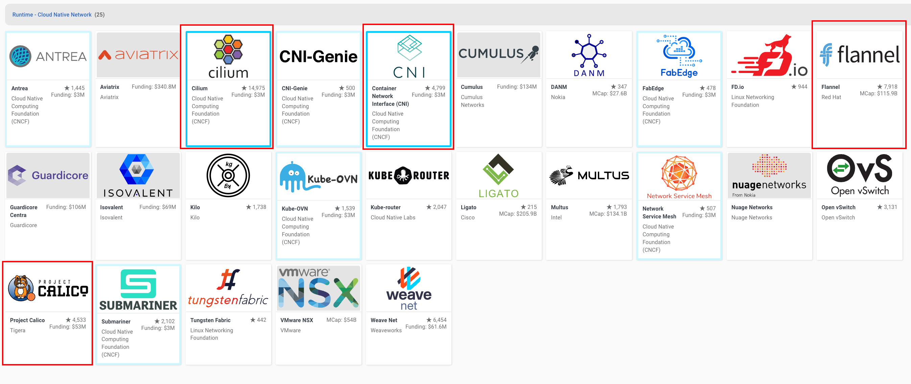

# k8s-network-learning
kubernetes容器网络学习，本文档将会记录从第一步搭建环境，到cilium，flannel，calico 等网络模型的学习

---

### 一： 环境准备篇

1. 如何使用kubeadm 搭建kubernetes集群

   https://github.com/HFfleming/k8s-network-learning/blob/main/env-prepare/installK8s_byKubeadm.md

   

2. 如何使用kind 搭建kubernetes 集群

   https://github.com/HFfleming/k8s-network-learning/blob/main/env-prepare/installK8s_byKind.md

   

3. 如何搭建私人镜像仓库

   https://github.com/HFfleming/k8s-network-learning/blob/main/env-prepare/how-to-setup-private-repo.md
   
   

4. 如何使用containerLab构建网络拓扑

   https://github.com/HFfleming/k8s-network-learning/blob/main/env-prepare/install_containerLab.md
   
   

---

### 二： 网络基础篇

1. 理解网络中报文的传输，以及抓包技巧。熟悉路由过程中源/目的IP MAC地址的变化

   https://github.com/HFfleming/k8s-network-learning/blob/main/network-basic/IPandMAC.md
   
   
   
1. 如何使用veth pair

   https://github.com/HFfleming/k8s-network-learning/blob/main/network-basic/understand-vethpair.md

---

### 三：cilium cni篇

1. Cilium 介绍，以及cilium安装的三种方式。（必须掌握）

    https://github.com/HFfleming/k8s-network-learning/blob/main/cilium-cni/how-to-install-cilium.md
     
     

2. Cilium Native Routing with kube-proxy 的搭建以及工作模式

     https://github.com/HFfleming/k8s-network-learning/blob/main/cilium-cni/Native-Routing-with-kubeProxy.md
    
    

3.  Cilium Native Routing with eBPF Host Routing 工作模式介绍

     https://github.com/HFfleming/k8s-network-learning/blob/main/cilium-cni/Native-Routing-with-eBPF-hostRouting.md

   

