### 一: Calico BGP FullMesh 方案

背景: 因为BGP协议的水平分割（防止路由环路）（从任何IBGP邻居学来的路由信息都不再向任何IBGP路由器转发）的限制，集群内每个节点都需要和其他节点通告路由。这样的实现方式被称为BGP fullmesh全互联。

启用 BGP 后，Calico 的默认行为是创建全互联模式的 BGP (iBGP) 连接，其中每个节点彼此对等。这使得 Calico 可以在任何 L2 网络上运行，无论是公共云还是私有云。如果配置了 IPIP，则可以在不阻止 IPIP 流量的任何网络上以overlay方式运行。 Calico 不支持BGP结合Vxlan的模式。

⚠️: BGP fullmesh 模式适合集群规模为100节点及以内的场景，在规模明显更大时，BGP fullmesh的效率会降低，此时建议使用BGP RR模式（路由反射器）。

概念图如下所示:

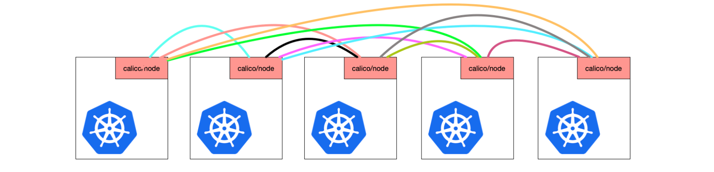


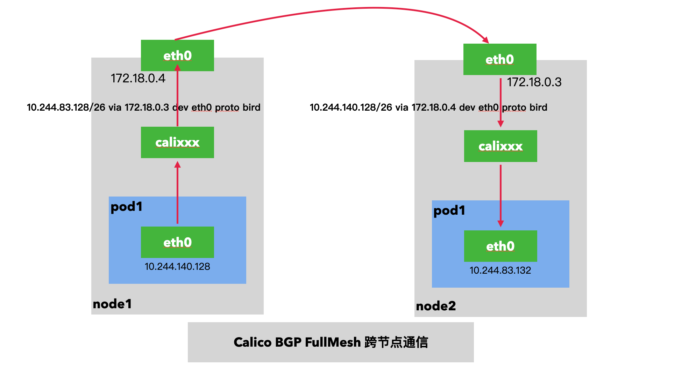

---

### 二: 部署k8s集群

测试采用1master2node配置。集群版本为1.27.3。 由于我们需要使用calico cni，在kind部署集群的时候，取消掉默认的cni。

由于创建出来的节点，缺少一些网络工具例如，route 相关的命令无法使用，所以集群创建完成后，对节点进行相关工具的安装

```shell
#1-setup-env.sh
#!/bin/bash
date
set -v

# 1.prep noCNI env
cat <<EOF | kind create cluster --name=calico-bgp-fullmesh --image=kindest/node:v1.27.3 --config=-
kind: Cluster
apiVersion: kind.x-k8s.io/v1alpha4
networking:
        disableDefaultCNI: true
nodes:
        - role: control-plane
        - role: worker
        - role: worker

EOF

# 2.remove taints
kubectl taint nodes $(kubectl get nodes -o name | grep control-plane) node-role.kubernetes.io/control-plane:NoSchedule-
kubectl get nodes -o wide

```


---

### 三: 部署cni，采用BGP fullmesh 模式 

本次测试使用的是calico的3.23版本。calico的yaml文件可以去官网下载`https://projectcalico.docs.tigera.io/archive/v3.23/manifests/calico.yaml`

由于默认是ipip模式，如果需要启用BGP模式，则需要修改相关配置: 即将`CALICO_IPV4POOL_IPIP` 和 `CALICO_IPV4POOL_VXLAN` 的值设置为`Never`

原因是: 这两个参数设置为never后，跨节点之间的通信，就不会经过overlay的封装。自然而然就是通过路由的方式实现跨节点pod通信了。


```bash
kubectl apply -f calico.yaml
#kubectl apply -f https://projectcalico.docs.tigera.io/archive/v3.23/manifests/calico.yaml
```

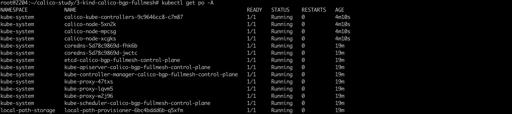

可以看到集群已经就绪，cni组件运行正常，node节点恢复ready状态

登录到集群节点执行`calicoctl node status` 可以确认node之间已经建立BGP连接

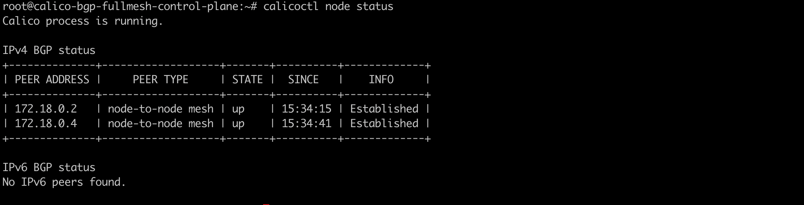

---

### 四: 集群节点安装测试工具

因为节点创建出来，一些网络工具没有安装，所以需要安装下

```shell
#2-install-tools.sh
#!/bin/bash
date
set -v


for i in $(docker ps -a --format "table {{.Names}}" |grep calico-bgp-fullmesh)
do
                echo $i
                docker cp /usr/bin/ping $i:/usr/bin/ping
                docker cp /usr/local/bin/calicoctl $i:/usr/local/bin/
                docker exec -it $i bash -c "apt-get -y update > /dev/null && apt-get -y install net-tools tcpdump lrzsz > /dev/null 2>&1"
done
```


---

### 五: 集群创建业务pod测试

```yaml
apiVersion: apps/v1
kind: DaemonSet
#kind: Deployment
metadata:
  labels:
    app: app
  name: app
spec:
  #replicas: 2
  selector:
    matchLabels:
      app: app
  template:
    metadata:
      labels:
        app: app
    spec:
      containers:
      - image: burlyluo/nettool
        name: nettoolbox
---
apiVersion: v1
kind: Service
metadata:
  name: app
spec:
  type: NodePort
  selector:
    app: app
  ports:
  - name: app
    port: 8080
    targetPort: 80
    nodePort: 32000
```

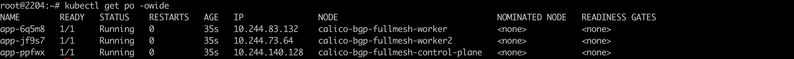


---

### 六: 分析集群路由策略

1. 查看节点的信息

   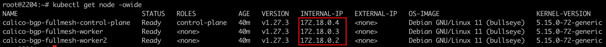

2. 查看pod 信息

   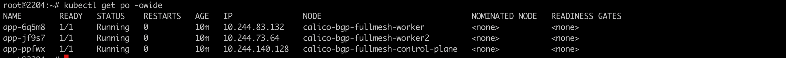

3. 登录node节点，查看路由策略

   如图所示: 查看master节点(172.18.0.4)路由,前往ip网段` 10.244.73.64～10.244.73.127`的数据包，需要从eth0接口出去，下一跳为172.18.0.2,即worker2节点

   前往ip网段 `10.244.83.128~10.244.83.191`之间的数据包，需要从eth0接口出去，下一跳为172.18.0.3,即worker节点

   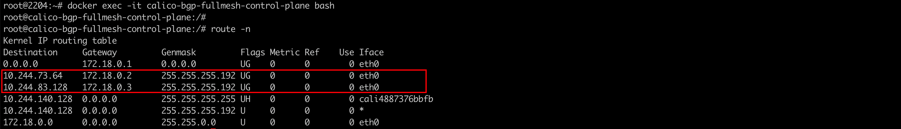

4. 抓包分析(master节点上pod ==》worker节点pod )

   10.244.140.128 ==> 10.244.83.132

   master节点上eth0网卡抓包: srcIP/dstIP 保持不变。srcMac地址为eth0设备mac地址，dstMac地址为下一跳worker的mac地址

   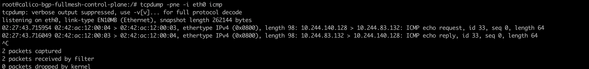

   

   

5. BGP fullmesh的一些信息查看

   在kube-system 下有calico-node这个daemonset

   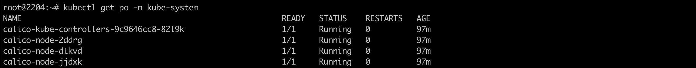

   登录calico-node,也可以查看bfp fullmesh 信息: `show route`

   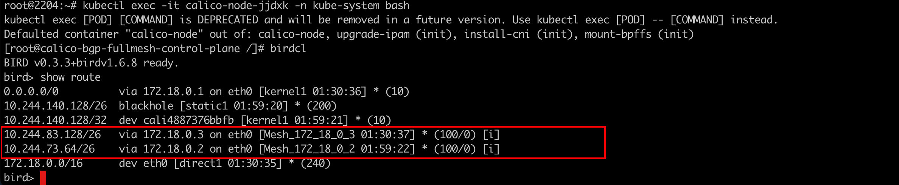

   查看iBGP的详细路由信息:  `show route for 10.244.83.128/26 all`

   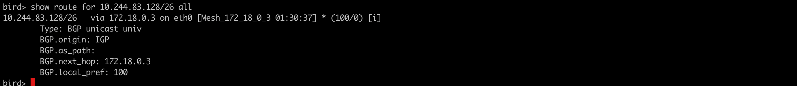

