### 一: Calico BGP RouteReflector

之前介绍过Calico BGP的fullmesh方案，该方案存在一些限制，集群节点越多，BGP连接就越多:n(n-1)/2，需要来回建立连接来保证网络的互通性，那么增加一个节点就要成倍的增加这种链接保证网络的互通性，这样的话就会使用大量的网络消耗。所以这时就可以使用Route Reflector模式。`RR模式` 中会指定一个或多个BGP Speaker为RouterReflecor，它与网络中其他Speaker建立连接，每个Speaker只要与Router Reflector建立BGP就可以获得全网的路由信息。

网络拓扑如下：

这是一个三层互通的方案模型，很接近真实生产环境

1. node和leaf交换机位于到同一个AS(自治系统)中 (IBGP)，leaf交换机作为routereflector，node作为routereflector的客户端
2. leaf交换机和spine交换机，位于不同的AS，需要经过EBGP

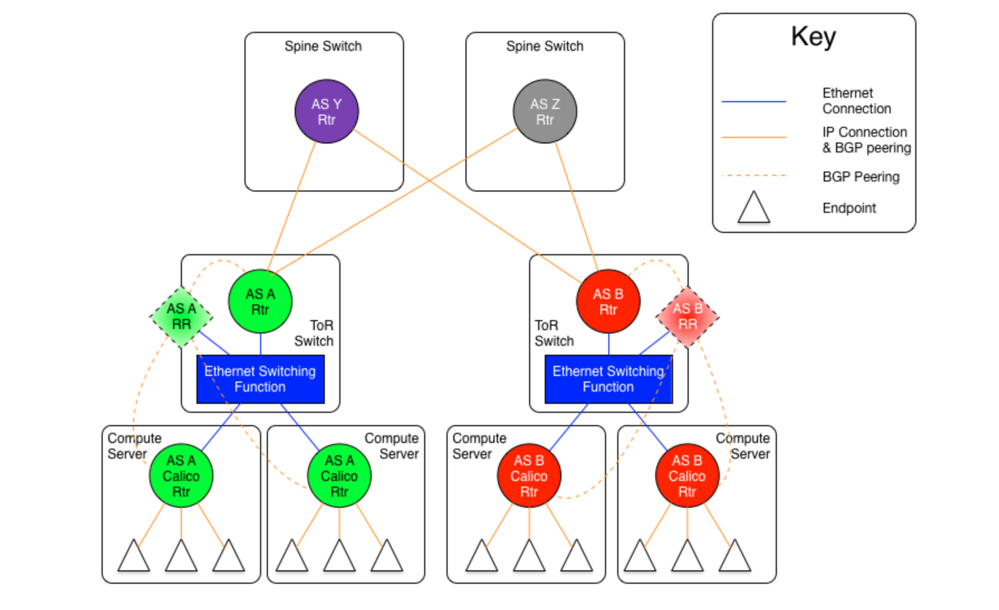

图片来源参考:https://www.wlgo.cc/wp-content/uploads/2019/06/966fc8a50d2f6ebd2a8644e6908afbce.png

组网原则:

1. 同一个主机上的pod互访通过宿主机路由器。(将linux 主机当成了一个路由器)
2. 同一个机架上不同node的pod通信只走ToR(leaf)交换机
3. 不同机架上pod通信走核心交换机(spine)


⚠️: 请保持环境信息一致，否则组网会失败。 os: ubuntu20.04 || kind: v0.18.0  || containerLab: 0.30.0 || k8s 1.23.4 || calico 3.23.5

---

### 二: k8s环境搭建

 k8s集群信息:1.23.4, 1master 3node

集群构建脚本如下: 1-setup-env.sh

```shell
#!/bin/bash
date
set -v

# 1.prep noCNI env
cat <<EOF | kind create cluster --name=clab-calico-bgp-rr --image=kindest/node:v1.23.4 --config=-
kind: Cluster
apiVersion: kind.x-k8s.io/v1alpha4
networking:
  disableDefaultCNI: true
  podSubnet: "10.244.0.0/16"
nodes:
- role: control-plane
  kubeadmConfigPatches:
  - |
    kind: InitConfiguration
    nodeRegistration:
      kubeletExtraArgs:
        node-ip: 10.1.5.10
        node-labels: "rack=rack0"

- role: worker
  kubeadmConfigPatches:
  - |
    kind: JoinConfiguration
    nodeRegistration:
      kubeletExtraArgs:
        node-ip: 10.1.5.11
        node-labels: "rack=rack0"

- role: worker
  kubeadmConfigPatches:
  - |
    kind: JoinConfiguration
    nodeRegistration:
      kubeletExtraArgs:
        node-ip: 10.1.8.10
        node-labels: "rack=rack1"

- role: worker
  kubeadmConfigPatches:
  - |
    kind: JoinConfiguration
    nodeRegistration:
      kubeletExtraArgs:
        node-ip: 10.1.8.11
        node-labels: "rack=rack1"


EOF

# 2.remove taints
controller_node_ip=`kubectl get node -o wide --no-headers | grep -E "control-plane|" | awk -F " " '{print $6}'`
kubectl taint nodes $(kubectl get nodes -o name | grep control-plane) node-role.kubernetes.io/master:NoSchedule-
kubectl get nodes -o wide

#3. install necessary tools
for i in $(docker ps -a --format "table {{.Names}}" |grep calico-bgp-rr)
do
                echo $i
                docker cp /usr/bin/ping $i:/usr/bin/ping
                docker cp /usr/local/bin/calicoctl $i:/usr/bin/calicoctl
                docker exec -it $i bash -c "sed -i -e  's/jp.archive.ubuntu.com\|archive.ubuntu.com\|security.ubuntu.com/old-releases.ubuntu.com/g' /etc/apt/sources.list"
                docker exec -it $i bash -c "apt-get -y update > /dev/null && apt-get -y install net-tools tcpdump lrzsz > /dev/null 2>&1"
done
```

集群创建完成: 由于未安装cni，所以节点未ready，以及部分pod 处于pending状态


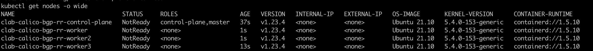

---

### 三: 创建网桥

`brctl addbr br-leaf0;ifconfig br-leaf0 up;brctl addbr br-leaf1;ifconfig br-leaf1 up`

---


### 四: containerLab组网

clab关键脚本如下: 2-setup-clab.sh

```shell
#!/bin/bash
set -v

brctl addbr br-leaf0
ifconfig br-leaf0 up

brctl addbr br-leaf1
ifconfig br-leaf1 up

cat <<EOF>clab.yaml | clab deploy -t clab.yaml -
name: calico-bgp-rr
topology:
  nodes:
    spine0:
      kind: linux
      image: vyos/vyos:1.2.8
      cmd: /sbin/init
      binds:
        - /lib/modules:/lib/modules
        - ./startup-conf/spine0-boot.cfg:/opt/vyatta/etc/config/config.boot

    spine1:
      kind: linux
      image: vyos/vyos:1.2.8
      cmd: /sbin/init
      binds:
        - /lib/modules:/lib/modules
        - ./startup-conf/spine1-boot.cfg:/opt/vyatta/etc/config/config.boot

    leaf0:
      kind: linux
      image: vyos/vyos:1.2.8
      cmd: /sbin/init
      binds:
        - /lib/modules:/lib/modules
        - ./startup-conf/leaf0-boot.cfg:/opt/vyatta/etc/config/config.boot

    leaf1:
      kind: linux
      image: vyos/vyos:1.2.8
      cmd: /sbin/init
      binds:
        - /lib/modules:/lib/modules
        - ./startup-conf/leaf1-boot.cfg:/opt/vyatta/etc/config/config.boot

    br-leaf0:
      kind: bridge
  
    br-leaf1:
      kind: bridge

    server1:
      kind: linux
      image: burlyluo/nettool
      network-mode: container:control-plane
      exec:
      - ip addr add 10.1.5.10/24 dev net0
      - ip route replace default via 10.1.5.1

    server2:
      kind: linux
      image: burlyluo/nettool
      network-mode: container:worker
      exec:
      - ip addr add 10.1.5.11/24 dev net0
      - ip route replace default via 10.1.5.1

    server3:
      kind: linux
      image: burlyluo/nettool
      network-mode: container:worker2
      exec:
      - ip addr add 10.1.8.10/24 dev net0
      - ip route replace default via 10.1.8.1

    server4:
      kind: linux
      image: burlyluo/nettool
      network-mode: container:worker3
      exec:
      - ip addr add 10.1.8.11/24 dev net0
      - ip route replace default via 10.1.8.1


  links:
    - endpoints: ["br-leaf0:br-leaf0-net0", "server1:net0"]
    - endpoints: ["br-leaf0:br-leaf0-net1", "server2:net0"]

    - endpoints: ["br-leaf1:br-leaf1-net0", "server3:net0"]
    - endpoints: ["br-leaf1:br-leaf1-net1", "server4:net0"]

    - endpoints: ["leaf0:eth1", "spine0:eth1"]
    - endpoints: ["leaf0:eth2", "spine1:eth1"]
    - endpoints: ["leaf0:eth3", "br-leaf0:br-leaf0-net2"]

    - endpoints: ["leaf1:eth1", "spine0:eth2"]
    - endpoints: ["leaf1:eth2", "spine1:eth2"]
    - endpoints: ["leaf1:eth3", "br-leaf1:br-leaf1-net2"]

EOF

```

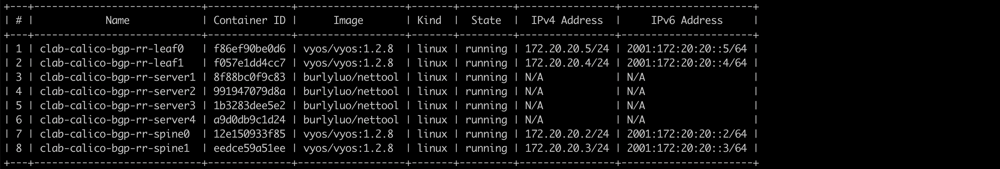

可以看到containerlab组网成功

注意⚠️: `network-mode: container:worker` 表示复用节点的网络，其中container:worker,会进行拼接处理 由clab的名字+worker，拼接完成后就是真实存在的容器name了


---

### 五: 部署calico cni

需要取消overlay的封装;

```
kubectl apply -f calico.yaml
#kubectl apply -f https://projectcalico.docs.tigera.io/archive/v3.23/manifests/calico.yaml
```


安装完cni后，此时还是全互联的模式。

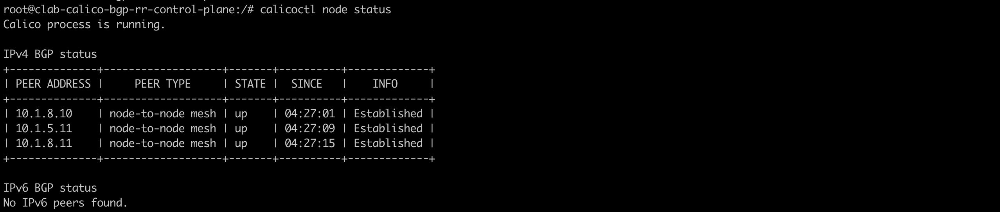


需要disable bgp fullmesh的模式，采用router reflector

方法如下: `3-disable-bgp-full-mesh.sh`

```shell
#!/bin/bash
set -v
# 1. disable bgp fullmesh
cat <<EOF | calicoctl apply -f - 
apiVersion: projectcalico.org/v3
items:
- apiVersion: projectcalico.org/v3
  kind: BGPConfiguration
  metadata:
    name: default
  spec:
    logSeverityScreen: Info
    nodeToNodeMeshEnabled: false
kind: BGPConfigurationList
metadata:
EOF
```

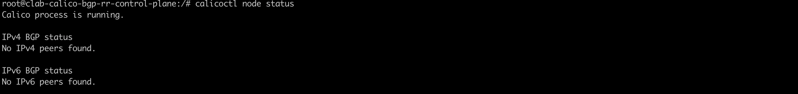

---

### 六: 配置calico bgp rr模式

```shell
#!/bin/bash
set -v
# 1.3. add() bgp configuration for the nodes
cat <<EOF | calicoctl apply -f - 
apiVersion: projectcalico.org/v3
kind: Node
metadata:
  annotations:
  labels:
    rack: rack0
  name: clab-calico-bgp-rr-control-plane
spec:
  addresses:
  - address: 10.1.5.10
    type: InternalIP
  bgp:
    asNumber: 65005
    ipv4Address: 10.1.5.10/24
  orchRefs:
  - nodeName: clab-calico-bgp-rr-control-plane
    orchestrator: k8s
EOF

cat <<EOF | calicoctl apply -f - 
apiVersion: projectcalico.org/v3
kind: Node
metadata:
  labels:
    rack: rack0
  name: clab-calico-bgp-rr-worker
spec:
  addresses:
  - address: 10.1.5.11
    type: InternalIP
  bgp:
    asNumber: 65005
    ipv4Address: 10.1.5.11/24  
  orchRefs:
  - nodeName: clab-calico-bgp-rr-worker
    orchestrator: k8s

EOF


cat <<EOF | calicoctl apply -f - 
apiVersion: projectcalico.org/v3
kind: Node
metadata:
  labels:
    rack: rack1
  name: clab-calico-bgp-rr-worker2
spec:
  addresses:
  - address: 10.1.8.10
    type: InternalIP
  bgp:
    asNumber: 65008
    ipv4Address: 10.1.8.10/24
  orchRefs:
  - nodeName: clab-calico-bgp-rr-worker2
    orchestrator: k8s

EOF


cat <<EOF | calicoctl apply -f - 
apiVersion: projectcalico.org/v3
kind: Node
metadata:
  labels:
    rack: rack1
  name: clab-calico-bgp-rr-worker3
spec:
  addresses:
  - address: 10.1.8.11
    type: InternalIP
  bgp:
    asNumber: 65008
    ipv4Address: 10.1.8.11/24
  orchRefs:
  - nodeName: clab-calico-bgp-rr-worker3
    orchestrator: k8s

EOF

# 1.4. peer to leaf0 switch
cat <<EOF | calicoctl apply -f -
apiVersion: projectcalico.org/v3
kind: BGPPeer
metadata:
  name: rack0-to-leaf0
spec:
  peerIP: 10.1.5.1
  asNumber: 65005
  nodeSelector: rack == 'rack0'
EOF

# 1.5. peer to leaf1 switch
cat <<EOF | calicoctl apply -f -
apiVersion: projectcalico.org/v3
kind: BGPPeer
metadata:
  name: rack1-to-leaf1
spec:
  peerIP: 10.1.8.1
  asNumber: 65008
  nodeSelector: rack == 'rack1'
EOF
```

部署完成后;登录到集群中任意节点，查看BGP信息: 发现已经不再是BGP full mesh的形式了。node specific 表示该节点是路由反射器的客户端，对端即路由反射器是10.1.5.1这个地址

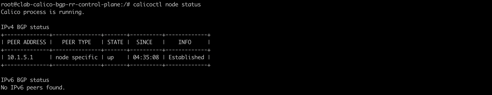 


---

### 七: 部署测试pod

为了便于测试，以daemonset形式部署

```yaml
apiVersion: apps/v1
kind: DaemonSet
#kind: Deployment
metadata:
  labels:
    app: app
  name: app
spec:
  #replicas: 2
  selector:
    matchLabels:
      app: app
  template:
    metadata:
      labels:
        app: app
    spec:
      containers:
      - image: burlyluo/nettool
        name: nettoolbox
---
apiVersion: v1
kind: Service
metadata:
  name: app
spec:
  type: NodePort
  selector:
    app: app
  ports:
  - name: app
    port: 8080
    targetPort: 80
    nodePort: 32000
```

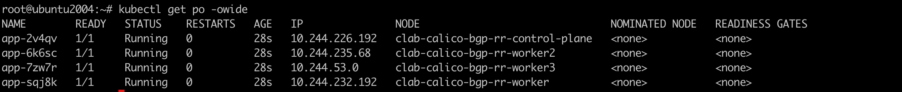


---

### 八: 查看BGP route reflector 规则

- 查看node节点上路由策略

  例如`10.244.232.192/26 via 10.1.5.11 dev net0 proto bird` ，则表示通过BGP协议学习的路由，bird 是calico中的BGP 客户端

  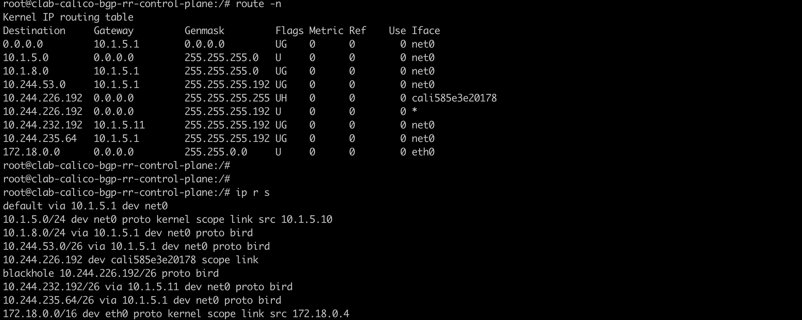 

  - 查看leaf0交换机上的BGP协议

    可以明显看到: 

    前往地址为: `10.1.8.0/24`|| `10.244.53.0/26` || `10.244.235.64`的设备 下一跳有两个`10.1.12.2`和`10.1.10.2` 属于EBGP路由，包含ECMP策略

    前往地址为: `10.244.226.192/26` || `10.244.232.192/26` 下一跳分别为`10.1.5.10`||`10.1.5.11` 属于IBGP路由

    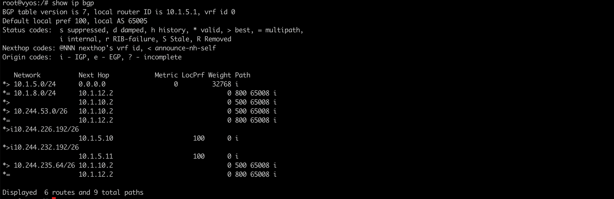

    使用命令: `show ip bgp neighbors`  可以查看到所用的ibgp和ebgp的信息，如下所示:

    ```bash
    root@vyos:/# show ip bgp neighbors
    BGP neighbor is 10.1.5.10, remote AS 65005, local AS 65005, internal link
      BGP version 4, remote router ID 10.1.5.10, local router ID 10.1.5.1
      BGP state = Established, up for 00:21:52
      Last read 00:00:27, Last write 00:00:52
      Hold time is 180, keepalive interval is 60 seconds
      Neighbor capabilities:
        4 Byte AS: advertised and received
        AddPath:
          IPv4 Unicast: TX received
          IPv4 Unicast: RX advertised IPv4 Unicast and received
        Route refresh: advertised and received(new)
        Address Family IPv4 Unicast: advertised and received
        Hostname Capability: advertised (name: leaf0,domain name: n/a) not received
        Graceful Restart Capabilty: advertised and received
          Remote Restart timer is 120 seconds
          Address families by peer:
            IPv4 Unicast(preserved)
      Graceful restart information:
        End-of-RIB send: IPv4 Unicast
        End-of-RIB received: IPv4 Unicast
      Message statistics:
        Inq depth is 0
        Outq depth is 0
                             Sent       Rcvd
        Opens:                  1          1
        Notifications:          0          0
        Updates:                7          4
        Keepalives:            22         25
        Route Refresh:          0          0
        Capability:             0          0
        Total:                 30         30
      Minimum time between advertisement runs is 0 seconds
    
     For address family: IPv4 Unicast
      Update group 2, subgroup 3
      Packet Queue length 0
      Route-Reflector Client
      Community attribute sent to this neighbor(all)
      1 accepted prefixes
    
      Connections established 1; dropped 0
      Last reset 00:23:16,  No AFI/SAFI activated for peer
    Local host: 10.1.5.1, Local port: 179
    ```

    


---

### 九: 抓包测试连通性

master节点上的pod，ping 测worker2 节点上的pod，master节点和node节点位于不同的vlan中

抓包位置位于路由反射器leaf0的eth1，eth2网卡设备， eth1连接着spine0交换机，eth2连接着spine1交换机。分别和spine0 spine1 是EBGP的关系。在EBGP中我们配置了ECMP(等价多径)，所以抓包就能看到负载均衡的处理

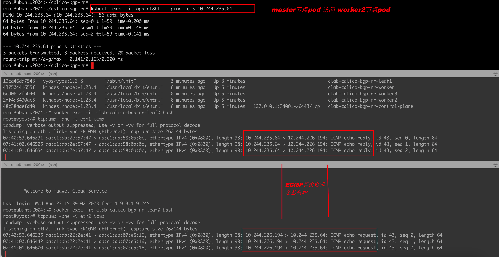


我们可以尝试将spine1交换机的eth1 网卡 设置为down状态，模拟宕机。此时再查看datapath: 可以发现收发包都只在leaf0的eth1网卡上进行了。因为leaf0 的eth2网卡连接的是spine1的eth1 网卡，spin1的eth1网卡此刻down掉。无法处理流量。

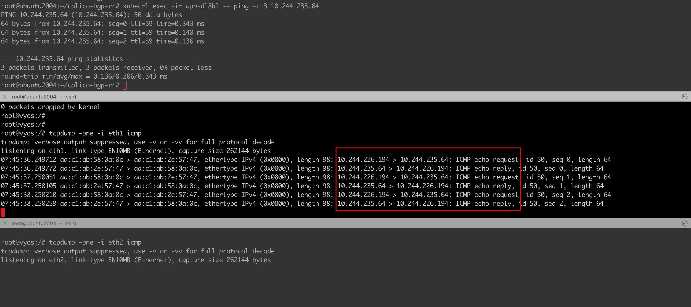

---

### 十: Calico svc BGP advertisement

Calico 可以通过BPG 协议将服务的svc地址宣告出集群，相比其他cni只能宣告LB地址。

参考:https://docs.tigera.io/archive/v3.23/networking/advertise-service-ips


未配置之前，我们的leaf/spine交换机都是没法访问svcIP的。查看路由策略，也未包含任何关于`10.96.xxx.xxx`的路由策略

执行以下命令:

```shell
calicoctl patch bgpconfig default --patch \
   '{"spec": {"serviceClusterIPs": [{"cidr": "10.96.0.0/16"}]}}'
```

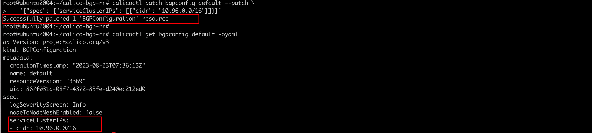


登录leaf0交换机查看路由策略:`ip r s`  已经有svcip的路由策略了。

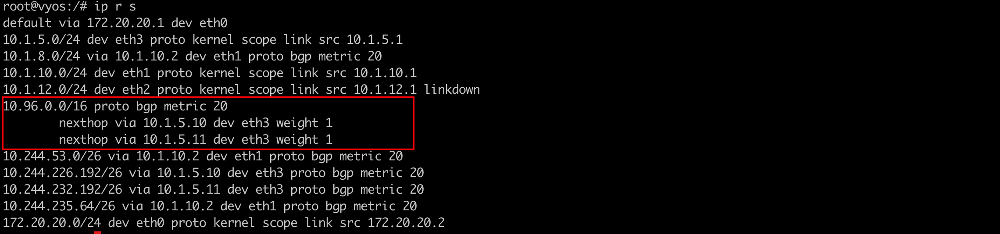

访问该svcIP: 访问位置为集群外leaf交换机设备，访问成功


也可以登录spine1交换机进行验证: spine 交换机也是可以访问到的。如果此时spine交换机和公网信息进行路由宣告，我们集群内的服务就可以彻底暴露出去了。

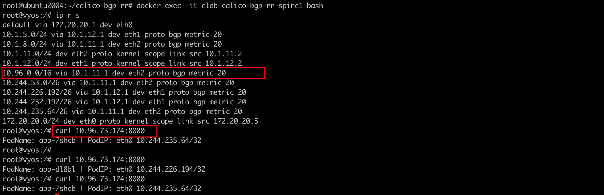

---


### 备注: vyos的配置如下

spine0-boot.cfg如下:

```json
interfaces {
    ethernet eth1 {
        address 10.1.10.2/24
        duplex auto
        smp-affinity auto
        speed auto
    }
    ethernet eth2 {
        address 10.1.34.2/24
        duplex auto
        smp-affinity auto
        speed auto
    }
    loopback lo {
    }
}
protocols {
    bgp 500 {
        neighbor 10.1.10.1 {
            remote-as 65005
        }
        neighbor 10.1.34.1 {
            remote-as 65008
        }
        parameters {
            router-id 10.1.10.2
        }
    }
}
system {
    config-management {
        commit-revisions 100
    }
    console {
        device ttyS0 {
            speed 9600
        }
    }
    host-name vyos
    login {
        user vyos {
            authentication {
                encrypted-password $6$QxPS.uk6mfo$9QBSo8u1FkH16gMyAVhus6fU3LOzvLR9Z9.82m3tiHFAxTtIkhaZSWssSgzt4v4dGAL8rhVQxTg0oAG9/q11h/
                plaintext-password ""
            }
            level admin
        }
    }
    ntp {
        server 0.pool.ntp.org {
        }
        server 1.pool.ntp.org {
        }
        server 2.pool.ntp.org {
        }
    }
    syslog {
        global {
            facility all {
                level info
            }
            facility protocols {
                level debug
            }
        }
    }
    time-zone UTC
}


/* Warning: Do not remove the following line. */
/* === vyatta-config-version: "qos@1:dhcp-server@5:webgui@1:pppoe-server@2:webproxy@2:firewall@5:pptp@1:dns-forwarding@1:mdns@1:quagga@7:webproxy@1:snmp@1:system@10:conntrack@1:l2tp@1:broadcast-relay@1:dhcp-relay@2:conntrack-sync@1:vrrp@2:ipsec@5:ntp@1:config-management@1:wanloadbalance@3:ssh@1:nat@4:zone-policy@1:cluster@1" === */
/* Release version: 1.2.8 */

```

---

spine1-boot.cfg 如下:

```json
interfaces {
    ethernet eth1 {
        address 10.1.12.2/24
        duplex auto
        smp-affinity auto
        speed auto
    }
    ethernet eth2 {
        address 10.1.11.2/24
        duplex auto
        smp-affinity auto
        speed auto
    }
    loopback lo {
    }
}
protocols {
    bgp 800 {
        neighbor 10.1.11.1 {
            remote-as 65008
        }
        neighbor 10.1.12.1 {
            remote-as 65005
        }
        parameters {
            router-id 10.1.12.2
        }
    }
}
system {
    config-management {
        commit-revisions 100
    }
    console {
        device ttyS0 {
            speed 9600
        }
    }
    host-name vyos
    login {
        user vyos {
            authentication {
                encrypted-password $6$QxPS.uk6mfo$9QBSo8u1FkH16gMyAVhus6fU3LOzvLR9Z9.82m3tiHFAxTtIkhaZSWssSgzt4v4dGAL8rhVQxTg0oAG9/q11h/
                plaintext-password ""
            }
            level admin
        }
    }
    ntp {
        server 0.pool.ntp.org {
        }
        server 1.pool.ntp.org {
        }
        server 2.pool.ntp.org {
        }
    }
    syslog {
        global {
            facility all {
                level info
            }
            facility protocols {
                level debug
            }
        }
    }
    time-zone UTC
}


/* Warning: Do not remove the following line. */
/* === vyatta-config-version: "qos@1:dhcp-server@5:webgui@1:pppoe-server@2:webproxy@2:firewall@5:pptp@1:dns-forwarding@1:mdns@1:quagga@7:webproxy@1:snmp@1:system@10:conntrack@1:l2tp@1:broadcast-relay@1:dhcp-relay@2:conntrack-sync@1:vrrp@2:ipsec@5:ntp@1:config-management@1:wanloadbalance@3:ssh@1:nat@4:zone-policy@1:cluster@1" === */
/* Release version: 1.2.8 */

```

---

leaf0-boot.cfg 如下:

```json
interfaces {
    ethernet eth1 {
        address 10.1.10.1/24
        duplex auto
        smp-affinity auto
        speed auto
    }
    ethernet eth2 {
        address 10.1.12.1/24
        duplex auto
        smp-affinity auto
        speed auto
    }
    ethernet eth3 {
        address 10.1.5.1/24
        duplex auto
        smp-affinity auto
        speed auto
    }
    loopback lo {
    }
}
nat {
    source {
        rule 100 {
            outbound-interface eth0
            source {
                address 10.1.0.0/16
            }
            translation {
                address masquerade
            }
        }
    }
}
protocols {
    bgp 65005 {
        address-family {
            ipv4-unicast {
                network 10.1.5.0/24 {
                }
            }
        }
        neighbor 10.1.5.10 {
            address-family {
                ipv4-unicast {
                    route-reflector-client
                }
            }
            remote-as 65005
        }
        neighbor 10.1.5.11 {
            address-family {
                ipv4-unicast {
                    route-reflector-client
                }
            }
            remote-as 65005
        }
        neighbor 10.1.10.2 {
            remote-as 500
        }
        neighbor 10.1.12.2 {
            remote-as 800
        }
        parameters {
            bestpath {
                as-path {
                    multipath-relax
                }
            }
            router-id 10.1.5.1
        }
    }
}
system {
    config-management {
        commit-revisions 100
    }
    console {
        device ttyS0 {
            speed 9600
        }
    }
    host-name vyos
    login {
        user vyos {
            authentication {
                encrypted-password $6$QxPS.uk6mfo$9QBSo8u1FkH16gMyAVhus6fU3LOzvLR9Z9.82m3tiHFAxTtIkhaZSWssSgzt4v4dGAL8rhVQxTg0oAG9/q11h/
                plaintext-password ""
            }
            level admin
        }
    }
    ntp {
        server 0.pool.ntp.org {
        }
        server 1.pool.ntp.org {
        }
        server 2.pool.ntp.org {
        }
    }
    syslog {
        global {
            facility all {
                level info
            }
            facility protocols {
                level debug
            }
        }
    }
    time-zone UTC
}


/* Warning: Do not remove the following line. */
/* === vyatta-config-version: "qos@1:dhcp-server@5:webgui@1:pppoe-server@2:webproxy@2:firewall@5:pptp@1:dns-forwarding@1:mdns@1:quagga@7:webproxy@1:snmp@1:system@10:conntrack@1:l2tp@1:broadcast-relay@1:dhcp-relay@2:conntrack-sync@1:vrrp@2:ipsec@5:ntp@1:config-management@1:wanloadbalance@3:ssh@1:nat@4:zone-policy@1:cluster@1" === */
/* Release version: 1.2.8 */

```

---

leaf1-boot.cfg 如下:

```json
interfaces {
    ethernet eth1 {
        address 10.1.34.1/24
        duplex auto
        smp-affinity auto
        speed auto
    }
    ethernet eth2 {
        address 10.1.11.1/24
        duplex auto
        smp-affinity auto
        speed auto
    }
    ethernet eth3 {
        address 10.1.8.1/24
        duplex auto
        smp-affinity auto
        speed auto
    }
    loopback lo {
    }
}
nat {
    source {
        rule 100 {
            outbound-interface eth0
            source {
                address 10.1.0.0/16
            }
            translation {
                address masquerade
            }
        }
    }
}
protocols {
    bgp 65008 {
        address-family {
            ipv4-unicast {
                network 10.1.8.0/24 {
                }
            }
        }
        neighbor 10.1.8.10 {
            address-family {
                ipv4-unicast {
                    route-reflector-client
                }
            }
            remote-as 65008
        }
        neighbor 10.1.8.11 {
            address-family {
                ipv4-unicast {
                    route-reflector-client
                }
            }
            remote-as 65008
        }
        neighbor 10.1.11.2 {
            remote-as 800
        }
        neighbor 10.1.34.2 {
            remote-as 500
        }
        parameters {
            bestpath {
                as-path {
                    multipath-relax
                }
            }
            router-id 10.1.8.1
        }
    }
}
system {
    config-management {
        commit-revisions 100
    }
    console {
        device ttyS0 {
            speed 9600
        }
    }
    host-name vyos
    login {
        user vyos {
            authentication {
                encrypted-password $6$QxPS.uk6mfo$9QBSo8u1FkH16gMyAVhus6fU3LOzvLR9Z9.82m3tiHFAxTtIkhaZSWssSgzt4v4dGAL8rhVQxTg0oAG9/q11h/
                plaintext-password ""
            }
            level admin
        }
    }
    ntp {
        server 0.pool.ntp.org {
        }
        server 1.pool.ntp.org {
        }
        server 2.pool.ntp.org {
        }
    }
    syslog {
        global {
            facility all {
                level info
            }
            facility protocols {
                level debug
            }
        }
    }
    time-zone UTC
}


/* Warning: Do not remove the following line. */
/* === vyatta-config-version: "qos@1:dhcp-server@5:webgui@1:pppoe-server@2:webproxy@2:firewall@5:pptp@1:dns-forwarding@1:mdns@1:quagga@7:webproxy@1:snmp@1:system@10:conntrack@1:l2tp@1:broadcast-relay@1:dhcp-relay@2:conntrack-sync@1:vrrp@2:ipsec@5:ntp@1:config-management@1:wanloadbalance@3:ssh@1:nat@4:zone-policy@1:cluster@1" === */
/* Release version: 1.2.8 */

```

