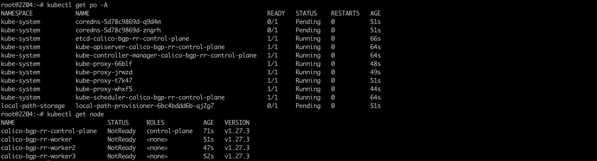
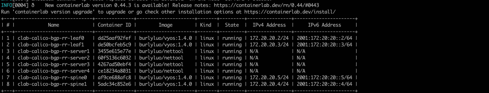
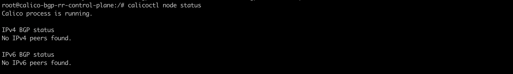
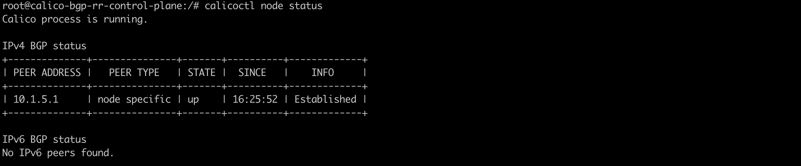
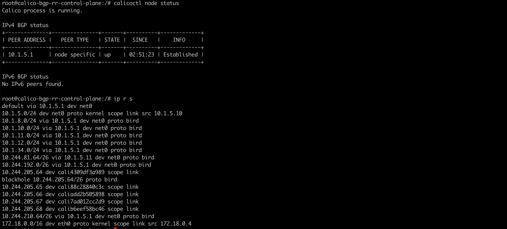
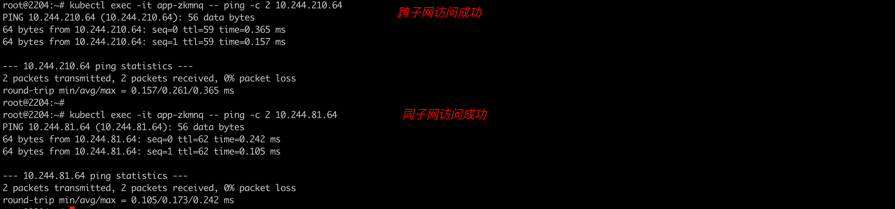

### 一: Calico BGP RouteReflector

之前介绍过Calico BGP的fullmesh方案，该方案存在一些限制，集群节点越多，BGP连接就越多:n(n-1)/2，需要来回建立连接来保证网络的互通性，那么增加一个节点就要成倍的增加这种链接保证网络的互通性，这样的话就会使用大量的网络消耗。所以这时就可以使用Route Reflector模式。`RR模式` 中会指定一个或多个BGP Speaker为RouterReflecor，它与网络中其他Speaker建立连接，每个Speaker只要与Router Reflector建立BGP就可以获得全网的路由信息。

网络拓扑如下：

这是一个三层互通的方案模型，很接近真实生产环境

1. node和leaf交换机位于到同一个AS(自治系统)中 (IBGP)，leaf交换机作为routereflector，node作为routereflector的客户端
2. leaf交换机和spine交换机，位于不同的AS，需要经过EBGP


图片来源参考:https://www.wlgo.cc/wp-content/uploads/2019/06/966fc8a50d2f6ebd2a8644e6908afbce.png

组网原则:

1. 同一个主机上的pod互访通过宿主机路由器。(将linux 主机当成了一个路由器)
2. 同一个机架上不同node的pod通信只走ToR(leaf)交换机
3. 不同机架上pod通信走核心交换机(spine)


总体组网环境:

Ubuntu22.04 || Vyos 1.4.0 || ContainerLab 0.42.0 || Kind v0.20.0 || Kubernetes 1.27.3

---

### 二: k8s环境搭建

k8s集群信息:1.27.3, 1master 3node

集群构建脚本如下: 1-setup-env.sh

```shell
#!/bin/bash
date
set -v

# 1.prep noCNI env
cat <<EOF | kind create cluster --name=calico-bgp-rr --image=kindest/node:v1.27.3 --config=-
kind: Cluster
apiVersion: kind.x-k8s.io/v1alpha4
networking:
  disableDefaultCNI: true
  podSubnet: "10.244.0.0/16"
nodes:
- role: control-plane
  kubeadmConfigPatches:
  - |
    kind: InitConfiguration
    nodeRegistration:
      kubeletExtraArgs:
        node-ip: 10.1.5.10
        node-labels: "rack=rack0"

- role: worker
  kubeadmConfigPatches:
  - |
    kind: JoinConfiguration
    nodeRegistration:
      kubeletExtraArgs:
        node-ip: 10.1.5.11
        node-labels: "rack=rack0"

- role: worker
  kubeadmConfigPatches:
  - |
    kind: JoinConfiguration
    nodeRegistration:
      kubeletExtraArgs:
        node-ip: 10.1.8.10
        node-labels: "rack=rack1"

- role: worker
  kubeadmConfigPatches:
  - |
    kind: JoinConfiguration
    nodeRegistration:
      kubeletExtraArgs:
        node-ip: 10.1.8.11
        node-labels: "rack=rack1"

EOF


# 2.remove taints
kubectl taint nodes $(kubectl get nodes -o name | grep control-plane) node-role.kubernetes.io/control-plane:NoSchedule-
kubectl get nodes -o wide

# 3. install tools
for i in $(docker ps -a --format "table {{.Names}}" |grep calico-bgp-rr)
do
                echo $i
                docker cp /usr/bin/ping $i:/usr/bin/ping
                docker cp /usr/local/bin/calicoctl $i:/usr/local/bin/
               # docker exec -it $i bash -c "apt-get -y update > /dev/null && apt-get -y install net-tools tcpdump lrzsz > /dev/null 2>&1"
done
```

集群创建完成: 由于未安装cni，所以节点未ready，以及部分pod 处于pending状态




---


### 三: 创建网桥

`brctl addbr br-leaf0;ifconfig br-leaf0 up;brctl addbr br-leaf1;ifconfig br-leaf1 up`

---


### 四: containerLab借助vyos网络子系统进行组网

clab关键脚本如下: 2-setup-clab.sh

```shell
#!/bin/bash
set -v

cat <<EOF>clab.yaml | clab deploy -t clab.yaml -
name: calico-bgp-rr
topology:
  nodes:
    spine0:
      kind: linux
      image: burlyluo/vyos:1.4.0
      cmd: /sbin/init
      binds:
        - /lib/modules:/lib/modules
        - ./startup-conf/spine0-boot.cfg:/opt/vyatta/etc/config/config.boot

    spine1:
      kind: linux
      image: burlyluo/vyos:1.4.0
      cmd: /sbin/init
      binds:
        - /lib/modules:/lib/modules
        - ./startup-conf/spine1-boot.cfg:/opt/vyatta/etc/config/config.boot

    leaf0:
      kind: linux
      image: burlyluo/vyos:1.4.0
      cmd: /sbin/init
      binds:
        - /lib/modules:/lib/modules
        - ./startup-conf/leaf0-boot.cfg:/opt/vyatta/etc/config/config.boot

    leaf1:
      kind: linux
      image: burlyluo/vyos:1.4.0
      cmd: /sbin/init
      binds:
        - /lib/modules:/lib/modules
        - ./startup-conf/leaf1-boot.cfg:/opt/vyatta/etc/config/config.boot

    br-leaf0:
      kind: bridge
  
    br-leaf1:
      kind: bridge

    server1:
      kind: linux
      image: burlyluo/nettool
      network-mode: container:calico-bgp-rr-control-plane
      exec:
      - ip addr add 10.1.5.10/24 dev net0
      - ip route replace default via 10.1.5.1

    server2:
      kind: linux
      image: burlyluo/nettool
      network-mode: container:calico-bgp-rr-worker
      exec:
      - ip addr add 10.1.5.11/24 dev net0
      - ip route replace default via 10.1.5.1

    server3:
      kind: linux
      image: burlyluo/nettool
      network-mode: container:calico-bgp-rr-worker2
      exec:
      - ip addr add 10.1.8.10/24 dev net0
      - ip route replace default via 10.1.8.1

    server4:
      kind: linux
      image: burlyluo/nettool
      network-mode: container:calico-bgp-rr-worker3
      exec:
      - ip addr add 10.1.8.11/24 dev net0
      - ip route replace default via 10.1.8.1


  links:
    - endpoints: ["br-leaf0:br-leaf0-net0", "server1:net0"]
    - endpoints: ["br-leaf0:br-leaf0-net1", "server2:net0"]

    - endpoints: ["br-leaf1:br-leaf1-net0", "server3:net0"]
    - endpoints: ["br-leaf1:br-leaf1-net1", "server4:net0"]

    - endpoints: ["leaf0:eth1", "spine0:eth1"]
    - endpoints: ["leaf0:eth2", "spine1:eth1"]
    - endpoints: ["leaf0:eth3", "br-leaf0:br-leaf0-net2"]

    - endpoints: ["leaf1:eth1", "spine0:eth2"]
    - endpoints: ["leaf1:eth2", "spine1:eth2"]
    - endpoints: ["leaf1:eth3", "br-leaf1:br-leaf1-net2"]

EOF
```



可以看到containerlab组网成功

vyos的详细配置见最后篇幅

---

### 四: 部署calico cni

需要取消overlay的封装;

```
kubectl apply -f calico.yaml
#kubectl apply -f https://projectcalico.docs.tigera.io/archive/v3.23/manifests/calico.yaml
```


安装完cni后，此时还是全互联的模式。


需要disable bgp fullmesh的模式，采用router reflector

方法如下: `3-disable-bgp-full-mesh.sh`

```shell
#!/bin/bash
set -v
# 1. disable bgp fullmesh
cat <<EOF | calicoctl apply -f - 
apiVersion: projectcalico.org/v3
items:
- apiVersion: projectcalico.org/v3
  kind: BGPConfiguration
  metadata:
    name: default
  spec:
    logSeverityScreen: Info
    nodeToNodeMeshEnabled: false
kind: BGPConfigurationList
metadata:
EOF
```

 

---

### 五: 配置calico bgp rr模式

```shell
#!/bin/bash
set -v
# 1.3. add() bgp configuration for the nodes
cat <<EOF | calicoctl apply -f - 
apiVersion: projectcalico.org/v3
kind: Node
metadata:
  annotations:
  labels:
    rack: rack0
  name: calico-bgp-rr-control-plane
spec:
  addresses:
  - address: 10.1.5.10
    type: InternalIP
  bgp:
    asNumber: 65005
    ipv4Address: 10.1.5.10/24
  orchRefs:
  - nodeName: calico-bgp-rr-control-plane
    orchestrator: k8s
EOF

cat <<EOF | calicoctl apply -f - 
apiVersion: projectcalico.org/v3
kind: Node
metadata:
  labels:
    rack: rack0
  name: calico-bgp-rr-worker
spec:
  addresses:
  - address: 10.1.5.11
    type: InternalIP
  bgp:
    asNumber: 65005
    ipv4Address: 10.1.5.11/24  
  orchRefs:
  - nodeName: calico-bgp-rr-worker
    orchestrator: k8s

EOF


cat <<EOF | calicoctl apply -f - 
apiVersion: projectcalico.org/v3
kind: Node
metadata:
  labels:
    rack: rack1
  name: calico-bgp-rr-worker2
spec:
  addresses:
  - address: 10.1.8.10
    type: InternalIP
  bgp:
    asNumber: 65008
    ipv4Address: 10.1.8.10/24
  orchRefs:
  - nodeName: calico-bgp-rr-worker2
    orchestrator: k8s

EOF


cat <<EOF | calicoctl apply -f - 
apiVersion: projectcalico.org/v3
kind: Node
metadata:
  labels:
    rack: rack1
  name: calico-bgp-rr-worker3
spec:
  addresses:
  - address: 10.1.8.11
    type: InternalIP
  bgp:
    asNumber: 65008
    ipv4Address: 10.1.8.11/24
  orchRefs:
  - nodeName: calico-bgp-rr-worker3
    orchestrator: k8s

EOF

# 1.4. peer to leaf0 switch
cat <<EOF | calicoctl apply -f -
apiVersion: projectcalico.org/v3
kind: BGPPeer
metadata:
  name: rack0-to-leaf0
spec:
  peerIP: 10.1.5.1
  asNumber: 65005
  nodeSelector: rack == 'rack0'
EOF

# 1.5. peer to leaf1 switch
cat <<EOF | calicoctl apply -f -
apiVersion: projectcalico.org/v3
kind: BGPPeer
metadata:
  name: rack1-to-leaf1
spec:
  peerIP: 10.1.8.1
  asNumber: 65008
  nodeSelector: rack == 'rack1'
EOF
```

部署完成后(可以重启calico-node 这个daemonset)

登录到集群中任意节点，查看BGP信息: 发现已经不再是BGP full mesh的形式了。node specific 表示该节点是路由反射器的客户端，对端即路由反射器是10.1.5.1这个地址

 


---

### 六: 部署业务测试

```yaml
apiVersion: apps/v1
kind: DaemonSet
#kind: Deployment
metadata:
  labels:
    app: app
  name: app
spec:
  #replicas: 2
  selector:
    matchLabels:
      app: app
  template:
    metadata:
      labels:
        app: app
    spec:
      containers:
      - image: burlyluo/nettool
        name: nettoolbox
---
apiVersion: v1
kind: Service
metadata:
  name: app
spec:
  type: NodePort
  selector:
    app: app
  ports:
  - name: app
    port: 8080
    targetPort: 80
    nodePort: 32000

```


登录节点查看节点上路由规则






---

### 七: Vyos的配置如下

spine0-boot.cfg 如下:

```yaml
interfaces {
    ethernet eth1 {
        address 10.1.10.2/24
        duplex auto
        speed auto
    }
    ethernet eth2 {
        address 10.1.34.2/24
        duplex auto
        speed auto
    }
    loopback lo {
    }
}
protocols {
    bgp {
        address-family {
            ipv4-unicast {
                network 10.1.10.0/24 {
                }
                network 10.1.34.0/24 {
                }
            }
        }
        neighbor 10.1.10.1 {
            address-family {
                ipv4-unicast {
                }
            }
            remote-as 65005
        }
        neighbor 10.1.34.1 {
            address-family {
                ipv4-unicast {
                }
            }
            remote-as 65008
        }
        parameters {
            bestpath {
                as-path {
                    multipath-relax
                }
            }
        }
        system-as 500
    }
}
system {
    config-management {
        commit-revisions 100
    }
    console {
        device ttyS0 {
            speed 9600
        }
    }
    host-name spine0
    login {
        user vyos {
            authentication {
                encrypted-password $6$QxPS.uk6mfo$9QBSo8u1FkH16gMyAVhus6fU3LOzvLR9Z9.82m3tiHFAxTtIkhaZSWssSgzt4v4dGAL8rhVQxTg0oAG9/q11h/
                plaintext-password ""
            }
        }
    }
    time-zone UTC
}


// Warning: Do not remove the following line.
// vyos-config-version: "bgp@4:broadcast-relay@1:cluster@1:config-management@1:conntrack@3:conntrack-sync@2:container@1:dhcp-relay@2:dhcp-server@6:dhcpv6-server@1:dns-dynamic@1:dns-forwarding@4:firewall@10:flow-accounting@1:https@4:ids@1:interfaces@29:ipoe-server@1:ipsec@12:isis@3:l2tp@4:lldp@1:mdns@1:monitoring@1:nat@5:nat66@1:ntp@2:openconnect@2:ospf@2:policy@5:pppoe-server@6:pptp@2:qos@2:quagga@11:rip@1:rpki@1:salt@1:snmp@3:ssh@2:sstp@4:system@26:vrf@3:vrrp@3:vyos-accel-ppp@2:wanloadbalance@3:webproxy@2"
// Release version: 1.4-rolling-202307070317

```


spin1-boot.cfg

```yaml
interfaces {
    ethernet eth1 {
        address "10.1.12.2/24"
        duplex "auto"
        mtu "9000"
        offload {
            gso { }
            sg { }
        }
        speed "auto"
    }
    ethernet eth2 {
        address "10.1.11.2/24"
        duplex "auto"
        mtu "9000"
        offload {
            gso { }
            sg { }
        }
        speed "auto"
    }
    loopback     lo { }
}
protocols {
    bgp {
        address-family {
            ipv4-unicast {
                network                 10.1.11.0/24 { }
                network                 10.1.12.0/24 { }
            }
        }
        neighbor 10.1.11.1 {
            address-family {
                ipv4-unicast { }
            }
            remote-as "65008"
        }
        neighbor 10.1.12.1 {
            address-family {
                ipv4-unicast { }
            }
            remote-as "65005"
        }
        parameters {
            bestpath {
                as-path {
                    multipath-relax { }
                }
            }
            router-id "10.1.8.1"
        }
        system-as "800"
    }
}
system {
    config-management {
        commit-revisions "100"
    }
    conntrack {
        modules {
            ftp { }
            h323 { }
            nfs { }
            pptp { }
            sip { }
            sqlnet { }
            tftp { }
        }
    }
    console {
        device ttyS0 {
            speed "9600"
        }
    }
    host-name "spine1"
    login {
        user vyos {
            authentication {
                encrypted-password "$6$QxPS.uk6mfo$9QBSo8u1FkH16gMyAVhus6fU3LOzvLR9Z9.82m3tiHFAxTtIkhaZSWssSgzt4v4dGAL8rhVQxTg0oAG9/q11h/"
                plaintext-password ""
            }
        }
    }
    time-zone "UTC"
}

// Warning: Do not remove the following line.
// // vyos-config-version: "bgp@4:broadcast-relay@1:cluster@1:config-management@1:conntrack@3:conntrack-sync@2:container@1:dhcp-relay@2:dhcp-server@6:dhcpv6-server@1:dns-dynamic@1:dns-forwarding@4:firewall@10:flow-accounting@1:https@4:ids@1:interfaces@29:ipoe-server@1:ipsec@12:isis@3:l2tp@4:lldp@1:mdns@1:monitoring@1:nat@5:nat66@1:ntp@2:openconnect@2:ospf@2:policy@5:pppoe-server@6:pptp@2:qos@2:quagga@11:rip@1:rpki@1:salt@1:snmp@3:ssh@2:sstp@4:system@26:vrf@3:vrrp@3:vyos-accel-ppp@2:wanloadbalance@3:webproxy@2"
// // Release version: 1.4-rolling-202307070317

```


leaf0-boot.cfg

```yaml
interfaces {
    ethernet eth1 {
        address 10.1.10.1/24
        duplex auto
        mtu 9000
        speed auto
    }
    ethernet eth2 {
        address 10.1.12.1/24
        duplex auto
        mtu 9000
        speed auto
    }
    ethernet eth3 {
        address 10.1.5.1/24
        duplex auto
        mtu 9000
        speed auto
    }
    loopback lo {
    }
}
nat {
    source {
        rule 100 {
            outbound-interface eth0
            source {
                address 10.1.0.0/16
            }
            translation {
                address masquerade
            }
        }
    }
}
protocols {
    bgp {
        address-family {
            ipv4-unicast {
                network 10.1.5.0/24 {
                }
                network 10.1.10.0/24 {
                }
                network 10.1.12.0/24 {
                }
            }
        }
        neighbor 10.1.5.10 {
            address-family {
                ipv4-unicast {
                    nexthop-self {
                    }
                    route-reflector-client
                }
            }
            remote-as 65005
        }
        neighbor 10.1.5.11 {
            address-family {
                ipv4-unicast {
                    nexthop-self {
                    }
                    route-reflector-client
                }
            }
            remote-as 65005
        }
        neighbor 10.1.10.2 {
            address-family {
                ipv4-unicast {
                }
            }
            remote-as 500
        }
        neighbor 10.1.12.2 {
            address-family {
                ipv4-unicast {
                }
            }
            remote-as 800
        }
        parameters {
            bestpath {
                as-path {
                    multipath-relax
                }
            }
            router-id 10.1.5.1
        }
        system-as 65005
    }
}
system {
    config-management {
        commit-revisions 100
    }
    console {
        device ttyS0 {
            speed 9600
        }
    }
    host-name leaf0
    login {
        user vyos {
            authentication {
                encrypted-password $6$QxPS.uk6mfo$9QBSo8u1FkH16gMyAVhus6fU3LOzvLR9Z9.82m3tiHFAxTtIkhaZSWssSgzt4v4dGAL8rhVQxTg0oAG9/q11h/
                plaintext-password ""
            }
        }
    }
    time-zone UTC
}


// Warning: Do not remove the following line.
// vyos-config-version: "bgp@4:broadcast-relay@1:cluster@1:config-management@1:conntrack@3:conntrack-sync@2:container@1:dhcp-relay@2:dhcp-server@6:dhcpv6-server@1:dns-dynamic@1:dns-forwarding@4:firewall@10:flow-accounting@1:https@4:ids@1:interfaces@29:ipoe-server@1:ipsec@12:isis@3:l2tp@4:lldp@1:mdns@1:monitoring@1:nat@5:nat66@1:ntp@2:openconnect@2:ospf@2:policy@5:pppoe-server@6:pptp@2:qos@2:quagga@11:rip@1:rpki@1:salt@1:snmp@3:ssh@2:sstp@4:system@26:vrf@3:vrrp@3:vyos-accel-ppp@2:wanloadbalance@3:webproxy@2"
// Release version: 1.4-rolling-202307070317

```


leaf1-boot.cfg

```yaml
interfaces {
    ethernet eth1 {
        address 10.1.34.1/24
        duplex auto
        mtu 9000
        speed auto
    }
    ethernet eth2 {
        address 10.1.11.1/24
        duplex auto
        mtu 9000
        speed auto
    }
    ethernet eth3 {
        address 10.1.8.1/24
        duplex auto
        mtu 9000
        speed auto
    }
    loopback lo {
    }
}
nat {
    source {
        rule 100 {
            outbound-interface eth0
            source {
                address 10.1.0.0/16
            }
            translation {
                address masquerade
            }
        }
    }
}
protocols {
    bgp {
        address-family {
            ipv4-unicast {
                network 10.1.8.0/24 {
                }
                network 10.1.10.0/24 {
                }
                network 10.1.12.0/24 {
                }
            }
        }
        neighbor 10.1.8.10 {
            address-family {
                ipv4-unicast {
                    nexthop-self {
                    }
                    route-reflector-client
                }
            }
            remote-as 65008
        }
        neighbor 10.1.8.11 {
            address-family {
                ipv4-unicast {
                    nexthop-self {
                    }
                    route-reflector-client
                }
            }
            remote-as 65008
        }
        neighbor 10.1.11.2 {
            address-family {
                ipv4-unicast {
                }
            }
            remote-as 800
        }
        neighbor 10.1.34.2 {
            address-family {
                ipv4-unicast {
                }
            }
            remote-as 500
        }
        parameters {
            bestpath {
                as-path {
                    multipath-relax
                }
            }
            router-id 10.1.8.1
        }
        system-as 65008
    }
}
system {
    config-management {
        commit-revisions 100
    }
    console {
        device ttyS0 {
            speed 9600
        }
    }
    host-name leaf1
    login {
        user vyos {
            authentication {
                encrypted-password $6$QxPS.uk6mfo$9QBSo8u1FkH16gMyAVhus6fU3LOzvLR9Z9.82m3tiHFAxTtIkhaZSWssSgzt4v4dGAL8rhVQxTg0oAG9/q11h/
                plaintext-password ""
            }
        }
    }
    time-zone UTC
}


// Warning: Do not remove the following line.
// vyos-config-version: "bgp@4:broadcast-relay@1:cluster@1:config-management@1:conntrack@3:conntrack-sync@2:container@1:dhcp-relay@2:dhcp-server@6:dhcpv6-server@1:dns-dynamic@1:dns-forwarding@4:firewall@10:flow-accounting@1:https@4:ids@1:interfaces@29:ipoe-server@1:ipsec@12:isis@3:l2tp@4:lldp@1:mdns@1:monitoring@1:nat@5:nat66@1:ntp@2:openconnect@2:ospf@2:policy@5:pppoe-server@6:pptp@2:qos@2:quagga@11:rip@1:rpki@1:salt@1:snmp@3:ssh@2:sstp@4:system@26:vrf@3:vrrp@3:vyos-accel-ppp@2:wanloadbalance@3:webproxy@2"
// Release version: 1.4-rolling-202307070317

```

