### 一: Calico同节点pod通信

⚠️: 在Calico网络环境下，k8s集群中的pod在同节点的通信方式都是一样的（除了ebpf后端模式），所以在Calico实践过程中，我们先来了解下同节点的pod是如何通信的。

Calico Architecture ipip Mode（Same Node）

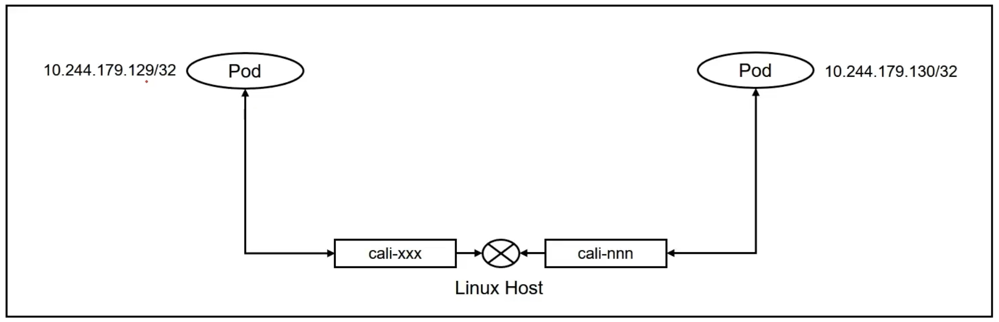  

从上面图中我们可以看到podIP:`10.244.179.129/32`是一个32位掩码的地址，和任何其他pod均不在同一个网段。如果需要相互通信，只能通过L3路由的方式实现(将linux主机当成了一个路由器)。L2通信则要求双方地址处于同一个网段


### 二: Calico环境搭建（ipip mode）

1. 1-setup-env.sh

   ```shell
   #!/bin/bash
   date
   set -v
   
   # 1.prep noCNI env
   cat <<EOF | kind create cluster --name=calico-ipip --image=kindest/node:v1.23.4 --config=-
   kind: Cluster
   apiVersion: kind.x-k8s.io/v1alpha4
   networking:
           disableDefaultCNI: true
   nodes:
           - role: control-plane
           - role: worker
           - role: worker
   
   EOF
   
   # 2.remove taints
   controller_node_ip=`kubectl get node -o wide --no-headers | grep -E "control-plane" | awk -F " " '{print $6}'`
   kubectl taint nodes $(kubectl get nodes -o name | grep control-plane) node-role.kubernetes.io/master:NoSchedule-
   kubectl get nodes -o wide
   
   # 3. install CNI[Calico v3.23.5]
   kubectl apply -f calico.yaml
   #kubectl apply -f https://projectcalico.docs.tigera.io/archive/v3.23/manifests/calico.yaml
   
   # 4. install necessary tools
   for i in $(docker ps -a --format "table {{.Names}}" |grep calico-ipip)
   do
                   echo $i
                   docker cp /usr/bin/ping $i:/usr/bin/ping
                   docker exec -it $i bash -c "sed -i -e  's/jp.archive.ubuntu.com\|archive.ubuntu.com\|security.ubuntu.com/old-releases.ubuntu.com/g' /etc/apt/sources.list"
                   docker exec -it $i bash -c "apt-get -y update > /dev/null && apt-get -y install net-tools tcpdump lrzsz > /dev/null 2>&1"
   done
   # 4. wait all pods ready
   kubectl wait --timeout=100s --for=condition=Ready=true pods --all -A
   ```

   默认安装就是`ipip:always`的模式，表示跨节点通信时，需要进行overlay的封装。

   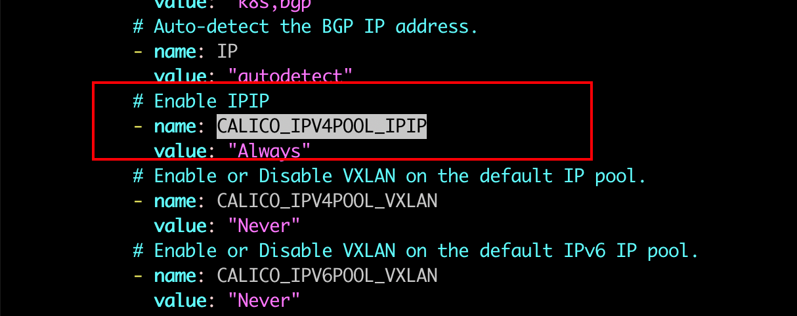

   关于如何修改该项配置: 可以事先在yaml中修改，或者通过calicoctl进行修改

   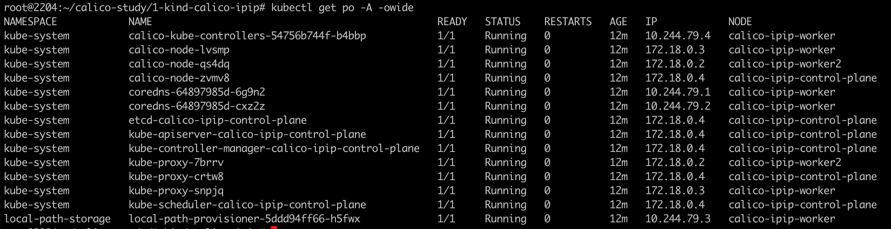 

### 三: Calico同节点pod通信datapath分析

部署业务pod用于分析,自行选择业务镜像，最好能有ping 或者curl 命令

```yaml
apiVersion: apps/v1
#kind: DaemonSet
kind: Deployment
metadata:
  labels:
    app: app
  name: app
spec:
  replicas: 4
  selector:
    matchLabels:
      app: app
  template:
    metadata:
      labels:
        app: app
    spec:
      containers:
      - image: burlyluo/nettool
        name: nettoolbox
```

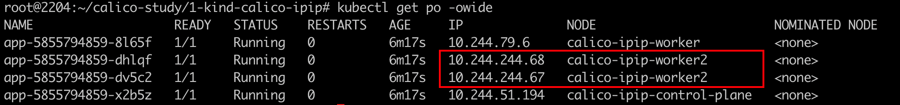

1. 登录worker2节点上的一个pod 

   查看该pod 地址信息`10.244.244.68/32` 32位掩码与任何地址都不在同一个网段，与其他pod通信会选择路由的方式

   查看该pod的路由信息:  如果需要访问其他地址，需要经过eth0接口，下一跳为169.254.1.1

   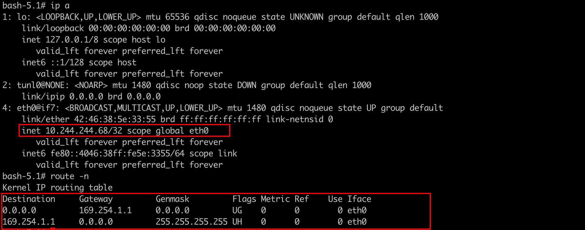 

   如果该pod要访问地址为`10.244.244.67/32`的同节点pod，需要通过默认路由进行寻址。通过L3路由可以找到网关的Mac地址，只有知道网关的地址，才能进行数据包Packet的转发。因为Packet的封装需要知道 SrcIP SrcMac DstIP DstMac 四个关键信息。

   所以当前pod内的数据包的封装信息应该是: 

   `SrcIP:10.244.244.68/32  SrcMac:42:46:38:5e:33:55`

   `DstIP:10.244.244.67/32  DstMac:(网关169.254.1.1的mac地址) ` 

   那么如何知道网关的Mac地址呢:`arping 169.254.1.1 `

   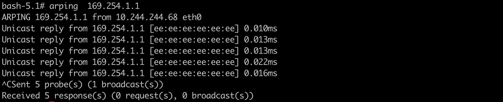 

   DstMac地址现在已经获取到了:`ee:ee:ee:ee:ee:ee`，至于为什么是全e的一个mac地址，后面会在arpproxy中细说。

   现在信息均已完备 ==》pod内的eth0接口上的数据包可以完成封装了。

   

   `ip -d link show`:可以发现eth0这个接口是一个 vethpair设备,它的一端是在Pod eth0 网卡上，另外一端位于宿主node上的网卡上，将数据包由用户空间传递到rootns中

   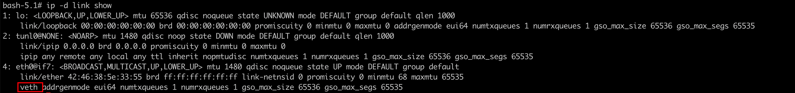 

   

   通过 `ip r s`命令查看路由的时候，两条路由分别时默认路由，和网关路由，网关路由中的scope link 表示的是什么意思呢?

   

   ```tex
   其中一个重要参数是"scope"（作用域），它指定适用于路由表条目的网络范围。该参数可以设置为数值或者从"/etc/iproute2/rt_scopes"文件中获取的字符串。下面是几个常见的作用域类型
   scope global：全局范围，适用于所有通过网关进行路由的单播流量。
   scope link：链路范围，适用于直接相连的子网或广播域上的单播和广播数据包。
   scope host：主机范围，适用于本地计算机上的本地接口流量。
   如果路由表条目未指定作用域，则默认情况下，iproute2工具将使用以下作用域：
   对于通过网关进行路由的单播流量，默认使用全局作用域(global)。
   对于直接相连的子网或广播域上的流量，默认使用链路作用域(link)。
   对于本地计算机上的本地接口流量，默认使用主机作用域(host)。
   ```

    

2. 登录calico-ipip-worker2 节点

   `SrcIP:10.244.244.68/32  `

   `DstIP:10.244.244.67/32  ` 

   查看该节点上的网卡信息

   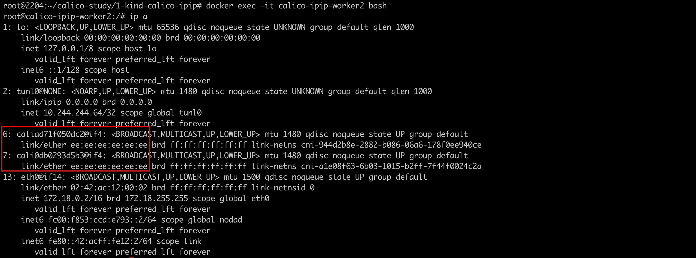

   可以发现 `cali0db0293d5b3` 网卡是 源pod eth0网卡的 peer。同时该网卡对应的Mac地址也是:`ee:ee:ee:ee:ee:ee`

   查看该节点上的路由信息:

   如果需要前往 `10.244.244.67` 这个目的地址，需要经过出接口`caliad71f050dc2` ，该网卡对应的就是目的pod的eth0的 veth peer

   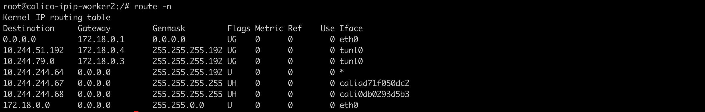

   由此可得: 在calico ipip模式的同节点pod通信的场景下: 一个数据包的传递需要经过两次L3路由的转发。(源pod 内查询路由表，获取封包数据例如目的mac地址，信息齐全之后，数据包转发到rootNs，然后根据路由表，转发到目的pod)

   对比Flannel 同节点pod的通信，借助的是Linux Bridge 二层交换。

   对于数据包的传递，二层交换机和三层路由分别有什么优缺点呢？ 二层场景下，交换机需要根据数据包的目的地址进行泛洪(广播)，会对交换机上的所有端口进行广播寻址，各个端口根据广播的内容进行回复，如果目的地址和自身匹配，就得回复广播。

   三层会隔离广播，请求的目的地址是固定的，限制在指定的广播域中，其他设备不会收到广播。

   通常来说基于硬件的转发效率是高于软件的，一般交换由硬件实现，路由 软件实现。虚拟化环境下，交换路由都是虚拟出来的，二者的效率相差不大。

   

3. pod ping 测 169.254.1.1

   登录pod，ping 测路由的网关地址: 可以发现 ping 不同该地址，但是arping 又可以解析出mac地址，为什么是 ee:ee:ee:ee:ee:ee ？

   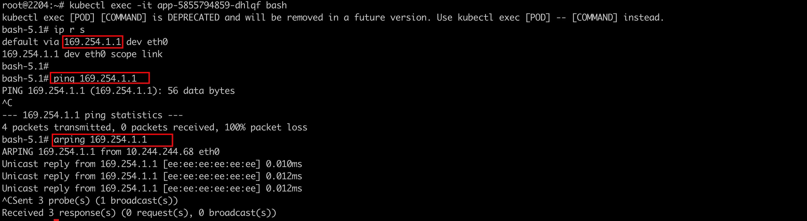

   同时登录宿主机查询ip地址 169.254.1.1，也并未发现该地址，该地址是哪里来的呢？

   抓包看一下相关信息: 发现目的Mac地址也确实是ee:ee:ee:ee:ee:ee

   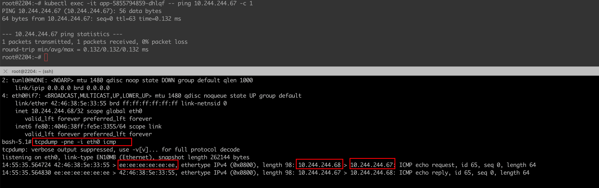

### 四: 分析169.254.1.1 从哪而来

参考:https://docs.tigera.io/calico/latest/reference/faq

1. 为什么在node上看不到169.254.1.1这个IP地址

   Calico 为了避免干扰主机上的任何其他配置。 Calico 没有将网关地址169.254.1.1添加到每个pod实例对应的宿主机的网卡上，而是在接口上设置 proxy_arp 标志。这使得主机的行为就像网关一样，响应 169.254.1.1 的 ARP，而无需实际将 IP 地址分配给接口。


2. 关于全e的mac地址解释

   由于内核无法生成永久 MAC 地址（设备重启后MAC地址会发生改变，增加了系统维护的复杂性），因此 Calico 会自行分配 MAC 地址。

   由于 Calico 使用点对点路由接口(意思是说 userNS 中的pod eth0网卡 <==> rootNS calixxx 网卡，pod中出来的包，只有对应的calixx网卡才能收到)，流量不会到达数据链路层，因此 MAC 地址永远不会被使用，因此对于所有 cali* 接口来说可以是相同的。（其实就是为了封包使用）。

   ⚠️:Mac地址在三层转发的时候，只是本地有效。如果没有经过nat，数据包的ip地址不会发生改变，MAC地址会在每一跳中发生变化。

