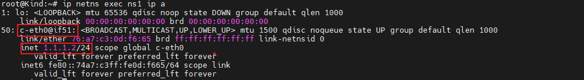

### 一: 为什么Calico使用ProxyARP

基于上一篇文章中做的实验，即同节点上的pod相互通信。我们重新思考数据包传输这个问题:

```tex
当一个数据包的目的地址不是本机，所以需要查询路由表，当查到路由表中的网关之后，需要获取网关的MAC地址，并将数据包的MAC地址修改成网关地址，然后发送到对应的网卡。
那么问题来了: 在容器里的网关是169.254.1.1，那网关的MAC地址是什么？
正常情况下，内核会对外发送ARP请求，去询问整个二层网络中谁拥有169.254.1.1这个IP地址，拥有这个IP地址的设备会将自己的MAC返回。但是现在的情况是，对于容器和主机，都没有169.254.1.1这个IP，甚至，在主机上的端口calixxx网卡，MAC地址也是一个无用的ee:ee:ee:ee:ee:ee。
所以，如果仅仅是目前的状况，容器和主机网络根本就无法通信！
```

我们在Calico的官方文档中，找到答案:

```tex
Why can't I see the 169.254.1.1 address mentioned above on my host?
Calico tries hard to avoid interfering with any other configuration on the host. Rather than adding the gateway address to the host side of each workload interface, Calico sets the proxy_arp flag on the interface. This makes the host behave like a gateway, responding to ARPs for 169.254.1.1 without having to actually allocate the IP address to the interface. 
```

```tex
Calico利用了网卡的proxy_arp功能，具体的，是将/proc/sys/net/ipv4/conf/DEV/proxy_arp置为1，当设置这个标志之后，DEV设备就会看起来像一个网关，会响应所有的ARP请求，并将自己的MAC地址告诉客户端。
也就是说，当容器发送ARP请求时，主机DEV设备会告诉容器，我拥有169.254.1.1这个IP，我的MAC地址是XXX，这样，容器就可以顺利的将数据包发出来了，于是网络就通了。
```

查看calixxx网卡，可以发现确实启用了网卡的proxy_arp的功能

 

### 二: 手动实现ProxyARP功能

例如要实现一个 自定义ns1中设备通过proxyARP访问外网，我们分解下步骤:

[1. 创建vethpari（userNS <==> rootNS）; 2.userNS中配置routing table ; 3.rootNS中的vethpair 设备对开启proxyARP ; 4.出网需要配置snat ]


1. 创建vethpair

   ```bash
   ip netns add  ns1
   ip link add veth type veth peer name c-eth0
   ip link set veth up
   ip link set c-eth0  netns ns1
   ip netns exec ns1 ip link  set c-eth0 up
   ip netns exec ns1 ip address add  1.1.1.2/24 dev c-eth0
   
   ```

     

2. 创建路由表

   ```bash
   ip netns exec ns1 ip route add 169.254.1.1 dev c-eth0 scope link
   ip netns exec ns1 ip route add default via 169.254.1.1 dev c-eth0
   ```

    

   ⚠️: 路由表的添加顺序一定不要错，否则添加失败。需要先告诉网关地址怎么走，然后才能添加默认路由 


3. rootNS中对应的veth pair设备开启proxyarp

   `1` 表示成功开启proxyARP

    

   可以在userNS中 arping 169.254.1.1 看看回复的MAC地址是不是veth网卡的 

    

   

   查看rootNS中的veth网卡MAC地址:

    

   完全一致

   

4. 如果想在userNS 中访问rootNS中的网卡

   需要在rootNS中添加回城路由，如果不添加，数据包传输出来就没法回去了。

   ```bash
   ip route add 1.1.1.0/24 dev veth scope link
   ```

    

   

5. 如果需要访问外网则要配置snat

   ```
   iptables -t nat -A POSTROUTING -s 1.1.1.0/24 -j MASQUERADE
   ```

    

   

   

### 三: 备注

```tex
在手动添加路由的时候: ip route add 169.254.1.1 dev c-eth0 scope link

其中一个重要参数是"scope"（作用域），它指定适用于路由表条目的网络范围。该参数可以设置为数值或者从"/etc/iproute2/rt_scopes"文件中获取的字符串。下面是几个常见的作用域类型

scope global：全局范围，适用于所有通过网关进行路由的单播流量。
scope link：链路范围，适用于直接相连的子网或广播域上的单播和广播数据包。
scope host：主机范围，适用于本地计算机上的本地接口流量。
如果路由表条目未指定作用域，则默认情况下，iproute2工具将使用以下作用域：

对于通过网关进行路由的单播流量，默认使用全局作用域(global)。
对于直接相连的子网或广播域上的流量，默认使用链路作用域(link)。
对于本地计算机上的本地接口流量，默认使用主机作用域(host)。
```

