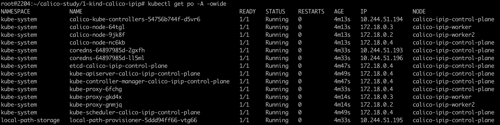
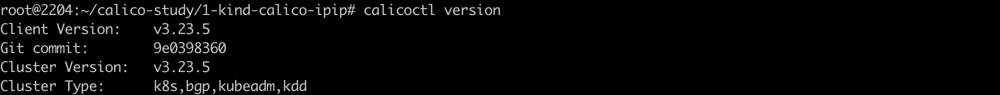
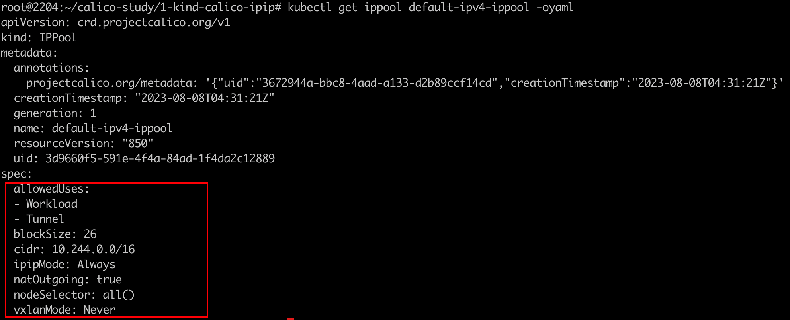
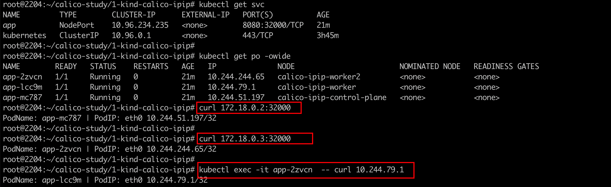

### 一: Calico基础环境搭建

- k8s集群版本: 1.23.4
- Calico版本: 3.23.5

calico的试验均采用kind进行集群的快速搭建,可参考文档: https://docs.tigera.io/calico/latest/getting-started/kubernetes/kind

1. 安装脚本如下:

   `1-setup-env.sh`

   ```shell
   #!/bin/bash
   date		
   set -v
   
   # 1.prep noCNI env
   cat <<EOF | kind create cluster --name=calico-ipip --image=kindest/node:v1.23.4 --config=-
   kind: Cluster
   apiVersion: kind.x-k8s.io/v1alpha4
   networking:
           disableDefaultCNI: true
   nodes:
           - role: control-plane
           - role: worker
           - role: worker
   
   EOF
   
   # 2.remove taints
   controller_node_ip=`kubectl get node -o wide --no-headers | grep -E "control-plane" | awk -F " " '{print $6}'`
   kubectl taint nodes $(kubectl get nodes -o name | grep control-plane) node-role.kubernetes.io/master:NoSchedule-
   kubectl get nodes -o wide
   
   # 3. install CNI[Calico v3.23.5]
   kubectl apply -f calico.yaml
   #kubectl apply -f https://projectcalico.docs.tigera.io/archive/v3.23/manifests/calico.yaml
   
   # 4. wait all pods ready
   kubectl wait --timeout=100s --for=condition=Ready=true pods --all -A
   ```

   


2. 查看集群状态

   各集群状态均已就绪

    


3. 安装calico二进制工具

   (类似做了kubectl的alicas)主要是方便操作calico的crd资源

   参考:https://docs.tigera.io/archive/v3.23/maintenance/clis/calicoctl/install

   `curl -L https://github.com/projectcalico/calico/releases/download/v3.23.5/calicoctl-linux-amd64 -o calicoctl`

   `chmod +x ./calicoctl`

   


---

### 二: IP pool分析

参考: https://docs.tigera.io/archive/v3.23/reference/resources/ippool

IP 池资源 (IPPool) 表示 Calico 期望从中分配pod IP 的 IP 地址集合。

`kubectl get ippool default-ipv4-ippool -oyaml`



⚠️: 其中`ipipMode: Always` Always表示无论node之间 无论是L2还是L3 都会进行ipip的报文封装

​    `vxlanMode: Never`  该配置和ipipMode互斥，never表示不走vxlan封装

​	`nodeSelector: all()`: 选择集群中的节点应用此ipam策略，默认是all()

还可以通过`calicoctl get ippool -owide`

 


---

### 三: 部署应用测试

1. 部署demo app

   ```yaml
   apiVersion: apps/v1
   kind: DaemonSet
   #kind: Deployment
   metadata:
     labels:
       app: app
     name: app
   spec:
     #replicas: 2
     selector:
       matchLabels:
         app: app
     template:
       metadata:
         labels:
           app: app
       spec:
         containers:
         - image: burlyluo/nettool
           name: nettoolbox
   ---
   apiVersion: v1
   kind: Service
   metadata:
     name: app
   spec:
     type: NodePort
     selector:
       app: app
     ports:
     - name: app
       port: 8080
       targetPort: 80
       nodePort: 32000
   
   ```

   访问测试: 

    


---

### 