### 一: Calico ipip模式 跨节点通信

参考架构图:

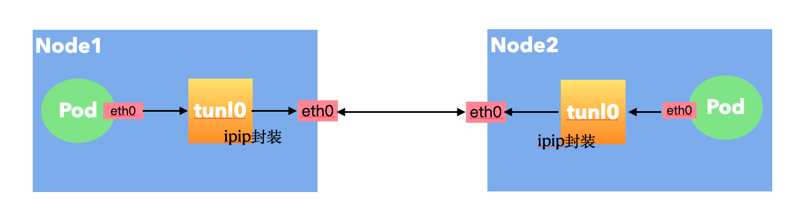

大概就是将一个IP数据包套在另一个IP包里，使用到了Linux提供的隧道技术。可以理解为一个基于IP层的网桥，将两个本不通的网络通过点对点连接起来.

### 二: Calico ipip 模式基本环境信息

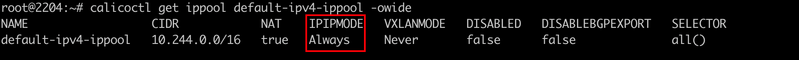 

`IPIPMODE取值为Always 表示节点之间无论是不是同一个二层都会经过ipip隧道封装。可选CrossSubnet，Never `

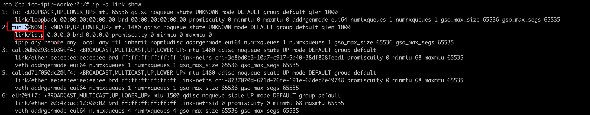 

node节点上的tunl0是一个ipip的设备负责封装ip报文。这个tunl0还是个NOARP 设备，不处理Mac信息，不往外发arp请求，三层设备，没有mac概念。

ipip怎么封装包呢？ 它将原本的ip包封装到一个新的ip包里面去，即ip(packet) in ip(new ip packet)

### 三: pod跨节点通信报文分析

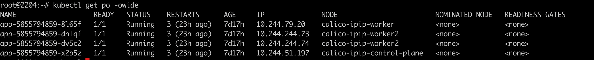 

源pod:   app-5855794859-8l65f (10.244.79.20) 

目标pod: app-5855794859-dhlqf (10.244.244.73)

1. 分析第一跳，pod内eth0网卡抓包 `tcpdump -pne -i eth0`

   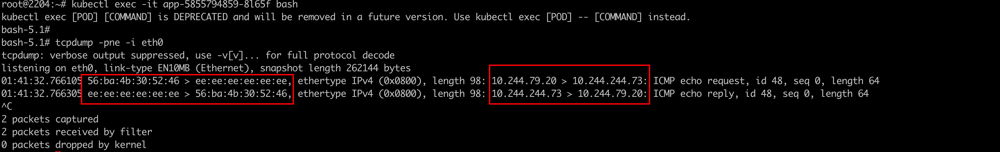 

   可以看到 srcIP dstIP 均为源pod，目标pod的 ip地址; srcMac为源pod的mac地址，dstMac 为calixxx网卡的全e地址

   源podMac地址

   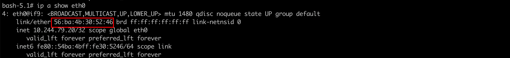

    

   pod eth0网卡对应的veth设备，即calixxx网卡:

   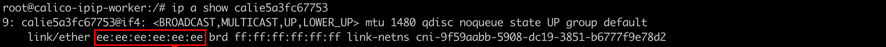 

   到此，数据包发送的第一跳，我们弄清楚了。

   

   我们也可以在对应的calixxx网卡进行抓包, 数据和pod内eth0数据理论应该是一致的:

   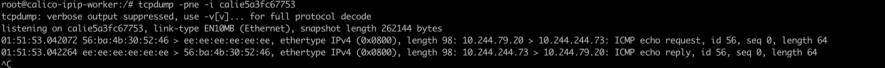 

2. 分析第二跳，数据包到了节点上后，发往tunl0设备封装处理

   首先查看节点上的路由表: 因为目标地址是`10.244.244.73`  ,所以命中该路由规则

   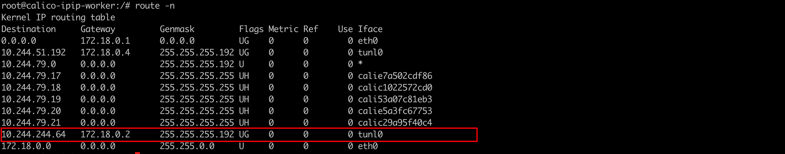 

   该路由有哪些信息: 掩码`255.255.255.192`  即26位(192=128+64) ==> 10.244.244.64/26 ==>(10.244.244.64 ~ 10.244.244.127 该范围内的ip地址都在路由规则内)

   

   那我们现在tunl0上进行抓包:

   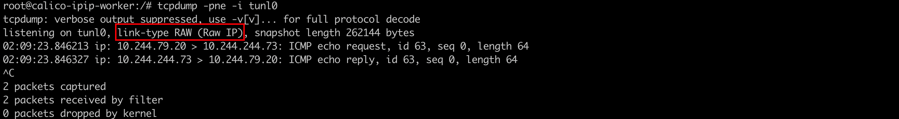 

   我们发现数据包似乎有点奇怪，只有srcIP,dstIP 信息。没有Mac信息。

   我们注意到 抓包信息提示: RAW （Raw IP）,它表示这是个ip包。就能很好解释为什么没有mac信息了。

   ipip的封装逻辑需要把原本的ip包，封装在新的ip包里面。我们知道了原本的ip是` request 10.244.79.20 > 10.244.244.73` ,那外层的ip包地址又是什么呢？

    

   我们可以看到 any remote any local。封装信息没有指定外层的的源目的ip，那就是以默认路由对应的网卡来封装，用作外层ip

   

3. 分析ipip封装的数据包，数据包经过tunl0封装后，由eth0网卡发往对端节点

   我们在节点的eth0网卡上抓包: `tcpdump -pne -i eth0 "ip proto 4"`

   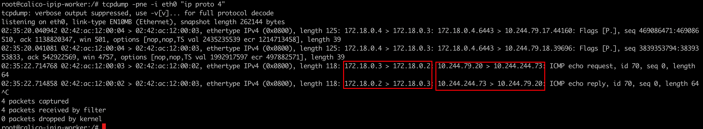

   可以发现数据包 也与平常见的不太一样，套了两层ip信息:

   `origin ip: 10.244.79.20 > 10.244.244.73`

   `外层ip : 172.18.0.3 (local) > 172.18.0.2 (remote)`

   封装的ip地址中，我们知道local ip 为eth0的ip地址，那么remote IP(172.18.0.2) 是怎么来的呢?

   查看路由表就可知道: 下一跳网关地址为: 172.18.0.2

   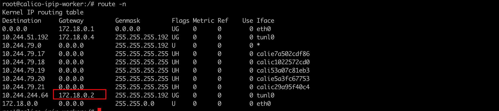

   

4. 使用wireshark 分析ipip数据包

   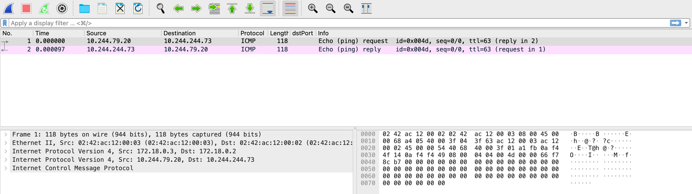

   可以看到数据包一共5层，其中ip所在的网络层有2个，分别是主机之间的网络封装和pod之间的网络，内层是Pod容器之间的IP网络报文,外层是宿主机节点的网络报文(2个node节点)。之所以要这样做是因为tunl0是一个隧道端点设备，在数据到达时要加上一层封装，便于发送到对端隧道设备中

   IPIP 数据包如上图所示，由于ipip包没有二层信息，所以也不支持二层的一些属性。由于二层信息丢失，额外开销就小一些，相比Vxlan来说，没有udp头，vni，二层的mac等地址信息

### 四: 总结

一般来说 ipip模式是Always的场景下，crossWorkNode之间的通信都需要进行ipip的封装，相比vxlan（Mac in udp）来说就简单很多。

Pod间的通信经由IPIP的三层隧道转发,相比较VxLAN的二层隧道来说，IPIP隧道的开销较小，但其安全性也更差一些。
