### 一: Calico ipip crossSubnet 模式

Calico-ipip模式和calico-bgp模式都有对应的局限性，对于一些主机跨子网而又无法使网络设备使用BGP的场景可以使用cross-subnet模式，实现同子网机器使用calico-BGP模式，跨子网机器使用calico-ipip模式。

概念图如下:

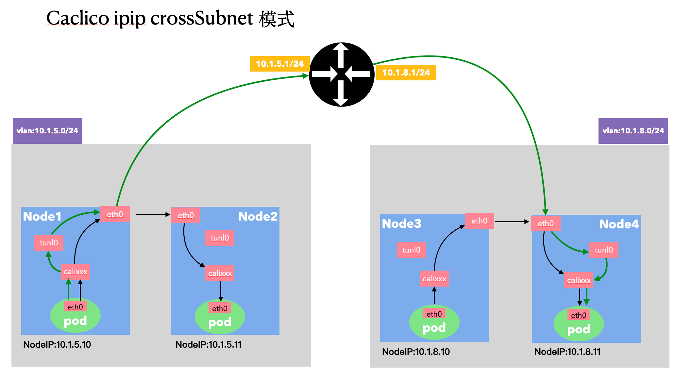


统一环境信息:

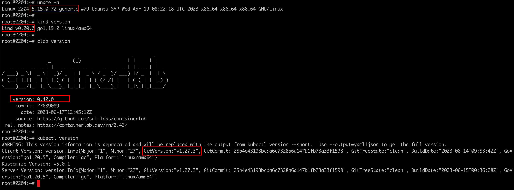


---

### 二: 创建k8s集群

创建k8s安装脚本 `1-setup-env.sh`

```shell
#!/bin/bash
date
set -v

# 1.prep noCNI env
cat <<EOF | kind create cluster --name=calico-ipip-crosssubnet --image=kindest/node:v1.27.3 --config=-
kind: Cluster
apiVersion: kind.x-k8s.io/v1alpha4
networking:
  disableDefaultCNI: true
  podSubnet: "10.98.0.0/16"
nodes:
- role: control-plane
  kubeadmConfigPatches:
  - |
    kind: InitConfiguration
    nodeRegistration:
      kubeletExtraArgs:
        node-ip: 10.1.5.10
        node-labels: "rack=rack0"

- role: worker
  kubeadmConfigPatches:
  - |
    kind: JoinConfiguration
    nodeRegistration:
      kubeletExtraArgs:
        node-ip: 10.1.5.11
        node-labels: "rack=rack0"

- role: worker
  kubeadmConfigPatches:
  - |
    kind: JoinConfiguration
    nodeRegistration:
      kubeletExtraArgs:
        node-ip: 10.1.8.10
        node-labels: "rack=rack1"

- role: worker
  kubeadmConfigPatches:
  - |
    kind: JoinConfiguration
    nodeRegistration:
      kubeletExtraArgs:
        node-ip: 10.1.8.11
        node-labels: "rack=rack1"

EOF

# 2.remove taints
controller_node_ip=`kubectl get node -o wide --no-headers | grep -E "control-plane" | awk -F " " '{print $6}'`
kubectl taint nodes $(kubectl get nodes -o name | grep control-plane) node-role.kubernetes.io/control-plane:NoSchedule-
kubectl get nodes -o wide

# 3. install tools for node
for i in $(docker ps -a --format "table {{.Names}}" |grep calico-ipip)
do
                echo $i
                docker cp /usr/bin/ping $i:/usr/bin/ping
                docker exec -it $i bash -c "apt-get -y update > /dev/null && apt-get -y install net-tools tcpdump lrzsz > /dev/null 2>&1"
done


```

该集群的创建，主要是构建4个节点组成的k8s集群，其中每两个在一个二层网络下。与另外一组形成二层网络隔离。

集群搭建成功

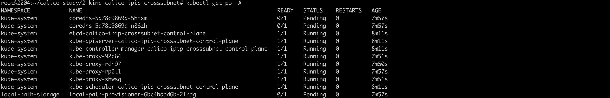 

---

### 三: 搭建clab环境

clab配置如下: `2-setup-clab.sh`

```shell
#!/bin/bash
set -v

brctl addbr br-pool0
ifconfig br-pool0 up

brctl addbr br-pool1
ifconfig br-pool1 up

cat <<EOF>clab.yaml | clab deploy -t clab.yaml -
name: calico-ipip-crosssubnet
topology:
  nodes:
    gw0:
      kind: linux
      image: burlyluo/vyos:1.4.0
      cmd: /sbin/init
      binds:
        - /lib/modules:/lib/modules
        - ./startup-conf/gw0-boot.cfg:/opt/vyatta/etc/config/config.boot
 
    br-pool0:
      kind: bridge
  
    br-pool1:
      kind: bridge

    server1:
      kind: linux
      image: burlyluo/nettool
      network-mode: container:calico-ipip-crosssubnet-control-plane
      exec:
      - ip addr add 10.1.5.10/24 dev net0
      - ip route replace default via 10.1.5.1

    server2:
      kind: linux
      image: burlyluo/nettool
      network-mode: container:calico-ipip-crosssubnet-worker
      exec:
      - ip addr add 10.1.5.11/24 dev net0
      - ip route replace default via 10.1.5.1

    server3:
      kind: linux
      image: burlyluo/nettool
      network-mode: container:calico-ipip-crosssubnet-worker2
      exec:
      - ip addr add 10.1.8.10/24 dev net0
      - ip route replace default via 10.1.8.1

    server4:
      kind: linux
      image: burlyluo/nettool
      network-mode: container:calico-ipip-crosssubnet-worker3
      exec:
      - ip addr add 10.1.8.11/24 dev net0
      - ip route replace default via 10.1.8.1


  links:
    - endpoints: ["br-pool0:br-pool0-net0", "server1:net0"]
    - endpoints: ["br-pool0:br-pool0-net1", "server2:net0"]
    - endpoints: ["br-pool1:br-pool1-net0", "server3:net0"]
    - endpoints: ["br-pool1:br-pool1-net1", "server4:net0"]

    - endpoints: ["gw0:eth1", "br-pool0:br-pool0-net2"]
    - endpoints: ["gw0:eth2", "br-pool1:br-pool1-net2"]

EOF
```

该配置其实就是为了将kind组建的k8s集群中的节点网络引入到containerLab中去，然后基于contailerLab做真实的网络配置

其中的gw0-boot.cfg配置文件如下:

```bash
interfaces {
    ethernet eth1 {
        address 10.1.5.1/24
        duplex auto
        smp-affinity auto
        speed auto
    }
    ethernet eth2 {
        address 10.1.8.1/24
        duplex auto
        smp-affinity auto
        speed auto
    }
    loopback lo {
    }
}
nat {
    source {
        rule 100 {
            outbound-interface eth0
            source {
                address 10.1.0.0/16
            }
            translation {
                address masquerade
            }
        }
    }
}
system {
    config-management {
        commit-revisions 100
    }
    console {
        device ttyS0 {
            speed 9600
        }
    }
    host-name vyos
    login {
        user vyos {
            authentication {
                encrypted-password $6$QxPS.uk6mfo$9QBSo8u1FkH16gMyAVhus6fU3LOzvLR9Z9.82m3tiHFAxTtIkhaZSWssSgzt4v4dGAL8rhVQxTg0oAG9/q11h/
                plaintext-password ""
            }
            level admin
        }
    }
    ntp {
        server 0.pool.ntp.org {
        }
        server 1.pool.ntp.org {
        }
        server 2.pool.ntp.org {
        }
    }
    syslog {
        global {
            facility all {
                level info
            }
            facility protocols {
                level debug
            }
        }
    }
    time-zone UTC
}


/* Warning: Do not remove the following line. */
/* === vyatta-config-version: "qos@1:dhcp-server@5:webgui@1:pppoe-server@2:webproxy@2:firewall@5:pptp@1:dns-forwarding@1:mdns@1:quagga@7:webproxy@1:snmp@1:system@10:conntrack@1:l2tp@1:broadcast-relay@1:dhcp-relay@2:conntrack-sync@1:vrrp@2:ipsec@5:ntp@1:config-management@1:wanloadbalance@3:ssh@1:nat@4:zone-policy@1:cluster@1" === */
/* Release version: 1.2.8 */
```

containerLab组网成功:

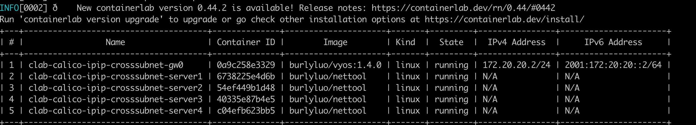

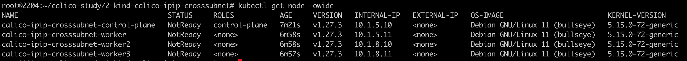


### 四: 部署cni(calico)网络插件

此时集群虽然搭建完成了，但是由于未部署cni网络插件，集群node/master之间k8s网络未互通(kubelet 无法同master通信)。

部署calico ipip crosssubnet模式的网络插件

```bash
kubectl apply -f calico.yaml
#kubectl apply -f https://projectcalico.docs.tigera.io/archive/v3.23/manifests/calico.yaml
```

需要⚠️: 将 `CALICO_IPV4POOL_IPIP 的值 Always`修改为`CrossSubnet`


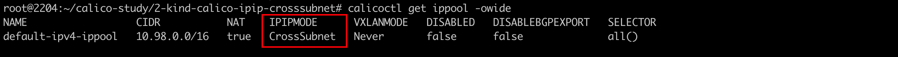

此时查看集群节点信息: 节点状态就绪

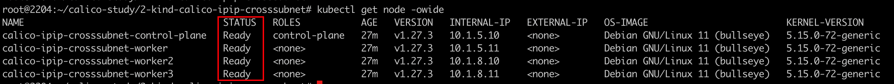

此时查看集群pod信息: 集群所有pod均已就绪 

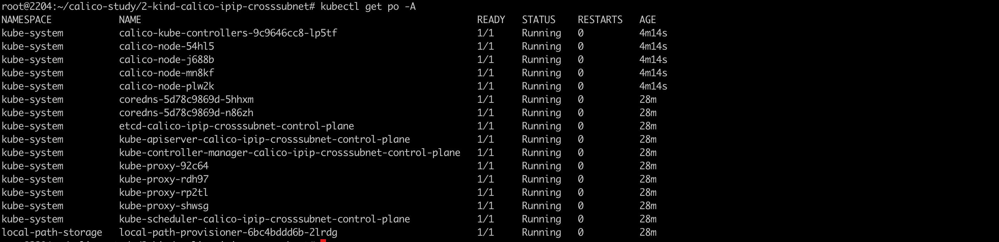


### 五: 部署测试业务验证CrossSubnet

```yaml
apiVersion: apps/v1
kind: DaemonSet
#kind: Deployment
metadata:
  labels:
    app: app
  name: app
spec:
  #replicas: 2
  selector:
    matchLabels:
      app: app
  template:
    metadata:
      labels:
        app: app
    spec:
      containers:
      - image: burlyluo/nettool
        name: nettoolbox
---
apiVersion: v1
kind: Service
metadata:
  name: app
spec:
  type: NodePort
  selector:
    app: app
  ports:
  - name: app
    port: 8080
    targetPort: 80
    nodePort: 32000
```

查看业务pod信息:

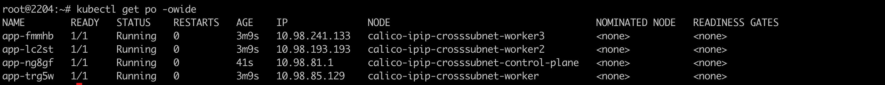

查看node上(master 节点)的路由策略:

可以发现如果是去往`10.98.85.128/26 `网段内的地址 则通过net0接口出去

如果是去往`10.98.193.192/26` 或者 `10.98.241.128/26` 网段内的地址 则通过tunl0接口出去;(需要ipip封装)

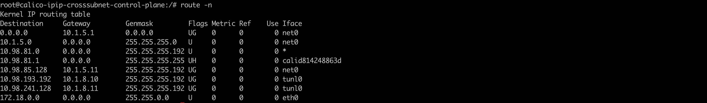

pod（master节点上pod）的路由策略:

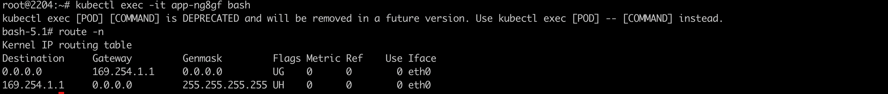


### 六:  抓包测试同子网pod通信datapath

抓包位置为: 源pod所在宿主机的net0网卡上:

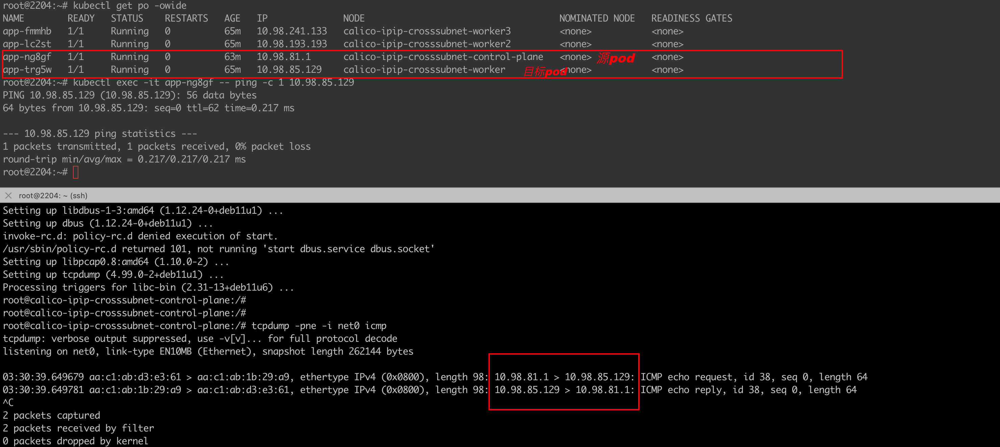

可以看到抓包数据中: 源/目的ip 均为srcpod/dstpod。 源/目的Mac 均为: 源pod所在宿主机net0网卡/目的pod所在宿主机net0网卡 的Mac地址。


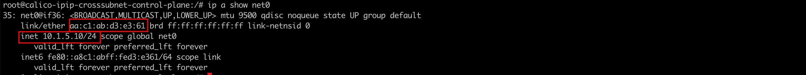

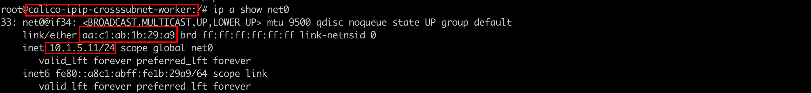

所以跨节点同子网下的pod通信无需ipip的封装，通过三层路由可达。

### 七: 抓包测试跨子网pod通信datapath

master节点和worker2 节点ip分别为: `10.1.5.10/24`  `10.1.8.10/24`,存在跨子网node通信的情况

抓包位置为源pod所在宿主机(master节点)net0网卡:

可以发现抓包信息中携带了两层ip信息: 跨子网需要进行ipip的封装

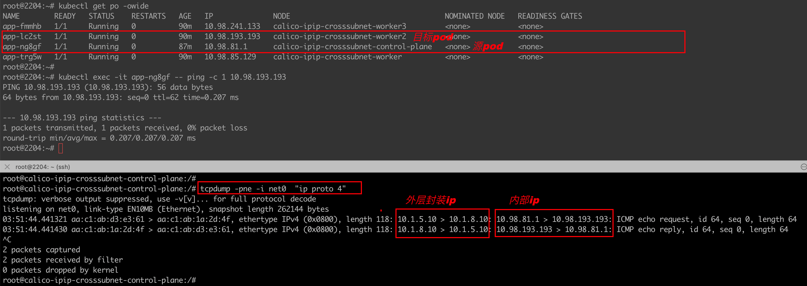


抓包位置为源pod所在宿主机(master节点)tunl0网卡:

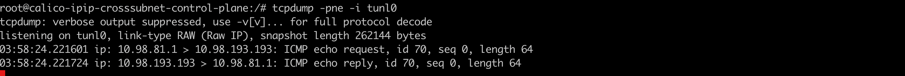 
