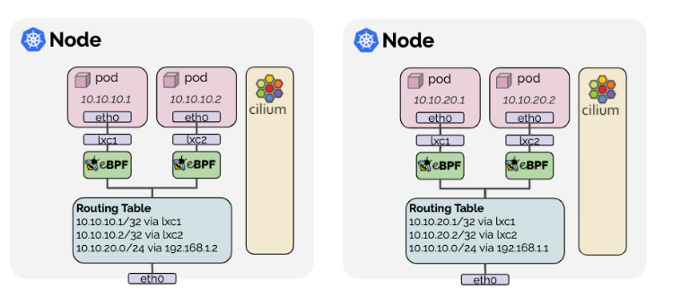
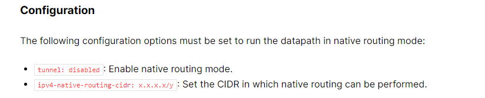
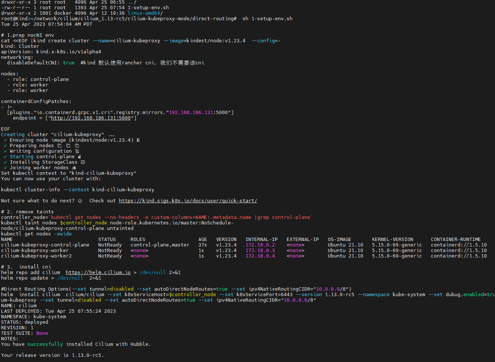
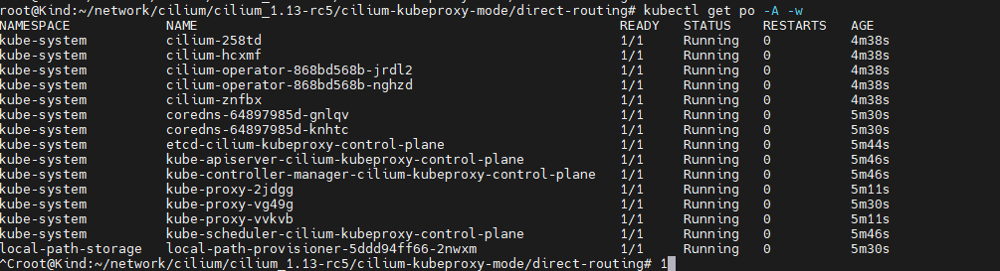

### 一： native routing with kubeproxy

这种模式最为通用，简单方便，效率还可以，几乎所有cni都支持这种backend,类似于flannel 的host-gateway模式

 

 

由于cilium 默认是vxlan模式运行，如果需要开启该模式，需要一些额外的配置:

 


### 二： 环境准备

```shell
#1-setup-env.sh
#! /bin/bash
date
set -v

# 1.prep nocNI env
cat <<EOF |kind create cluster --name=cilium-kubeproxy --image=kindest/node:v1.23.4  --config=-
kind: Cluster
apiVersion: kind.x-k8s.io/v1alpha4
networking:
  disableDefaultCNI: true  #kind 默认使用rancher cni，我们不需要该cni
  
nodes:
  - role: control-plane
  - role: worker
  - role: worker
 
containerdConfigPatches:
- |-
  [plugins."io.containerd.grpc.v1.cri".registry.mirrors."192.168.186.131:5000"]
    endpoint = ["http://192.168.186.131:5000"]
  
EOF

# 2. remove taints
controller_node=`kubectl get nodes --no-headers -o custom-columns=NAME:.metadata.name |grep control-plane`
kubectl taint nodes $controller_node node-role.kubernetes.io/master:NoSchedule-
kubectl get nodes -owide

# 3.  install cni
helm repo add cilium  https://helm.cilium.io > /dev/null 2>&1
helm repo update > /dev/null  2>&1

#Direct Routing Options(--set tunnel=disabled --set autoDirectNodeRoutes=true --set ipv4NativeRoutingCIDR="10.0.0.0/8")
helm  install cilium  cilium/cilium --set k8sServiceHost=$controller_node --set k8sServicePort=6443 --version 1.13.0-rc5 --namespace kube-system --set dubug.enabled=true --set dubug.verbose=datapath --set monitorAggregation=none --set ipam.mode=cluster-pool --set cluster.name=cilium-kubeproxy --set tunnel=disabled --set autoDirectNodeRoutes=true --set ipv4NativeRoutingCIDR="10.0.0.0/8"
```

**集群创建成功** 

cilium cni应用成功

 


### 三：部署demo体验cilium cni

