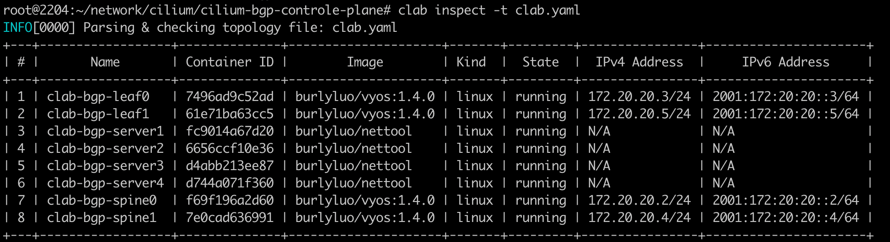

### 一: Cilium BGP能力

随着 Kubernetes 在企业中的应用越来越多，用户在其环境中同时拥有传统应用程序和云原生应用程序，为了让彼此联通，同时还要允许 Kubernetes 集群外部的网络能够通过 BGP 协议动态获取到访问的 Pod 的路由，Cilium 引入了对 BGP 协议的支持。


1. BGP beta方案（Cilium+MetalLB）

   Cilium 1.10 版本开始集成了对 BGP 的支持，通过集成 MetalLB 将 Kubernetes 暴露给外部。Cilium 现在能够为 LoadBalancer 类型的service分配IP，并向 BGP 邻居宣告路由信息。无需任何其他组件，就可以允许集群外部的流量访问k8s内运行的服务。

   

   BGP 功能出现在 1.10 版本中，并在 1.11 中得到进一步增强。它使运维人员能够通告 Pod CIDR 和 ServiceIP，并在 Cilium 管理的 Pod 和现有网络基础设施之间提供路由对等。这些功能仅适用于 IPv4 协议并依赖 MetalLB。

   

   

2. Cilium BGP ControlePlane方案 

   随着 IPv6 的使用热度不断增长，Cilium 需要提供BGP IPv6 能力 - 包括SRv6。虽然 MetalLB 通过 FRR 提供了一些有限的 IPv6 支持，但它仍然处于实验阶段。 Cilium 团队评估了各种选项，并决定转向功能更丰富的 GoBGP 。

   

   该方案也是Cilium社区主要的演进方向，更加推荐使用。

---

### 二: Cilium BGP ControlePlane 环境搭建

架构图如下所示: 搭建的真实环境将模拟该topo，包括ip地址 ASN编号

  

1. 创建网桥 `1-create-bridge.sh`

   ```shell
   brctl addbr  br-leaf0
   ifconfig br-leaf0 up
   brctl addbr br-leaf1
   ifconfig br-leaf1 up
   ```

   创建这两个网桥主要是为了让kind上节点通过虚拟交换机连接到containerLab，为什么不直连接containerLab，如果`10.1.5.10/24`使用vethPair和containerLab进行连接，`10.1.5.11/24`就没有额外的端口进行连接

    

   

2. 创建集群: `2-setup-k8s.sh`

   ```shell
   #!/bin/bash
   date
   set -v
   
   # 1.prep noCNI env
   cat <<EOF | kind create cluster --image=kindest/node:v1.23.4 --config=-
   kind: Cluster
   name: clab-bgp
   apiVersion: kind.x-k8s.io/v1alpha4
   networking:
     disableDefaultCNI: true
     podSubnet: "10.98.0.0/16"
   nodes:
   - role: control-plane
     kubeadmConfigPatches:
     - |
       kind: InitConfiguration
       nodeRegistration:
         kubeletExtraArgs:
           node-ip: 10.1.5.10
           node-labels: "rack=rack0"
   
   - role: worker
     kubeadmConfigPatches:
     - |
       kind: JoinConfiguration
       nodeRegistration:
         kubeletExtraArgs:
           node-ip: 10.1.5.11
           node-labels: "rack=rack0"
   
   - role: worker
     kubeadmConfigPatches:
     - |
       kind: JoinConfiguration
       nodeRegistration:
         kubeletExtraArgs:
           node-ip: 10.1.8.10
           node-labels: "rack=rack1"
   
   - role: worker
     kubeadmConfigPatches:
     - |
       kind: JoinConfiguration
       nodeRegistration:
         kubeletExtraArgs:
           node-ip: 10.1.8.11
           node-labels: "rack=rack1"
   
   EOF
   
   # 2.remove taints
   controller_node=`kubectl get nodes --no-headers  -o custom-columns=NAME:.metadata.name| grep control-plane`
   kubectl taint nodes $controller_node node-role.kubernetes.io/master:NoSchedule-
   kubectl get nodes -o wide
   ```

   注意点:

   - 集群名称需要设置为:`clab-bgp`,因为contailerLab的版本原因，便于node 共享名称空间
   - 集群安装保留kube-proxy
   - 创建node的时候需要设置`nodeRegistration.kubeletExtraArgs.node-labels=rack=rackx`
   - 设置`nodeRegistration.kubeletExtraArgs.node-ip=10.1.5.10` 创建4个节点，构建每2个节点处于同一个二层。测试不同二层机器上面的pod如何互访


3. 创建clab容器环境`3-setup-clab.sh`

    

   Ubuntu22.04运行ContainerLab with vyos的环境会出现不兼容，

   vyos镜像可用: `docker pull burlyluo/vyos:1.4.0`

   containerLab的安装最好选择使用0.30.0版本
   
   ```shell
   #!/bin/bash
   set -v
   cat <<EOF>clab.yaml | clab deploy -t clab.yaml -
   name: bgp
   topology:
     nodes:
       spine0:
         kind: linux
         image: burlyluo/vyos:1.4.0
         cmd: /sbin/init
         binds:
           - /lib/modules:/lib/modules
           - ./startup-conf/spine0-boot.cfg:/opt/vyatta/etc/config/config.boot
   
   
       spine1:
         kind: linux
         image: burlyluo/vyos:1.4.0
         cmd: /sbin/init
         binds:
           - /lib/modules:/lib/modules
           - ./startup-conf/spine1-boot.cfg:/opt/vyatta/etc/config/config.boot
   
       leaf0:
         kind: linux
         image: burlyluo/vyos:1.4.0
         cmd: /sbin/init
         binds:
           - /lib/modules:/lib/modules
           - ./startup-conf/leaf0-boot.cfg:/opt/vyatta/etc/config/config.boot
   
       leaf1:
         kind: linux
         image: burlyluo/vyos:1.4.0
         cmd: /sbin/init
         binds:
           - /lib/modules:/lib/modules
           - ./startup-conf/leaf1-boot.cfg:/opt/vyatta/etc/config/config.boot
   
       br-leaf0:
         kind: bridge
     
       br-leaf1:
         kind: bridge
   
   
       server1:
         kind: linux
         image: burlyluo/nettool
         network-mode: container:control-plane
         exec:
         - ip addr add 10.1.5.10/24 dev net0
         - ip route replace default via 10.1.5.1
   
       server2:
         kind: linux
         image: burlyluo/nettool
         network-mode: container:worker
         exec:
         - ip addr add 10.1.5.11/24 dev net0
         - ip route replace default via 10.1.5.1
   
       server3:
         kind: linux
         image: burlyluo/nettool
         network-mode: container:worker2
         exec:
         - ip addr add 10.1.8.10/24 dev net0
         - ip route replace default via 10.1.8.1
   
       server4:
         kind: linux
         image: burlyluo/nettool
         network-mode: container:worker3
         exec:
         - ip addr add 10.1.8.11/24 dev net0
         - ip route replace default via 10.1.8.1
   
   
     links:
       - endpoints: ["br-leaf0:br-leaf0-net0", "server1:net0"]
       - endpoints: ["br-leaf0:br-leaf0-net1", "server2:net0"]
   
       - endpoints: ["br-leaf1:br-leaf1-net0", "server3:net0"]
       - endpoints: ["br-leaf1:br-leaf1-net1", "server4:net0"]
   
       - endpoints: ["leaf0:eth1", "spine0:eth1"]
       - endpoints: ["leaf0:eth2", "spine1:eth1"]
       - endpoints: ["leaf0:eth3", "br-leaf0:br-leaf0-net2"]
   
       - endpoints: ["leaf1:eth1", "spine0:eth2"]
       - endpoints: ["leaf1:eth2", "spine1:eth2"]
       - endpoints: ["leaf1:eth3", "br-leaf1:br-leaf1-net2"]
   
   EOF
   
   # clab deploy -t ./clab.yaml
   ```
   
   部署完成后: `clab inspect -t clab.yaml` 可以看到8个容器 
   
   


4. 安装cilium网络插件

   ```shell
   helm repo add cilium https://helm.cilium.io/ > /dev/null 2>&1
   help repo update > /dev/null 2>&1
   # [Do not set "--set k8sServiceHost=$controller_node_ip --set k8sServicePort=6443"]
   helm install cilium  cilium/cilium --version 1.13.0-rc5 --namespace kube-system  \
   --set debug.enabled=true  --set debug.verbose=datapath --set monitorAggregation=none \
   --set cluster.name=clab-bgp-controlplane --set tunnel=disabled --set ipam.mode=kubernetes \
   --set ipv4NativeRoutingCIDR="10.0.0.0/8"  --set k8s.requireIPv4PodCIDR=true \
   --set bgpControlPlane.enabled=true 
   ```

   ⚠️：其中最关键的几处配置：

   - 无需指定 `k8sServiceHost` `k8sServicePort`
   - 安装参数需指定`set bgpControlPlane.enabled=true`  表示打开BGP controlpalne特性，BGP 控制平面控制器将被实例化并开始监听 `CiliumBGPPeeringPolicy `事件

   

