### 一: Cilium BGP介绍

随着 Kubernetes 在企业中的应用越来越多，用户在其环境中同时拥有传统应用程序和云原生应用程序，为了让彼此联通，同时还要允许 Kubernetes 集群外部的网络能够通过 BGP 协议动态获取到访问的 Pod 的路由，Cilium 引入了对 BGP 协议的支持。


1. BGP beta方案（Cilium+MetalLB）

   Cilium 1.10 版本开始集成了对 BGP 的支持，通过集成 MetalLB 将 Kubernetes 暴露给外部。Cilium 现在能够为 LoadBalancer 类型的service分配IP，并向 BGP 邻居宣告路由信息。无需任何其他组件，就可以允许集群外部的流量访问k8s内运行的服务。

   

   cilium 在 1.10 开始支持BGP ，并在 1.11 中得到进一步增强。它使运维人员能够通告 Pod CIDR 和 ServiceIP，并在 Cilium 管理的 Pod 和现有网络基础设施之间提供路由对等。这些功能仅适用于 IPv4 协议并依赖 MetalLB。

   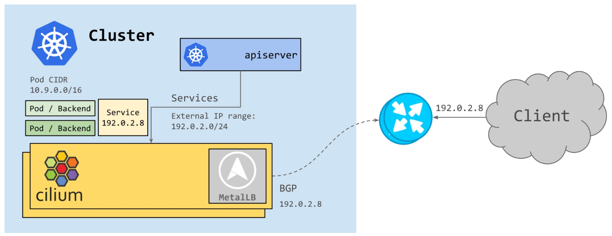

   

2. Cilium BGP ControlePlane方案 

   随着 IPv6 的使用热度不断增长，Cilium 需要提供BGP IPv6 能力 。虽然 MetalLB 通过 FRR 提供了一些有限的 IPv6 支持，但它仍然处于实验阶段。 Cilium 团队评估了各种选项，并决定转向功能更丰富的 GoBGP 。

   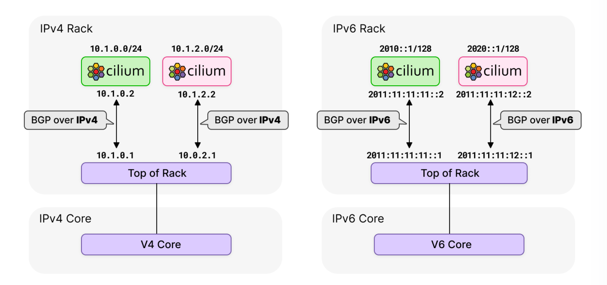

   该方案也是Cilium社区主要的演进方向，更加推荐使用。
   
   **本文档也会基于这种方案进行环境搭建和讲解**

---

### 二: Cilium BGP 使用背景

随着用户的集群规模不断扩大，不同数据中心的节点都加入了同一个kubernetes 集群，集群内节点不处于同一个二层网络平面。(或者是混合云的场景中)

为了解决跨平面网络互通的问题，虽然通过overlay的隧道封装(Cilium vxlan)方案可以解决该问题，但同时也引入了新问题，即隧道封装带来的数据包封装和解封装的额外网络性能损耗。

这时我们可以基于Cilium BGP controlplane的能力 实现直接路由的underlay网络方案，该方案打通了node-node，node-pod，pod-pod之间的网络,能够保证较高的网络性能,并且支持大规模集群扩展。


---

### 三: Cilium BGP ControlePlane 环境搭建

**在创建集群环境之前，统一下基础环境:**

`os ubuntu22.04; conatinerLab v0.42; kind v0.20 ;vyos1.4.0`

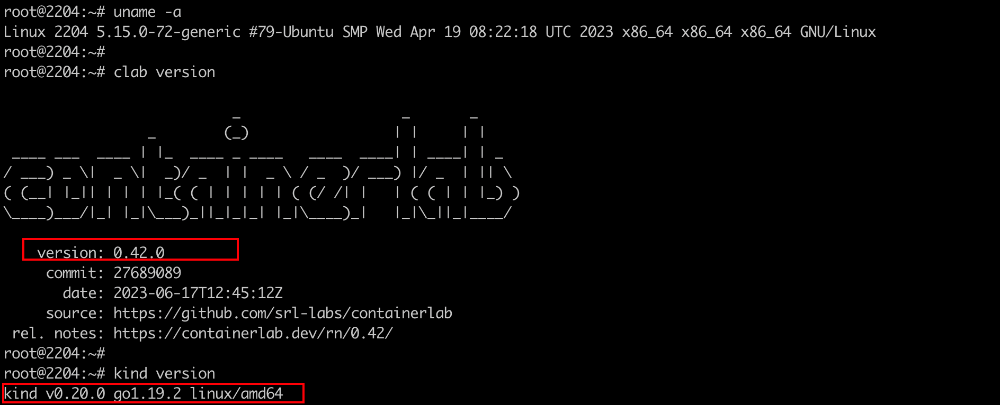 


架构图如下所示: 搭建的真实网络环境将模拟该topo，包括ip地址 ASN编号

该集群一共有4台节点，1master，3node，同时节点之间不在同一个网段

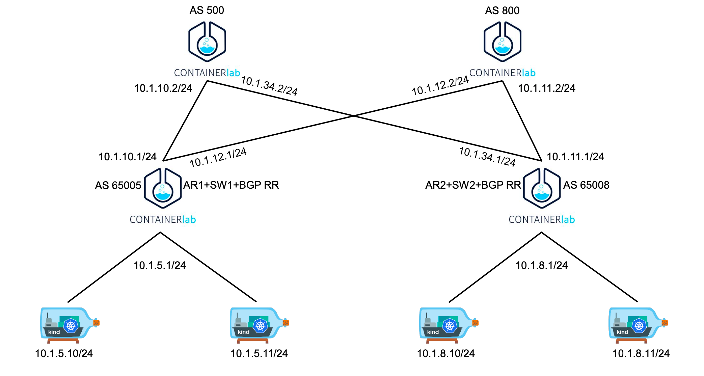  

 

---


1. 创建集群: `1-setup-k8s.sh`

   ```shell
   #!/bin/bash
   date
   set -v
   
   # 1.prep noCNI env
   cat <<EOF | kind create cluster --name=cilium-bgp --image=kindest/node:v1.27.3 --config=-
   kind: Cluster
   apiVersion: kind.x-k8s.io/v1alpha4
   networking:
     disableDefaultCNI: true
     podSubnet: "10.98.0.0/16"
   nodes:
   - role: control-plane
     kubeadmConfigPatches:
     - |
       kind: InitConfiguration
       nodeRegistration:
         kubeletExtraArgs:
           node-ip: 10.1.5.10
           node-labels: "rack=rack0"
   
   - role: worker
     kubeadmConfigPatches:
     - |
       kind: JoinConfiguration
       nodeRegistration:
         kubeletExtraArgs:
           node-ip: 10.1.5.11
           node-labels: "rack=rack0"
   
   - role: worker
     kubeadmConfigPatches:
     - |
       kind: JoinConfiguration
       nodeRegistration:
         kubeletExtraArgs:
           node-ip: 10.1.8.10
           node-labels: "rack=rack1"
   
   - role: worker
     kubeadmConfigPatches:
     - |
       kind: JoinConfiguration
       nodeRegistration:
         kubeletExtraArgs:
           node-ip: 10.1.8.11
           node-labels: "rack=rack1"
   
   EOF
   
   ```

   注意点:

   - 注意集群版本相比之前的测试有所变动，本次演示使用的1.27的k8s，注意更换节点上的kubectl版本

   - 集群安装保留kube-proxy

   - 创建node的时候需要设置`nodeRegistration.kubeletExtraArgs.node-labels=rack=rackx`

   - 设置`nodeRegistration.kubeletExtraArgs.node-ip=10.1.5.10` 创建4个节点，构建每2个节点处于同一个二层。测试不同二层机器上面的pod如何互访

     

   集群创建完成后，可以看到节点状态因为没有cni插件，状态为ready，同时也没有ip地址。这是正常现象

   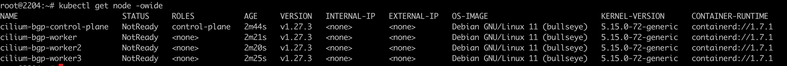

---

2. 创建clab容器环境`2-setup-clab.sh`

   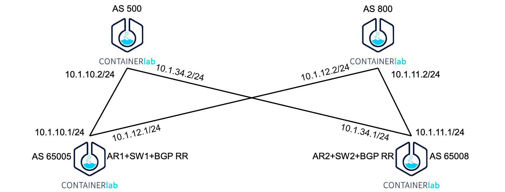 

   vyos镜像可用: `docker pull burlyluo/vyos:1.4.0`

   ```shell
   #!/bin/bash
   set -v
   
   brctl addbr br-leaf0;ifconfig br-leaf0 up;brctl addbr br-leaf1;ifconfig br-leaf1 up
   
   cat <<EOF>clab.yaml | clab deploy -t clab.yaml -
   name: cilium-bgp
   topology:
     nodes:
       spine0:
         kind: linux
         image: burlyluo/vyos:1.4.0
         cmd: /sbin/init
         binds:
           - /lib/modules:/lib/modules
           - ./startup-conf/spine0-boot.cfg:/opt/vyatta/etc/config/config.boot
   
       spine1:
         kind: linux
         image: burlyluo/vyos:1.4.0
         cmd: /sbin/init
         binds:
           - /lib/modules:/lib/modules
           - ./startup-conf/spine1-boot.cfg:/opt/vyatta/etc/config/config.boot
   
       leaf0:
         kind: linux
         image: burlyluo/vyos:1.4.0
         cmd: /sbin/init
         binds:
           - /lib/modules:/lib/modules
           - ./startup-conf/leaf0-boot.cfg:/opt/vyatta/etc/config/config.boot
   
       leaf1:
         kind: linux
         image: burlyluo/vyos:1.4.0
         cmd: /sbin/init
         binds:
           - /lib/modules:/lib/modules
           - ./startup-conf/leaf1-boot.cfg:/opt/vyatta/etc/config/config.boot
   
       br-leaf0:
         kind: bridge
     
       br-leaf1:
         kind: bridge
   
       server1:
         kind: linux
         image: burlyluo/nettool
         network-mode: container:cilium-bgp-control-plane
         exec:
         - ip addr add 10.1.5.10/24 dev net0
         - ip route replace default via 10.1.5.1
   
       server2:
         kind: linux
         image: burlyluo/nettool
         network-mode: container:cilium-bgp-worker
         exec:
         - ip addr add 10.1.5.11/24 dev net0
         - ip route replace default via 10.1.5.1
   
       server3:
         kind: linux
         image: burlyluo/nettool
         network-mode: container:cilium-bgp-worker2
         exec:
         - ip addr add 10.1.8.10/24 dev net0
         - ip route replace default via 10.1.8.1
   
       server4:
         kind: linux
         image: burlyluo/nettool
         network-mode: container:cilium-bgp-worker3
         exec:
         - ip addr add 10.1.8.11/24 dev net0
         - ip route replace default via 10.1.8.1
   
   
     links:
       - endpoints: ["br-leaf0:br-leaf0-net0", "server1:net0"]
       - endpoints: ["br-leaf0:br-leaf0-net1", "server2:net0"]
   
       - endpoints: ["br-leaf1:br-leaf1-net0", "server3:net0"]
       - endpoints: ["br-leaf1:br-leaf1-net1", "server4:net0"]
   
       - endpoints: ["leaf0:eth1", "spine0:eth1"]
       - endpoints: ["leaf0:eth2", "spine1:eth1"]
       - endpoints: ["leaf0:eth3", "br-leaf0:br-leaf0-net2"]
   
       - endpoints: ["leaf1:eth1", "spine0:eth2"]
       - endpoints: ["leaf1:eth2", "spine1:eth2"]
       - endpoints: ["leaf1:eth3", "br-leaf1:br-leaf1-net2"]
   
   EOF
   
   ```

   部署完成后: `clab inspect -t clab.yaml` 可以看到8个容器 

   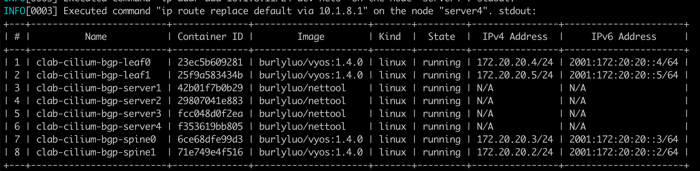

   同时我们的集群节点ip也被分配了:

   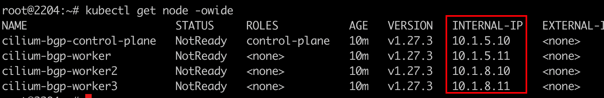

   需要注意的地方:

   - `brctl addbr br-leaf0;ifconfig br-leaf0 up;brctl addbr br-leaf1;ifconfig br-leaf1 up`

     创建这两个网桥主要是为了让kind上节点通过虚拟交换机连接到containerLab，为什么不直连接containerLab，如果`10.1.5.10/24`使用vethPair和containerLab进行连接，`10.1.5.11/24`就没有额外的端口进行连接

     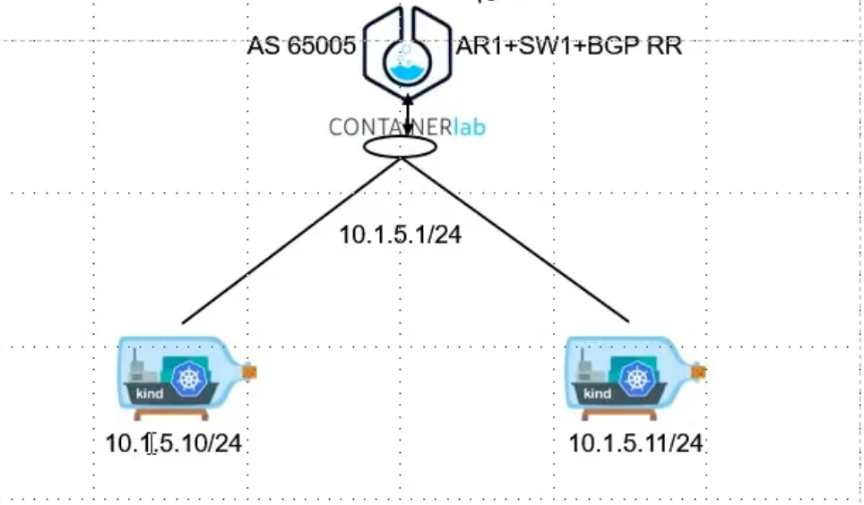  

   - ` - ./startup-conf/spine0-boot.cfg:/opt/vyatta/etc/config/config.boot`  vyos网关配置文件的编写

   - `network-mode: container:cilium-bgp-control-plane`  关键配置，该配置就是为了复用节点网络，共享网络命名空间

   - `- ip addr add 10.1.5.10/24 dev net0 && ip route replace default via 10.1.5.1` 该配置是为了设置节点上的业务网卡(参考以前集群节点ip一般都是172.18.0.2)，同时将默认路由的网关进行更改。 


---

3. 安装cilium 网络插件,此次安装的cilium v1.14新版本 `3-install-cilium.sh`

   ```shell
   #!/bin/bash
   set -v 
   
   # 1.remove taints
   kubectl taint nodes $(kubectl get nodes -o name | grep control-plane) node-role.kubernetes.io/control-plane:NoSchedule-
   kubectl get nodes -o wide
   
   # 2.install cilium cni
   helm repo add cilium https://helm.cilium.io/ > /dev/null 2>&1
   help repo update > /dev/null 2>&1
   
   # [Do not set "--set k8sServiceHost=$controller_node_ip --set k8sServicePort=6443" {kk describe ds/cilium to see the rc}]
   helm install cilium cilium/cilium --version 1.14.0-rc.0 --namespace kube-system  \
   --set debug.enabled=true --set debug.verbose=datapath --set monitorAggregation=none \
   --set cluster.name=cilium-bgp --set tunnel=disabled --set ipam.mode=kubernetes \
   --set ipv4NativeRoutingCIDR=10.0.0.0/8   --set k8s.requireIPv4PodCIDR=true \
   --set bgpControlPlane.enabled=true  
   
   
   # 3. wait all pods ready
   kubectl wait --timeout=100s --for=condition=Ready=true pods --all -A
   
   # 4. cilium status
   kubectl -nkube-system exec -it ds/cilium -- cilium status
   
   # 5. cgroup v2 verify
   for container in $(docker ps  -a --format "table {{.Names}}" | grep cilium-bgp);do docker exec $container ls -al /proc/self/ns/cgroup;done
   
   ```

   Cilium 已经就绪:

   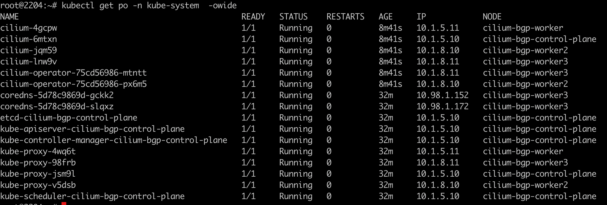 

   ⚠️：其中最关键的几处配置：

   - 无需指定 `k8sServiceHost` `k8sServicePort`，因为我门手动改了master节点ip，这时候如果指定成10.1.5.10 反而会引发其他问题。
   - 安装参数需指定`set bgpControlPlane.enabled=true`  表示打开BGP controlpalne特性，BGP 控制平面控制器将被实例化并开始监听 `CiliumBGPPeeringPolicy `事件

---

4. 创建CiliumBGPPeeringPolicy `4-enable-bgp-peer.sh`

   所有 BGP 对等体拓扑信息都包含在 CiliumBGPPeeringPolicy CRD 中。

   ```shell
   cat <<EOF | kubectl apply -f -
   ---
   apiVersion: "cilium.io/v2alpha1"
   kind: CiliumBGPPeeringPolicy
   metadata:
     name: rack0
   spec:
     nodeSelector:
       matchLabels:
         rack: rack0
     virtualRouters:
     - localASN: 65005
       exportPodCIDR: true
       neighbors:
       - peerAddress: "10.1.5.1/24"
         peerASN: 65005
   ---
   apiVersion: "cilium.io/v2alpha1"
   kind: CiliumBGPPeeringPolicy
   metadata:
     name: rack1
   spec:
     nodeSelector:
       matchLabels:
         rack: rack1
     virtualRouters:
     - localASN: 65008
       exportPodCIDR: true
       neighbors:
       - peerAddress: "10.1.8.1/24"
         peerASN: 65008
   EOF
   
   ```

   以上所有步骤执行完，即完成了 cilium BGP controlplane的搭建


---


### 四: Cilium BGP ControlPlane 特性验证

创建demo app 

```yaml
apiVersion: apps/v1
kind: DaemonSet
metadata:
  name: app
  labels:
    app: app
spec:
  selector:
    matchLabels:
      app: app
  template:
    metadata:
      labels:
        app: app
    spec:
      containers:
      - name: nettool
        image: burlyluo/nettool
        securityContext:
          privileged: true

---
apiVersion: v1
kind: Service
metadata:
  name: app
spec:
  type: NodePort
  selector:
    app: app
  ports:
  - name: app
    port: 8080
    targetPort: 80
    nodePort: 32000
```

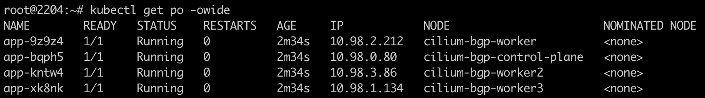

在构建集群的时候，4个节点中，master 和worker1 处于同一二层网络平面，worker2和worker3 处于另外一个二层平面


1. master节点上pod 访问worker2/worker3节点上的pod 进行测试，查看网络是否打通

   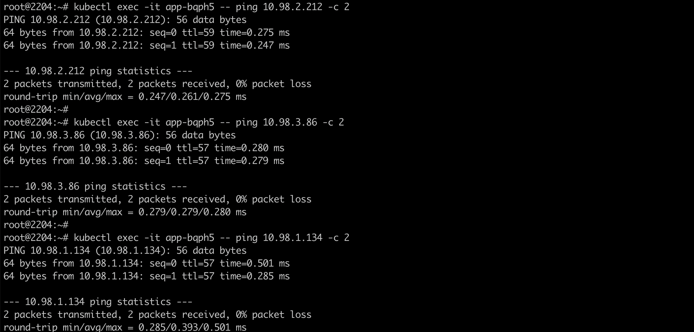    

   可以发现跨节点进行访问时候，无轮同一网络平面还是不同网络平面都可以互通

   

2. 抓包查看数据转发路径

   抓包位置选择leaf0 交换机的 eth1 和 eth2 网卡，为什么选择这个网卡呢，因为这两个网卡是对接这外部的两个BGP设备

   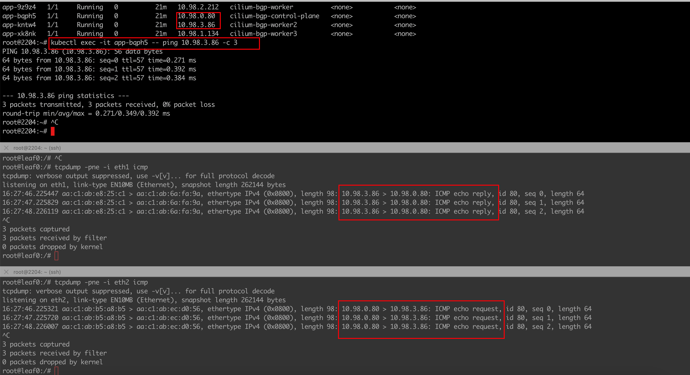

   通过抓包 我们还发现了EBGP的负载均衡策略，发包的网卡和收包的网卡并不是同一个。这也是EBGP的一个特性，网卡流量分摊。

   

3. 查看leaf0三层交换机上的路由策略

   `show ip route`

   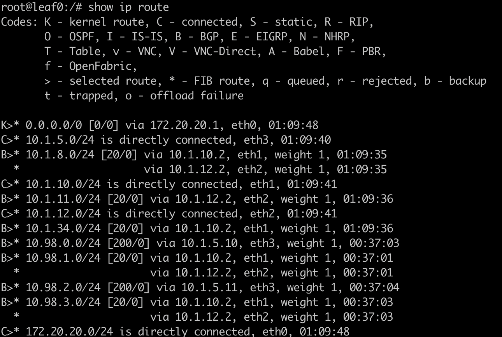

   

   或者 `show ip bgp`

   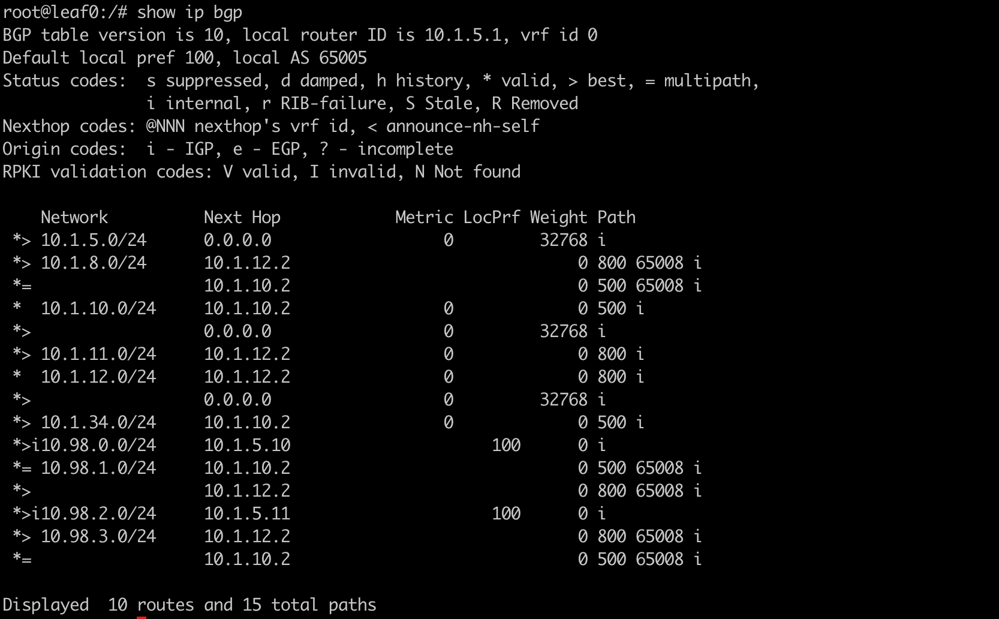 

---

### 五: BGP ControlePlane+MetalLB 宣告LBsvc

集群里的服务最终还是需要对外暴露的，仅仅在集群内可访问往往不能满足生产需求。借助metalLB的能力进行LB IP管理，然后通过BGP将LB svc进行宣告。

1. MetalLB环境搭建，采用v0.13版本。

   `kubectl apply -f https://raw.githubusercontent.com/metallb/metallb/v0.13.10/config/manifests/metallb-native.yaml`

   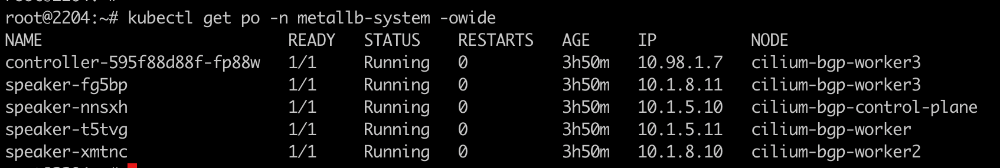

 

2.  创建LB IPpool 用于给loadbalancer类型的service分配ip地址

   `metallb-ipadpool.yaml`

   ```yaml
   apiVersion: metallb.io/v1beta1
   kind: IPAddressPool
   metadata:
     name: first-pool
     namespace: metallb-system
   spec:
     addresses:
     - 172.18.0.200-172.18.0.210
   ```

3. 创建LB类型的svc,查看是否分配IP地址

   ```yaml
   apiVersion: apps/v1
   kind: DaemonSet
   metadata:
     name: appdemo
     labels:
       app: appdemo
   spec:
     selector:
       matchLabels:
         app: appdemo
     template:
       metadata:
         labels:
           app: appdemo
       spec:
         containers:
         - name: nettool
           image: burlyluo/nettool
           securityContext:
             privileged: true
   
   ---
   apiVersion: v1
   kind: Service
   metadata:
     name: appdemo
   spec:
     type: LoadBalancer
     selector:
       app: appdemo
     ports:
     - name: app
       port: 8080
       targetPort: 80
   ```

   可以看到LB ip地址已经分配

   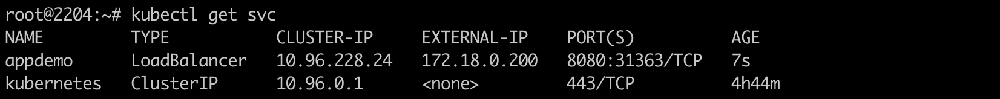 

   测试访问效果，发现无法在集群外访问该LB ip地址。

   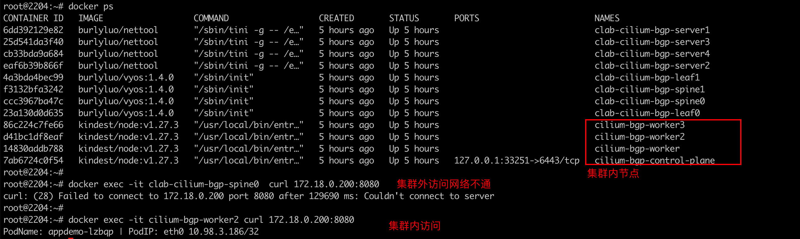

   原因很简单，还没进行service的宣告发布。

   

4. service announcements 服务宣告

   默认情况下，Virtual routers不会发布服务。不过Virtual routers 可以通过serviceSelector 进行svc匹配，然后将匹配到的任何svc的LB IP进行宣告

   将上述步骤创建的`CiliumBGPPeeringPolicy`cr资源进行修改，添加`serviceSelector`

   ```shell
   cat <<EOF | kubectl apply -f -
   ---
   apiVersion: "cilium.io/v2alpha1"
   kind: CiliumBGPPeeringPolicy
   metadata:
     name: rack0
   spec:
     nodeSelector:
       matchLabels:
         rack: rack0
     virtualRouters:
     - localASN: 65005
       exportPodCIDR: true
       neighbors:
       - peerAddress: "10.1.5.1/24"
         peerASN: 65005
       serviceSelector:
         matchExpressions:
           - {key: app, operator: NotIn, values: ["test"]}
        
   ---
   apiVersion: "cilium.io/v2alpha1"
   kind: CiliumBGPPeeringPolicy
   metadata:
     name: rack1
   spec:
     nodeSelector:
       matchLabels:
         rack: rack1
     virtualRouters:
     - localASN: 65008
       exportPodCIDR: true
       neighbors:
       - peerAddress: "10.1.8.1/24"
         peerASN: 65008
       serviceSelector:
         matchExpressions:
           - {key: app, operator: NotIn, values: ["test"]}
   EOF
   
   ```

   即添加:`serviceSelector.matchExpressions=[xxx]` ;该配置表示除了带有app:test 标签的service，其余的svc的LB地址均会被BGP路由发布

   

5. 访问测试

   访问成功，集群内外都可通过LB地址进行访问

    

   

   查看客户端的路由规则:

   可以看到对应LB IP的路由规则已经通过BGP协议学习到了

   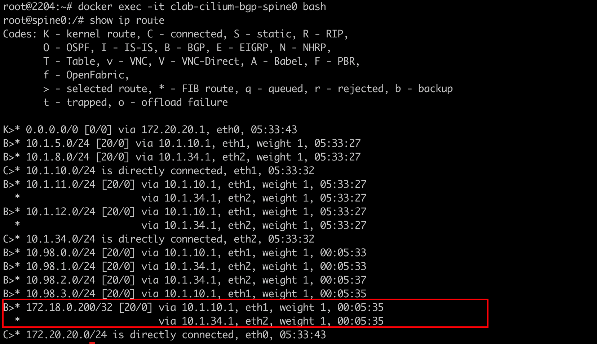 

---

### 六: BGP ControlPlane + LB IPAM 宣告LB svc

Cilium 本身也支持service LB地址的分配管理，除了MetalLB的方案外，还可以使用IPAM的特性完成service的宣告

1. 清理metalLB环境

2. 创建`CiliumLoadBalancerIPPool` 定义IP地址池

   ```yaml
   apiVersion: "cilium.io/v2alpha1"
   kind: CiliumLoadBalancerIPPool
   metadata:
     name: "red-pool"
   spec:
     cidrs:
     - cidr: "30.0.10.0/24"
     serviceSelector:
       matchLabels:
         color: red
   ```

   注意`serviceSelector`字段，表示该ip池只对指定svc生效

3. 创建deomo服务

   ```yaml
   apiVersion: apps/v1
   kind: DaemonSet
   metadata:
     name: appdemo
     labels:
       app: appdemo
   spec:
     selector:
       matchLabels:
         app: appdemo
     template:
       metadata:
         labels:
           app: appdemo
       spec:
         containers:
         - name: nettool
           image: burlyluo/nettool
           securityContext:
             privileged: true
   
   ---
   apiVersion: v1
   kind: Service
   metadata:
     name: appdemo
     labels:
       color: red
   spec:
     type: LoadBalancer
     selector:
       app: appdemo
     ports:
     - name: app
       port: 8080
       targetPort: 80
   ```

   服务创建成功，LB ip地址已经分配

    

4. 由于上述步骤已经创建`CiliumBGPPeeringPolicy` 资源配置，无需重复创建，复用即可

5. 访问测试

   测试发现，无论集群内外均可访问该svc的LB ip地址

   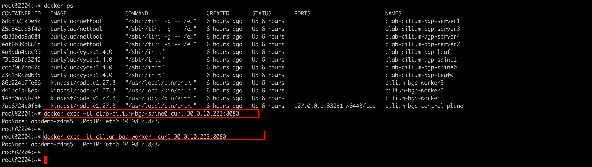

   

   查看外部节点的路由规则:

   可以看到对应服务的ip地址已经在该节点的路由表中，前面B表示，通过BGP学习而来的

   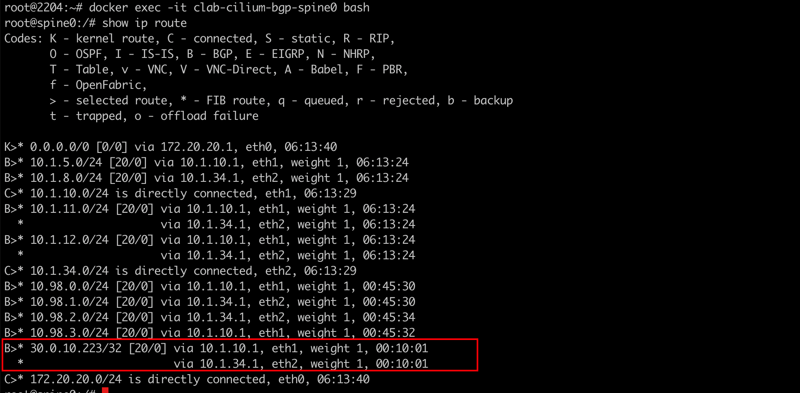

---

### 七: BGP方案不是万能的

1. Underlay + 三层路由的方案，在传统机房中是非常流行的方案，因为它的性能很好。但是在公有云vpc的场景下，受限使用，不是每个公有云供应商都让用，每一个云厂商对网络保护的定义不一样。Calio的BGP在AWS中可以实现，但是在Azure中不允许，它的VPC不允许不受管控范围的IP通过。
2. 在BGP场景下，BGP Underlay即使能使用，但无法跨AZ。在公有云中跨AZ一般意味着跨子网，跨子网就意味着跨路由。VPC的 vRouter一般不支持BGP。BGP underlay可以用，也仅限于单az。


---

### 八: 关于vyos的网关配置

在上面环境搭建步骤汇总 containerLab组网配置vyos的时候，需要配置vyos的网关路由配置，如下:

1. leaf0-boot.cfg

   ```yaml
   interfaces {
       ethernet eth1 {
           address 10.1.10.1/24
           duplex auto
           mtu 9000
           speed auto
       }
       ethernet eth2 {
           address 10.1.12.1/24
           duplex auto
           mtu 9000
           speed auto
       }
       ethernet eth3 {
           address 10.1.5.1/24
           duplex auto
           mtu 9000
           speed auto
       }
       loopback lo {
       }
   }
   nat {
       source {
           rule 100 {
               outbound-interface eth0
               source {
                   address 10.1.0.0/16
               }
               translation {
                   address masquerade
               }
           }
       }
   }
   protocols {
       bgp {
           address-family {
               ipv4-unicast {
                   network 10.1.5.0/24 {
                   }
                   network 10.1.10.0/24 {
                   }
                   network 10.1.12.0/24 {
                   }
               }
           }
           neighbor 10.1.5.10 {
               address-family {
                   ipv4-unicast {
                       route-reflector-client
                   }
               }
               remote-as 65005
           }
           neighbor 10.1.5.11 {
               address-family {
                   ipv4-unicast {
                       route-reflector-client
                   }
               }
               remote-as 65005
           }
           neighbor 10.1.10.2 {
               address-family {
                   ipv4-unicast {
                   }
               }
               remote-as 500
           }
           neighbor 10.1.12.2 {
               address-family {
                   ipv4-unicast {
                   }
               }
               remote-as 800
           }
           parameters {
               bestpath {
                   as-path {
                       multipath-relax
                   }
               }
               router-id 10.1.5.1
           }
           system-as 65005
       }
   }
   system {
       config-management {
           commit-revisions 100
       }
       console {
           device ttyS0 {
               speed 9600
           }
       }
       host-name leaf0
       login {
           user vyos {
               authentication {
                   encrypted-password $6$QxPS.uk6mfo$9QBSo8u1FkH16gMyAVhus6fU3LOzvLR9Z9.82m3tiHFAxTtIkhaZSWssSgzt4v4dGAL8rhVQxTg0oAG9/q11h/
                   plaintext-password ""
               }
           }
       }
       time-zone UTC
   }
   
   
   // Warning: Do not remove the following line.
   // vyos-config-version: "bgp@4:broadcast-relay@1:cluster@1:config-management@1:conntrack@3:conntrack-sync@2:container@1:dhcp-relay@2:dhcp-server@6:dhcpv6-server@1:dns-dynamic@1:dns-forwarding@4:firewall@10:flow-accounting@1:https@4:ids@1:interfaces@29:ipoe-server@1:ipsec@12:isis@3:l2tp@4:lldp@1:mdns@1:monitoring@1:nat@5:nat66@1:ntp@2:openconnect@2:ospf@2:policy@5:pppoe-server@6:pptp@2:qos@2:quagga@11:rip@1:rpki@1:salt@1:snmp@3:ssh@2:sstp@4:system@26:vrf@3:vrrp@3:vyos-accel-ppp@2:wanloadbalance@3:webproxy@2"
   // Release version: 1.4-rolling-202307070317
   
   ```

   

2. leaf1-boot.cfg

   ```yaml
   interfaces {
       ethernet eth1 {
           address 10.1.34.1/24
           duplex auto
           mtu 9000
           speed auto
       }
       ethernet eth2 {
           address 10.1.11.1/24
           duplex auto
           mtu 9000
           speed auto
       }
       ethernet eth3 {
           address 10.1.8.1/24
           duplex auto
           mtu 9000
           speed auto
       }
       loopback lo {
       }
   }
   nat {
       source {
           rule 100 {
               outbound-interface eth0
               source {
                   address 10.1.0.0/16
               }
               translation {
                   address masquerade
               }
           }
       }
   }
   protocols {
       bgp {
           address-family {
               ipv4-unicast {
                   network 10.1.8.0/24 {
                   }
                   network 10.1.10.0/24 {
                   }
                   network 10.1.12.0/24 {
                   }
               }
           }
           neighbor 10.1.8.10 {
               address-family {
                   ipv4-unicast {
                       route-reflector-client
                   }
               }
               remote-as 65008
           }
           neighbor 10.1.8.11 {
               address-family {
                   ipv4-unicast {
                       route-reflector-client
                   }
               }
               remote-as 65008
           }
           neighbor 10.1.11.2 {
               address-family {
                   ipv4-unicast {
                   }
               }
               remote-as 800
           }
           neighbor 10.1.34.2 {
               address-family {
                   ipv4-unicast {
                   }
               }
               remote-as 500
           }
           parameters {
               bestpath {
                   as-path {
                       multipath-relax
                   }
               }
               router-id 10.1.8.1
           }
           system-as 65008
       }
   }
   system {
       config-management {
           commit-revisions 100
       }
       console {
           device ttyS0 {
               speed 9600
           }
       }
       host-name leaf1
       login {
           user vyos {
               authentication {
                   encrypted-password $6$QxPS.uk6mfo$9QBSo8u1FkH16gMyAVhus6fU3LOzvLR9Z9.82m3tiHFAxTtIkhaZSWssSgzt4v4dGAL8rhVQxTg0oAG9/q11h/
                   plaintext-password ""
               }
           }
       }
       time-zone UTC
   }
   
   
   // Warning: Do not remove the following line.
   // vyos-config-version: "bgp@4:broadcast-relay@1:cluster@1:config-management@1:conntrack@3:conntrack-sync@2:container@1:dhcp-relay@2:dhcp-server@6:dhcpv6-server@1:dns-dynamic@1:dns-forwarding@4:firewall@10:flow-accounting@1:https@4:ids@1:interfaces@29:ipoe-server@1:ipsec@12:isis@3:l2tp@4:lldp@1:mdns@1:monitoring@1:nat@5:nat66@1:ntp@2:openconnect@2:ospf@2:policy@5:pppoe-server@6:pptp@2:qos@2:quagga@11:rip@1:rpki@1:salt@1:snmp@3:ssh@2:sstp@4:system@26:vrf@3:vrrp@3:vyos-accel-ppp@2:wanloadbalance@3:webproxy@2"
   // Release version: 1.4-rolling-202307070317
   
   ```

   

3. spine0-boot.cfg

   ```yaml
   interfaces {
       ethernet eth1 {
           address 10.1.10.2/24
           duplex auto
           speed auto
       }
       ethernet eth2 {
           address 10.1.34.2/24
           duplex auto
           speed auto
       }
       loopback lo {
       }
   }
   protocols {
       bgp {
           address-family {
               ipv4-unicast {
                   network 10.1.10.0/24 {
                   }
                   network 10.1.34.0/24 {
                   }
               }
           }
           neighbor 10.1.10.1 {
               address-family {
                   ipv4-unicast {
                   }
               }
               remote-as 65005
           }
           neighbor 10.1.34.1 {
               address-family {
                   ipv4-unicast {
                   }
               }
               remote-as 65008
           }
           parameters {
               bestpath {
                   as-path {
                       multipath-relax
                   }
               }
           }
           system-as 500
       }
   }
   system {
       config-management {
           commit-revisions 100
       }
       console {
           device ttyS0 {
               speed 9600
           }
       }
       host-name spine0
       login {
           user vyos {
               authentication {
                   encrypted-password $6$QxPS.uk6mfo$9QBSo8u1FkH16gMyAVhus6fU3LOzvLR9Z9.82m3tiHFAxTtIkhaZSWssSgzt4v4dGAL8rhVQxTg0oAG9/q11h/
                   plaintext-password ""
               }
           }
       }
       time-zone UTC
   }
   
   
   // Warning: Do not remove the following line.
   // vyos-config-version: "bgp@4:broadcast-relay@1:cluster@1:config-management@1:conntrack@3:conntrack-sync@2:container@1:dhcp-relay@2:dhcp-server@6:dhcpv6-server@1:dns-dynamic@1:dns-forwarding@4:firewall@10:flow-accounting@1:https@4:ids@1:interfaces@29:ipoe-server@1:ipsec@12:isis@3:l2tp@4:lldp@1:mdns@1:monitoring@1:nat@5:nat66@1:ntp@2:openconnect@2:ospf@2:policy@5:pppoe-server@6:pptp@2:qos@2:quagga@11:rip@1:rpki@1:salt@1:snmp@3:ssh@2:sstp@4:system@26:vrf@3:vrrp@3:vyos-accel-ppp@2:wanloadbalance@3:webproxy@2"
   // Release version: 1.4-rolling-202307070317
   
   ```

   

4. spine1-boot.cfg

   ```yaml
   interfaces {
       ethernet eth1 {
           address 10.1.12.2/24
           duplex auto
           mtu 9000
           speed auto
       }
       ethernet eth2 {
           address 10.1.11.2/24
           duplex auto
           mtu 9000
           speed auto
       }
       loopback lo {
       }
   }
   protocols {
       bgp {
           address-family {
               ipv4-unicast {
                   network 10.1.11.0/24 {
                   }
                   network 10.1.12.0/24 {
                   }
               }
           }
           neighbor 10.1.11.1 {
               address-family {
                   ipv4-unicast {
                   }
               }
               remote-as 65008
           }
           neighbor 10.1.12.1 {
               address-family {
                   ipv4-unicast {
                   }
               }
               remote-as 65005
           }
           parameters {
               bestpath {
                   as-path {
                       multipath-relax
                   }
               }
               router-id 10.1.8.1
           }
           system-as 800
       }
   }
   system {
       config-management {
           commit-revisions 100
       }
       console {
           device ttyS0 {
               speed 9600
           }
       }
       host-name spine1
       login {
           user vyos {
               authentication {
                   encrypted-password $6$QxPS.uk6mfo$9QBSo8u1FkH16gMyAVhus6fU3LOzvLR9Z9.82m3tiHFAxTtIkhaZSWssSgzt4v4dGAL8rhVQxTg0oAG9/q11h/
                   plaintext-password ""
               }
           }
       }
       time-zone UTC
   }
   
   
   // Warning: Do not remove the following line.
   // vyos-config-version: "bgp@4:broadcast-relay@1:cluster@1:config-management@1:conntrack@3:conntrack-sync@2:container@1:dhcp-relay@2:dhcp-server@6:dhcpv6-server@1:dns-dynamic@1:dns-forwarding@4:firewall@10:flow-accounting@1:https@4:ids@1:interfaces@29:ipoe-server@1:ipsec@12:isis@3:l2tp@4:lldp@1:mdns@1:monitoring@1:nat@5:nat66@1:ntp@2:openconnect@2:ospf@2:policy@5:pppoe-server@6:pptp@2:qos@2:quagga@11:rip@1:rpki@1:salt@1:snmp@3:ssh@2:sstp@4:system@26:vrf@3:vrrp@3:vyos-accel-ppp@2:wanloadbalance@3:webproxy@2"
   // Release version: 1.4-rolling-202307070317
   
   ```

   

