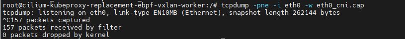
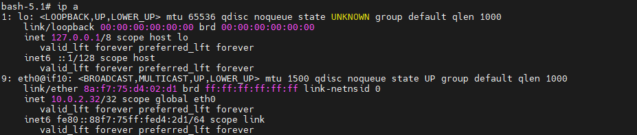

### 一： Cilium  VxLAN 模式下的host routing 方案

相比之前的native routing 组网模式，vxlan模式多了overlay的封装。

 

流量从pod namespace 到宿主机 namespace 的方式 无论backend 怎么换，都是一样的套路。它们所做的优化主要是在root namespace 中针对报文做各种操作


### 二： cilium vxlan 环境搭建

依旧采用kind 搭建集群

```shell
#1-setup-env.sh
#! /bin/bash
date
set -v

# 1.prep nocNI env
cat <<EOF |kind create cluster --name=cilium-kubeproxy-replacement-ebpf-vxlan --image=kindest/node:v1.23.4  --config=-
kind: Cluster
apiVersion: kind.x-k8s.io/v1alpha4
networking:
  disableDefaultCNI: true  #kind 默认使用rancher cni，我们不需要该cni
  kubeProxyMode: "none"  #不使用kube-proxy
  
nodes:
  - role: control-plane
  - role: worker
  - role: worker
 
containerdConfigPatches:
- |-
  [plugins."io.containerd.grpc.v1.cri".registry.mirrors."192.168.186.131:5000"]
    endpoint = ["http://192.168.186.131:5000"]
  
EOF

# 2. remove taints
controller_node=`kubectl get nodes --no-headers -o custom-columns=NAME:.metadata.name |grep control-plane`
kubectl taint nodes $controller_node node-role.kubernetes.io/master:NoSchedule-
kubectl get nodes -owide

# 3.  install cni
helm repo add cilium  https://helm.cilium.io > /dev/null 2>&1
helm repo update > /dev/null  2>&1

#VxLAN Options(--set kubeProxyReplacement=strict  --set bpf.masquerade=true)
helm  install cilium  cilium/cilium --set k8sServiceHost=$controller_node --set k8sServicePort=6443 --version 1.13.0-rc5 --namespace kube-system --set dubug.enabled=true --set dubug.verbose=datapath --set monitorAggregation=none --set ipam.mode=cluster-pool --set cluster.name=cilium-kubeproxy-replacement-ebpf-vxlan --set kubeProxyReplacement=strict  --set bpf.masquerade=true

#4. install necessary tools
for i in $(docker ps -a --format "table {{.Names}}" |grep cilium-kubeproxy-replacement-ebpf-vxlan)
do
                echo $i
                #docker cp ./bridge $i:/opt/cni/bin/
                docker cp /usr/bin/ping $i:/usr/bin/ping
                docker exec -it $i bash -c "sed -i -e  's/jp.archive.ubuntu.com\|archive.ubuntu.com\|security.ubuntu.com/old-releases.ubuntu.com/g' /etc/apt/sources.list"
                docker exec -it $i bash -c "apt-get -y update > /dev/null && apt-get -y install net-tools tcpdump lrzsz > /dev/null 2>&1"
done
```

环境准备就绪 

部署demo

```yaml
#cni-demo.yaml
apiVersion: apps/v1
kind: DaemonSet
metadata:
  name: cilium-with-kubeproxy
  labels:
    app: cilium-with-kubeproxy
spec:
  selector:
    matchLabels:
      app: cilium-with-kubeproxy
  template:
    metadata:
      labels:
        app: cilium-with-kubeproxy
    spec:
      containers:
      - name: cilium-with-kubeproxy
        image: 192.168.186.131:5000/nettool:latest
        securityContext:
          privileged: true
---
apiVersion: v1
kind: Service
metadata:
  name: cilium-with-kubeproxy
spec:
  type: NodePort
  selector: 
    app: cilium-with-kubeproxy
  ports:
  - name: cilium-with-kubeproxy
    port: 8080
    targetPort: 80
    nodePort: 32000
```


### 三： cilium vxlan 方案分析

登录集群节点，查看节点ip 信息

  

1. 找出vxlan 设备  `ip -d link show`  ：只有  cilium_vxlan 网卡是vxlan设备，其余均为veth pair 

   注意: 在cilium中，vxlan设备的设置和其余cni 区别很大

2. vxlan 设备如何 和pod namespace 进行信息交互呢？如何封装数据包呢？

   **由于cilium 大量使用eBPF 这种模式，cilium_vxlan 上面也挂载了tc hook，tc hook 通过eBPF MAP 实现和pod ns 的信息交互**

   

   登录cilium 容器 

    

   本地ip为: 172.18.0.3

   

   使用`cilium bpf tunnel list`

     

   该配置表示: 如果去往10.0.0.0   remoteip 是 172.18.0.4  ||   如果去往10.0.2.0  remoteIP 是 172.18.0.2  || 如果去往10.0.1.0  remoteIP 是 172.18.0.3

3. ping 测抓包

     

   ping测:

   src：` ip：10.0.1.168   宿主机: worker2`

   dst ：` ip: 10.0.2.111  宿主机： worker`  

    

   抓包位置: 源pod 对应的宿主机worker2进行抓包

    

   

   ping 测:

   src： ` ip 10.0.2.32  宿主机: worker`

   dst：`ip：10.0.1.168   宿主机: worker2 `

    

   抓包位置: 源pod 对应的宿主机worker进行抓包

    

   

4.  wireshark 分析数据包

   eth0_cilium_vxlan.cap ：找到8472端口的数据包，然后decode, 选择vxlan，即可得到如下所示：

    

   request和reply 请求数据包的vni：3101

   

   

   eth0_cni.cap：找到8472端口的数据包，然后decode, 选择vxlan，即可得到如下所示：

    

   查看vni： 

    `request 数据包对应的vni： 8287` ||  `reply 数据包对应的vni：3101`   这就是cilium 特殊的地方，request/reply 对应的vni 不一样，在其他的cni中，vni是保持不变的。

   在cilium 视图下，每类pod 都有一个id。可以根据这个id 定制各种控制策略，例如访问权限的控制。

     

   上述 vni 针对的是服务级别的分类，如果需要精确到pod粒度，则可以使用 ` cilium endpoint list`  ,使用endpoint 进行区分

    

   

   回到这个报文:  弄清mac地址的匹配关系

    

   源MAC： `8a:f7:75:d4:02:d1  对应 源pod 中eth0 网卡的mac地址`  

   这和常规cni处理方式不一样，常规的cni会经过路由表 找到对应的vxlan接口，所以源mac一般就是宿主机的vxlan接口的mac地址。

   那么问题来了，cilium是如何将报文报送给vxlan接口的呢？  通过lxc 网卡上 engress hook 调用bpf_redirect_neigh() 跳到cilium_vxlan 网卡上面，所以能保持原始pod所带来的一个MAC地址。

    

   

   目的MAC：`66:71:de:64:ab:cd  对应源pod所在宿主机的 lxcfc188afe3921 网卡,也就是 源pod eth0 的veth pair` 

   ？ 为什么目的MAC 是源pod的vethpair lxc 网卡的mac地址啊？

   (cilium_vxlan 接口没有ip地址，不依赖ip地址去学习下一跳的mac地址，所以只能把原本数据包的mac地址拿过来，和其他cni有差别)

   

    

   

     

### 四： 节点lxc 网卡抓包

跨节点pod 进行ping 测时

src： ` ip 10.0.2.32  宿主机: worker`      ||        dst：`ip：10.0.1.168   宿主机: worker2 `

分别对worker节点的lxc 网卡 和worker2节点的lxc 网卡进行抓包:

 

worker 节点 lxc网卡 只有request 数据包:

 

worker2 节点lxc网卡只有reply 数据包:

 


### 五： cilium  monitor 抓包分析

依旧是跨节点pod 进行ping 测 ： src： ` ip 10.0.2.32  宿主机: worker`      ||        dst：`ip：10.0.1.168   宿主机: worker2 `

登录 worker节点上的cilium agent ：`cilium monitor -vv  > cni_monitor.yaml ` 

 

将pod中文件拷贝出来查看：`kubectl -n kube-system   cp cilium-lxcg8:/home/cilium/cni_monitor.yaml ./cni_monitor.yaml`

 

