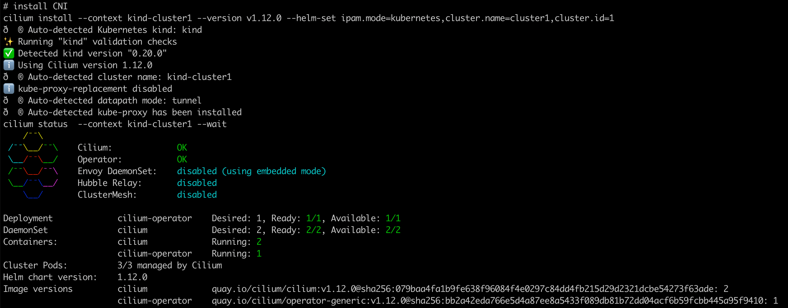

### 一: Cilium ClusterMesh 架构概览


Cilium 控制面基于etcd设计，尽可能保持设计简单

- 每个Kubernetes集群都维护自己的 etcd 集群，其中包含该集群的状态。来自多个集群的状态永远不会在etcd中混淆。
- 每个集群通过一组 etcd proxy 公开自身 etcd。其他集群中运行的 Cilium agent连接到 etcd proxy监听集群资源状态，并将多集群相关资源状态复制到自己的集群中。使用 etcd proxy可确保 etcd watcher的可扩展性。访问受到 TLS 证书的保护。
- 从一个集群到另一个集群的访问始终是只读的。这确保了故障域保持不变，即一个集群中的故障永远不会传播到其他集群。
- 配置通过一个简单的 Kubernetes secrets，其中包含远程 etcd 代理的地址信息以及集群名称和访问 etcd 代理所需的证书。

可参考: https://cilium.io/blog/2019/03/12/clustermesh/

### 二：Cilium ClusterMesh 使用背景

1. **High Availability,和容灾备份**

   Cluster Mesh 增强了服务的高可用性和容错能力。支持Kubernetes集群在多个地域或者可用区的运行。如果资源暂时不可用、一个集群中配置错误或离线升级，它可以将故障转移到其他集群，确保您的服务始终可访问。

   

   

2. **Transparent Service Discovery**

   Cluster Mesh 可自动发现 Kubernetes 集群中的服务。使用标准 Kubernetes service，它会自动将跨集群具有相同名称和命名空间的服务合并为全局服务。这意味着您的应用程序可以发现服务并与服务交互，无论它们驻留在哪个集群中，从而大大简化了跨集群通信。

    


3. **可基于Pod IP 进行路由**

   Cluster Mesh 能够以本机性能处理跨多个 Kubernetes 集群的 Pod IP 路由。通过使用隧道或直接路由，它不需要任何网关或代理。这允许您的 Pod 跨集群无缝通信，从而提高微服务架构的整体效率。

   

   native-routing模式:

   

   隧道封装模式:

    

   

4. **Shared Services Across Clusters. (跨集群共享服务)

   Cluster Mesh 支持在所有集群之间共享服务，例如秘密管理、日志记录、监控或 DNS。这可以减少运营开销、简化管理并保持租户集群之间的隔离。

   


5. **Uniform Network Policy Enforcement**

   集群网格将 Cilium 的第 3-7 层网络策略实施扩展到网格中的所有集群。它标准化了网络策略的应用，确保整个 Kubernetes 部署采用一致的安全方法，无论涉及多少集群。

    

---

### 三: Cilium ClusterMesh 环境搭建

1. 搭建集群环境,集群版本为1.23，cilium 版本是1.12

   `1-setup-cilium-clustermesh1.sh`

   记的提前在环境里安装cilium 客户端工具，clustermesh 模式因为设计证书的继承，使用cilium install 安装的方式比helm install 要方便

   cilium 客户端工具: https://github.com/cilium/cilium-cli/releases/tag/v0.15.0

   ```shell
   #!/bin/bash
   set -v
   # exec &>./cluster1-install-log-rec.txt
   date
   # create a cluster with the local registry enabled in containerd
   cat <<EOF | kind create cluster --name=cluster1 --image=kindest/node:v1.23.4 --config=-
   kind: Cluster
   apiVersion: kind.x-k8s.io/v1alpha4
   networking:
           disableDefaultCNI: true
           podSubnet: "10.10.0.0/16"
           serviceSubnet: "10.11.0.0/16"
   
   nodes:
           - role: control-plane
           - role: worker
   EOF
   
   # prep the environment
   controller_node=$(kubectl get nodes --no-headers  -o custom-columns=NAME:.metadata.name| grep control-plane)
   kubectl taint nodes $controller_node node-role.kubernetes.io/master:NoSchedule-
   kubectl get nodes -owide
   kubectl get pods -owide -A
   
   # install CNI
   cilium install --context kind-cluster1 --version v1.12.0 --helm-set ipam.mode=kubernetes,cluster.name=cluster1,cluster.id=1
   cilium status  --context kind-cluster1 --wait
   ```

   cluster1 安装完成: 默认是vxlan模式

    

   

   `2-setup-cilium-clustermesh2.sh`安装cluster2:

   `--inherit-ca kind-cluster1` 关键配置，继承cluster1的ca证书

   ```shell
   #!/bin/bash
   set -v
   # exec &>./cluster2-install-log-rec.txt
   date
   
   # create a cluster with the local registry enabled in containerd
   cat <<EOF | kind create cluster --name=cluster2 --image=kindest/node:v1.23.4 --config=-
   kind: Cluster
   apiVersion: kind.x-k8s.io/v1alpha4
   networking:
           disableDefaultCNI: true
           podSubnet: "10.20.0.0/16"
           serviceSubnet: "10.21.0.0/16"
   
   nodes:
           - role: control-plane
           - role: worker
   
   EOF
   
   # prep the environment
   controller_node=$(kubectl get nodes --no-headers  -o custom-columns=NAME:.metadata.name| grep control-plane)
   kubectl taint nodes $controller_node node-role.kubernetes.io/master:NoSchedule-
   kubectl get nodes -owide -A
   
   # install CNI
   cilium install --context kind-cluster2 --version v1.12.0 --helm-set ipam.mode=kubernetes,cluster.name=cluster2,cluster.id=2 --inherit-ca kind-cluster1
   cilium status  --context kind-cluster2 --wait
   ```

   

   