### 一: Cilium ClusterMesh 架构概览

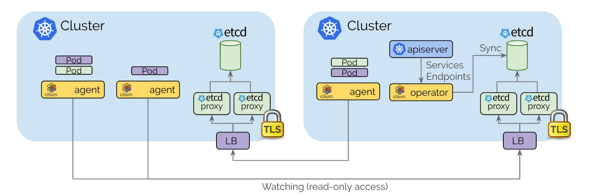

Cilium 控制面基于etcd设计，尽可能保持设计简单

- 每个Kubernetes集群都维护自己的 etcd 集群，其中包含该集群的状态。来自多个集群的状态永远不会在etcd中混淆。
- 每个集群通过一组 etcd proxy 公开自身 etcd。其他集群中运行的 Cilium agent连接到 etcd proxy监听集群资源状态，并将多集群相关资源状态复制到自己的集群中。使用 etcd proxy可确保 etcd watcher的可扩展性。访问受到 TLS 证书的保护。
- 从一个集群到另一个集群的访问始终是只读的。这确保了故障域保持不变，即一个集群中的故障永远不会传播到其他集群。
- 配置通过一个简单的 Kubernetes secrets，其中包含远程 etcd 代理的地址信息以及集群名称和访问 etcd 代理所需的证书。

可参考: https://cilium.io/blog/2019/03/12/clustermesh/

### 二：Cilium ClusterMesh 使用背景

1. **High Availability,和容灾备份**

   Cluster Mesh 增强了服务的高可用性和容错能力。支持Kubernetes集群在多个地域或者可用区的运行。如果资源暂时不可用、一个集群中配置错误或离线升级，它可以将故障转移到其他集群，确保您的服务始终可访问。

   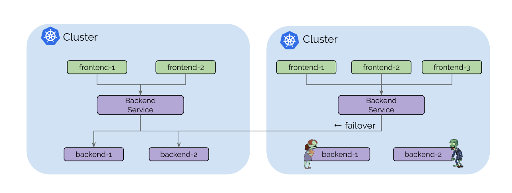

   

2. **Transparent Service Discovery**

   Cluster Mesh 可自动发现 Kubernetes 集群中的服务。使用标准 Kubernetes service，它会自动将跨集群具有相同名称和命名空间的服务合并为全局服务。这意味着您的应用程序可以发现服务并与服务交互，无论它们驻留在哪个集群中，从而大大简化了跨集群通信。

   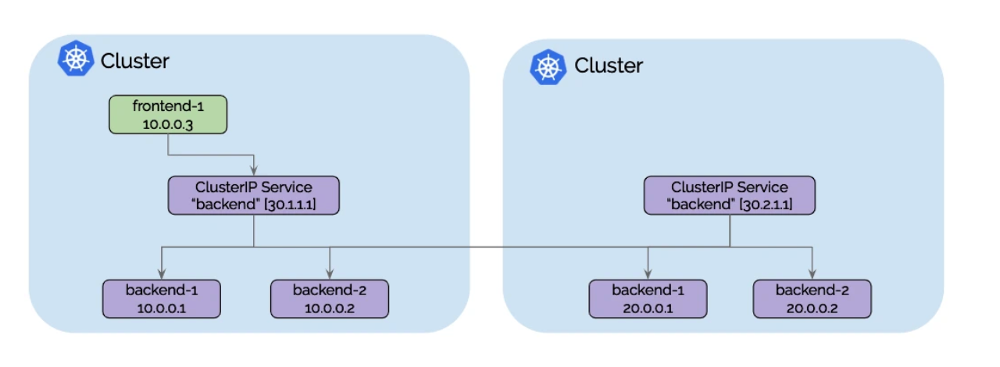 


3. **可基于Pod IP 进行路由**

   Cluster Mesh 能够以本机性能处理跨多个 Kubernetes 集群的 Pod IP 路由。通过使用隧道或直接路由，它不需要任何网关或代理。这允许您的 Pod 跨集群无缝通信，从而提高微服务架构的整体效率。

   

   native-routing模式:

   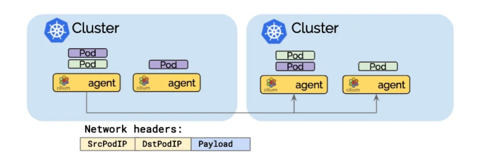

   隧道封装模式:

   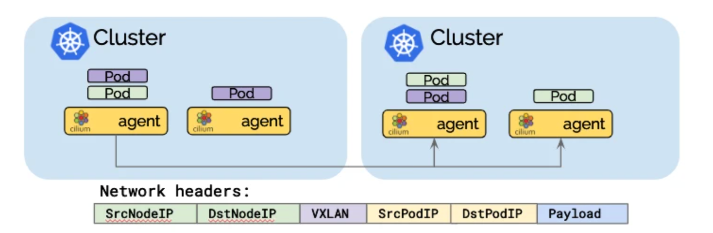 

   

4. **Shared Services Across Clusters. (跨集群共享服务)

   Cluster Mesh 支持在所有集群之间共享服务，例如秘密管理、日志记录、监控或 DNS。这可以减少运营开销、简化管理并保持租户集群之间的隔离。

   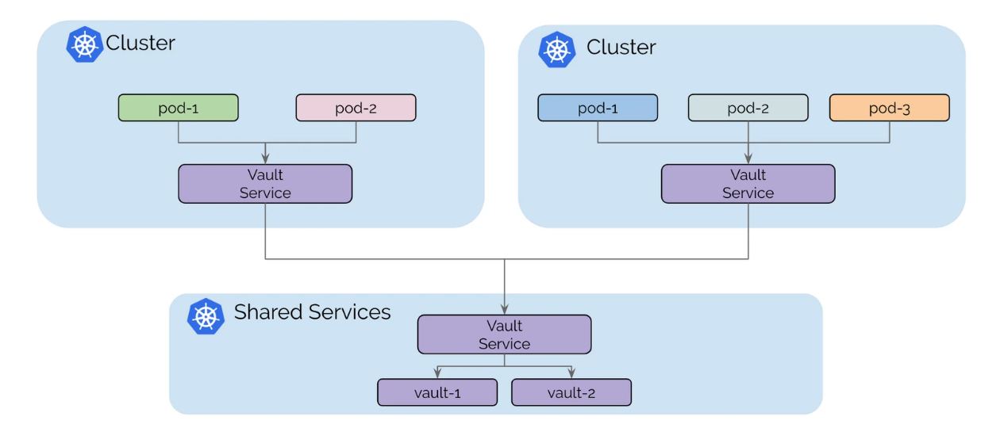


5. **Uniform Network Policy Enforcement**

   集群网格将 Cilium 的第 3-7 层网络策略实施扩展到网格中的所有集群。它标准化了网络策略的应用，确保整个 Kubernetes 部署采用一致的安全方法，无论涉及多少集群。

   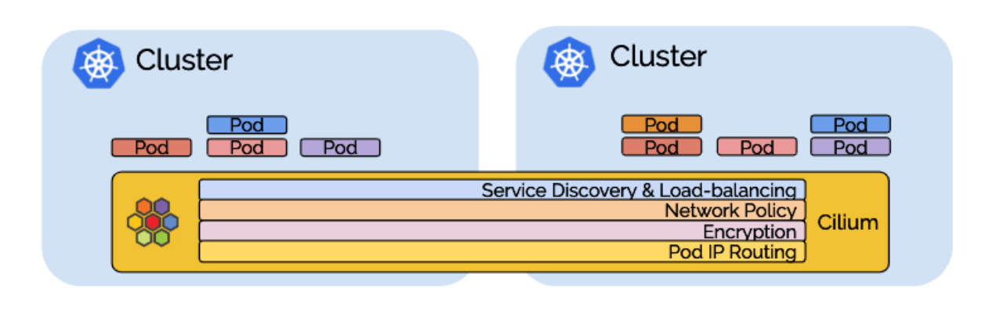 

---

### 三: Cilium ClusterMesh 环境搭建

1. 搭建集群环境,集群版本为1.27，cilium 版本是1.14

   `1-setup-cilium-clustermesh1.sh`

   记的提前在环境里安装cilium 客户端工具，clustermesh 模式因为设计证书的继承，使用cilium install 安装的方式比helm install 要方便

   cilium 客户端工具: https://github.com/cilium/cilium-cli/releases/tag/v0.15.0

   ```shell
   #!/bin/bash
   set -v
   date
   
   # 1. prep noCNI env
   cat <<EOF | kind create cluster --name=cluster1 --image=kindest/node:v1.27.3 --config=-
   kind: Cluster
   apiVersion: kind.x-k8s.io/v1alpha4
   networking:
     disableDefaultCNI: true
     podSubnet: "10.10.0.0/16"
     serviceSubnet: "10.11.0.0/16"
   
   nodes:
     - role: control-plane
     - role: worker
     - role: worker
   
   EOF
   
   # 2. remove taints
   controller_node_ip=`kubectl get node -o wide --no-headers | grep -E "control-plane" | awk -F " " '{print $6}'`
   kubectl taint nodes $(kubectl get nodes -o name | grep control-plane) node-role.kubernetes.io/control-plane:NoSchedule-
   kubectl get nodes -o wide
   
   # 3. install CNI
   cilium install --context kind-cluster1 --version 1.14.0-rc.0  \
   --helm-set ipam.mode=kubernetes,cluster.name=cluster1,cluster.id=1
   cilium status  --context kind-cluster1 --wait
   ```

   cluster1 安装完成: 默认是vxlan模式

   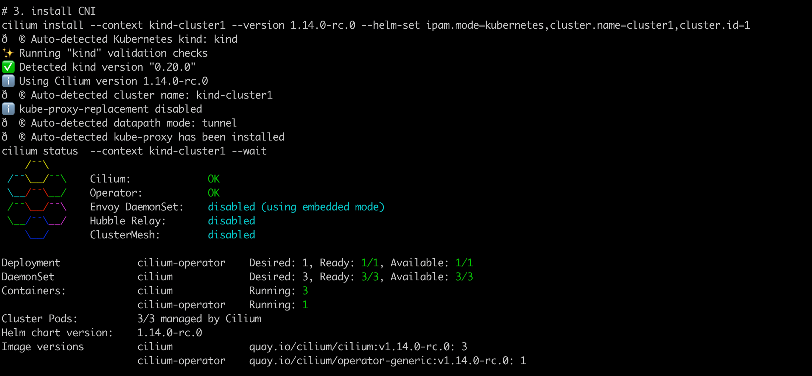  

   

   `2-setup-cilium-clustermesh2.sh`安装cluster2: 关键配置，第三步继承cluster1的cilium-ca证书

   ```shell
   #!/bin/bash
   set -v
   date
   
   # 1. prep noCNI env
   cat <<EOF | kind create cluster --name=cluster2 --image=kindest/node:v1.27.3 --config=-
   kind: Cluster
   apiVersion: kind.x-k8s.io/v1alpha4
   networking:
     disableDefaultCNI: true
     podSubnet: "10.20.0.0/16"
     serviceSubnet: "10.21.0.0/16"
   
   nodes:
     - role: control-plane
     - role: worker
     - role: worker
   EOF
   
   # 2. remove taints
   controller_node_ip=`kubectl get node -o wide --no-headers | grep -E "control-plane" | awk -F " " '{print $6}'`
   kubectl taint nodes $(kubectl get nodes -o name | grep control-plane) node-role.kubernetes.io/control-plane:NoSchedule-
   kubectl get nodes -o wide
   
   # 3. Shared Certificate Authority
   kubectl --context=kind-cluster1 get secret -n kube-system cilium-ca -o yaml | kubectl --context kind-cluster2 create -f -
   
   # 4. install CNI
   cilium install --context kind-cluster2 --version 1.14.0-rc.0  \
   --helm-set ipam.mode=kubernetes,cluster.name=cluster2,cluster.id=2
   cilium status  --context kind-cluster2 --wait
   ```
   
   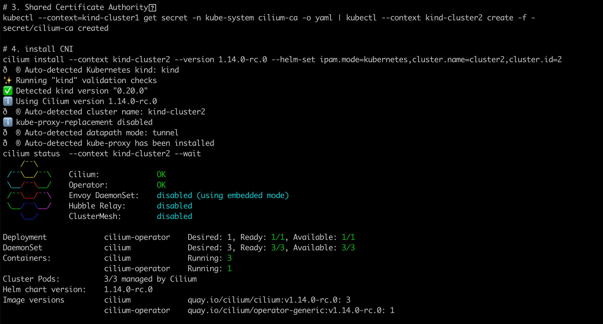 
   
   **⚠️：如果在安装第二个集群出现报错:**
   
   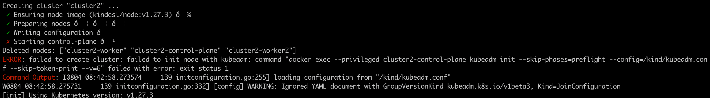 
   
   查看安装集群失败日志，kubelet的日志发现: `too many open files`
   
   如何查看kubelet日志,在安装命令中配置
   
   `kind create cluster --name cl1 --config multi.yaml --retain
   kind export logs --name cl1`
   
   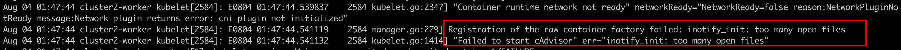 
   
   解决方式: 在当前主机上执行如下命令:
   
   临时方式(重启失效)：
   
   `sudo sysctl fs.inotify.max_user_watches=524288  `
   
   `sudo sysctl fs.inotify.max_user_instances=512`
   
   永久方式: `/etc/sysctl.conf`
   
   `fs.inotify.max_user_watches = 524288`
   
   `fs.inotify.max_user_instances = 512`
   
   原因: 这可能是由于 inotify 资源耗尽造成的。资源限制由 fs.inotify.max_user_watches 和 fs.inotify.max_user_instances 系统变量定义。例如，在 Ubuntu 中，这些默认值分别为 8192 和 128，这不足以创建具有多个节点的集群。
   
   
   
   如下图所示: 两个集群均已就绪
   
   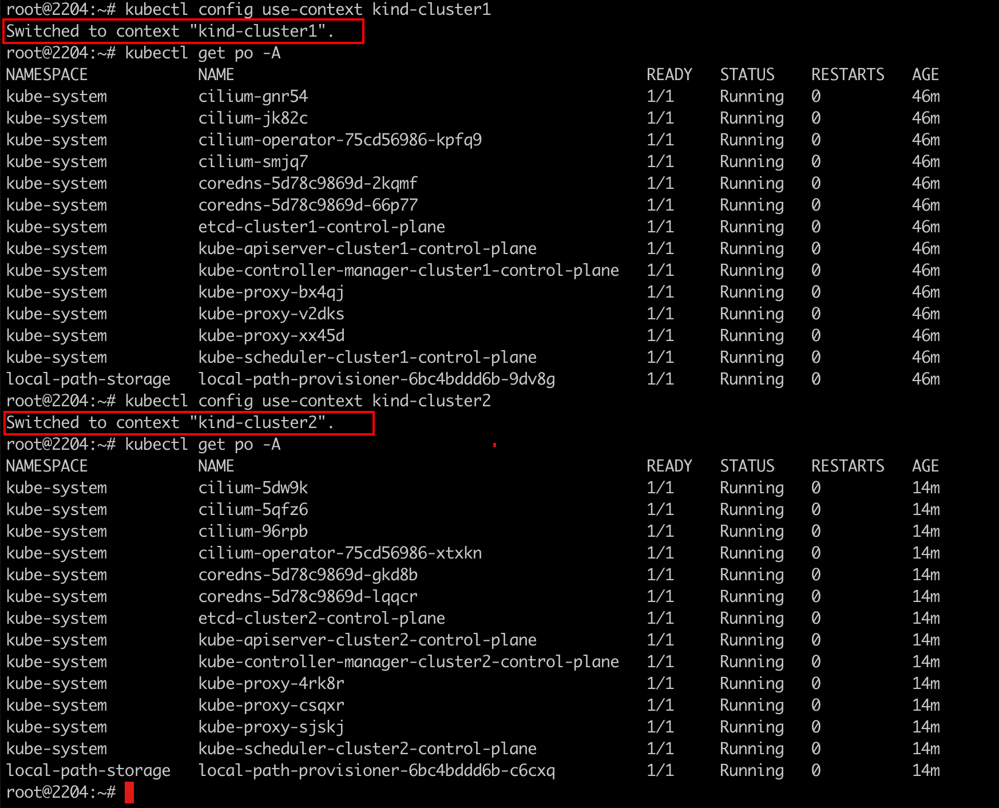


2. 集群互联成网格 `3-enable-cilium-servicemesh.sh`

   ```shell
   #!/bin/bash
   set -v
   #exec &> ./clustermesh-connect-log-rec.log
   date
   
   cilium clustermesh enable --context kind-cluster1 --service-type NodePort
   cilium clustermesh enable --context kind-cluster2 --service-type NodePort
   
   cilium clustermesh connect --context kind-cluster1 --destination-context kind-cluster2
   
   cilium clustermesh status  --context kind-cluster1 --wait
   ```

   执行脚本，集群互联成功

   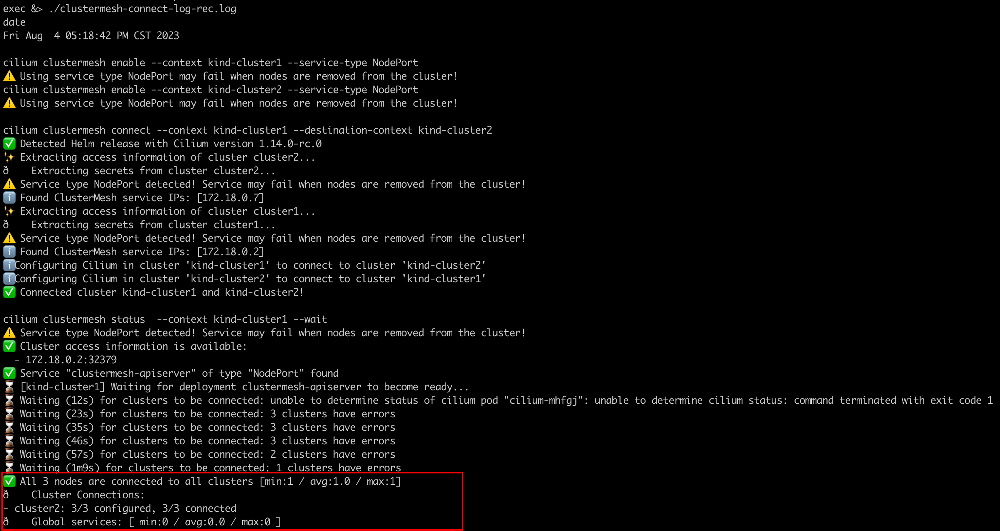

   clustermesh 互联是通过nodeport svc实现的，（更好的方式可以采用LoadBalencer）

   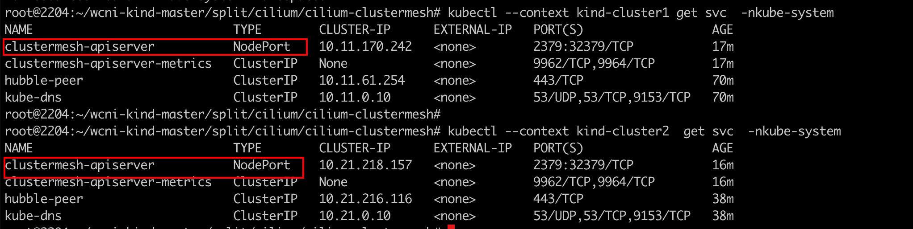

   

   ⚠️如果节点重启过，集群互联状态可能会失效，需要重新执行该脚本。(本人kind节点关机休眠后，第二天测试global svc的时候，发现无法跨集群访问，执行该脚本恢复)


---

### 四: Load-balancing with Global Services

通过在每个集群中定义具有相同name和namespace的 Kubernetes service并添加注解` service.cilium.io/global: "true" `将其声明为全局来实现集群之间建立负载均衡。 Cilium 将自动对两个集群中的 pod 执行负载均衡。

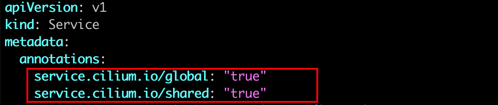 

1. 创建业务进行测试`4-clustermesh-verify.sh `

   ```shell
   #/bin/bash
   set -v
   
   wget https://raw.githubusercontent.com/cilium/cilium/1.14.0/examples/kubernetes/clustermesh/global-service-example/cluster1.yaml
   
   wget https://raw.githubusercontent.com/cilium/cilium/1.14.0/examples/kubernetes/clustermesh/global-service-example/cluster2.yaml
   
   kubectl apply -f ./cluster1.yaml --context kind-cluster1
   kubectl apply -f ./cluster2.yaml --context kind-cluster2
   
   kubectl wait --for=condition=Ready=true pods --all --context kind-cluster1
   kubectl wait --for=condition=Ready=true pods --all --context kind-cluster2
   ```

   

2. 访问测试

   `for i in $(seq 1 10);do kubectl --context kind-cluster1 exec -ti deployment/x-wing -- curl rebel-base;done`

   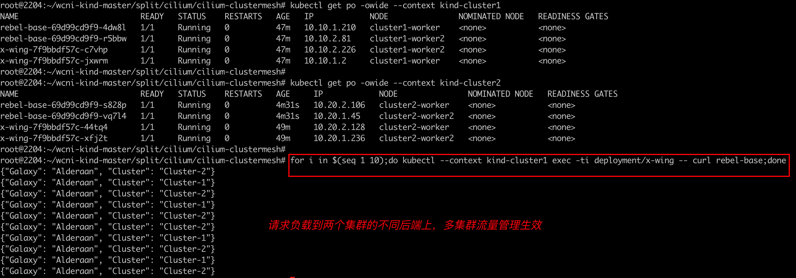

   将集群2中对应服务的后端缩容成0:

   `kubectl --context kind-cluster2 scale deployment rebel-base --replicas=0 `

   再次访问:

    `for i in $(seq 1 10);do kubectl --context kind-cluster1 exec -ti deployment/x-wing -- curl rebel-base;done `

   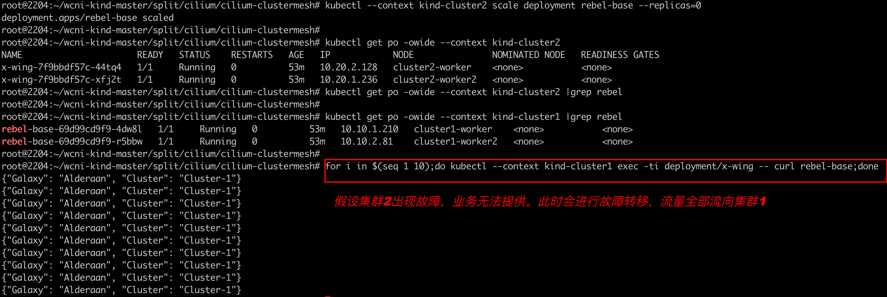 

3. 如果需要取消全局负载均衡，可通过`service.cilium.io/shared="false"` 注解实现,该注解模式是true

   修改cluster1中的svc，`kubectl --context kind-cluster1 annotate service rebel-base service.cilium.io/shared="false" --overwrite`

   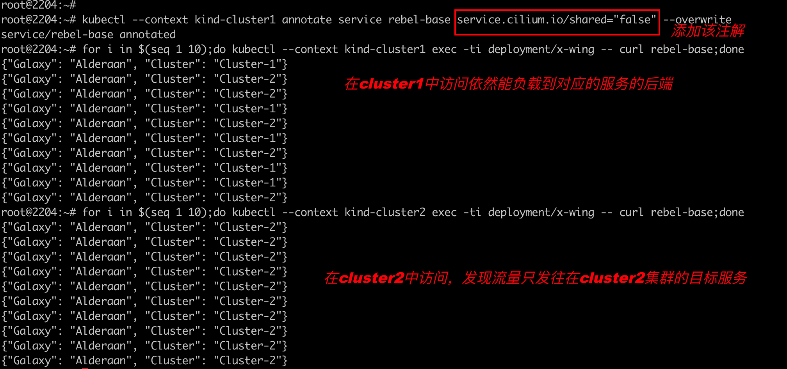 

4.  移除该注解`kubectl annotate service rebel-base service.cilium.io/shared-`,方便后续特性测试

---

### 五: Service Affinity 服务亲和

在某些情况下，跨多个集群的负载均衡可能并不理想。 通过注解 `service.cilium.io/affinity: "local|remote|none" `可用于指定负载示例的目的地。

例如，如果注释 `service.cilium.io/affinity: local `，则将在健康的本地集群内后端实例之间进行负载平衡，并且当且仅当所有本地后端实例都不可用或不健康时，才会负载到远程实例。


1. 给cluster1 中的svc 添加`service.cilium.io/affinity: local`

   `kubectl annotate service rebel-base service.cilium.io/affinity=local --overwrite `

   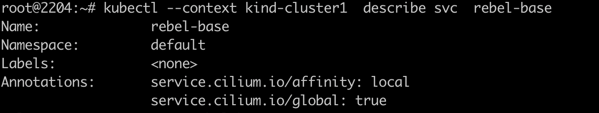

   在cluser1中访问该服务

   `for i in $(seq 1 10);do kubectl --context kind-cluster1 exec -ti deployment/x-wing -- curl rebel-base;done`

   可以发现,流量仅会发往cluster1的后端实例

   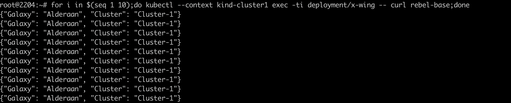

   在cluster2中访问服务

   `for i in $(seq 1 10);do kubectl --context kind-cluster2 exec -ti deployment/x-wing -- curl rebel-base;done `

   可以发现，流量会负载均衡到cluster1和cluster2的后端实例上

   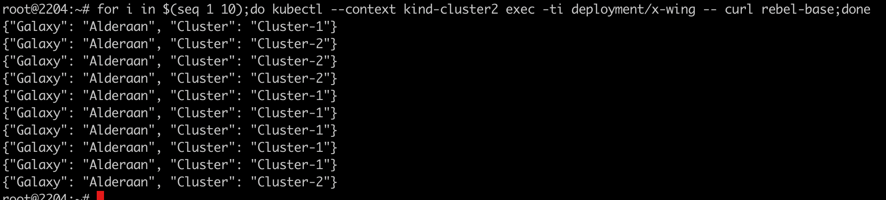

   查看cluster1中的配置

   `kubectl --context kind-cluster1 exec -n kube-system -ti ds/cilium -- cilium service list --clustermesh-affinity`

   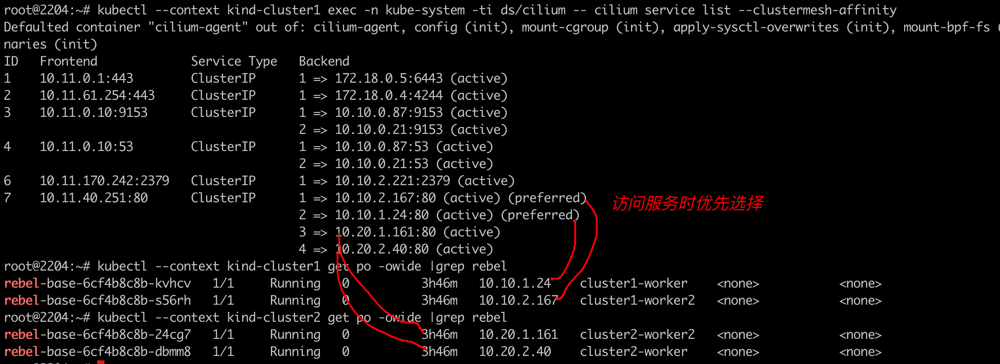


2. 将cluster1的目标服务svc注解从local设为remote

   `kubectl --context kind-cluster1 annotate service rebel-base service.cilium.io/affinity=remote --overwrite`	

   

   在cluster1中进行访问测试:

   `for i in $(seq 1 10);do kubectl --context kind-cluster1 exec -ti deployment/x-wing -- curl rebel-base;done`

   可以发现，响应全都来自 cluster2的后端实例

   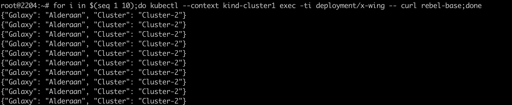 

   查看cilium agent配置发现，访问策略已经是远端实例优先了

   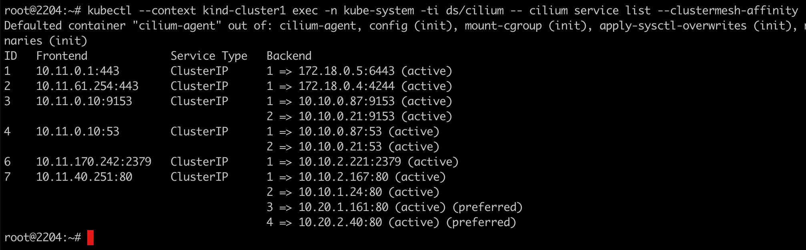 

 


