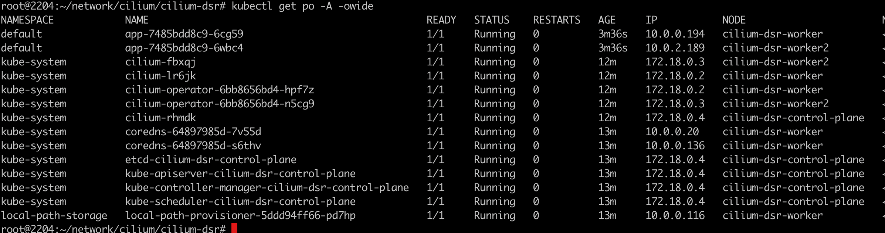
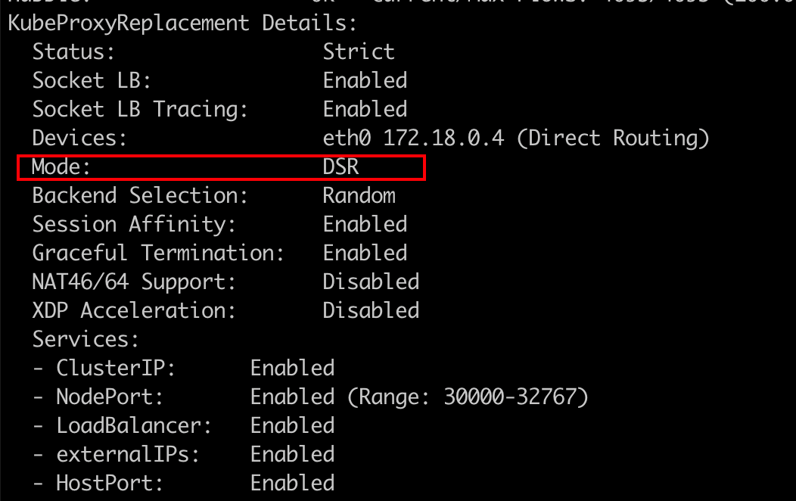
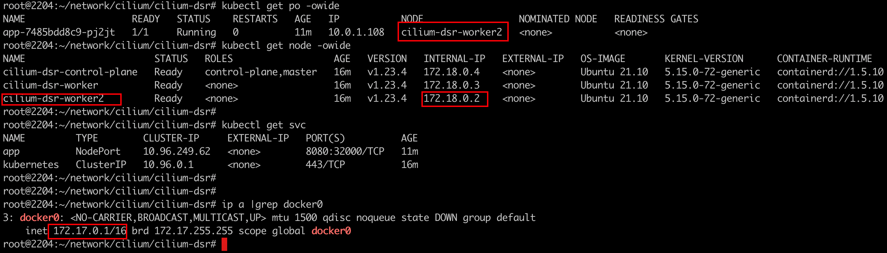
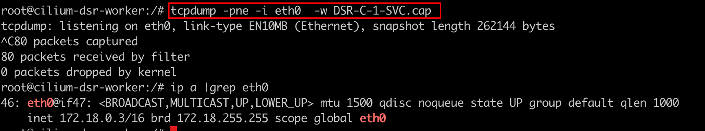
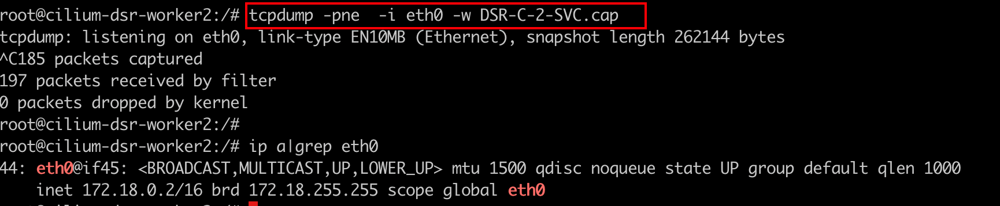
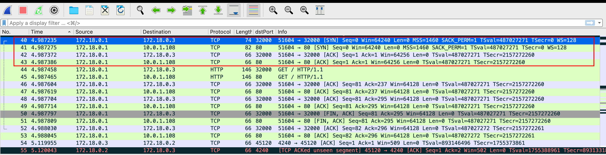
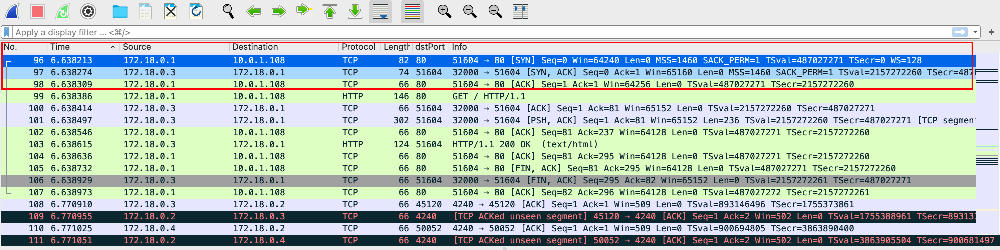
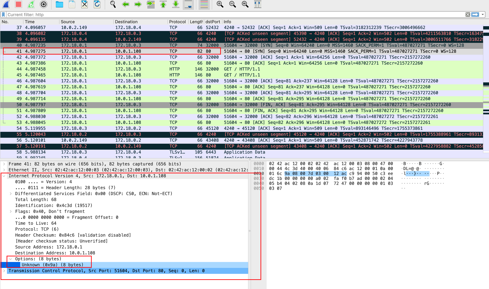
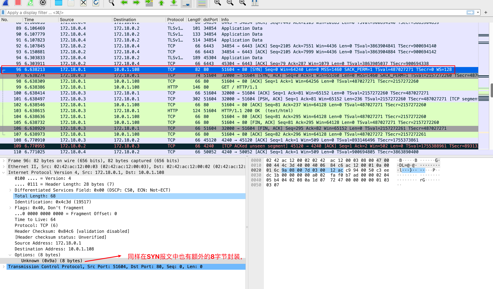

### 一：Cilium DSR模式架构对比分析

传统模式下：


外部流量通过 NodePort、ExternalIPs 或 LoadBalancer 访问 Kubernetes 服务，当backend pod运行在与请求发送到的节点不同的节点上时，Kubernetes 工作节点可能会将请求重定向到远程节点。

请求将经过 SNAT处理，这也会导致后端不会看到客户端的源 IP 地址。此外，后端的回程报文将通过初始节点（在该节点执行反向 SNAT 转换）再发送回客户端，这会引入额外的网络开销和延迟。

---

Cilium Direct server return(DSR)模式：


虽然Kubernetes 提供了 externalTrafficPolicy=Local，如果接收请求的节点不运行任何后端pod，它会通过删除对服务的请求来保留客户端源 IP 地址（访问失败）。然而，这也会使负载均衡的实现变得更加复杂，并可能导致负载均衡失效。

为了解决上述问题从cilium 1.7开始，借助ebpf实现了direct server return，从而加速了南北向流量的通信效率（在向客户端回包时避免额外的一跳），同时也增加了保持客户端源IP特性。


### 二：Cilium DSR模式环境搭建

依旧采用kind快速搭建k8s环境

```shell
#1-setup-env.sh
#! /bin/bash
date
set -v

# 1.prep nocNI env
cat <<EOF |kind create cluster --name=cilium-dsr --image=kindest/node:v1.23.4  --config=-
kind: Cluster
apiVersion: kind.x-k8s.io/v1alpha4
networking:
  disableDefaultCNI: true  #kind 默认使用rancher cni，我们不需要该cni
  kubeProxyMode: "none" #Enable the kubeProxy
  
nodes:
  - role: control-plane
  - role: worker
  - role: worker
  
EOF

# 2. remove taints
controller_node=`kubectl get nodes --no-headers -o custom-columns=NAME:.metadata.name |grep control-plane`
kubectl taint nodes $controller_node node-role.kubernetes.io/master:NoSchedule-
kubectl get nodes -owide

# 3.  install cni
helm repo add cilium  https://helm.cilium.io > /dev/null 2>&1
helm repo update > /dev/null  2>&1


helm  install cilium  cilium/cilium --set k8sServiceHost=$controller_node --set k8sServicePort=6443 --version 1.13.0-rc5 --namespace kube-system --set debug.enabled=true --set debug.verbose=datapath --set monitorAggregation=none --set ipam.mode=cluster-pool --set cluster.name=cilium-dsr  --set kubeProxyReplacement=strict  --set autoDirectNodeRoutes=true --set ipv4NativeRoutingCIDR="10.0.0.0/8" --set tunnel=disabled --set bpf.masquerade=true --set installNoConntrackIptablesRules=true  --set loadBalancer.mode=dsr

#4. install necessary tools
for i in $(docker ps -a --format "table {{.Names}}" |grep cilium-dsr)
do
                echo $i
                #docker cp ./bridge $i:/opt/cni/bin/
                docker cp /usr/bin/ping $i:/usr/bin/ping
                docker exec -it $i bash -c "sed -i -e  's/jp.archive.ubuntu.com\|archive.ubuntu.com\|security.ubuntu.com/old-releases.ubuntu.com/g' /etc/apt/sources.list"
                docker exec -it $i bash -c "apt-get -y update > /dev/null && apt-get -y install net-tools tcpdump lrzsz > /dev/null 2>&1"
done
```

其中cilium dsr在安装时关键配置项:

`set tunnel=disabled  不能使用vxlan这种overlay的网络模式，必须以native routing模式运行`

`loadBalancer.mode=dsr 开启dsr模式`


部署状态：

 

确认开启dsr模式：默认模式是SNAT

`cilium status --verbose`

 


### 三：抓包分析Cilium DSR模式下的datapath

1. 构造南北向流量，dsr解决的是传统模式下南北向流量的痛点

   可以通过当前节点（172.17.0.1） 访问集群节点（172.18.0.3)加nodeport端口32000然后负载均衡到后端服务上

   

2. 抓包位置考虑

   手动curl

    

   在集群节点(172.18.0.3)上抓第一个包，他会收到tcp协议三次握手的syn和ack数据包

    

   在集群节点(172.18.0.2)上抓第二个包，backend pod 运行在这个节点上，它也会收到tcp协议三次握手的syn包和syn+ack数据包

   

3. 分析第一个数据包（节点ip：172.18.0.3）

   `DSR-C-1-SVC.cap` 即客户端直接访问的节点上的数据包信息：

   

   可以看到第一个SYN 信息:`172.18.0.1 ==> 172.18.0.3`  即客户端和访问节点之间的第一跳，符合正常逻辑

   第二个SYN信息: `172.18.0.1 ==> 10.0.1.108`  10.0.1.108是目标pod。SYN需要继续转，终止到目标第地址上

   第一个ACK信息: `172.18.0.1 ==> 172.18.0.3`  同SYN

   第二个ACK信息: `172.18.0.1 ==> 10.0.1.108`  同SYN

   我们知道TCP 三次握手🤝，流程是: 

   SYN（我叫张三；一次证明自己） ==> SYN+ACK (张三，我叫李四；一次证明对方) ==> ACK (好的，李四；证明彼此)

   但是在该节点上抓包并没有发现完整的TCP三次握手信息。

   网络的本质应该是从哪去，从哪回来。但是cilium通过一些特殊的方式进行了SYN+ACK的回程包，并达到了客户端源IP保持和更高的网络通信效率。

   

4. 分析第二个数据包，于172.18.0.2上抓的包

   `DSR-C-2-SVC.cap` 即目标pod所在节点上的数据包信息：

   

   可以看到有一个SYN 信息: `172.18.0.1 ==> 10.0.1.108`  这是因为第一跳节点上没有目标服务，SYN需要终止在目标服务上

   SYN+ACK信息: `172.18.0.3 ==> 172.18.0.1` 很关键的一条信息，172.18.0.3 作为源ip是第一跳经过的节点ip地址，并非是第二跳经过的节点ip地址。虽然客户端收到的数据包是从该节点(172.18.0.2)响应的，但是实际上封包的时候并不会以源ip 172.18.0.2进行封装的。

   对于客户端来说，如果收到的ip信息不是自己发出去的数据包中的ip，该数据包就会被丢掉。所以cilium是怎么处理 当前节点以其他节点ip信息作为源地址进行数据包的封装的？

   最后还有一条ACK信息: ACK 会经过第一跳，直到终止到目标服务上。

   

5. 分析第一跳中 `172.18.0.3`ip地址是如何传递下去的

   查看第一个抓包文件，找到第二条SYN消息

   

   在这个包的IP头里面有个Option字段，这个报文中有额外封装的8字节，这是cilium 对SYN 报文进行额外封装的一部分，借此达到DSR，直接返回源地址的效果。

   ac   12  00  03  7d00 

   ||   ||  ||  ||   ||

   172  18   0  3   32000

   可以看到服务端进行回包的源ip和源端口就藏在这个封装的包里

   

   查看第二个抓包文件：

   

   

### 四：Cilium DSR模式的约束

1. cilium DSR 不支持在VXLAN模式下运行，只能在native routing模式下运行。UDP报文没有SYN包。对于 TCP 服务，Cilium 仅对 SYN 数据包的服务 IP/端口进行编码

2. 由于underlay 网路结构可能会删除 cilium特定的ip包的扩展头信息，因此在某些公共云提供商环境中使用 DSR 模式可能不起作用。

3. 在某些实施源/目标 IP 地址检查（例如 AWS）的公共云提供商环境中，必须禁用该检查才能使 DSR 模式正常工作

   

### 五： Cilium DSR 模式扩展

Cilium还支持混合DSR和SNAT模式（Hybrid DSR and SNAT Mode），即对TCP连接执行DSR，对UDP连接执行SNAT。这消除了在网络中更改 MTU 的需要，同时仍然受益于通过删除额外的回复跃点来改善延迟，特别是当 TCP 是工作负载的主要传输时。
