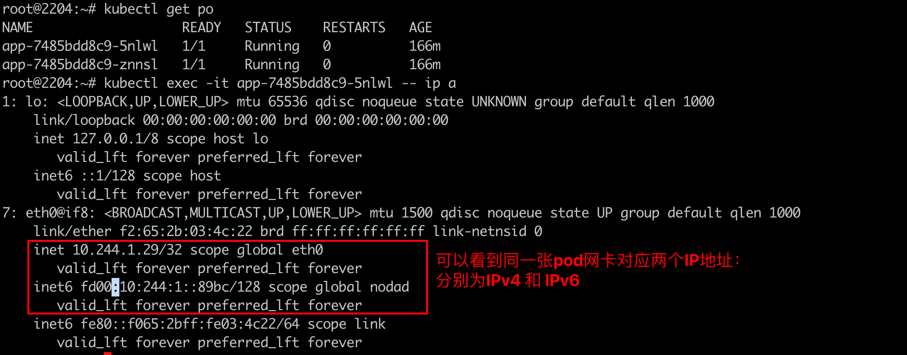

### 一 : 关于IPV6/IPV4 双栈

目前很多公司开始将自己的业务由ipv4切换成ipv6，或者ipv4,ipv6共存。

ipv4 ipv6共存（DualStack）有两种方式: 

- 一个网卡上有两个IP地址，一个是ipv4，一个是ipv6。标准实现方式。

- 两个同样功能的网卡接口，一个提供ipv4，一个提供ipv6。通过负载均衡机制，将对应地址的请求发送到对应的网卡。

  

目前k8s集群已经支持ipv4/ipv6双栈，从1.21的alpha版本到如今1.23的stable版本。

同样cilium cni也对双栈技术做了实现，是一个inCluster层面的实现，如果数据流量要进出集群，就需要平台级的实现。


### 二：Cilium DualStack 双栈环境搭建

依旧是kind快速搭建k8s集群

```shell
#1-setup-env.sh
#! /bin/bash
date
set -v

# 1.prep nocNI env
cat <<EOF |kind create cluster --name=cilium-dual-stack --image=kindest/node:v1.23.4  --config=-
kind: Cluster
apiVersion: kind.x-k8s.io/v1alpha4
networking:
  disableDefaultCNI: true  #kind 默认使用rancher cni，我们不需要该cni
  ipFamily: dual

  
nodes:
  - role: control-plane
  - role: worker
  - role: worker
  
EOF

# 2. remove taints
controller_node=`kubectl get nodes --no-headers -o custom-columns=NAME:.metadata.name |grep control-plane`
kubectl taint nodes $controller_node node-role.kubernetes.io/master:NoSchedule-
kubectl get nodes -owide

# 3.  install cni
helm repo add cilium  https://helm.cilium.io > /dev/null 2>&1
helm repo update > /dev/null  2>&1


helm  install cilium  cilium/cilium --set k8sServiceHost=$controller_node --set k8sServicePort=6443 --version 1.13.0-rc5 --namespace kube-system --set debug.enabled=true --set debug.verbose=datapath --set monitorAggregation=none --set ipam.mode=kubernetes --set cluster.name=cilium-dual-stack --set tunnel=vxlan  --set kubeProxyReplacement=disabled  --set ipv6.enabled=true

#4. install necessary tools
for i in $(docker ps -a --format "table {{.Names}}" |grep cilium-dual-stack)
do
                echo $i
                #docker cp ./bridge $i:/opt/cni/bin/
                docker cp /usr/bin/ping $i:/usr/bin/ping
                docker exec -it $i bash -c "sed -i -e  's/jp.archive.ubuntu.com\|archive.ubuntu.com\|security.ubuntu.com/old-releases.ubuntu.com/g' /etc/apt/sources.list"
                docker exec -it $i bash -c "apt-get -y update > /dev/null && apt-get -y install net-tools tcpdump lrzsz > /dev/null 2>&1"
done
```

 其中关键配置有:

- `ipFamily: dual` 创建集群需要为集群开启双栈配置
- `set kubeProxyReplacement=disabled ` 双栈依赖kube-proxy
- `set ipv6.enabled=true` ipv4是默认开启的，ipv6需要手动开启
- `set tunnel=vxlan` vxlan模式下，安装更简单


部署一个demo应用

```yaml
apiVersion: apps/v1
kind: Deployment
metadata:
  name: app
  labels:
    app: app
spec:
  replicas: 2
  selector:
    matchLabels:
      app: app
  template:
    metadata:
      labels:
        app: app
    spec:
      containers:
      - name: nettool
        image: burlyluo/nettool
        securityContext:
          privileged: true

---
apiVersion: v1
kind: Service
metadata:
  name: app
spec:
  ipFamilyPolicy: PreferDualStack
  ipFamilies:
  - IPv6
  - IPv4
  type: ClusterIP
  selector:
    app: app
  ports:
  - name: app
    port: 8080
    targetPort: 80
```

集群搭建成功：


IPv4 IPv6 双栈启用成功

Pod:





service:


### 三：Cilium DualStack 模式分析

1. IPv4 模式下分析pod内的路由规则

   

   pod出网需要经过eth0网卡，下一跳地址是`10.244.1.3`,下一跳是宿主机上的cilium_host网卡

   

   

2. IPv6 模式下pod内的路由规则

   `ip -6 route show`

   

   它的下一跳所在的地址`fd00:10:244:1::20f3` 不一定在宿主机的命名空间里面，所在在主机上找不到对应的网卡接口

   

3. IPv6模式下的ping测

   pod-a IPv6 地址: `fd00:10:244:1::89bc `;  pod-b IPv6 地址: `fd00:10:244:2::3573`

    

   

4. pod内eth0网卡抓包分析数据包

   

   源Mac: `f2:65:2b:03:4c:22`  为源pod的eth0网卡的mac地址;  源IPv6: `fd00:10:244:1::89bc` 为源pod的IPv6地址

   目标IPv6: `fd00:10:244:2::3573` 为目标pod的IPv6地址

   目标Mac: `8a:be:1f:9b:eb:9d`  为源pod所在宿主机上的lxc网卡

   

   所以即使在pod内查看IPv6的路由规则，找不到对应的下一跳位置，也不影响数据报文的封装。类似于calico的169.254.1.1，这个地址不一定要有，但是数据包往上面发的时候，只要有一个hook能劫持，并且让其他网卡回复对应的mac地址就行了。这样在封装报文的时候，srcMac srcIP，dstMac，dstIP 都具备了，这样一个数据包才能完整的发送出去。

   整个流程差不多就是 根据容器内IPv6的下一跳 抓包找到对应的mac地址，然后根据mac地址的来源做一个推理。

   

5. IPv6 的优点

   一个数据包如果到达IP层才能感知可以丢包，但是IPv6 在二层就能感知到，不是自己的包就可以丢掉。

   提供了更多的IP地址，但是复杂性也增加了。

   

   

6. service的双栈

   

   `fd00:10:96::94f8 ` 为IPv6的clusterIP; `10.96.247.62` 为IPv4的clusterIP

   

   可以进入容器进行service 的IPv4和IPv6 地址的解析进行验证：

   
