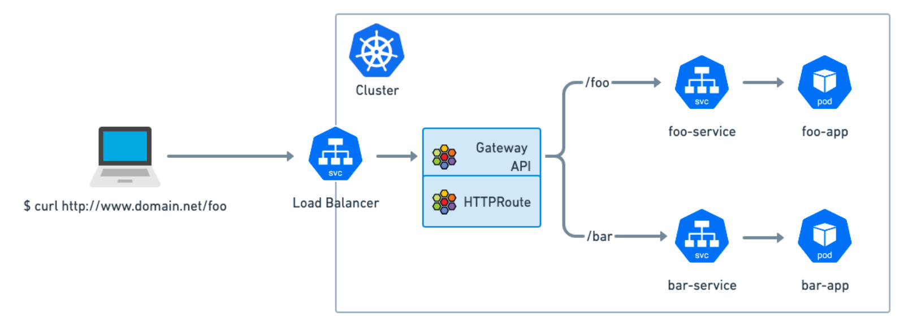
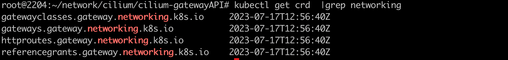
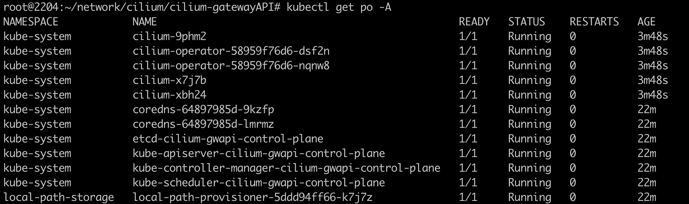
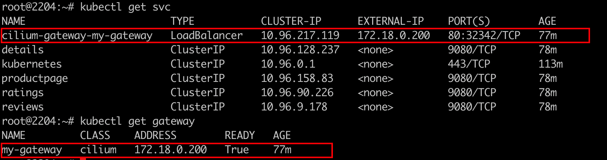
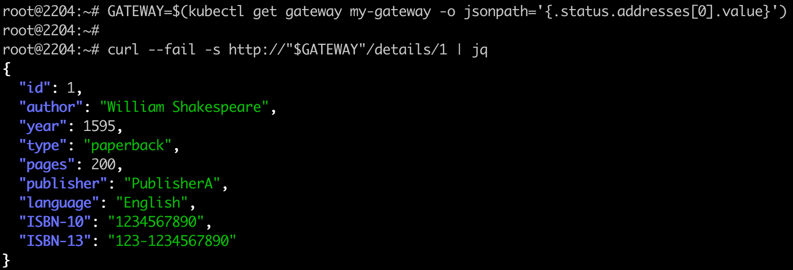
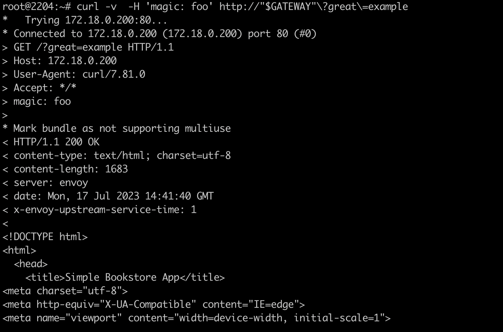
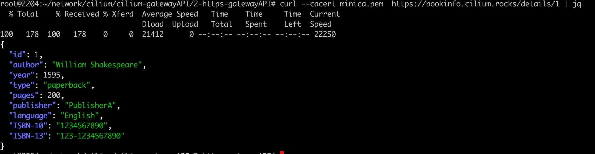
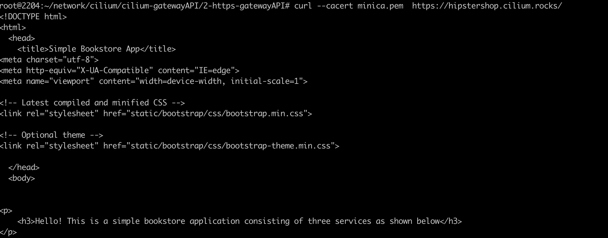
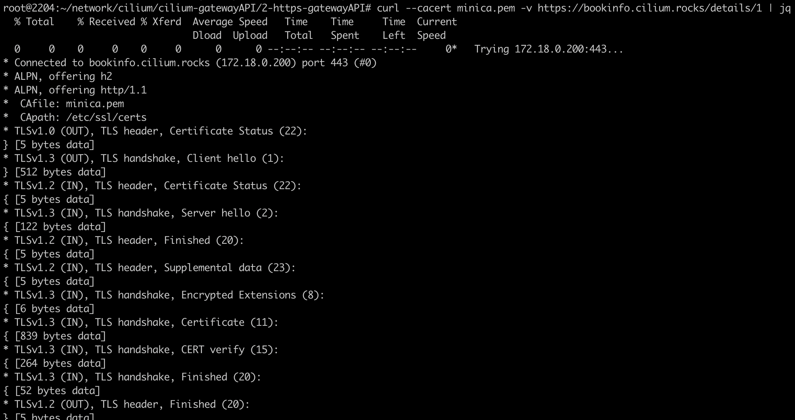

### 一: Cilium GatewayAPI 概览



Cilium 现在提供完全一致的 Gateway API 实现。 Gateway API 是 Kubernetes 集群中南北负载均衡和流量路由的新标准，并且是 Ingress API 的长期继承者。 Gateway API 代表了流量管理的未来。

GatewaAPI从设计之初就是为了解决Ingress API的局限性

- Gateway API 的创建是源于Ingress API 存在一些局限性：首先，它不提供用户需要定义的高级负载均衡功能。它本身仅支持简单的基于路径的 HTTP 流量请求路由
- 其次，用户管理变得不切实际：产品供应商通过注释来解决 Ingress API 中功能缺乏的问题。但是注释虽然非常强大，但最终会导致一个 Ingress 与另一个 Ingress 之间出现不一致
- 第三，由于 Ingress API 是单一 API 资源，因此它操作受限：不适合具有共享负载均衡基础设施的多团队集群

在 Cilium 1.13 中，Cilium Gateway API 通过了所有 Gateway API 一致性测试 (v0.5.1)

https://isovalent.com/blog/post/cilium-release-113/

### 二: Cilium GatewayAPI 环境搭建

1. 依旧使用kind搭建k8s环境

   ```shell
   #!/bin/bash
   date
   set -v
   
   # 1.prep noCNI env(VM Based Environment)
   cat <<EOF | kind create cluster --name=cilium-gwapi --image=kindest/node:v1.23.4 --config=-
   kind: Cluster
   apiVersion: kind.x-k8s.io/v1alpha4
   networking:
           disableDefaultCNI: true
           kubeProxyMode: "none"
   nodes:
           - role: control-plane
           - role: worker
           - role: worker
   
   EOF
   
   # 2.remove taints
   controller_node=`kubectl get nodes --no-headers  -o custom-columns=NAME:.metadata.name| grep control-plane`
   kubectl taint nodes $controller_node node-role.kubernetes.io/master:NoSchedule-
   kubectl get nodes -o wide
   
   
   #3 . install necessary tools
   for i in $(docker ps -a --format "table {{.Names}}" |grep cilium-gwapi)
   do
                   echo $i
                   #docker cp ./bridge $i:/opt/cni/bin/
                   docker cp /usr/bin/ping $i:/usr/bin/ping
                   docker exec -it $i bash -c "sed -i -e  's/jp.archive.ubuntu.com\|archive.ubuntu.com\|security.ubuntu.com/old-releases.ubuntu.com/g' /etc/apt/sources.list"
                   docker exec -it $i bash -c "apt-get -y update > /dev/null && apt-get -y install net-tools tcpdump lrzsz > /dev/null 2>&1"
   ```

   注意: `kubeProxyMode: "none"` cilium gatewayapi 特性不需要集群安装kube-proxy

   

2. 如果要使用GatewayAPI，需要在集群安装相关crd.(安装v0.5.1)

   https://gateway-api.sigs.k8s.io/guides/?h=crds#getting-started-with-gateway-api

   

   

3. 安装Cilium cni

   ```shell
   #/bin/bash
   set -v
   controller_node_ip=`kubectl get node -o wide --no-headers | grep -E "control-plane|bpf1" | awk -F " " '{print $6}'`
   
   helm repo add cilium https://helm.cilium.io > /dev/null 2>&1
   helm repo update > /dev/null 2>&1
   
   helm install cilium cilium/cilium --set k8sServiceHost=$controller_node_ip --set k8sServicePort=6443 --version 1.13.0-rc5 --namespace kube-system --set debug.enabled=true --set debug.verbose=datapath --set monitorAggregation=none --set ipam.mode=cluster-pool --set cluster.name=cilium-gwapi --set kubeProxyReplacement=strict --set bpf.masquerade=true --set gatewayAPI.enabled=true
   
   ```

   需要注意的地方:

   `-set gatewayAPI.enabled=true `开启gatewayAPI特性

   `-set kubeProxyReplacement=stric` 取代kubeproxy模式

   

4. 部署metalLb，L2模式

   参考链接: https://metallb.universe.tf/installation/
   
   cilium ingressController 需要创建LoadBalencer service以4层LB对外暴露服务。这里借助metalLB 实现LB ip地址的分配和宣告，使用的是v0.13版本
   
   `kubectl apply -f https://raw.githubusercontent.com/metallb/metallb/v0.13.10/config/manifests/metallb-native.yaml`
   
   

5. 配置metalLB的ippool和ip地址宣告规则

   L2模式下，ippool地址网段需要与节点在同一网段下

   ```yaml
   apiVersion: metallb.io/v1beta1
   kind: IPAddressPool
   metadata:
     name: first-pool
     namespace: metallb-system
   spec:
     addresses:
     - 172.18.0.200-172.18.0.210
     
   ---
   apiVersion: metallb.io/v1beta1
   kind: L2Advertisement
   metadata:
     name: first-adv
     namespace: metallb-system
   spec:
     ipAddressPools:
     - first-pool
   ```

   

6. 部署应用示例demo

   `kubectl apply -f https://raw.githubusercontent.com/istio/istio/release-1.11/samples/bookinfo/platform/kube/bookinfo.yaml`


### 三: GatewayAPI HTTP example 

1. 配置gateway规则信息

   ```yaml
   ---
   apiVersion: gateway.networking.k8s.io/v1beta1
   kind: Gateway
   metadata:
     name: my-gateway
   spec:
     gatewayClassName: cilium
     listeners:
     - protocol: HTTP
       port: 80
       name: web-gw
       allowedRoutes:
         namespaces:
           from: Same
   ---
   apiVersion: gateway.networking.k8s.io/v1beta1
   kind: HTTPRoute
   metadata:
     name: http-app-1
   spec:
     parentRefs:
     - name: my-gateway
       namespace: default
     rules:
     - matches:
       - path:
           type: PathPrefix
           value: /details
       backendRefs:
       - name: details
         port: 9080
     - matches:
       - headers:
         - type: Exact
           name: magic
           value: foo
         queryParams:
         - type: Exact
           name: great
           value: example
         path:
           type: PathPrefix
           value: /
         method: GET
       backendRefs:
       - name: productpage
         port: 9080
   
   ```

   

2. 测试验证

   `GATEWAY=$(kubectl get gateway my-gateway -o jsonpath='{.status.addresses[0].value}')`

   `curl --fail -s http://"$GATEWAY"/details/1 | jq`

   

   

   `curl -v -H 'magic: foo' http://"$GATEWAY"\?great\=example`

   

### 四: GatewayAPI HTTPS example

1. 由于是https访问请求，客户端需要服务端提供证书，demo案例使用minica进行证书的签发

   ```shell
   #/bin/bash
   set -v
   controller_node=`kubectl get node -o wide --no-headers |grep -E "control-plane" | awk -F " " '{print $1}'`
   docker exec $controller_node bash -c 'apt -y install wget sudo git;wget -c https://dl.google.com/go/go1.14.2.linux-amd64.tar.gz -O - | sudo tar -xz -C /usr/local;echo wget done;export PATH=$PATH:/usr/local/go/bin;source ~/.profile;git clone https://github.com/jsha/minica.git;cd minica && go build;/minica/minica --domains '*.cilium.rocks';kubectl create secret tls demo-cert --key=_.cilium.rocks/key.pem --cert=_.cilium.rocks/cert.pem'
   ```
   
   


2. 配置gateway https 规则信息

   ```yaml
   apiVersion: gateway.networking.k8s.io/v1beta1
   kind: Gateway
   metadata:
     name: tls-gateway
   spec:
     gatewayClassName: cilium
     listeners:
     - name: https-1
       protocol: HTTPS
       port: 443
       hostname: "bookinfo.cilium.rocks"
       tls:
         certificateRefs:
         - kind: Secret
           name: demo-cert
     - name: https-2
       protocol: HTTPS
       port: 443
       hostname: "hipstershop.cilium.rocks"
       tls:
         certificateRefs:
         - kind: Secret
           name: demo-cert
   ---
   apiVersion: gateway.networking.k8s.io/v1beta1
   kind: HTTPRoute
   metadata:
     name: https-app-route-1
   spec:
     parentRefs:
     - name: tls-gateway
     hostnames:
     - "bookinfo.cilium.rocks"
     rules:
     - matches:
       - path:
           type: PathPrefix
           value: /details
       backendRefs:
       - name: details
         port: 9080
   ---
   apiVersion: gateway.networking.k8s.io/v1beta1
   kind: HTTPRoute
   metadata:
     name: https-app-route-2
   spec:
     parentRefs:
     - name: tls-gateway
     hostnames:
     - "hipstershop.cilium.rocks"
     rules:
     - matches:
       - path:
           type: PathPrefix
           value: /
       backendRefs:
       - name: productpage
         port: 9080
   
   ```

   

3. 测试验证

   ```shell
   #/bin/bash
   set -v 
   # exec &>./cilium-gateway-api-https.log
   date
   # 1.env info
   lsb_release -a
   
   kubectl get nodes -o wide
   
   # 2.Cilium ingress http demo
   controller_node=`kubectl get node -o wide --no-headers | grep -E "control-plane" | awk -F " " '{print $1}'`
   docker cp $controller_node:/minica/minica.pem ./minica.pem
   
   sed -i '/bookinfo\.cilium\.rocks\|hipstershop\.cilium\.rocks/d' /etc/hosts
   tee -a /etc/hosts <<<"$(kubectl get svc/cilium-gateway-tls-gateway -o=jsonpath='{.status.loadBalancer.ingress[0].ip}') bookinfo.cilium.rocks hipstershop.cilium.rocks"
   
   curl --cacert minica.pem -v https://bookinfo.cilium.rocks/details/1 | jq
   ```

   

   

    如果想看tls握手的过程，可以加上 `-v`

   `curl --cacert minica.pem -v https://bookinfo.cilium.rocks/details/1 | jq`

   