### 一：Cilium IPSec 架构

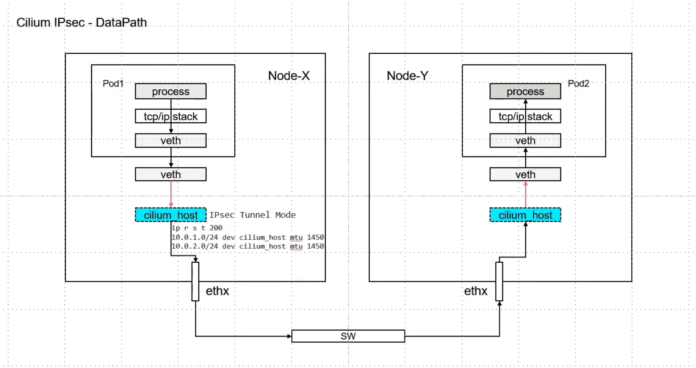 

### 二：Cilium IPSec 环境搭建

1. 采用kind搭建集群环境，配置文件如下

   ```shell
   #1-setup-env.sh
   #! /bin/bash
   date
   set -v
   
   # 1.prep nocNI env
   cat <<EOF |kind create cluster --name=cilium-ipsec-native-routing --image=kindest/node:v1.23.4  --config=-
   kind: Cluster
   apiVersion: kind.x-k8s.io/v1alpha4
   networking:
     disableDefaultCNI: true  #kind 默认使用rancher cni，我们不需要该cni
     #kubeProxyMode: "node" #Enable the kubeProxy
     
   nodes:
     - role: control-plane
     - role: worker
     - role: worker
     
   EOF
   
   # 2. remove taints
   controller_node=`kubectl get nodes --no-headers -o custom-columns=NAME:.metadata.name |grep control-plane`
   kubectl taint nodes $controller_node node-role.kubernetes.io/master:NoSchedule-
   kubectl get nodes -owide
   
   # 3.  install cni
   helm repo add cilium  https://helm.cilium.io > /dev/null 2>&1
   helm repo update > /dev/null  2>&1
   
   kubectl create -n kube-system secret generic cilium-ipsec-keys --from-literal=keys="3 rfc4106(gcm(aes)) $(echo $(dd if=/dev/urandom count=20 bs=1 2> /dev/null | xxd -p -c 64)) 128"
   
   helm  install cilium  cilium/cilium --set k8sServiceHost=$controller_node --set k8sServicePort=6443 --version 1.13.0-rc5 --namespace kube-system --set debug.enabled=true --set debug.verbose=datapath --set monitorAggregation=none --set ipam.mode=cluster-pool --set cluster.name=cilium-ipsec-native-routing --set tunnel=disabled --set autoDirectNodeRoutes=true --set ipv4NativeRoutingCIDR="10.0.0.0/8" --set encryption.enabled=true --set encryption.type=ipsec
   
   #4. install necessary tools
   for i in $(docker ps -a --format "table {{.Names}}" |grep cilium-ipsec-native-routing)
   do
                   echo $i
                   #docker cp ./bridge $i:/opt/cni/bin/
                   docker cp /usr/bin/ping $i:/usr/bin/ping
                   docker exec -it $i bash -c "sed -i -e  's/jp.archive.ubuntu.com\|archive.ubuntu.com\|security.ubuntu.com/old-releases.ubuntu.com/g' /etc/apt/sources.list"
                   docker exec -it $i bash -c "apt-get -y update > /dev/null && apt-get -y install net-tools tcpdump lrzsz > /dev/null 2>&1"
   done
   ```
   
   和之前部署cilium的差异点在于：
   
   需要准备key，加密文件。同时 cilium的安装参数需要打开加密配置`encryption.enabled=true`，加密方式为ipsec`encryption.type=ipsec`,集群安装不再是kubeProxyreplacement。
   
   
   
   ⚠️：当前版本的cilium，开启ipsec的同时，还不支持ebpf的能力；ip xfrm frameware 不是一个框架，想要替换掉不是那么容易。所以只能把cilium当成一个普通的cni来使用。

​	

​	

2. 确认部署状态

   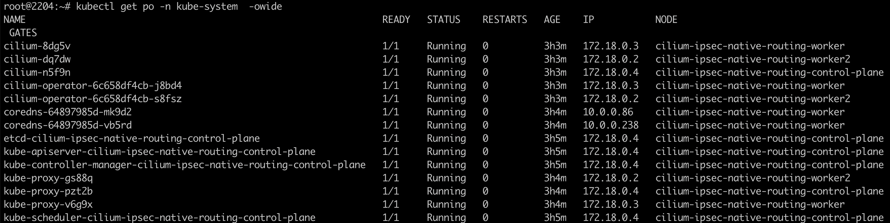 


### 三： 特性分析

1. 分析节点上网卡信息。可以看到mark信息。这个和手工搭建ipsec网络环境存在差异

   `ip xfrm state` 命令：

   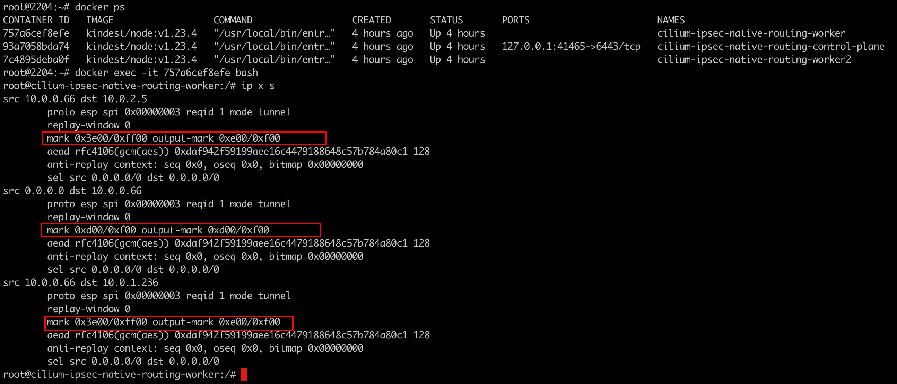 

2. 抓包分析

   ipsec 是一个三层的加密技术，all把二层隐藏了，不影响抓包

   `tcpdump -pne -i any -w all-ipsec.cap`

   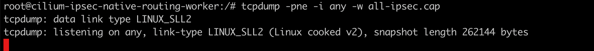  

3. ping 测触发

   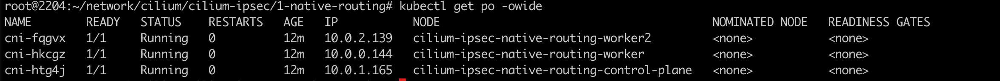 

   抓包的节点是在worker节点上，可以从worker节点上的pod ping 其他节点上的pod。 

   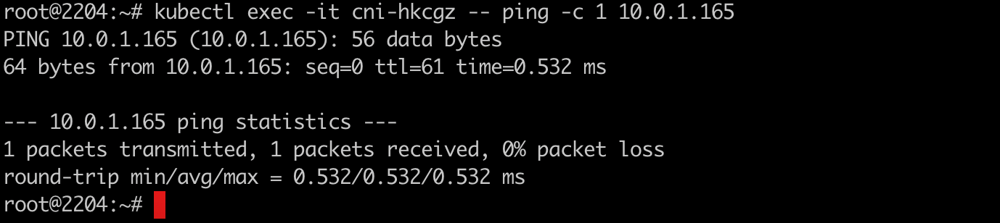 

4. 解密抓包报文

   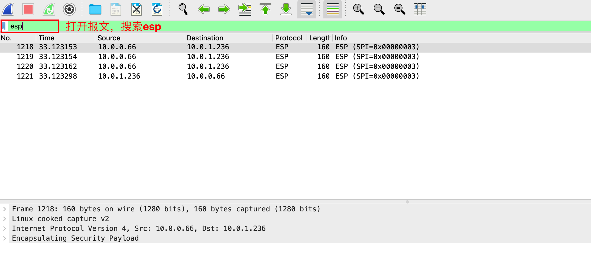 

   替换密钥： 密钥为节点上 `ip x s` 命令后，可直接获取

   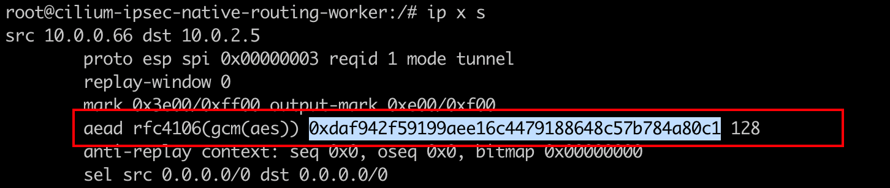 

   

   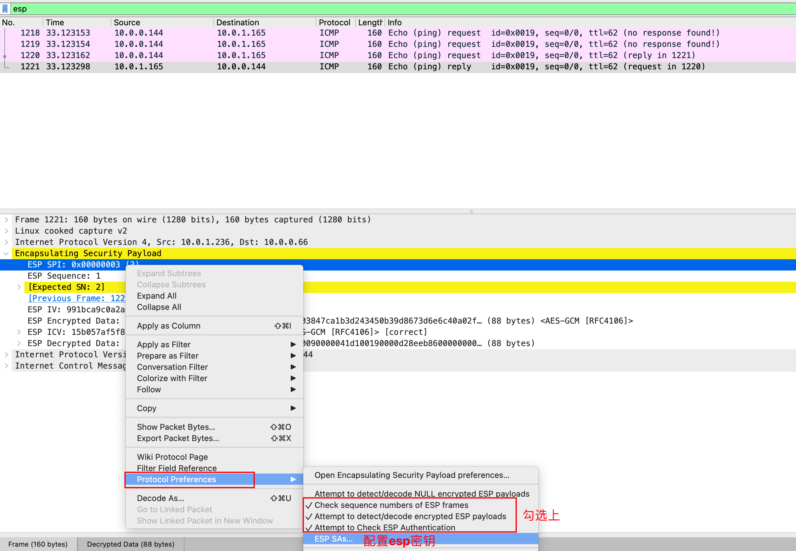  

   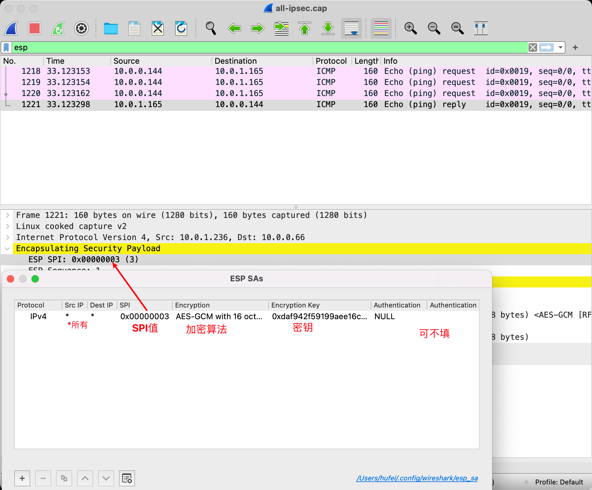 

   可以发现配置完密钥后，报文载荷解析出来了。

   

5. 分析报文

   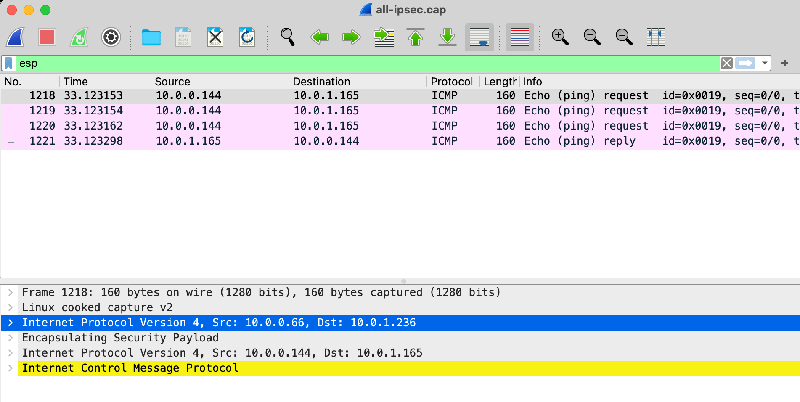 

   上述步骤中ping测： 

   source pod ip: 10.0.0.144 ; destination pod ip: 10.0.1.165

   和解密之后的报文src dst符合；

   但是有个疑问外层IP：src: 10.0.0.66  dst： 10.0.1.236    又是谁的ip呢？

   查看pod对应宿主机的网卡信息：

   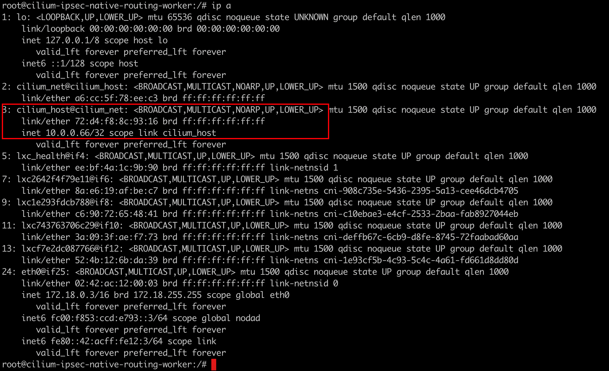 

   可以发现对应的封装报文的网卡接口是： cilium_host接口。按照正常逻辑封装报文应该是走的节点上的物理网卡接口，对应的是节点ip。

   所以有个疑问？ 网络流量是怎么走到cilium_host网卡接口的呢。

   `ip x s`查看ipsec加密配置：满足src和dst规则的都会使用匹配到的 spi 密钥等。

   注意mark值： 

   `mark 0x3e00/0xff00 output-mark 0xe00/0xf00`

   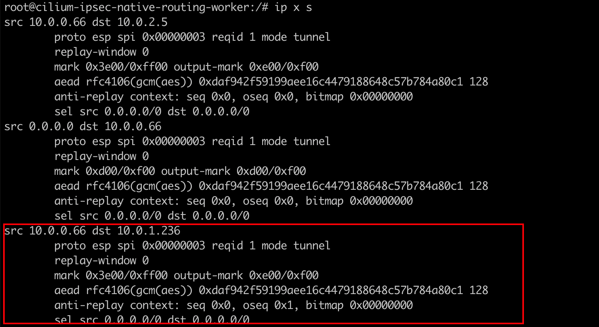 

   所以还是有上述疑问，pod流量出来后，是怎么路由到cilium_host 网卡上面的？

   `ip rule show` ,该命令查询的是基于源地址进行路由SBR，优先级比DBR目地址路由高，在多网卡Muti-Nic场景下使用比较多

   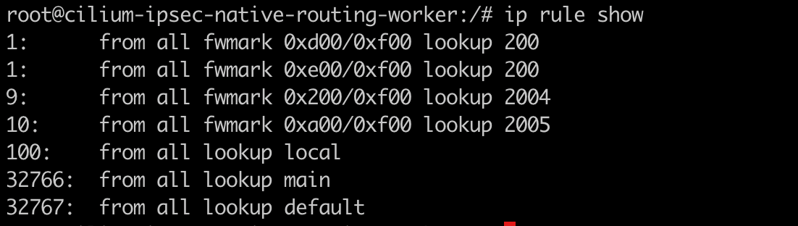 

   根据上面的mark值，找到对应的路由表，发现对应的是表id 是200，

   `ip r s t 200` 查看具体内容：

   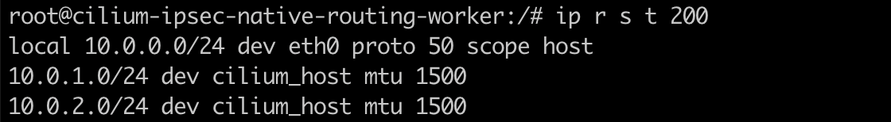 

   包含三条路由，最好结合`ip x s` 内容来看：

   第一条路由：用于访问本地的情况

   第二/三条路由：在访问`10.0.1.0/24 或者 10.0.2.0/24`时，需要借助cilium_host来转发。

   

6. 进一步分析

   为什么抓包报文存在3条request报文，分别来自什么网卡接口呢？

   做下简单测试：

   cilium_host 网卡接口：

   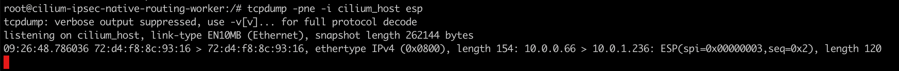

   cilium_net 网卡接口：

   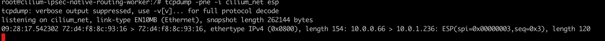

   eth0 网卡接口：

   数据包到达这里是通过路由转发出去的，可以route -n 查看

   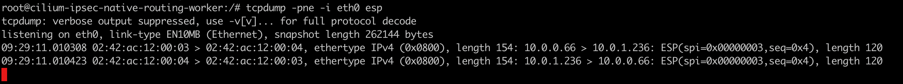 


7. 补充：

1）在ipsec场景下，需要区分哪些流量是敏感流量（需要做ipsec的流量），一般存在两种方案： ACL && Routing （SBR DBR）

2）ipsec的封装架构非常类似ipip,只不过多了一个ESP的header头
