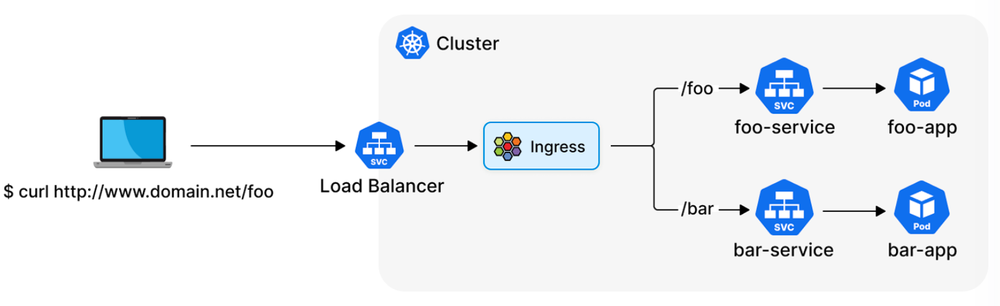
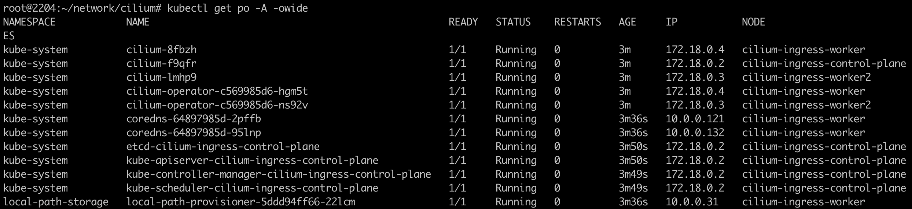
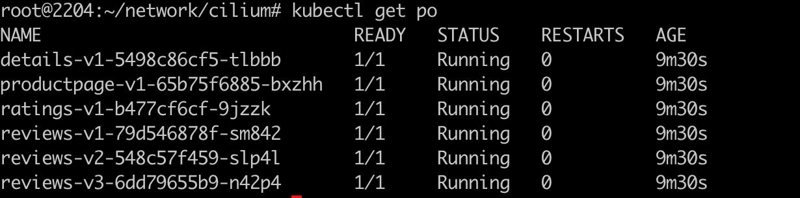
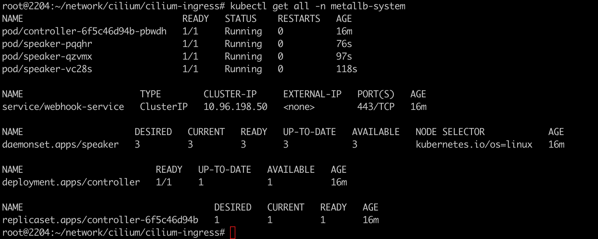
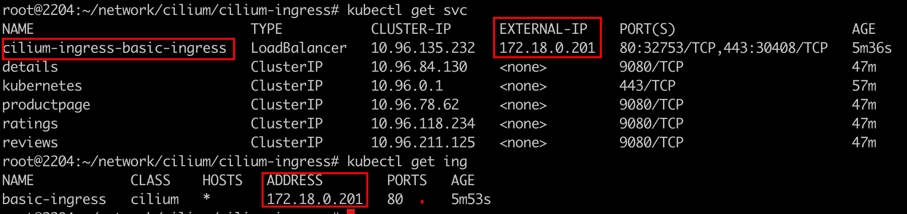
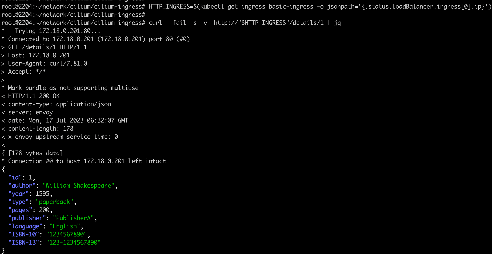
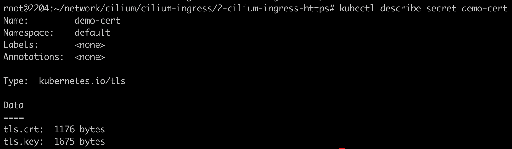
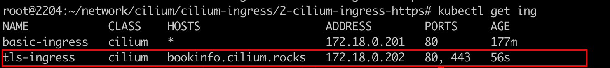
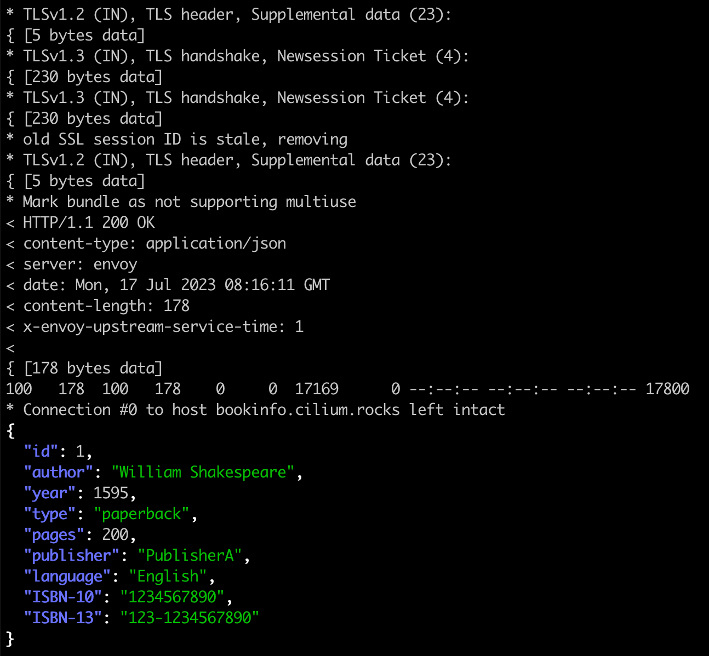

### 一： Cilium Ingress 流程图



- Cilium 现在提供了开箱即用的 Kubernetes Ingress 实现。Cilium ingress实现了基于路径的路由、TLS 终止还可以提供多服务共享一个负载均衡器 IP 等功能。
-  Cilium Ingress Controller在底层使用了 Envoy 和 eBPF，可管理进入 Kubernetes 集群的南北向流量，集群内的东西向流量以及跨集群通信的流量，同时实现丰富的 L7 负载均衡衡和L7流量管理。  

参考官方链接: https://docs.cilium.io/en/stable/network/servicemesh/ingress/

### 二: Cilium Ingress 环境搭建

依旧使用kind 搭建kubernetes 集群

```shell
#1-setup-env.sh
#! /bin/bash
date
set -v

# 1.prep nocNI env
cat <<EOF |kind create cluster --name=cilium-ingress --image=kindest/node:v1.23.4  --config=-
kind: Cluster
apiVersion: kind.x-k8s.io/v1alpha4
networking:
  disableDefaultCNI: true  #kind 默认使用rancher cni，我们不需要该cni
  kubeProxyMode: "none" #Enable the kubeProxy
  
nodes:
  - role: control-plane
  - role: worker
  - role: worker
  
EOF

# 2. remove taints
controller_node=`kubectl get nodes --no-headers -o custom-columns=NAME:.metadata.name |grep control-plane`
kubectl taint nodes $controller_node node-role.kubernetes.io/master:NoSchedule-
kubectl get nodes -owide

# 3.  install cni
helm repo add cilium  https://helm.cilium.io > /dev/null 2>&1
helm repo update > /dev/null  2>&1


helm  install cilium  cilium/cilium --set k8sServiceHost=$controller_node --set k8sServicePort=6443 --version 1.13.0-rc5 --namespace kube-system --set debug.enabled=true --set debug.verbose=datapath --set monitorAggregation=none --set ipam.mode=cluster-pool --set cluster.name=cilium-ingress  --set tunnel=disabled --set autoDirectNodeRoutes=true --set ipv4NativeRoutingCIDR="10.0.0.0/8" --set bpf.masquerade=true --set kubeProxyReplacement=strict --set installNoConntrackIptablesRules=true --set ingressController.enabled=true
--set enable-l7-proxy=true

#4. install necessary tools
for i in $(docker ps -a --format "table {{.Names}}" |grep cilium-ingress)
do
                echo $i
                #docker cp ./bridge $i:/opt/cni/bin/
                docker cp /usr/bin/ping $i:/usr/bin/ping
                docker exec -it $i bash -c "sed -i -e  's/jp.archive.ubuntu.com\|archive.ubuntu.com\|security.ubuntu.com/old-releases.ubuntu.com/g' /etc/apt/sources.list"
                docker exec -it $i bash -c "apt-get -y update > /dev/null && apt-get -y install net-tools tcpdump lrzsz > /dev/null 2>&1"
done
```

需要注意的是⚠️:

`set ingressController.enabled=true` 必须设置启动cilium ingressController

`set kubeProxyReplacement=strict` 必须启动KPR模式  

`set enable-l7-proxy=true` 默认开启，前期学习阶段，手动配置上加深理解

集群版本必须大于1.19

确认集群部署成功




### 三: Ingress HTTP Example

采用 Istio 的 bookinfo 项目演示微服务应用程序路由到后端服务。

1. 部署demo app

   `kubectl apply -f https://raw.githubusercontent.com/istio/istio/release-1.11/samples/bookinfo/platform/kube/bookinfo.yaml`

   

   

   放心，这只是部署istio项目下的的微服务demo，并不会部署istio相关组件(no sidecar)

   

2. 安装metalLB （L2/BGP），这里部署L2模式的。

   参考链接: https://metallb.universe.tf/installation/

   cilium ingressController 需要创建LoadBalencer service以4层LB对外暴露服务。这里借助metalLB 实现LB ip地址的分配和宣告，使用的是v0.13版本

   `kubectl apply -f https://raw.githubusercontent.com/metallb/metallb/v0.13.10/config/manifests/metallb-native.yaml`

   

   

   注意⚠️，需要手动配置一下metalLb layer2 的IPAddressPool,因为要创建loadbanlencer分配LB ip地址，因为是L2模式的，需要和worker节点处于同一网段`172.18.0.200-172.18.0.210`即可。

   ```yaml
   apiVersion: metallb.io/v1beta1
   kind: IPAddressPool
   metadata:
     name: first-pool
     namespace: metallb-system
   spec:
     addresses:
     - 172.18.0.200-172.18.0.210
   ```

   为了将上面的ip地址宣告出去，还需要创建`L2Advertisement` 进行地址宣告。

   ```yaml
   apiVersion: metallb.io/v1beta1
   kind: L2Advertisement
   metadata:
     name: first-adv
     namespace: metallb-system
   spec:
     ipAddressPools:
     - first-pool
   
   ```

   

3. 应用ingress资源配置清单

   ```yaml
   # Basic ingress for istio bookinfo demo application, which can be found in below
   # https://raw.githubusercontent.com/istio/istio/release-1.11/samples/bookinfo/platform/kube/bookinfo.yaml
   apiVersion: networking.k8s.io/v1
   kind: Ingress
   metadata:
     name: basic-ingress
     namespace: default
   spec:
     ingressClassName: cilium
     rules:
     - http:
         paths:
         - backend:
             service:
               name: details
               port:
                 number: 9080
           path: /details
           pathType: Prefix
         - backend:
             service:
               name: productpage
               port:
                 number: 9080
           path: /
           pathType: Prefix
   
   ```

   可以看到创建完ingress，会自动创建svc，包括分配LB IP地址; ingress对应的Adress同样被分配
   
   
   
   

4. 测试 `6-test.sh`

   ```shell
   #/bin/bash
   set -v
   # exec &> ./cilium-ingress-http.log
   date
   # 1. env info
   lsb_release -a
   
   kubectl get nodes -o wide
   
   #2. Cilium ingress http demo
   HTTP_INGRESS=$(kubectl get ing basic-ingress -o jsonpath='{.status.loadBalancer.ingress[0].ip}')
   curl -v --fail -s http://"$HTTP_INGRESS"/details/1 |jq
   ```

   访问成功:

   

   客户端并非时集群内环境，是处于同一二层的设备。


### 四: Ingress HTTPS Example

1. 由于https协议，多了证书的步骤，需要借助其他工具完成证书的签发。(minica|cert-manager|openssl自签发均可)

   本案例采用minica进行证书的签发: 

   ```shell
   #/bin/bash
   set -v
   controller_node=`kubectl get node -o wide --no-headers |grep -E "control-plane" | awk -F " " '{print $1}'`
   docker exec $controller_node bash -c 'apt -y install wget sudo git;wget -c https://dl.google.com/go/go1.14.2.linux-amd64.tar.gz -O - | sudo tar -xz -C /usr/local;echo wget done;export PATH=$PATH:/usr/local/go/bin;source ~/.profile;git clone https://github.com/jsha/minica.git;cd minica && go build;/minica/minica --domains '*.cilium.rocks';kubectl create secret tls demo-cert --key=_.cilium.rocks/key.pem --cert=_.cilium.rocks/cert.pem'
   ```

   

2. ingress资源清单

   ```yaml
   # TLS ingress example, requires the below two applications
   # https://raw.githubusercontent.com/istio/istio/release-1.11/samples/bookinfo/platform/kube/bookinfo.yaml
   # https://github.com/GoogleCloudPlatform/microservices-demo
   apiVersion: networking.k8s.io/v1
   kind: Ingress
   metadata:
     name: tls-ingress
     namespace: default
   spec:
     ingressClassName: cilium
     rules:
     - host: bookinfo.cilium.rocks
       http:
         paths:
         - backend:
             service:
               name: details
               port:
                 number: 9080
           path: /details
           pathType: Prefix
         - backend:
             service:
               name: productpage
               port:
                 number: 9080
           path: /
           pathType: Prefix
     tls:
     - hosts:
       - bookinfo.cilium.rocks
       secretName: demo-cert
   
   ```

   


3. 测试https访问

   ```shell
   #/bin/bash
   set -v 
   # exec &>./cilium-ingress-https.log
   date
   # 1.env info
   lsb_release -a
   
   kubectl get nodes -o wide
   
   # 2.Cilium ingress http demo
   controller_node=`kubectl get node -o wide --no-headers | grep -E "control-plane" | awk -F " " '{print $1}'`
   docker cp $controller_node:/minica/minica.pem ./minica.pem
   
   sed -i '/bookinfo\.cilium\.rocks/d' /etc/hosts
   tee -a /etc/hosts <<<"$(kubectl get svc/cilium-ingress-tls-ingress -o=jsonpath='{.status.loadBalancer.ingress[0].ip}') bookinfo.cilium.rocks "
   
   curl --cacert minica.pem -v https://bookinfo.cilium.rocks/details/1 | jq
   
   ```

   访问成功。服务端正常响应。同时加上`-v`还能看到tls握手过程

   


### 五: appdemo.yaml & metalLb.yaml

1. demoAPP 详细yaml文件如下:

   ```yaml
   
   ##################################################################################################
   # Details service
   ##################################################################################################
   apiVersion: v1
   kind: Service
   metadata:
     name: details
     labels:
       app: details
       service: details
   spec:
     ports:
     - port: 9080
       name: http
     selector:
       app: details
   ---
   apiVersion: v1
   kind: ServiceAccount
   metadata:
     name: bookinfo-details
     labels:
       account: details
   ---
   apiVersion: apps/v1
   kind: Deployment
   metadata:
     name: details-v1
     labels:
       app: details
       version: v1
   spec:
     replicas: 1
     selector:
       matchLabels:
         app: details
         version: v1
     template:
       metadata:
         labels:
           app: details
           version: v1
       spec:
         serviceAccountName: bookinfo-details
         containers:
         - name: details
           image: docker.io/istio/examples-bookinfo-details-v1:1.16.2
           imagePullPolicy: IfNotPresent
           ports:
           - containerPort: 9080
           securityContext:
             runAsUser: 1000
   ---
   ##################################################################################################
   # Ratings service
   ##################################################################################################
   apiVersion: v1
   kind: Service
   metadata:
     name: ratings
     labels:
       app: ratings
       service: ratings
   spec:
     ports:
     - port: 9080
       name: http
     selector:
       app: ratings
   ---
   apiVersion: v1
   kind: ServiceAccount
   metadata:
     name: bookinfo-ratings
     labels:
       account: ratings
   ---
   apiVersion: apps/v1
   kind: Deployment
   metadata:
     name: ratings-v1
     labels:
       app: ratings
       version: v1
   spec:
     replicas: 1
     selector:
       matchLabels:
         app: ratings
         version: v1
     template:
       metadata:
         labels:
           app: ratings
           version: v1
       spec:
         serviceAccountName: bookinfo-ratings
         containers:
         - name: ratings
           image: docker.io/istio/examples-bookinfo-ratings-v1:1.16.2
           imagePullPolicy: IfNotPresent
           ports:
           - containerPort: 9080
           securityContext:
             runAsUser: 1000
   ---
   ##################################################################################################
   # Reviews service
   ##################################################################################################
   apiVersion: v1
   kind: Service
   metadata:
     name: reviews
     labels:
       app: reviews
       service: reviews
   spec:
     ports:
     - port: 9080
       name: http
     selector:
       app: reviews
   ---
   apiVersion: v1
   kind: ServiceAccount
   metadata:
     name: bookinfo-reviews
     labels:
       account: reviews
   ---
   apiVersion: apps/v1
   kind: Deployment
   metadata:
     name: reviews-v1
     labels:
       app: reviews
       version: v1
   spec:
     replicas: 1
     selector:
       matchLabels:
         app: reviews
         version: v1
     template:
       metadata:
         labels:
           app: reviews
           version: v1
       spec:
         serviceAccountName: bookinfo-reviews
         containers:
         - name: reviews
           image: docker.io/istio/examples-bookinfo-reviews-v1:1.16.2
           imagePullPolicy: IfNotPresent
           env:
           - name: LOG_DIR
             value: "/tmp/logs"
           ports:
           - containerPort: 9080
           volumeMounts:
           - name: tmp
             mountPath: /tmp
           - name: wlp-output
             mountPath: /opt/ibm/wlp/output
           securityContext:
             runAsUser: 1000
         volumes:
         - name: wlp-output
           emptyDir: {}
         - name: tmp
           emptyDir: {}
   ---
   apiVersion: apps/v1
   kind: Deployment
   metadata:
     name: reviews-v2
     labels:
       app: reviews
       version: v2
   spec:
     replicas: 1
     selector:
       matchLabels:
         app: reviews
         version: v2
     template:
       metadata:
         labels:
           app: reviews
           version: v2
       spec:
         serviceAccountName: bookinfo-reviews
         containers:
         - name: reviews
           image: docker.io/istio/examples-bookinfo-reviews-v2:1.16.2
           imagePullPolicy: IfNotPresent
           env:
           - name: LOG_DIR
             value: "/tmp/logs"
           ports:
           - containerPort: 9080
           volumeMounts:
           - name: tmp
             mountPath: /tmp
           - name: wlp-output
             mountPath: /opt/ibm/wlp/output
           securityContext:
             runAsUser: 1000
         volumes:
         - name: wlp-output
           emptyDir: {}
         - name: tmp
           emptyDir: {}
   ---
   apiVersion: apps/v1
   kind: Deployment
   metadata:
     name: reviews-v3
     labels:
       app: reviews
       version: v3
   spec:
     replicas: 1
     selector:
       matchLabels:
         app: reviews
         version: v3
     template:
       metadata:
         labels:
           app: reviews
           version: v3
       spec:
         serviceAccountName: bookinfo-reviews
         containers:
         - name: reviews
           image: docker.io/istio/examples-bookinfo-reviews-v3:1.16.2
           imagePullPolicy: IfNotPresent
           env:
           - name: LOG_DIR
             value: "/tmp/logs"
           ports:
           - containerPort: 9080
           volumeMounts:
           - name: tmp
             mountPath: /tmp
           - name: wlp-output
             mountPath: /opt/ibm/wlp/output
           securityContext:
             runAsUser: 1000
         volumes:
         - name: wlp-output
           emptyDir: {}
         - name: tmp
           emptyDir: {}
   ---
   ##################################################################################################
   # Productpage services
   ##################################################################################################
   apiVersion: v1
   kind: Service
   metadata:
     name: productpage
     labels:
       app: productpage
       service: productpage
   spec:
     ports:
     - port: 9080
       name: http
     selector:
       app: productpage
   ---
   apiVersion: v1
   kind: ServiceAccount
   metadata:
     name: bookinfo-productpage
     labels:
       account: productpage
   ---
   apiVersion: apps/v1
   kind: Deployment
   metadata:
     name: productpage-v1
     labels:
       app: productpage
       version: v1
   spec:
     replicas: 1
     selector:
       matchLabels:
         app: productpage
         version: v1
     template:
       metadata:
         labels:
           app: productpage
           version: v1
       spec:
         serviceAccountName: bookinfo-productpage
         containers:
         - name: productpage
           image: docker.io/istio/examples-bookinfo-productpage-v1:1.16.2
           imagePullPolicy: IfNotPresent
           ports:
           - containerPort: 9080
           volumeMounts:
           - name: tmp
             mountPath: /tmp
           securityContext:
             runAsUser: 1000
         volumes:
         - name: tmp
           emptyDir: {}
   ---
   ```

   

2. metalLb 环境部署文件

   ```yaml
   apiVersion: v1
   kind: Namespace
   metadata:
     labels:
       pod-security.kubernetes.io/audit: privileged
       pod-security.kubernetes.io/enforce: privileged
       pod-security.kubernetes.io/warn: privileged
     name: metallb-system
   ---
   apiVersion: apiextensions.k8s.io/v1
   kind: CustomResourceDefinition
   metadata:
     annotations:
       controller-gen.kubebuilder.io/version: v0.11.1
     creationTimestamp: null
     name: addresspools.metallb.io
   spec:
     conversion:
       strategy: Webhook
       webhook:
         clientConfig:
           caBundle: LS0tLS1CRUdJTiBDRVJUSUZJQ0FURS0tLS0tDQpNSUlGWlRDQ0EwMmdBd0lCQWdJVU5GRW1XcTM3MVpKdGkrMmlSQzk1WmpBV1MxZ3dEUVlKS29aSWh2Y05BUUVMDQpCUUF3UWpFTE1Ba0dBMVVFQmhNQ1dGZ3hGVEFUQmdOVkJBY01ERVJsWm1GMWJIUWdRMmwwZVRFY01Cb0dBMVVFDQpDZ3dUUkdWbVlYVnNkQ0JEYjIxd1lXNTVJRXgwWkRBZUZ3MHlNakEzTVRrd09UTXlNek5hRncweU1qQTRNVGd3DQpPVE15TXpOYU1FSXhDekFKQmdOVkJBWVRBbGhZTVJVd0V3WURWUVFIREF4RVpXWmhkV3gwSUVOcGRIa3hIREFhDQpCZ05WQkFvTUUwUmxabUYxYkhRZ1EyOXRjR0Z1ZVNCTWRHUXdnZ0lpTUEwR0NTcUdTSWIzRFFFQkFRVUFBNElDDQpEd0F3Z2dJS0FvSUNBUUNxVFpxMWZRcC9vYkdlenhES0o3OVB3Ny94azJwellualNzMlkzb1ZYSm5sRmM4YjVlDQpma2ZZQnY2bndscW1keW5PL2phWFBaQmRQSS82aFdOUDBkdVhadEtWU0NCUUpyZzEyOGNXb3F0MGNTN3pLb1VpDQpvcU1tQ0QvRXVBeFFNZjhRZDF2c1gvVllkZ0poVTZBRXJLZEpIaXpFOUJtUkNkTDBGMW1OVW55Rk82UnRtWFZUDQpidkxsTDVYeTc2R0FaQVBLOFB4aVlDa0NtbDdxN0VnTWNiOXlLWldCYmlxQ3VkTXE5TGJLNmdKNzF6YkZnSXV4DQo1L1pXK2JraTB2RlplWk9ZODUxb1psckFUNzJvMDI4NHNTWW9uN0pHZVZkY3NoUnh5R1VpSFpSTzdkaXZVTDVTDQpmM2JmSDFYbWY1ZDQzT0NWTWRuUUV2NWVaOG8zeWVLa3ZrbkZQUGVJMU9BbjdGbDlFRVNNR2dhOGFaSG1URSttDQpsLzlMSmdDYjBnQmtPT0M0WnV4bWh2aERKV1EzWnJCS3pMQlNUZXN0NWlLNVlwcXRWVVk2THRyRW9FelVTK1lsDQpwWndXY2VQWHlHeHM5ZURsR3lNVmQraW15Y3NTU1UvVno2Mmx6MnZCS21NTXBkYldDQWhud0RsRTVqU2dyMjRRDQp0eGNXLys2N3d5KzhuQlI3UXdqVTFITndVRjBzeERWdEwrZ1NHVERnSEVZSlhZelYvT05zMy94TkpoVFNPSkxNDQpoeXNVdyttaGdackdhbUdXcHVIVU1DUitvTWJzMTc1UkcrQjJnUFFHVytPTjJnUTRyOXN2b0ZBNHBBQm8xd1dLDQpRYjRhY3pmeVVscElBOVFoSmFsZEY3S3dPSHVlV3gwRUNrNXg0T2tvVDBvWVp0dzFiR0JjRGtaSmF3SURBUUFCDQpvMU13VVRBZEJnTlZIUTRFRmdRVW90UlNIUm9IWTEyRFZ4R0NCdEhpb1g2ZmVFQXdId1lEVlIwakJCZ3dGb0FVDQpvdFJTSFJvSFkxMkRWeEdDQnRIaW9YNmZlRUF3RHdZRFZSMFRBUUgvQkFVd0F3RUIvekFOQmdrcWhraUc5dzBCDQpBUXNGQUFPQ0FnRUFSbkpsWWRjMTFHd0VxWnh6RDF2R3BDR2pDN2VWTlQ3aVY1d3IybXlybHdPYi9aUWFEa0xYDQpvVStaOVVXT1VlSXJTdzUydDdmQUpvVVAwSm5iYkMveVIrU1lqUGhvUXNiVHduOTc2ZldBWTduM3FMOXhCd1Y0DQphek41OXNjeUp0dlhMeUtOL2N5ak1ReDRLajBIMFg0bWJ6bzVZNUtzWWtYVU0vOEFPdWZMcEd0S1NGVGgrSEFDDQpab1Q5YnZHS25adnNHd0tYZFF0Wnh0akhaUjVqK3U3ZGtQOTJBT051RFNabS8rWVV4b2tBK09JbzdSR3BwSHNXDQo1ZTdNY0FTVXRtb1FORXd6dVFoVkJaRWQ1OGtKYjUrV0VWbGNzanlXNnRTbzErZ25tTWNqR1BsMWgxR2hVbjV4DQpFY0lWRnBIWXM5YWo1NmpBSjk1MVQvZjhMaWxmTlVnanBLQ0c1bnl0SUt3emxhOHNtdGlPdm1UNEpYbXBwSkI2DQo4bmdHRVluVjUrUTYwWFJ2OEhSSGp1VG9CRHVhaERrVDA2R1JGODU1d09FR2V4bkZpMXZYWUxLVllWb1V2MXRKDQo4dVdUR1pwNllDSVJldlBqbzg5ZytWTlJSaVFYUThJd0dybXE5c0RoVTlqTjA0SjdVL1RvRDFpNHE3VnlsRUc5DQorV1VGNkNLaEdBeTJIaEhwVncyTGFoOS9lUzdZMUZ1YURrWmhPZG1laG1BOCtqdHNZamJadnR5Mm1SWlF0UUZzDQpUU1VUUjREbUR2bVVPRVRmeStpRHdzK2RkWXVNTnJGeVVYV2dkMnpBQU4ydVl1UHFGY2pRcFNPODFzVTJTU3R3DQoxVzAyeUtYOGJEYmZFdjBzbUh3UzliQnFlSGo5NEM1Mjg0YXpsdTBmaUdpTm1OUEM4ckJLRmhBPQ0KLS0tLS1FTkQgQ0VSVElGSUNBVEUtLS0tLQ==
           service:
             name: webhook-service
             namespace: metallb-system
             path: /convert
         conversionReviewVersions:
         - v1alpha1
         - v1beta1
     group: metallb.io
     names:
       kind: AddressPool
       listKind: AddressPoolList
       plural: addresspools
       singular: addresspool
     scope: Namespaced
     versions:
     - deprecated: true
       deprecationWarning: metallb.io v1alpha1 AddressPool is deprecated
       name: v1alpha1
       schema:
         openAPIV3Schema:
           description: AddressPool is the Schema for the addresspools API.
           properties:
             apiVersion:
               description: 'APIVersion defines the versioned schema of this representation
                 of an object. Servers should convert recognized schemas to the latest
                 internal value, and may reject unrecognized values. More info: https://git.k8s.io/community/contributors/devel/sig-architecture/api-conventions.md#resources'
               type: string
             kind:
               description: 'Kind is a string value representing the REST resource this
                 object represents. Servers may infer this from the endpoint the client
                 submits requests to. Cannot be updated. In CamelCase. More info: https://git.k8s.io/community/contributors/devel/sig-architecture/api-conventions.md#types-kinds'
               type: string
             metadata:
               type: object
             spec:
               description: AddressPoolSpec defines the desired state of AddressPool.
               properties:
                 addresses:
                   description: A list of IP address ranges over which MetalLB has authority.
                     You can list multiple ranges in a single pool, they will all share
                     the same settings. Each range can be either a CIDR prefix, or an
                     explicit start-end range of IPs.
                   items:
                     type: string
                   type: array
                 autoAssign:
                   default: true
                   description: AutoAssign flag used to prevent MetallB from automatic
                     allocation for a pool.
                   type: boolean
                 bgpAdvertisements:
                   description: When an IP is allocated from this pool, how should it
                     be translated into BGP announcements?
                   items:
                     properties:
                       aggregationLength:
                         default: 32
                         description: The aggregation-length advertisement option lets
                           you “roll up” the /32s into a larger prefix.
                         format: int32
                         minimum: 1
                         type: integer
                       aggregationLengthV6:
                         default: 128
                         description: Optional, defaults to 128 (i.e. no aggregation)
                           if not specified.
                         format: int32
                         type: integer
                       communities:
                         description: BGP communities
                         items:
                           type: string
                         type: array
                       localPref:
                         description: BGP LOCAL_PREF attribute which is used by BGP best
                           path algorithm, Path with higher localpref is preferred over
                           one with lower localpref.
                         format: int32
                         type: integer
                     type: object
                   type: array
                 protocol:
                   description: Protocol can be used to select how the announcement is
                     done.
                   enum:
                   - layer2
                   - bgp
                   type: string
               required:
               - addresses
               - protocol
               type: object
             status:
               description: AddressPoolStatus defines the observed state of AddressPool.
               type: object
           required:
           - spec
           type: object
       served: true
       storage: false
       subresources:
         status: {}
     - deprecated: true
       deprecationWarning: metallb.io v1beta1 AddressPool is deprecated, consider using
         IPAddressPool
       name: v1beta1
       schema:
         openAPIV3Schema:
           description: AddressPool represents a pool of IP addresses that can be allocated
             to LoadBalancer services. AddressPool is deprecated and being replaced by
             IPAddressPool.
           properties:
             apiVersion:
               description: 'APIVersion defines the versioned schema of this representation
                 of an object. Servers should convert recognized schemas to the latest
                 internal value, and may reject unrecognized values. More info: https://git.k8s.io/community/contributors/devel/sig-architecture/api-conventions.md#resources'
               type: string
             kind:
               description: 'Kind is a string value representing the REST resource this
                 object represents. Servers may infer this from the endpoint the client
                 submits requests to. Cannot be updated. In CamelCase. More info: https://git.k8s.io/community/contributors/devel/sig-architecture/api-conventions.md#types-kinds'
               type: string
             metadata:
               type: object
             spec:
               description: AddressPoolSpec defines the desired state of AddressPool.
               properties:
                 addresses:
                   description: A list of IP address ranges over which MetalLB has authority.
                     You can list multiple ranges in a single pool, they will all share
                     the same settings. Each range can be either a CIDR prefix, or an
                     explicit start-end range of IPs.
                   items:
                     type: string
                   type: array
                 autoAssign:
                   default: true
                   description: AutoAssign flag used to prevent MetallB from automatic
                     allocation for a pool.
                   type: boolean
                 bgpAdvertisements:
                   description: Drives how an IP allocated from this pool should translated
                     into BGP announcements.
                   items:
                     properties:
                       aggregationLength:
                         default: 32
                         description: The aggregation-length advertisement option lets
                           you “roll up” the /32s into a larger prefix.
                         format: int32
                         minimum: 1
                         type: integer
                       aggregationLengthV6:
                         default: 128
                         description: Optional, defaults to 128 (i.e. no aggregation)
                           if not specified.
                         format: int32
                         type: integer
                       communities:
                         description: BGP communities to be associated with the given
                           advertisement.
                         items:
                           type: string
                         type: array
                       localPref:
                         description: BGP LOCAL_PREF attribute which is used by BGP best
                           path algorithm, Path with higher localpref is preferred over
                           one with lower localpref.
                         format: int32
                         type: integer
                     type: object
                   type: array
                 protocol:
                   description: Protocol can be used to select how the announcement is
                     done.
                   enum:
                   - layer2
                   - bgp
                   type: string
               required:
               - addresses
               - protocol
               type: object
             status:
               description: AddressPoolStatus defines the observed state of AddressPool.
               type: object
           required:
           - spec
           type: object
       served: true
       storage: true
       subresources:
         status: {}
   ---
   apiVersion: apiextensions.k8s.io/v1
   kind: CustomResourceDefinition
   metadata:
     annotations:
       controller-gen.kubebuilder.io/version: v0.11.1
     creationTimestamp: null
     name: bfdprofiles.metallb.io
   spec:
     group: metallb.io
     names:
       kind: BFDProfile
       listKind: BFDProfileList
       plural: bfdprofiles
       singular: bfdprofile
     scope: Namespaced
     versions:
     - additionalPrinterColumns:
       - jsonPath: .spec.passiveMode
         name: Passive Mode
         type: boolean
       - jsonPath: .spec.transmitInterval
         name: Transmit Interval
         type: integer
       - jsonPath: .spec.receiveInterval
         name: Receive Interval
         type: integer
       - jsonPath: .spec.detectMultiplier
         name: Multiplier
         type: integer
       name: v1beta1
       schema:
         openAPIV3Schema:
           description: BFDProfile represents the settings of the bfd session that can
             be optionally associated with a BGP session.
           properties:
             apiVersion:
               description: 'APIVersion defines the versioned schema of this representation
                 of an object. Servers should convert recognized schemas to the latest
                 internal value, and may reject unrecognized values. More info: https://git.k8s.io/community/contributors/devel/sig-architecture/api-conventions.md#resources'
               type: string
             kind:
               description: 'Kind is a string value representing the REST resource this
                 object represents. Servers may infer this from the endpoint the client
                 submits requests to. Cannot be updated. In CamelCase. More info: https://git.k8s.io/community/contributors/devel/sig-architecture/api-conventions.md#types-kinds'
               type: string
             metadata:
               type: object
             spec:
               description: BFDProfileSpec defines the desired state of BFDProfile.
               properties:
                 detectMultiplier:
                   description: Configures the detection multiplier to determine packet
                     loss. The remote transmission interval will be multiplied by this
                     value to determine the connection loss detection timer.
                   format: int32
                   maximum: 255
                   minimum: 2
                   type: integer
                 echoInterval:
                   description: Configures the minimal echo receive transmission interval
                     that this system is capable of handling in milliseconds. Defaults
                     to 50ms
                   format: int32
                   maximum: 60000
                   minimum: 10
                   type: integer
                 echoMode:
                   description: Enables or disables the echo transmission mode. This
                     mode is disabled by default, and not supported on multi hops setups.
                   type: boolean
                 minimumTtl:
                   description: 'For multi hop sessions only: configure the minimum expected
                     TTL for an incoming BFD control packet.'
                   format: int32
                   maximum: 254
                   minimum: 1
                   type: integer
                 passiveMode:
                   description: 'Mark session as passive: a passive session will not
                     attempt to start the connection and will wait for control packets
                     from peer before it begins replying.'
                   type: boolean
                 receiveInterval:
                   description: The minimum interval that this system is capable of receiving
                     control packets in milliseconds. Defaults to 300ms.
                   format: int32
                   maximum: 60000
                   minimum: 10
                   type: integer
                 transmitInterval:
                   description: The minimum transmission interval (less jitter) that
                     this system wants to use to send BFD control packets in milliseconds.
                     Defaults to 300ms
                   format: int32
                   maximum: 60000
                   minimum: 10
                   type: integer
               type: object
             status:
               description: BFDProfileStatus defines the observed state of BFDProfile.
               type: object
           type: object
       served: true
       storage: true
       subresources:
         status: {}
   ---
   apiVersion: apiextensions.k8s.io/v1
   kind: CustomResourceDefinition
   metadata:
     annotations:
       controller-gen.kubebuilder.io/version: v0.11.1
     creationTimestamp: null
     name: bgpadvertisements.metallb.io
   spec:
     group: metallb.io
     names:
       kind: BGPAdvertisement
       listKind: BGPAdvertisementList
       plural: bgpadvertisements
       singular: bgpadvertisement
     scope: Namespaced
     versions:
     - additionalPrinterColumns:
       - jsonPath: .spec.ipAddressPools
         name: IPAddressPools
         type: string
       - jsonPath: .spec.ipAddressPoolSelectors
         name: IPAddressPool Selectors
         type: string
       - jsonPath: .spec.peers
         name: Peers
         type: string
       - jsonPath: .spec.nodeSelectors
         name: Node Selectors
         priority: 10
         type: string
       name: v1beta1
       schema:
         openAPIV3Schema:
           description: BGPAdvertisement allows to advertise the IPs coming from the
             selected IPAddressPools via BGP, setting the parameters of the BGP Advertisement.
           properties:
             apiVersion:
               description: 'APIVersion defines the versioned schema of this representation
                 of an object. Servers should convert recognized schemas to the latest
                 internal value, and may reject unrecognized values. More info: https://git.k8s.io/community/contributors/devel/sig-architecture/api-conventions.md#resources'
               type: string
             kind:
               description: 'Kind is a string value representing the REST resource this
                 object represents. Servers may infer this from the endpoint the client
                 submits requests to. Cannot be updated. In CamelCase. More info: https://git.k8s.io/community/contributors/devel/sig-architecture/api-conventions.md#types-kinds'
               type: string
             metadata:
               type: object
             spec:
               description: BGPAdvertisementSpec defines the desired state of BGPAdvertisement.
               properties:
                 aggregationLength:
                   default: 32
                   description: The aggregation-length advertisement option lets you
                     “roll up” the /32s into a larger prefix. Defaults to 32. Works for
                     IPv4 addresses.
                   format: int32
                   minimum: 1
                   type: integer
                 aggregationLengthV6:
                   default: 128
                   description: The aggregation-length advertisement option lets you
                     “roll up” the /128s into a larger prefix. Defaults to 128. Works
                     for IPv6 addresses.
                   format: int32
                   type: integer
                 communities:
                   description: The BGP communities to be associated with the announcement.
                     Each item can be a standard community of the form 1234:1234, a large
                     community of the form large:1234:1234:1234 or the name of an alias
                     defined in the Community CRD.
                   items:
                     type: string
                   type: array
                 ipAddressPoolSelectors:
                   description: A selector for the IPAddressPools which would get advertised
                     via this advertisement. If no IPAddressPool is selected by this
                     or by the list, the advertisement is applied to all the IPAddressPools.
                   items:
                     description: A label selector is a label query over a set of resources.
                       The result of matchLabels and matchExpressions are ANDed. An empty
                       label selector matches all objects. A null label selector matches
                       no objects.
                     properties:
                       matchExpressions:
                         description: matchExpressions is a list of label selector requirements.
                           The requirements are ANDed.
                         items:
                           description: A label selector requirement is a selector that
                             contains values, a key, and an operator that relates the
                             key and values.
                           properties:
                             key:
                               description: key is the label key that the selector applies
                                 to.
                               type: string
                             operator:
                               description: operator represents a key's relationship
                                 to a set of values. Valid operators are In, NotIn, Exists
                                 and DoesNotExist.
                               type: string
                             values:
                               description: values is an array of string values. If the
                                 operator is In or NotIn, the values array must be non-empty.
                                 If the operator is Exists or DoesNotExist, the values
                                 array must be empty. This array is replaced during a
                                 strategic merge patch.
                               items:
                                 type: string
                               type: array
                           required:
                           - key
                           - operator
                           type: object
                         type: array
                       matchLabels:
                         additionalProperties:
                           type: string
                         description: matchLabels is a map of {key,value} pairs. A single
                           {key,value} in the matchLabels map is equivalent to an element
                           of matchExpressions, whose key field is "key", the operator
                           is "In", and the values array contains only "value". The requirements
                           are ANDed.
                         type: object
                     type: object
                     x-kubernetes-map-type: atomic
                   type: array
                 ipAddressPools:
                   description: The list of IPAddressPools to advertise via this advertisement,
                     selected by name.
                   items:
                     type: string
                   type: array
                 localPref:
                   description: The BGP LOCAL_PREF attribute which is used by BGP best
                     path algorithm, Path with higher localpref is preferred over one
                     with lower localpref.
                   format: int32
                   type: integer
                 nodeSelectors:
                   description: NodeSelectors allows to limit the nodes to announce as
                     next hops for the LoadBalancer IP. When empty, all the nodes having  are
                     announced as next hops.
                   items:
                     description: A label selector is a label query over a set of resources.
                       The result of matchLabels and matchExpressions are ANDed. An empty
                       label selector matches all objects. A null label selector matches
                       no objects.
                     properties:
                       matchExpressions:
                         description: matchExpressions is a list of label selector requirements.
                           The requirements are ANDed.
                         items:
                           description: A label selector requirement is a selector that
                             contains values, a key, and an operator that relates the
                             key and values.
                           properties:
                             key:
                               description: key is the label key that the selector applies
                                 to.
                               type: string
                             operator:
                               description: operator represents a key's relationship
                                 to a set of values. Valid operators are In, NotIn, Exists
                                 and DoesNotExist.
                               type: string
                             values:
                               description: values is an array of string values. If the
                                 operator is In or NotIn, the values array must be non-empty.
                                 If the operator is Exists or DoesNotExist, the values
                                 array must be empty. This array is replaced during a
                                 strategic merge patch.
                               items:
                                 type: string
                               type: array
                           required:
                           - key
                           - operator
                           type: object
                         type: array
                       matchLabels:
                         additionalProperties:
                           type: string
                         description: matchLabels is a map of {key,value} pairs. A single
                           {key,value} in the matchLabels map is equivalent to an element
                           of matchExpressions, whose key field is "key", the operator
                           is "In", and the values array contains only "value". The requirements
                           are ANDed.
                         type: object
                     type: object
                     x-kubernetes-map-type: atomic
                   type: array
                 peers:
                   description: Peers limits the bgppeer to advertise the ips of the
                     selected pools to. When empty, the loadbalancer IP is announced
                     to all the BGPPeers configured.
                   items:
                     type: string
                   type: array
               type: object
             status:
               description: BGPAdvertisementStatus defines the observed state of BGPAdvertisement.
               type: object
           type: object
       served: true
       storage: true
       subresources:
         status: {}
   ---
   apiVersion: apiextensions.k8s.io/v1
   kind: CustomResourceDefinition
   metadata:
     annotations:
       controller-gen.kubebuilder.io/version: v0.11.1
     creationTimestamp: null
     name: bgppeers.metallb.io
   spec:
     conversion:
       strategy: Webhook
       webhook:
         clientConfig:
           caBundle: LS0tLS1CRUdJTiBDRVJUSUZJQ0FURS0tLS0tDQpNSUlGWlRDQ0EwMmdBd0lCQWdJVU5GRW1XcTM3MVpKdGkrMmlSQzk1WmpBV1MxZ3dEUVlKS29aSWh2Y05BUUVMDQpCUUF3UWpFTE1Ba0dBMVVFQmhNQ1dGZ3hGVEFUQmdOVkJBY01ERVJsWm1GMWJIUWdRMmwwZVRFY01Cb0dBMVVFDQpDZ3dUUkdWbVlYVnNkQ0JEYjIxd1lXNTVJRXgwWkRBZUZ3MHlNakEzTVRrd09UTXlNek5hRncweU1qQTRNVGd3DQpPVE15TXpOYU1FSXhDekFKQmdOVkJBWVRBbGhZTVJVd0V3WURWUVFIREF4RVpXWmhkV3gwSUVOcGRIa3hIREFhDQpCZ05WQkFvTUUwUmxabUYxYkhRZ1EyOXRjR0Z1ZVNCTWRHUXdnZ0lpTUEwR0NTcUdTSWIzRFFFQkFRVUFBNElDDQpEd0F3Z2dJS0FvSUNBUUNxVFpxMWZRcC9vYkdlenhES0o3OVB3Ny94azJwellualNzMlkzb1ZYSm5sRmM4YjVlDQpma2ZZQnY2bndscW1keW5PL2phWFBaQmRQSS82aFdOUDBkdVhadEtWU0NCUUpyZzEyOGNXb3F0MGNTN3pLb1VpDQpvcU1tQ0QvRXVBeFFNZjhRZDF2c1gvVllkZ0poVTZBRXJLZEpIaXpFOUJtUkNkTDBGMW1OVW55Rk82UnRtWFZUDQpidkxsTDVYeTc2R0FaQVBLOFB4aVlDa0NtbDdxN0VnTWNiOXlLWldCYmlxQ3VkTXE5TGJLNmdKNzF6YkZnSXV4DQo1L1pXK2JraTB2RlplWk9ZODUxb1psckFUNzJvMDI4NHNTWW9uN0pHZVZkY3NoUnh5R1VpSFpSTzdkaXZVTDVTDQpmM2JmSDFYbWY1ZDQzT0NWTWRuUUV2NWVaOG8zeWVLa3ZrbkZQUGVJMU9BbjdGbDlFRVNNR2dhOGFaSG1URSttDQpsLzlMSmdDYjBnQmtPT0M0WnV4bWh2aERKV1EzWnJCS3pMQlNUZXN0NWlLNVlwcXRWVVk2THRyRW9FelVTK1lsDQpwWndXY2VQWHlHeHM5ZURsR3lNVmQraW15Y3NTU1UvVno2Mmx6MnZCS21NTXBkYldDQWhud0RsRTVqU2dyMjRRDQp0eGNXLys2N3d5KzhuQlI3UXdqVTFITndVRjBzeERWdEwrZ1NHVERnSEVZSlhZelYvT05zMy94TkpoVFNPSkxNDQpoeXNVdyttaGdackdhbUdXcHVIVU1DUitvTWJzMTc1UkcrQjJnUFFHVytPTjJnUTRyOXN2b0ZBNHBBQm8xd1dLDQpRYjRhY3pmeVVscElBOVFoSmFsZEY3S3dPSHVlV3gwRUNrNXg0T2tvVDBvWVp0dzFiR0JjRGtaSmF3SURBUUFCDQpvMU13VVRBZEJnTlZIUTRFRmdRVW90UlNIUm9IWTEyRFZ4R0NCdEhpb1g2ZmVFQXdId1lEVlIwakJCZ3dGb0FVDQpvdFJTSFJvSFkxMkRWeEdDQnRIaW9YNmZlRUF3RHdZRFZSMFRBUUgvQkFVd0F3RUIvekFOQmdrcWhraUc5dzBCDQpBUXNGQUFPQ0FnRUFSbkpsWWRjMTFHd0VxWnh6RDF2R3BDR2pDN2VWTlQ3aVY1d3IybXlybHdPYi9aUWFEa0xYDQpvVStaOVVXT1VlSXJTdzUydDdmQUpvVVAwSm5iYkMveVIrU1lqUGhvUXNiVHduOTc2ZldBWTduM3FMOXhCd1Y0DQphek41OXNjeUp0dlhMeUtOL2N5ak1ReDRLajBIMFg0bWJ6bzVZNUtzWWtYVU0vOEFPdWZMcEd0S1NGVGgrSEFDDQpab1Q5YnZHS25adnNHd0tYZFF0Wnh0akhaUjVqK3U3ZGtQOTJBT051RFNabS8rWVV4b2tBK09JbzdSR3BwSHNXDQo1ZTdNY0FTVXRtb1FORXd6dVFoVkJaRWQ1OGtKYjUrV0VWbGNzanlXNnRTbzErZ25tTWNqR1BsMWgxR2hVbjV4DQpFY0lWRnBIWXM5YWo1NmpBSjk1MVQvZjhMaWxmTlVnanBLQ0c1bnl0SUt3emxhOHNtdGlPdm1UNEpYbXBwSkI2DQo4bmdHRVluVjUrUTYwWFJ2OEhSSGp1VG9CRHVhaERrVDA2R1JGODU1d09FR2V4bkZpMXZYWUxLVllWb1V2MXRKDQo4dVdUR1pwNllDSVJldlBqbzg5ZytWTlJSaVFYUThJd0dybXE5c0RoVTlqTjA0SjdVL1RvRDFpNHE3VnlsRUc5DQorV1VGNkNLaEdBeTJIaEhwVncyTGFoOS9lUzdZMUZ1YURrWmhPZG1laG1BOCtqdHNZamJadnR5Mm1SWlF0UUZzDQpUU1VUUjREbUR2bVVPRVRmeStpRHdzK2RkWXVNTnJGeVVYV2dkMnpBQU4ydVl1UHFGY2pRcFNPODFzVTJTU3R3DQoxVzAyeUtYOGJEYmZFdjBzbUh3UzliQnFlSGo5NEM1Mjg0YXpsdTBmaUdpTm1OUEM4ckJLRmhBPQ0KLS0tLS1FTkQgQ0VSVElGSUNBVEUtLS0tLQ==
           service:
             name: webhook-service
             namespace: metallb-system
             path: /convert
         conversionReviewVersions:
         - v1beta1
         - v1beta2
     group: metallb.io
     names:
       kind: BGPPeer
       listKind: BGPPeerList
       plural: bgppeers
       singular: bgppeer
     scope: Namespaced
     versions:
     - additionalPrinterColumns:
       - jsonPath: .spec.peerAddress
         name: Address
         type: string
       - jsonPath: .spec.peerASN
         name: ASN
         type: string
       - jsonPath: .spec.bfdProfile
         name: BFD Profile
         type: string
       - jsonPath: .spec.ebgpMultiHop
         name: Multi Hops
         type: string
       name: v1beta1
       schema:
         openAPIV3Schema:
           description: BGPPeer is the Schema for the peers API.
           properties:
             apiVersion:
               description: 'APIVersion defines the versioned schema of this representation
                 of an object. Servers should convert recognized schemas to the latest
                 internal value, and may reject unrecognized values. More info: https://git.k8s.io/community/contributors/devel/sig-architecture/api-conventions.md#resources'
               type: string
             kind:
               description: 'Kind is a string value representing the REST resource this
                 object represents. Servers may infer this from the endpoint the client
                 submits requests to. Cannot be updated. In CamelCase. More info: https://git.k8s.io/community/contributors/devel/sig-architecture/api-conventions.md#types-kinds'
               type: string
             metadata:
               type: object
             spec:
               description: BGPPeerSpec defines the desired state of Peer.
               properties:
                 bfdProfile:
                   type: string
                 ebgpMultiHop:
                   description: EBGP peer is multi-hops away
                   type: boolean
                 holdTime:
                   description: Requested BGP hold time, per RFC4271.
                   type: string
                 keepaliveTime:
                   description: Requested BGP keepalive time, per RFC4271.
                   type: string
                 myASN:
                   description: AS number to use for the local end of the session.
                   format: int32
                   maximum: 4294967295
                   minimum: 0
                   type: integer
                 nodeSelectors:
                   description: Only connect to this peer on nodes that match one of
                     these selectors.
                   items:
                     properties:
                       matchExpressions:
                         items:
                           properties:
                             key:
                               type: string
                             operator:
                               type: string
                             values:
                               items:
                                 type: string
                               minItems: 1
                               type: array
                           required:
                           - key
                           - operator
                           - values
                           type: object
                         type: array
                       matchLabels:
                         additionalProperties:
                           type: string
                         type: object
                     type: object
                   type: array
                 password:
                   description: Authentication password for routers enforcing TCP MD5
                     authenticated sessions
                   type: string
                 peerASN:
                   description: AS number to expect from the remote end of the session.
                   format: int32
                   maximum: 4294967295
                   minimum: 0
                   type: integer
                 peerAddress:
                   description: Address to dial when establishing the session.
                   type: string
                 peerPort:
                   description: Port to dial when establishing the session.
                   maximum: 16384
                   minimum: 0
                   type: integer
                 routerID:
                   description: BGP router ID to advertise to the peer
                   type: string
                 sourceAddress:
                   description: Source address to use when establishing the session.
                   type: string
               required:
               - myASN
               - peerASN
               - peerAddress
               type: object
             status:
               description: BGPPeerStatus defines the observed state of Peer.
               type: object
           type: object
       served: true
       storage: false
       subresources:
         status: {}
     - additionalPrinterColumns:
       - jsonPath: .spec.peerAddress
         name: Address
         type: string
       - jsonPath: .spec.peerASN
         name: ASN
         type: string
       - jsonPath: .spec.bfdProfile
         name: BFD Profile
         type: string
       - jsonPath: .spec.ebgpMultiHop
         name: Multi Hops
         type: string
       name: v1beta2
       schema:
         openAPIV3Schema:
           description: BGPPeer is the Schema for the peers API.
           properties:
             apiVersion:
               description: 'APIVersion defines the versioned schema of this representation
                 of an object. Servers should convert recognized schemas to the latest
                 internal value, and may reject unrecognized values. More info: https://git.k8s.io/community/contributors/devel/sig-architecture/api-conventions.md#resources'
               type: string
             kind:
               description: 'Kind is a string value representing the REST resource this
                 object represents. Servers may infer this from the endpoint the client
                 submits requests to. Cannot be updated. In CamelCase. More info: https://git.k8s.io/community/contributors/devel/sig-architecture/api-conventions.md#types-kinds'
               type: string
             metadata:
               type: object
             spec:
               description: BGPPeerSpec defines the desired state of Peer.
               properties:
                 bfdProfile:
                   description: The name of the BFD Profile to be used for the BFD session
                     associated to the BGP session. If not set, the BFD session won't
                     be set up.
                   type: string
                 ebgpMultiHop:
                   description: To set if the BGPPeer is multi-hops away. Needed for
                     FRR mode only.
                   type: boolean
                 holdTime:
                   description: Requested BGP hold time, per RFC4271.
                   type: string
                 keepaliveTime:
                   description: Requested BGP keepalive time, per RFC4271.
                   type: string
                 myASN:
                   description: AS number to use for the local end of the session.
                   format: int32
                   maximum: 4294967295
                   minimum: 0
                   type: integer
                 nodeSelectors:
                   description: Only connect to this peer on nodes that match one of
                     these selectors.
                   items:
                     description: A label selector is a label query over a set of resources.
                       The result of matchLabels and matchExpressions are ANDed. An empty
                       label selector matches all objects. A null label selector matches
                       no objects.
                     properties:
                       matchExpressions:
                         description: matchExpressions is a list of label selector requirements.
                           The requirements are ANDed.
                         items:
                           description: A label selector requirement is a selector that
                             contains values, a key, and an operator that relates the
                             key and values.
                           properties:
                             key:
                               description: key is the label key that the selector applies
                                 to.
                               type: string
                             operator:
                               description: operator represents a key's relationship
                                 to a set of values. Valid operators are In, NotIn, Exists
                                 and DoesNotExist.
                               type: string
                             values:
                               description: values is an array of string values. If the
                                 operator is In or NotIn, the values array must be non-empty.
                                 If the operator is Exists or DoesNotExist, the values
                                 array must be empty. This array is replaced during a
                                 strategic merge patch.
                               items:
                                 type: string
                               type: array
                           required:
                           - key
                           - operator
                           type: object
                         type: array
                       matchLabels:
                         additionalProperties:
                           type: string
                         description: matchLabels is a map of {key,value} pairs. A single
                           {key,value} in the matchLabels map is equivalent to an element
                           of matchExpressions, whose key field is "key", the operator
                           is "In", and the values array contains only "value". The requirements
                           are ANDed.
                         type: object
                     type: object
                     x-kubernetes-map-type: atomic
                   type: array
                 password:
                   description: Authentication password for routers enforcing TCP MD5
                     authenticated sessions
                   type: string
                 passwordSecret:
                   description: passwordSecret is name of the authentication secret for
                     BGP Peer. the secret must be of type "kubernetes.io/basic-auth",
                     and created in the same namespace as the MetalLB deployment. The
                     password is stored in the secret as the key "password".
                   properties:
                     name:
                       description: name is unique within a namespace to reference a
                         secret resource.
                       type: string
                     namespace:
                       description: namespace defines the space within which the secret
                         name must be unique.
                       type: string
                   type: object
                   x-kubernetes-map-type: atomic
                 peerASN:
                   description: AS number to expect from the remote end of the session.
                   format: int32
                   maximum: 4294967295
                   minimum: 0
                   type: integer
                 peerAddress:
                   description: Address to dial when establishing the session.
                   type: string
                 peerPort:
                   default: 179
                   description: Port to dial when establishing the session.
                   maximum: 16384
                   minimum: 0
                   type: integer
                 routerID:
                   description: BGP router ID to advertise to the peer
                   type: string
                 sourceAddress:
                   description: Source address to use when establishing the session.
                   type: string
                 vrf:
                   description: To set if we want to peer with the BGPPeer using an interface
                     belonging to a host vrf
                   type: string
               required:
               - myASN
               - peerASN
               - peerAddress
               type: object
             status:
               description: BGPPeerStatus defines the observed state of Peer.
               type: object
           type: object
       served: true
       storage: true
       subresources:
         status: {}
   ---
   apiVersion: apiextensions.k8s.io/v1
   kind: CustomResourceDefinition
   metadata:
     annotations:
       controller-gen.kubebuilder.io/version: v0.11.1
     creationTimestamp: null
     name: communities.metallb.io
   spec:
     group: metallb.io
     names:
       kind: Community
       listKind: CommunityList
       plural: communities
       singular: community
     scope: Namespaced
     versions:
     - name: v1beta1
       schema:
         openAPIV3Schema:
           description: Community is a collection of aliases for communities. Users can
             define named aliases to be used in the BGPPeer CRD.
           properties:
             apiVersion:
               description: 'APIVersion defines the versioned schema of this representation
                 of an object. Servers should convert recognized schemas to the latest
                 internal value, and may reject unrecognized values. More info: https://git.k8s.io/community/contributors/devel/sig-architecture/api-conventions.md#resources'
               type: string
             kind:
               description: 'Kind is a string value representing the REST resource this
                 object represents. Servers may infer this from the endpoint the client
                 submits requests to. Cannot be updated. In CamelCase. More info: https://git.k8s.io/community/contributors/devel/sig-architecture/api-conventions.md#types-kinds'
               type: string
             metadata:
               type: object
             spec:
               description: CommunitySpec defines the desired state of Community.
               properties:
                 communities:
                   items:
                     properties:
                       name:
                         description: The name of the alias for the community.
                         type: string
                       value:
                         description: The BGP community value corresponding to the given
                           name. Can be a standard community of the form 1234:1234 or
                           a large community of the form large:1234:1234:1234.
                         type: string
                     type: object
                   type: array
               type: object
             status:
               description: CommunityStatus defines the observed state of Community.
               type: object
           type: object
       served: true
       storage: true
       subresources:
         status: {}
   ---
   apiVersion: apiextensions.k8s.io/v1
   kind: CustomResourceDefinition
   metadata:
     annotations:
       controller-gen.kubebuilder.io/version: v0.11.1
     creationTimestamp: null
     name: ipaddresspools.metallb.io
   spec:
     group: metallb.io
     names:
       kind: IPAddressPool
       listKind: IPAddressPoolList
       plural: ipaddresspools
       singular: ipaddresspool
     scope: Namespaced
     versions:
     - additionalPrinterColumns:
       - jsonPath: .spec.autoAssign
         name: Auto Assign
         type: boolean
       - jsonPath: .spec.avoidBuggyIPs
         name: Avoid Buggy IPs
         type: boolean
       - jsonPath: .spec.addresses
         name: Addresses
         type: string
       name: v1beta1
       schema:
         openAPIV3Schema:
           description: IPAddressPool represents a pool of IP addresses that can be allocated
             to LoadBalancer services.
           properties:
             apiVersion:
               description: 'APIVersion defines the versioned schema of this representation
                 of an object. Servers should convert recognized schemas to the latest
                 internal value, and may reject unrecognized values. More info: https://git.k8s.io/community/contributors/devel/sig-architecture/api-conventions.md#resources'
               type: string
             kind:
               description: 'Kind is a string value representing the REST resource this
                 object represents. Servers may infer this from the endpoint the client
                 submits requests to. Cannot be updated. In CamelCase. More info: https://git.k8s.io/community/contributors/devel/sig-architecture/api-conventions.md#types-kinds'
               type: string
             metadata:
               type: object
             spec:
               description: IPAddressPoolSpec defines the desired state of IPAddressPool.
               properties:
                 addresses:
                   description: A list of IP address ranges over which MetalLB has authority.
                     You can list multiple ranges in a single pool, they will all share
                     the same settings. Each range can be either a CIDR prefix, or an
                     explicit start-end range of IPs.
                   items:
                     type: string
                   type: array
                 autoAssign:
                   default: true
                   description: AutoAssign flag used to prevent MetallB from automatic
                     allocation for a pool.
                   type: boolean
                 avoidBuggyIPs:
                   default: false
                   description: AvoidBuggyIPs prevents addresses ending with .0 and .255
                     to be used by a pool.
                   type: boolean
                 serviceAllocation:
                   description: AllocateTo makes ip pool allocation to specific namespace
                     and/or service. The controller will use the pool with lowest value
                     of priority in case of multiple matches. A pool with no priority
                     set will be used only if the pools with priority can't be used.
                     If multiple matching IPAddressPools are available it will check
                     for the availability of IPs sorting the matching IPAddressPools
                     by priority, starting from the highest to the lowest. If multiple
                     IPAddressPools have the same priority, choice will be random.
                   properties:
                     namespaceSelectors:
                       description: NamespaceSelectors list of label selectors to select
                         namespace(s) for ip pool, an alternative to using namespace
                         list.
                       items:
                         description: A label selector is a label query over a set of
                           resources. The result of matchLabels and matchExpressions
                           are ANDed. An empty label selector matches all objects. A
                           null label selector matches no objects.
                         properties:
                           matchExpressions:
                             description: matchExpressions is a list of label selector
                               requirements. The requirements are ANDed.
                             items:
                               description: A label selector requirement is a selector
                                 that contains values, a key, and an operator that relates
                                 the key and values.
                               properties:
                                 key:
                                   description: key is the label key that the selector
                                     applies to.
                                   type: string
                                 operator:
                                   description: operator represents a key's relationship
                                     to a set of values. Valid operators are In, NotIn,
                                     Exists and DoesNotExist.
                                   type: string
                                 values:
                                   description: values is an array of string values.
                                     If the operator is In or NotIn, the values array
                                     must be non-empty. If the operator is Exists or
                                     DoesNotExist, the values array must be empty. This
                                     array is replaced during a strategic merge patch.
                                   items:
                                     type: string
                                   type: array
                               required:
                               - key
                               - operator
                               type: object
                             type: array
                           matchLabels:
                             additionalProperties:
                               type: string
                             description: matchLabels is a map of {key,value} pairs.
                               A single {key,value} in the matchLabels map is equivalent
                               to an element of matchExpressions, whose key field is
                               "key", the operator is "In", and the values array contains
                               only "value". The requirements are ANDed.
                             type: object
                         type: object
                         x-kubernetes-map-type: atomic
                       type: array
                     namespaces:
                       description: Namespaces list of namespace(s) on which ip pool
                         can be attached.
                       items:
                         type: string
                       type: array
                     priority:
                       description: Priority priority given for ip pool while ip allocation
                         on a service.
                       type: integer
                     serviceSelectors:
                       description: ServiceSelectors list of label selector to select
                         service(s) for which ip pool can be used for ip allocation.
                       items:
                         description: A label selector is a label query over a set of
                           resources. The result of matchLabels and matchExpressions
                           are ANDed. An empty label selector matches all objects. A
                           null label selector matches no objects.
                         properties:
                           matchExpressions:
                             description: matchExpressions is a list of label selector
                               requirements. The requirements are ANDed.
                             items:
                               description: A label selector requirement is a selector
                                 that contains values, a key, and an operator that relates
                                 the key and values.
                               properties:
                                 key:
                                   description: key is the label key that the selector
                                     applies to.
                                   type: string
                                 operator:
                                   description: operator represents a key's relationship
                                     to a set of values. Valid operators are In, NotIn,
                                     Exists and DoesNotExist.
                                   type: string
                                 values:
                                   description: values is an array of string values.
                                     If the operator is In or NotIn, the values array
                                     must be non-empty. If the operator is Exists or
                                     DoesNotExist, the values array must be empty. This
                                     array is replaced during a strategic merge patch.
                                   items:
                                     type: string
                                   type: array
                               required:
                               - key
                               - operator
                               type: object
                             type: array
                           matchLabels:
                             additionalProperties:
                               type: string
                             description: matchLabels is a map of {key,value} pairs.
                               A single {key,value} in the matchLabels map is equivalent
                               to an element of matchExpressions, whose key field is
                               "key", the operator is "In", and the values array contains
                               only "value". The requirements are ANDed.
                             type: object
                         type: object
                         x-kubernetes-map-type: atomic
                       type: array
                   type: object
               required:
               - addresses
               type: object
             status:
               description: IPAddressPoolStatus defines the observed state of IPAddressPool.
               type: object
           required:
           - spec
           type: object
       served: true
       storage: true
       subresources:
         status: {}
   ---
   apiVersion: apiextensions.k8s.io/v1
   kind: CustomResourceDefinition
   metadata:
     annotations:
       controller-gen.kubebuilder.io/version: v0.11.1
     creationTimestamp: null
     name: l2advertisements.metallb.io
   spec:
     group: metallb.io
     names:
       kind: L2Advertisement
       listKind: L2AdvertisementList
       plural: l2advertisements
       singular: l2advertisement
     scope: Namespaced
     versions:
     - additionalPrinterColumns:
       - jsonPath: .spec.ipAddressPools
         name: IPAddressPools
         type: string
       - jsonPath: .spec.ipAddressPoolSelectors
         name: IPAddressPool Selectors
         type: string
       - jsonPath: .spec.interfaces
         name: Interfaces
         type: string
       - jsonPath: .spec.nodeSelectors
         name: Node Selectors
         priority: 10
         type: string
       name: v1beta1
       schema:
         openAPIV3Schema:
           description: L2Advertisement allows to advertise the LoadBalancer IPs provided
             by the selected pools via L2.
           properties:
             apiVersion:
               description: 'APIVersion defines the versioned schema of this representation
                 of an object. Servers should convert recognized schemas to the latest
                 internal value, and may reject unrecognized values. More info: https://git.k8s.io/community/contributors/devel/sig-architecture/api-conventions.md#resources'
               type: string
             kind:
               description: 'Kind is a string value representing the REST resource this
                 object represents. Servers may infer this from the endpoint the client
                 submits requests to. Cannot be updated. In CamelCase. More info: https://git.k8s.io/community/contributors/devel/sig-architecture/api-conventions.md#types-kinds'
               type: string
             metadata:
               type: object
             spec:
               description: L2AdvertisementSpec defines the desired state of L2Advertisement.
               properties:
                 interfaces:
                   description: A list of interfaces to announce from. The LB IP will
                     be announced only from these interfaces. If the field is not set,
                     we advertise from all the interfaces on the host.
                   items:
                     type: string
                   type: array
                 ipAddressPoolSelectors:
                   description: A selector for the IPAddressPools which would get advertised
                     via this advertisement. If no IPAddressPool is selected by this
                     or by the list, the advertisement is applied to all the IPAddressPools.
                   items:
                     description: A label selector is a label query over a set of resources.
                       The result of matchLabels and matchExpressions are ANDed. An empty
                       label selector matches all objects. A null label selector matches
                       no objects.
                     properties:
                       matchExpressions:
                         description: matchExpressions is a list of label selector requirements.
                           The requirements are ANDed.
                         items:
                           description: A label selector requirement is a selector that
                             contains values, a key, and an operator that relates the
                             key and values.
                           properties:
                             key:
                               description: key is the label key that the selector applies
                                 to.
                               type: string
                             operator:
                               description: operator represents a key's relationship
                                 to a set of values. Valid operators are In, NotIn, Exists
                                 and DoesNotExist.
                               type: string
                             values:
                               description: values is an array of string values. If the
                                 operator is In or NotIn, the values array must be non-empty.
                                 If the operator is Exists or DoesNotExist, the values
                                 array must be empty. This array is replaced during a
                                 strategic merge patch.
                               items:
                                 type: string
                               type: array
                           required:
                           - key
                           - operator
                           type: object
                         type: array
                       matchLabels:
                         additionalProperties:
                           type: string
                         description: matchLabels is a map of {key,value} pairs. A single
                           {key,value} in the matchLabels map is equivalent to an element
                           of matchExpressions, whose key field is "key", the operator
                           is "In", and the values array contains only "value". The requirements
                           are ANDed.
                         type: object
                     type: object
                     x-kubernetes-map-type: atomic
                   type: array
                 ipAddressPools:
                   description: The list of IPAddressPools to advertise via this advertisement,
                     selected by name.
                   items:
                     type: string
                   type: array
                 nodeSelectors:
                   description: NodeSelectors allows to limit the nodes to announce as
                     next hops for the LoadBalancer IP. When empty, all the nodes having  are
                     announced as next hops.
                   items:
                     description: A label selector is a label query over a set of resources.
                       The result of matchLabels and matchExpressions are ANDed. An empty
                       label selector matches all objects. A null label selector matches
                       no objects.
                     properties:
                       matchExpressions:
                         description: matchExpressions is a list of label selector requirements.
                           The requirements are ANDed.
                         items:
                           description: A label selector requirement is a selector that
                             contains values, a key, and an operator that relates the
                             key and values.
                           properties:
                             key:
                               description: key is the label key that the selector applies
                                 to.
                               type: string
                             operator:
                               description: operator represents a key's relationship
                                 to a set of values. Valid operators are In, NotIn, Exists
                                 and DoesNotExist.
                               type: string
                             values:
                               description: values is an array of string values. If the
                                 operator is In or NotIn, the values array must be non-empty.
                                 If the operator is Exists or DoesNotExist, the values
                                 array must be empty. This array is replaced during a
                                 strategic merge patch.
                               items:
                                 type: string
                               type: array
                           required:
                           - key
                           - operator
                           type: object
                         type: array
                       matchLabels:
                         additionalProperties:
                           type: string
                         description: matchLabels is a map of {key,value} pairs. A single
                           {key,value} in the matchLabels map is equivalent to an element
                           of matchExpressions, whose key field is "key", the operator
                           is "In", and the values array contains only "value". The requirements
                           are ANDed.
                         type: object
                     type: object
                     x-kubernetes-map-type: atomic
                   type: array
               type: object
             status:
               description: L2AdvertisementStatus defines the observed state of L2Advertisement.
               type: object
           type: object
       served: true
       storage: true
       subresources:
         status: {}
   ---
   apiVersion: v1
   kind: ServiceAccount
   metadata:
     labels:
       app: metallb
     name: controller
     namespace: metallb-system
   ---
   apiVersion: v1
   kind: ServiceAccount
   metadata:
     labels:
       app: metallb
     name: speaker
     namespace: metallb-system
   ---
   apiVersion: rbac.authorization.k8s.io/v1
   kind: Role
   metadata:
     labels:
       app: metallb
     name: controller
     namespace: metallb-system
   rules:
   - apiGroups:
     - ""
     resources:
     - secrets
     verbs:
     - create
     - delete
     - get
     - list
     - patch
     - update
     - watch
   - apiGroups:
     - ""
     resourceNames:
     - memberlist
     resources:
     - secrets
     verbs:
     - list
   - apiGroups:
     - apps
     resourceNames:
     - controller
     resources:
     - deployments
     verbs:
     - get
   - apiGroups:
     - metallb.io
     resources:
     - bgppeers
     verbs:
     - get
     - list
   - apiGroups:
     - metallb.io
     resources:
     - addresspools
     verbs:
     - get
     - list
     - watch
   - apiGroups:
     - metallb.io
     resources:
     - bfdprofiles
     verbs:
     - get
     - list
     - watch
   - apiGroups:
     - metallb.io
     resources:
     - ipaddresspools
     verbs:
     - get
     - list
     - watch
   - apiGroups:
     - metallb.io
     resources:
     - bgpadvertisements
     verbs:
     - get
     - list
     - watch
   - apiGroups:
     - metallb.io
     resources:
     - l2advertisements
     verbs:
     - get
     - list
     - watch
   - apiGroups:
     - metallb.io
     resources:
     - communities
     verbs:
     - get
     - list
     - watch
   ---
   apiVersion: rbac.authorization.k8s.io/v1
   kind: Role
   metadata:
     labels:
       app: metallb
     name: pod-lister
     namespace: metallb-system
   rules:
   - apiGroups:
     - ""
     resources:
     - pods
     verbs:
     - list
   - apiGroups:
     - ""
     resources:
     - secrets
     verbs:
     - get
     - list
     - watch
   - apiGroups:
     - ""
     resources:
     - configmaps
     verbs:
     - get
     - list
     - watch
   - apiGroups:
     - metallb.io
     resources:
     - addresspools
     verbs:
     - get
     - list
     - watch
   - apiGroups:
     - metallb.io
     resources:
     - bfdprofiles
     verbs:
     - get
     - list
     - watch
   - apiGroups:
     - metallb.io
     resources:
     - bgppeers
     verbs:
     - get
     - list
     - watch
   - apiGroups:
     - metallb.io
     resources:
     - l2advertisements
     verbs:
     - get
     - list
     - watch
   - apiGroups:
     - metallb.io
     resources:
     - bgpadvertisements
     verbs:
     - get
     - list
     - watch
   - apiGroups:
     - metallb.io
     resources:
     - ipaddresspools
     verbs:
     - get
     - list
     - watch
   - apiGroups:
     - metallb.io
     resources:
     - communities
     verbs:
     - get
     - list
     - watch
   ---
   apiVersion: rbac.authorization.k8s.io/v1
   kind: ClusterRole
   metadata:
     labels:
       app: metallb
     name: metallb-system:controller
   rules:
   - apiGroups:
     - ""
     resources:
     - services
     - namespaces
     verbs:
     - get
     - list
     - watch
   - apiGroups:
     - ""
     resources:
     - nodes
     verbs:
     - list
   - apiGroups:
     - ""
     resources:
     - services/status
     verbs:
     - update
   - apiGroups:
     - ""
     resources:
     - events
     verbs:
     - create
     - patch
   - apiGroups:
     - policy
     resourceNames:
     - controller
     resources:
     - podsecuritypolicies
     verbs:
     - use
   - apiGroups:
     - admissionregistration.k8s.io
     resourceNames:
     - metallb-webhook-configuration
     resources:
     - validatingwebhookconfigurations
     - mutatingwebhookconfigurations
     verbs:
     - create
     - delete
     - get
     - list
     - patch
     - update
     - watch
   - apiGroups:
     - admissionregistration.k8s.io
     resources:
     - validatingwebhookconfigurations
     - mutatingwebhookconfigurations
     verbs:
     - list
     - watch
   - apiGroups:
     - apiextensions.k8s.io
     resourceNames:
     - addresspools.metallb.io
     - bfdprofiles.metallb.io
     - bgpadvertisements.metallb.io
     - bgppeers.metallb.io
     - ipaddresspools.metallb.io
     - l2advertisements.metallb.io
     - communities.metallb.io
     resources:
     - customresourcedefinitions
     verbs:
     - create
     - delete
     - get
     - list
     - patch
     - update
     - watch
   - apiGroups:
     - apiextensions.k8s.io
     resources:
     - customresourcedefinitions
     verbs:
     - list
     - watch
   ---
   apiVersion: rbac.authorization.k8s.io/v1
   kind: ClusterRole
   metadata:
     labels:
       app: metallb
     name: metallb-system:speaker
   rules:
   - apiGroups:
     - ""
     resources:
     - services
     - endpoints
     - nodes
     - namespaces
     verbs:
     - get
     - list
     - watch
   - apiGroups:
     - discovery.k8s.io
     resources:
     - endpointslices
     verbs:
     - get
     - list
     - watch
   - apiGroups:
     - ""
     resources:
     - events
     verbs:
     - create
     - patch
   - apiGroups:
     - policy
     resourceNames:
     - speaker
     resources:
     - podsecuritypolicies
     verbs:
     - use
   ---
   apiVersion: rbac.authorization.k8s.io/v1
   kind: RoleBinding
   metadata:
     labels:
       app: metallb
     name: controller
     namespace: metallb-system
   roleRef:
     apiGroup: rbac.authorization.k8s.io
     kind: Role
     name: controller
   subjects:
   - kind: ServiceAccount
     name: controller
     namespace: metallb-system
   ---
   apiVersion: rbac.authorization.k8s.io/v1
   kind: RoleBinding
   metadata:
     labels:
       app: metallb
     name: pod-lister
     namespace: metallb-system
   roleRef:
     apiGroup: rbac.authorization.k8s.io
     kind: Role
     name: pod-lister
   subjects:
   - kind: ServiceAccount
     name: speaker
     namespace: metallb-system
   ---
   apiVersion: rbac.authorization.k8s.io/v1
   kind: ClusterRoleBinding
   metadata:
     labels:
       app: metallb
     name: metallb-system:controller
   roleRef:
     apiGroup: rbac.authorization.k8s.io
     kind: ClusterRole
     name: metallb-system:controller
   subjects:
   - kind: ServiceAccount
     name: controller
     namespace: metallb-system
   ---
   apiVersion: rbac.authorization.k8s.io/v1
   kind: ClusterRoleBinding
   metadata:
     labels:
       app: metallb
     name: metallb-system:speaker
   roleRef:
     apiGroup: rbac.authorization.k8s.io
     kind: ClusterRole
     name: metallb-system:speaker
   subjects:
   - kind: ServiceAccount
     name: speaker
     namespace: metallb-system
   ---
   apiVersion: v1
   data:
     excludel2.yaml: |
       announcedInterfacesToExclude: ["docker.*", "cbr.*", "dummy.*", "virbr.*", "lxcbr.*", "veth.*", "lo", "^cali.*", "^tunl.*", "flannel.*", "kube-ipvs.*", "cni.*", "^nodelocaldns.*"]
   kind: ConfigMap
   metadata:
     name: metallb-excludel2
     namespace: metallb-system
   ---
   apiVersion: v1
   kind: Secret
   metadata:
     name: webhook-server-cert
     namespace: metallb-system
   ---
   apiVersion: v1
   kind: Service
   metadata:
     name: webhook-service
     namespace: metallb-system
   spec:
     ports:
     - port: 443
       targetPort: 9443
     selector:
       component: controller
   ---
   apiVersion: apps/v1
   kind: Deployment
   metadata:
     labels:
       app: metallb
       component: controller
     name: controller
     namespace: metallb-system
   spec:
     revisionHistoryLimit: 3
     selector:
       matchLabels:
         app: metallb
         component: controller
     template:
       metadata:
         annotations:
           prometheus.io/port: "7472"
           prometheus.io/scrape: "true"
         labels:
           app: metallb
           component: controller
       spec:
         containers:
         - args:
           - --port=7472
           - --log-level=info
           env:
           - name: METALLB_ML_SECRET_NAME
             value: memberlist
           - name: METALLB_DEPLOYMENT
             value: controller
           image: quay.io/metallb/controller:v0.13.10
           livenessProbe:
             failureThreshold: 3
             httpGet:
               path: /metrics
               port: monitoring
             initialDelaySeconds: 10
             periodSeconds: 10
             successThreshold: 1
             timeoutSeconds: 1
           name: controller
           ports:
           - containerPort: 7472
             name: monitoring
           - containerPort: 9443
             name: webhook-server
             protocol: TCP
           readinessProbe:
             failureThreshold: 3
             httpGet:
               path: /metrics
               port: monitoring
             initialDelaySeconds: 10
             periodSeconds: 10
             successThreshold: 1
             timeoutSeconds: 1
           securityContext:
             allowPrivilegeEscalation: false
             capabilities:
               drop:
               - all
             readOnlyRootFilesystem: true
           volumeMounts:
           - mountPath: /tmp/k8s-webhook-server/serving-certs
             name: cert
             readOnly: true
         nodeSelector:
           kubernetes.io/os: linux
         securityContext:
           fsGroup: 65534
           runAsNonRoot: true
           runAsUser: 65534
         serviceAccountName: controller
         terminationGracePeriodSeconds: 0
         volumes:
         - name: cert
           secret:
             defaultMode: 420
             secretName: webhook-server-cert
   ---
   apiVersion: apps/v1
   kind: DaemonSet
   metadata:
     labels:
       app: metallb
       component: speaker
     name: speaker
     namespace: metallb-system
   spec:
     selector:
       matchLabels:
         app: metallb
         component: speaker
     template:
       metadata:
         annotations:
           prometheus.io/port: "7472"
           prometheus.io/scrape: "true"
         labels:
           app: metallb
           component: speaker
       spec:
         containers:
         - args:
           - --port=7472
           - --log-level=info
           env:
           - name: METALLB_NODE_NAME
             valueFrom:
               fieldRef:
                 fieldPath: spec.nodeName
           - name: METALLB_HOST
             valueFrom:
               fieldRef:
                 fieldPath: status.hostIP
           - name: METALLB_ML_BIND_ADDR
             valueFrom:
               fieldRef:
                 fieldPath: status.podIP
           - name: METALLB_ML_LABELS
             value: app=metallb,component=speaker
           - name: METALLB_ML_SECRET_KEY_PATH
             value: /etc/ml_secret_key
           image: quay.io/metallb/speaker:v0.13.10
           livenessProbe:
             failureThreshold: 3
             httpGet:
               path: /metrics
               port: monitoring
             initialDelaySeconds: 10
             periodSeconds: 10
             successThreshold: 1
             timeoutSeconds: 1
           name: speaker
           ports:
           - containerPort: 7472
             name: monitoring
           - containerPort: 7946
             name: memberlist-tcp
           - containerPort: 7946
             name: memberlist-udp
             protocol: UDP
           readinessProbe:
             failureThreshold: 3
             httpGet:
               path: /metrics
               port: monitoring
             initialDelaySeconds: 10
             periodSeconds: 10
             successThreshold: 1
             timeoutSeconds: 1
           securityContext:
             allowPrivilegeEscalation: false
             capabilities:
               add:
               - NET_RAW
               drop:
               - ALL
             readOnlyRootFilesystem: true
           volumeMounts:
           - mountPath: /etc/ml_secret_key
             name: memberlist
             readOnly: true
           - mountPath: /etc/metallb
             name: metallb-excludel2
             readOnly: true
         hostNetwork: true
         nodeSelector:
           kubernetes.io/os: linux
         serviceAccountName: speaker
         terminationGracePeriodSeconds: 2
         tolerations:
         - effect: NoSchedule
           key: node-role.kubernetes.io/master
           operator: Exists
         - effect: NoSchedule
           key: node-role.kubernetes.io/control-plane
           operator: Exists
         volumes:
         - name: memberlist
           secret:
             defaultMode: 420
             secretName: memberlist
         - configMap:
             defaultMode: 256
             name: metallb-excludel2
           name: metallb-excludel2
   ---
   apiVersion: admissionregistration.k8s.io/v1
   kind: ValidatingWebhookConfiguration
   metadata:
     creationTimestamp: null
     name: metallb-webhook-configuration
   webhooks:
   - admissionReviewVersions:
     - v1
     clientConfig:
       service:
         name: webhook-service
         namespace: metallb-system
         path: /validate-metallb-io-v1beta2-bgppeer
     failurePolicy: Fail
     name: bgppeersvalidationwebhook.metallb.io
     rules:
     - apiGroups:
       - metallb.io
       apiVersions:
       - v1beta2
       operations:
       - CREATE
       - UPDATE
       resources:
       - bgppeers
     sideEffects: None
   - admissionReviewVersions:
     - v1
     clientConfig:
       service:
         name: webhook-service
         namespace: metallb-system
         path: /validate-metallb-io-v1beta1-addresspool
     failurePolicy: Fail
     name: addresspoolvalidationwebhook.metallb.io
     rules:
     - apiGroups:
       - metallb.io
       apiVersions:
       - v1beta1
       operations:
       - CREATE
       - UPDATE
       resources:
       - addresspools
     sideEffects: None
   - admissionReviewVersions:
     - v1
     clientConfig:
       service:
         name: webhook-service
         namespace: metallb-system
         path: /validate-metallb-io-v1beta1-bfdprofile
     failurePolicy: Fail
     name: bfdprofilevalidationwebhook.metallb.io
     rules:
     - apiGroups:
       - metallb.io
       apiVersions:
       - v1beta1
       operations:
       - CREATE
       - DELETE
       resources:
       - bfdprofiles
     sideEffects: None
   - admissionReviewVersions:
     - v1
     clientConfig:
       service:
         name: webhook-service
         namespace: metallb-system
         path: /validate-metallb-io-v1beta1-bgpadvertisement
     failurePolicy: Fail
     name: bgpadvertisementvalidationwebhook.metallb.io
     rules:
     - apiGroups:
       - metallb.io
       apiVersions:
       - v1beta1
       operations:
       - CREATE
       - UPDATE
       resources:
       - bgpadvertisements
     sideEffects: None
   - admissionReviewVersions:
     - v1
     clientConfig:
       service:
         name: webhook-service
         namespace: metallb-system
         path: /validate-metallb-io-v1beta1-community
     failurePolicy: Fail
     name: communityvalidationwebhook.metallb.io
     rules:
     - apiGroups:
       - metallb.io
       apiVersions:
       - v1beta1
       operations:
       - CREATE
       - UPDATE
       resources:
       - communities
     sideEffects: None
   - admissionReviewVersions:
     - v1
     clientConfig:
       service:
         name: webhook-service
         namespace: metallb-system
         path: /validate-metallb-io-v1beta1-ipaddresspool
     failurePolicy: Fail
     name: ipaddresspoolvalidationwebhook.metallb.io
     rules:
     - apiGroups:
       - metallb.io
       apiVersions:
       - v1beta1
       operations:
       - CREATE
       - UPDATE
       resources:
       - ipaddresspools
     sideEffects: None
   - admissionReviewVersions:
     - v1
     clientConfig:
       service:
         name: webhook-service
         namespace: metallb-system
         path: /validate-metallb-io-v1beta1-l2advertisement
     failurePolicy: Fail
     name: l2advertisementvalidationwebhook.metallb.io
     rules:
     - apiGroups:
       - metallb.io
       apiVersions:
       - v1beta1
       operations:
       - CREATE
       - UPDATE
       resources:
       - l2advertisements
     sideEffects: None
   ```

   

