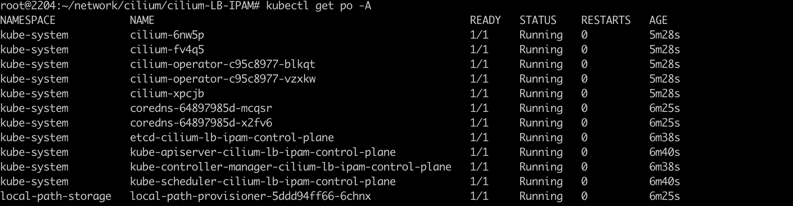
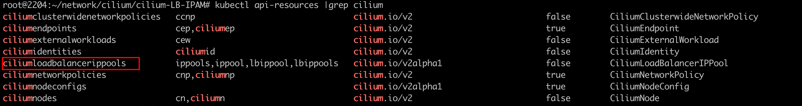
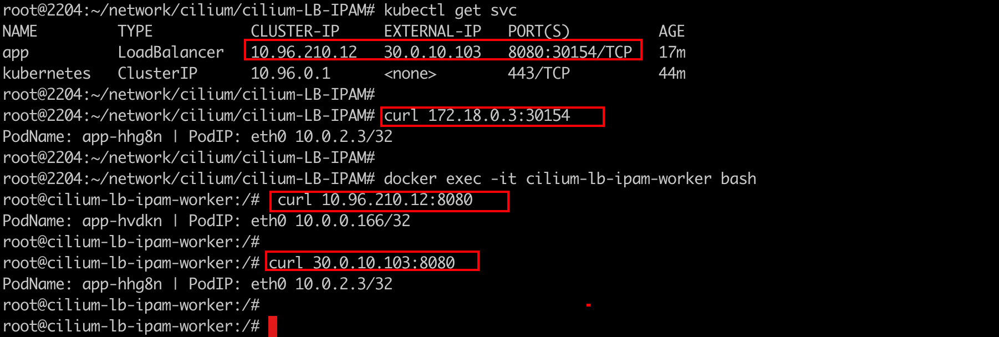

### 一： Cilium LB IPAM概念说明

参考官方文档: https://docs.cilium.io/en/stable/network/lb-ipam/#lb-ipam

- LB IPAM（LoadBalancer IP Address Management） 允许 Cilium 将 IP 地址分配给 LoadBalancer 类型的服务;

  在公有云环境中，LB地址通常由云厂商提供。然而在私有云环境中，我们就需要借助其他工具实现了。

- LB IPAM 通常与 Cilium BGP 等功能结合使用。其中 LB IPAM 负责将 IP 分配和指派给service对象，BGP负责将这些 IP 通告出去

- LB IPAM 只会分配LB地址，不负责路由，无论是集群内还是集群外都无法访问该地址。需要借助其他方案例如metallb或者通过cilium BGP将地址宣告出去，这样外界网络里这个地址就是可路由了

- Cilium BGP 将service LB的ip地址宣告出去（更加符合k8s理念）。不同的是 在Calico中，通过BGP是将clusterIP宣告出去的。

  


### 二：Cilium LB IPAM 环境搭建

依旧采用kind快速搭建k8s集群

```shell
#1-setup-env.sh
#! /bin/bash
date
set -v

# 1.prep nocNI env
cat <<EOF |kind create cluster --name=cilium-lb-ipam --image=kindest/node:v1.23.4  --config=-
kind: Cluster
apiVersion: kind.x-k8s.io/v1alpha4
networking:
  disableDefaultCNI: true  #kind 默认使用rancher cni，我们不需要该cni
  kubeProxyMode: "none"
nodes:
  - role: control-plane
  - role: worker
  - role: worker
  
EOF

# 2. remove taints
controller_node=`kubectl get nodes --no-headers -o custom-columns=NAME:.metadata.name |grep control-plane`
kubectl taint nodes $controller_node node-role.kubernetes.io/master:NoSchedule-
kubectl get nodes -owide

# 3.  install cni
helm repo add cilium  https://helm.cilium.io > /dev/null 2>&1
helm repo update > /dev/null  2>&1


helm  install cilium  cilium/cilium --set k8sServiceHost=$controller_node --set k8sServicePort=6443 --version 1.13.0-rc5 --namespace kube-system --set debug.enabled=true --set debug.verbose=datapath --set monitorAggregation=none --set ipam.mode=cluster-pool --set cluster.name=cilium-lb-ipam --set kubeProxyReplacement=strict --set autoDirectNodeRoutes=true --set ipv4NativeRoutingCIDR=10.0.0.0/8 --set tunnel=disabled --set bpf.masquerade=true --set installNoConntrackIptablesRules=true

#4. install necessary tools
for i in $(docker ps -a --format "table {{.Names}}" |grep cilium-lb-ipam)
do
                echo $i
                #docker cp ./bridge $i:/opt/cni/bin/
                docker cp /usr/bin/ping $i:/usr/bin/ping
                docker exec -it $i bash -c "sed -i -e  's/jp.archive.ubuntu.com\|archive.ubuntu.com\|security.ubuntu.com/old-releases.ubuntu.com/g' /etc/apt/sources.list"
                docker exec -it $i bash -c "apt-get -y update > /dev/null && apt-get -y install net-tools tcpdump lrzsz > /dev/null 2>&1"
done
```


其实LB IPAM在安装cilium的时候，这个feature不需要特别的配置。能正常启动即可。



主要是依赖集群中相关crd规则的编写（CiliumLoadBalancerIPPool）




### 三：创建LB ippool

LB IPAM 具有 IP 池的概念，管理员可以创建该规则来告诉 Cilium 可以使用哪些 IP 范围来给service LB分配 IP;(支持双栈)

```yaml
apiVersion: "cilium.io/v2alpha1"
kind: CiliumLoadBalancerIPPool
metadata:
  name: "blue-pool"
spec:
  cidrs:
  - cidr: "20.0.10.0/24"
  serviceSelector:
    matchExpressions:
      - {key: color, operator: In, values: [blue, cyan]}
---
apiVersion: "cilium.io/v2alpha1"
kind: CiliumLoadBalancerIPPool
metadata:
  name: "red-pool"
spec:
  cidrs:
  - cidr: "30.0.10.0/24"
  serviceSelector:
    matchLabels:
      color: red

```

IP 池有一个可选的 `.spec.serviceSelector` 字段，允许管理员使用标签选择器限制哪些服务可以从哪些池获取 IP。


### 四： 创建service验证是否分配LB IP

```yaml
#nettool.yaml
apiVersion: v1
kind: Service
metadata:
  name: app
  labels: 
    color: red
spec:
  type: LoadBalancer
  selector: 
    app: app
  ports:
  - name: app
    port: 8080
    targetPort: 80
    
---
apiVersion: apps/v1
kind: DaemonSet
metadata:
  name: app
  labels:
    app: app
spec:
  selector:
    matchLabels:
      app: app
  template:
    metadata:
      labels:
        app: app
    spec:
      containers:
      - name: nettool
        image: burlyluo/nettool
        securityContext:
          privileged: true


```

可以发现svc 的LB地址已经被分配对应ip池中的lb 地址


但是仅限于给loadbalancer分配一个地址，该地址目前还不可用，需要借助BGP宣告出去。

ps：我们之前自建k8s集群经常遇到安装开源的项目时候，service的external-ip会出现pending 状态。其实我们就可以通过MetalLb(L2/BGP),或者cilium lb ipam特性来解决


访问测试: 集群内可以访问这个 LB ip




学习完了LB IPAM， 接下来就需要提前预习下 BGP control plane了。。
