### 一：Cilium  Host Routing 模式 native routing with eBPF 

cilium 高级模式，高级特性全部开启，推荐学习使用此种模式

关于DataPath ,主要是要 掌握

1.  TC from-container 

2. TC to-container

3. TC to-netdev

4. TC from-netdev

   

### 二： 环境准备

1. 安装脚本

   ```shell
   #1-setup-env.sh
   #! /bin/bash
   date
   set -v
   
   # 1.prep nocNI env
   cat <<EOF |kind create cluster --name=cilium-kubeproxy-replacement-ebpf --image=kindest/node:v1.23.4  --config=-
   kind: Cluster
   apiVersion: kind.x-k8s.io/v1alpha4
   networking:
     disableDefaultCNI: true  #kind 默认使用rancher cni，我们不需要该cni
     kubeProxyMode: "none"  #不使用kube-proxy
     
   nodes:
     - role: control-plane
     - role: worker
     - role: worker
    
   containerdConfigPatches:
   - |-
     [plugins."io.containerd.grpc.v1.cri".registry.mirrors."192.168.186.131:5000"]
       endpoint = ["http://192.168.186.131:5000"]
     
   EOF
   
   # 2. remove taints
   controller_node=`kubectl get nodes --no-headers -o custom-columns=NAME:.metadata.name |grep control-plane`
   kubectl taint nodes $controller_node node-role.kubernetes.io/master:NoSchedule-
   kubectl get nodes -owide
   
   # 3.  install cni
   helm repo add cilium  https://helm.cilium.io > /dev/null 2>&1
   helm repo update > /dev/null  2>&1
   
   #Direct Routing Options(--set kubeProxyReplacement=strict --set tunnel=disabled --set autoDirectNodeRoutes=true --set ipv4NativeRoutingCIDR="10.0.0.0/8" --set bpf.masquerade=true)
   helm  install cilium  cilium/cilium --set k8sServiceHost=$controller_node --set k8sServicePort=6443 --version 1.13.0-rc5 --namespace kube-system --set dubug.enabled=true --set dubug.verbose=datapath --set monitorAggregation=none --set ipam.mode=cluster-pool --set cluster.name=cilium-kubeproxy-replacement-ebpf --set kubeProxyReplacement=strict --set tunnel=disabled --set autoDirectNodeRoutes=true --set ipv4NativeRoutingCIDR="10.0.0.0/8" --set bpf.masquerade=true
   
   #4. install necessary tools
   for i in $(docker ps -a --format "table {{.Names}}" |grep cilium-kubeproxy-replacement-ebpf)
   do
                   echo $i
                   #docker cp ./bridge $i:/opt/cni/bin/
                   docker cp /usr/bin/ping $i:/usr/bin/ping
                   docker exec -it $i bash -c "sed -i -e  's/jp.archive.ubuntu.com\|archive.ubuntu.com\|security.ubuntu.com/old-releases.ubuntu.com/g' /etc/apt/sources.list"
                   docker exec -it $i bash -c "apt-get -y update > /dev/null && apt-get -y install net-tools tcpdump lrzsz > /dev/null 2>&1"
   done
   ```


2. demo 部署

   `kubectl apply -f cni-demo.yaml`

   ```yaml
   #cni-demo.yaml
   apiVersion: apps/v1
   kind: DaemonSet
   metadata:
     name: cilium-with-kubeproxy
     labels:
       app: cilium-with-kubeproxy
   spec:
     selector:
       matchLabels:
         app: cilium-with-kubeproxy
     template:
       metadata:
         labels:
           app: cilium-with-kubeproxy
       spec:
         containers:
         - name: cilium-with-kubeproxy
           image: 192.168.186.131:5000/nettool:latest
           securityContext:
             privileged: true
   ---
   apiVersion: v1
   kind: Service
   metadata:
     name: cilium-with-kubeproxy
   spec:
     type: NodePort
     selector: 
       app: cilium-with-kubeproxy
     ports:
     - name: cilium-with-kubeproxy
       port: 8080
       targetPort: 80
       nodePort: 32000
   ```

3.  手动启动一个pod

   	`kubectl run cni --image=192.168.186.131:5000/nettool`

   

   

4. 确认环境是否就绪

   `kubectl get po -A -owide`

   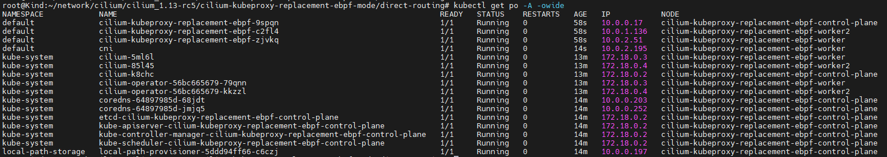 


### 三 ： 同节点pod 通信如何实现的

节点网卡信息

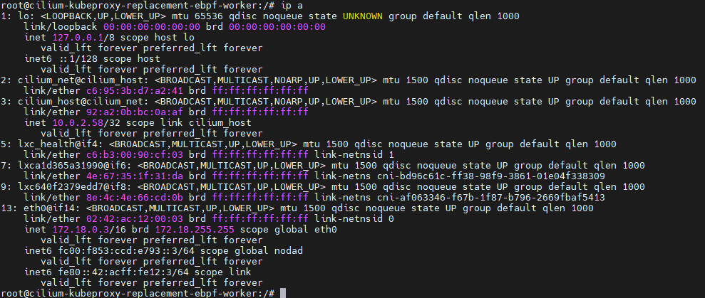 

1. pod ping 测

   源：     podName: cni                                                                 |  podIP: 10.0.2.195  | node:cilium-kubeproxy-replacement-ebpf-worker

   目标：  podName: cilium-kubeproxy-replacement-ebpf-zjvkq    | podIP:10.0.2.51     |  node:cilium-kubeproxy-replacement-ebpf-worker

   `kubectl  exec -it cni -- ping  10.0.2.51 -c 1 `

   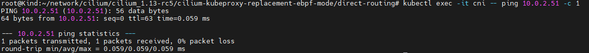 

   

2. 节点上抓包

   抓包位置为 cni pod eth0网卡对应的节点上的veth pair ：`kubectl exec -it cni -- ethtool -S eth0` 即 `lxc640f2379edd7` 网卡

   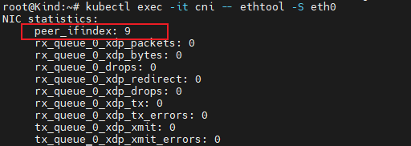 

   抓包命令: `tcpdump -pne -i lxc640f2379edd7` 

   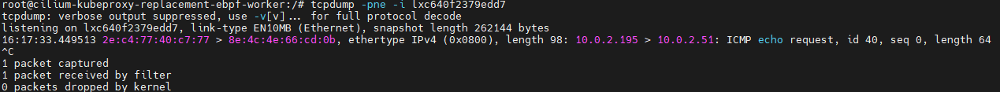 

   

    **现象： 我们看到抓包信息，虚拟网卡lxc上只有ICMP 的 request, 没有reply。 但是ping 通一个地址，必须有request 和reply。**

   

3.  源pod 上 eth0网卡上进行 抓包

   	`kubectl exec -it cni -- tcpdump -pne -i eth0`

   	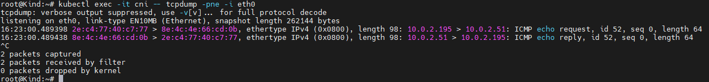  

   	现象： 在pod内可以看到request 和reply 信息。 ICMP reply 数据包没有通过宿主机的lxc 网卡回来。感觉就像目标pod直接reply 给源pod一样

   	**其实这就是通过 bpf_redirect_peer helper 函数实现的，cilium 在lxc 网卡上挂了一个 tc hook，然后调用bpf_redirect_peer 函数, 跳到pod内的eth0网卡**

   	(当节点内核 kernel >= 5.10  则 tc hook 调用的是bpf_redirect_peer 函数; 当节点内核 kernel < 5.10 则 tc hook 调用的是 bpf_redirect() )

   	可参考 该图

   	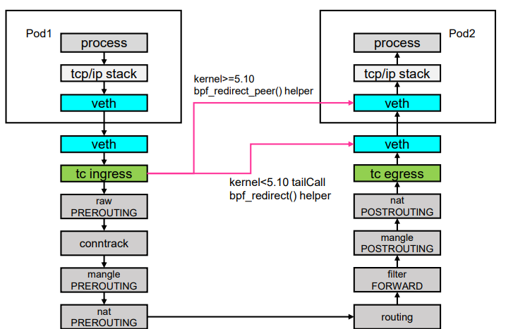 

   	**pod1 和pod2 的lxc 网卡，都只能收到ICMP 数据包信息的一半**

   	(pod1 lxc 网卡发数据包信息 不发给 pod2 的lxc网卡，那pod2 也用同样的态度对待pod1  )


### 四： 跨节点pod通信如何实现的

跨节点pod通信，还借助了bpf_redirect_neigh()函数，可以从pod eth0网卡的vethpair网卡lxc 直接跳到 节点上的物理网卡;

**这样做有什么好处呢？ 少经过一次宿主机上的iptables netfilter框架的处理，所以就会少一次上下文的切换，少一次拷贝, 少一次中断。进而提高数据转发的效率**

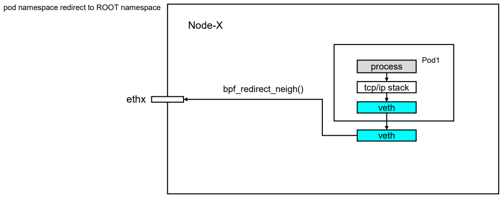 

1. 跨节点pod ping 测

   src ： podIP：  10.0.2.195    ||     node：cilium-kubeproxy-replacement-ebpf-worker   

   dst ： podIP：  10.0.1.136    ||    node: cilium-kubeproxy-replacement-ebpf-worker2 

   `kubectl exec -it cni -- ping 10.0.1.136 -c 1`  

   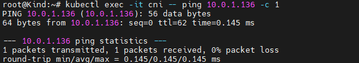 

   

   

2.  cilium-kubeproxy-replacement-ebpf-worker   节点进行抓包分析

   	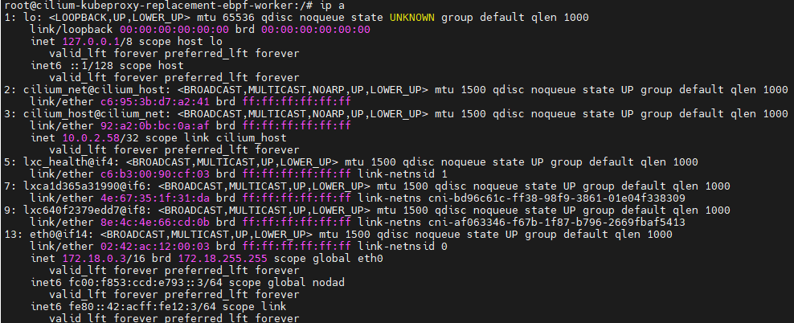 

   	首先对 物理网卡 eth0  进行抓包 `tcpdump -pne -i eth0 icmp`： 可以发现 数据包的request reply 信息，这是没有问题的，ebpf的跳转是在 lxc网卡进行的

   	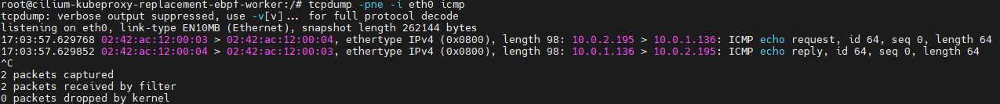

   	对虚拟网卡 `lxc640f2379edd7` 进行抓包: `tcpdump -pne -i lxc640f2379edd7 icmp` : 可以发现 只有request 的数据包信息，tc hook 调用bpf_redirect_peer 函数直接将reply 数据包传递给pod内的eth0 网卡了

   	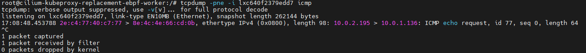

   	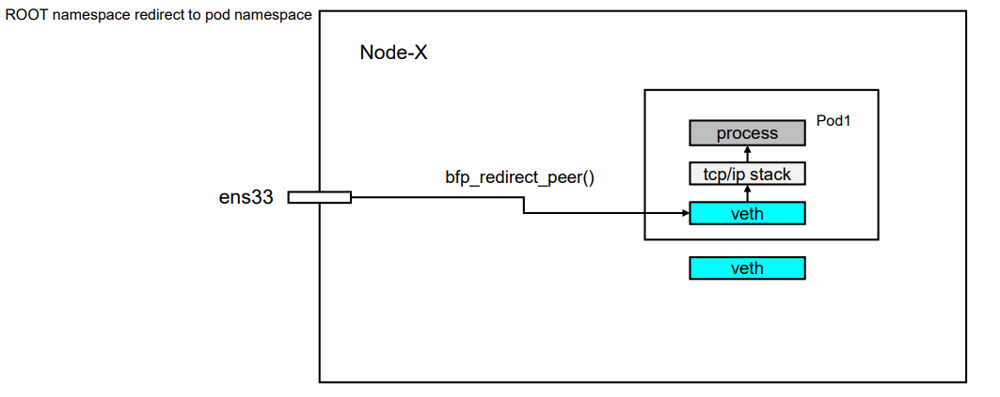 

3. cilium-kubeproxy-replacement-ebpf-worker2  节点抓包分析

   节点网卡信息: 

   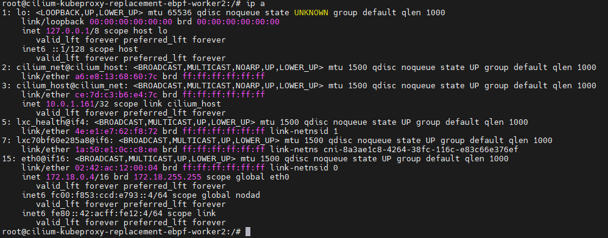 

   首先对eth0 网卡进行抓包分析: `tcpdump -pne -i eth0 icmp`： icmp的request reply 数据包信息均经过该网卡

   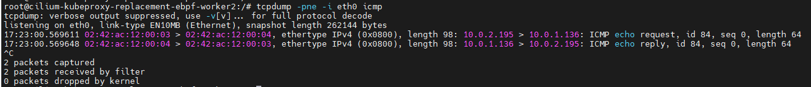 

   

   对 lxc 网卡进行抓包分析:  `tcpdump -pne -i lxc70bf60e285a8 icmp`   ： 只有icmp 的reply 数据包，符合预期，因为宿主机的eth0 网卡直接将request 数据包传递给pod ns中的eth网卡了

   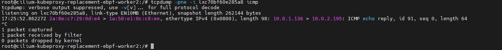


### 五： eBPF  Host-Routing

可以登录 cilium pod 查看 host-routing 的状态： 应为BPF

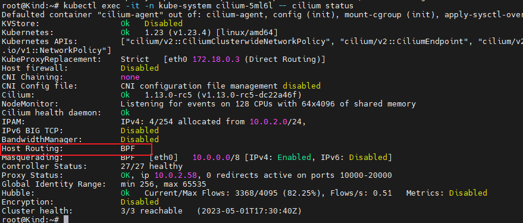 


节点与节点之间通信所需的整个网络处理路径，在容器通信场景下也是如此，只不过是在容器的网络命名空间内（深蓝色方框）。

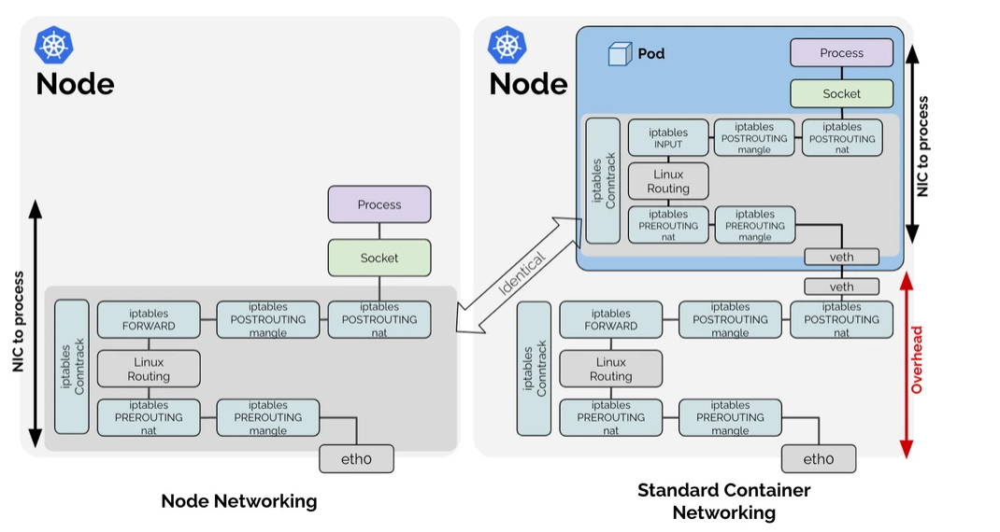 

我们通过上图可以看到： 相比 节点网络，标准的容器网络多了红色线条部分的额外开销，正是这部分开销会导致容器之间通信效率 低于节点


所以cilium 做了什么？ **Breaking the Rules: eBPF Host-Routing**

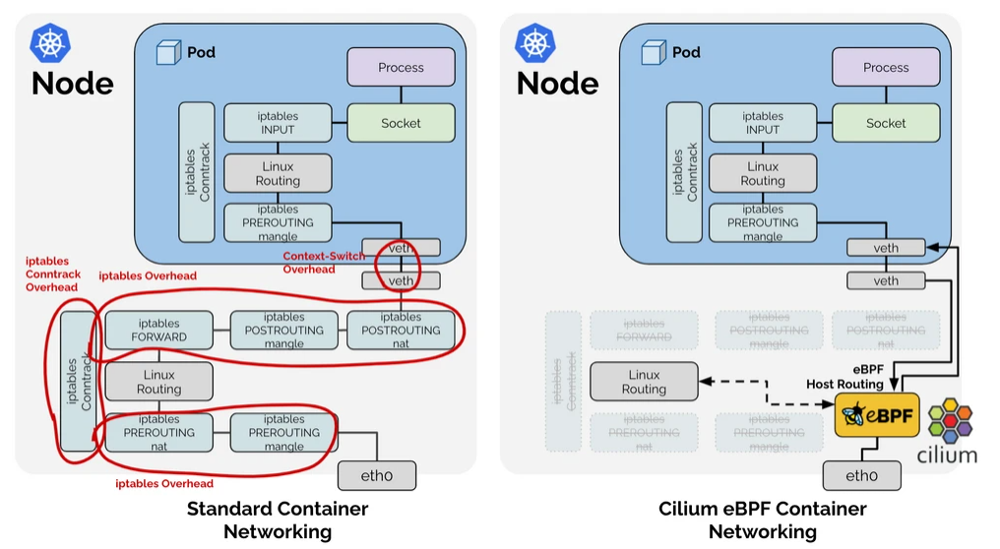  

eBPF Host Routing 允许pod 数据包绕过host namespace的所有iptables和上层堆栈的开销，以及通过veth pair时的一些上下文切换开销


### 六 ：补充： ebpf  host routing在 service 场景下如何运行的

大概原理是在 pod 内的 eth0 网关上 挂了一个tc hook ，然后根据bpf map 返回对应的后端ip加端口。不同于kube-proxy 的 iptable 只能在 3层或者4层进行操作，cilium host routing可以实现一个7层的治理。

1.  容器内访问 nodeport  svc

   	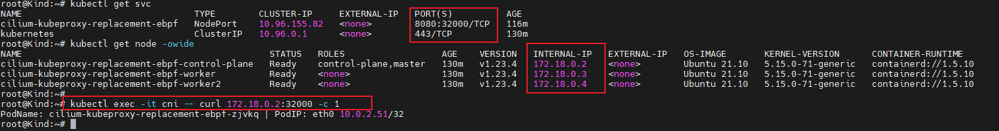

2.  对容器的eth0 进行抓包

   	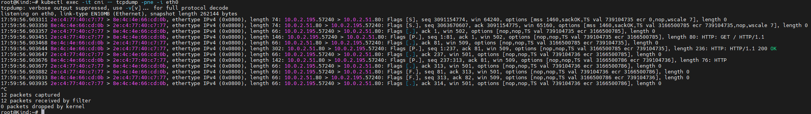 

   对抓包数据进行分析: 三次握手阶段，就可以看到目的地址 已经是 后端pod ip加端口了，并不是所谓的nodeip 和32000端口，没有经过宿主机 ns跳转。

   

    

   