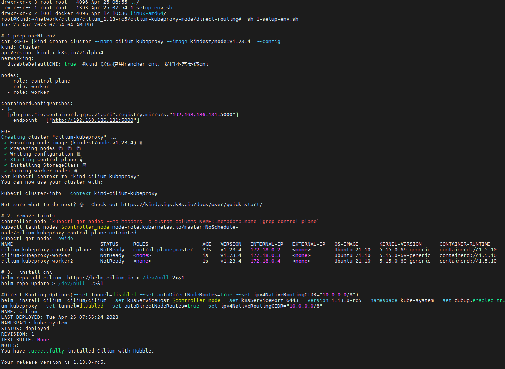
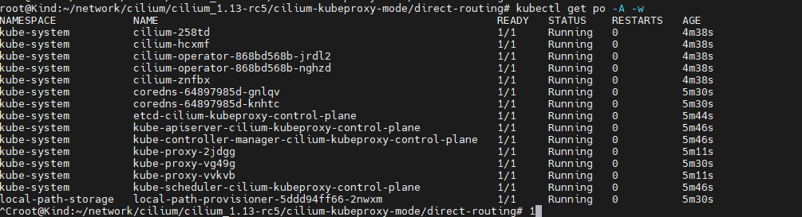
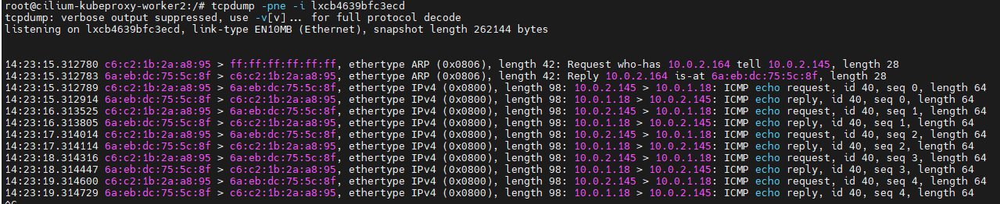

### 一： native routing with kubeproxy

这种模式最为通用，简单方便，效率还可以，几乎所有cni都支持这种backend,类似于flannel 的host-gateway模式

 

 

由于cilium 默认是vxlan模式运行，如果需要开启该模式，需要一些额外的配置:

 


### 二： 环境准备

```shell
#1-setup-env.sh
#! /bin/bash
date
set -v

# 1.prep nocNI env
cat <<EOF |kind create cluster --name=cilium-kubeproxy --image=kindest/node:v1.23.4  --config=-
kind: Cluster
apiVersion: kind.x-k8s.io/v1alpha4
networking:
  disableDefaultCNI: true  #kind 默认使用rancher cni，我们不需要该cni
  
nodes:
  - role: control-plane
  - role: worker
  - role: worker
 
containerdConfigPatches:
- |-
  [plugins."io.containerd.grpc.v1.cri".registry.mirrors."192.168.186.131:5000"]
    endpoint = ["http://192.168.186.131:5000"]
  
EOF

# 2. remove taints
controller_node=`kubectl get nodes --no-headers -o custom-columns=NAME:.metadata.name |grep control-plane`
kubectl taint nodes $controller_node node-role.kubernetes.io/master:NoSchedule-
kubectl get nodes -owide

# 3.  install cni
helm repo add cilium  https://helm.cilium.io > /dev/null 2>&1
helm repo update > /dev/null  2>&1

#Direct Routing Options(--set tunnel=disabled --set autoDirectNodeRoutes=true --set ipv4NativeRoutingCIDR="10.0.0.0/8")
helm  install cilium  cilium/cilium --set k8sServiceHost=$controller_node --set k8sServicePort=6443 --version 1.13.0-rc5 --namespace kube-system --set dubug.enabled=true --set dubug.verbose=datapath --set monitorAggregation=none --set ipam.mode=cluster-pool --set cluster.name=cilium-kubeproxy --set tunnel=disabled --set autoDirectNodeRoutes=true --set ipv4NativeRoutingCIDR="10.0.0.0/8"

#4. install necessary tools
for i in $(docker ps -a --format "table {{.Names}}" |grep cilium-kubeproxy)
do
                echo $i
                #docker cp ./bridge $i:/opt/cni/bin/
                docker cp /usr/bin/ping $i:/usr/bin/ping
                docker exec -it $i bash -c "sed -i -e  's/jp.archive.ubuntu.com\|archive.ubuntu.com\|security.ubuntu.com/old-releases.ubuntu.com/g' /etc/apt/sources.list"
                docker exec -it $i bash -c "apt-get -y update > /dev/null && apt-get -y install net-tools tcpdump lrzsz > /dev/null 2>&1"
done
```

**集群创建成功** 

**cilium cni应用成功**

 

可以通过`cilium status`查看cilium参数信息

 


### 三：部署demo体验cilium cni

demo应用如下

`kubectl apply -f cni-demo.yaml`

```shell
#cni-demo.yaml
apiVersion: apps/v1
kind: DaemonSet
metadata:
  name: cilium-with-kubeproxy
  labels:
    app: cilium-with-kubeproxy
spec:
  selector:
    matchLabels:
      app: cilium-with-kubeproxy
  template:
    metadata:
      labels:
        app: cilium-with-kubeproxy
    spec:
      containers:
      - name: cilium-with-kubeproxy
        image: 192.168.186.131:5000/nettool:latest
        securityContext:
          privileged: true
---
apiVersion: v1
kind: Service
metadata:
  name: cilium-with-kubeproxy
spec:
  type: NodePort
  selector: 
    app: cilium-with-kubeproxy
  ports:
  - name: cilium-with-kubeproxy
    port: 8080
    targetPort: 80
    nodePort: 32000
```

为了验证cilium cni 是如何进行同节点pod 和跨节点pod 是如何通信的，可以先手动run 一个pod `kubectl run cni --image=192.168.186.131:5000/nettool`


### 四： 解析cilium kubeproxy 模式下**同节点pod**是如何通信的

 

源pod：    IP地址：`10.0.1.45` ||  MAC 地址：` c6:c2:4a:cb:e6:e5`

目标pod： IP 地址：`10.0.1.87` || MAC 地址： `a6:90:ae:3d:6d:f1`

1. `kubectl exec -it cni bash`  查看IP 信息

    

   **cni pod 与同节点pod  `cilium-with-kubeproxy-gvdrg` ip为`10.0.1.87` 均为32为掩码，我们知道32位掩码的pod 和任意地址的pod都不在同一个网段内，既然这两个pod不在同一个网段内，就没办法走二层网络互通，所以就必须通过三层经过路由的方式进行通信**

2. 因为需要基于路由的方式进行互通，所以需要查询该pod 的路由表

   `ip route show`  或者 `route -n ` 均能查看

    

   有两条路由规则: 默认路由(全局路由) 和 交换路由（没有网关的路由）在该示例中主要是为了告知如何前往10.0.1.83这个地址的

   

3. 查看这两个pod的宿主机node节点的路由规则

   我们知道同节点pod通信时，第一跳是：从pod的名称空间 到宿主机的 名称空间，所以查看pod宿主机的ip信息

    

   刚在在pod 中查看路由规则时，得知pod需要通过`10.0.1.83`这个地址进行寻址，对应宿主机`cilium_host`这个网卡接口，即所有流量从pod里出来到宿主机都需要经过这个地址。

   `cilium_host`  ip地址为：`10.0.1.83/32`  || mac地址为：`c2:6d:cc:b4:2d:b7`

   

4. pod ping 测查看报文走向

   从 `cni` pod  arping 测 `cilium-with-kubeproxy-gvdrg` pod

    

   我们看到 回包时候 有dst ip 和dst mac；dstip 为ping测的pod ip，但是我们发现 dst mac地址并非 ping 测目的pod mac地址，

   也不是上面说的网关`cilium_host` 的mac地址

   

   宿主机上执行 `ip a |grep "52:78:72:f7:e4:33" -C 1` 查看发现是 `lxc135b0eb56f67` 这个网卡的mac地址

    

   

   同时根据以上信息 还发现 这个宿主机上这个网卡的peer index是10

    

    查看源pod的网卡

    

   

   **很明显 宿主机上的 `lxc135b0eb56f67`网卡  和 源pod上的`eth0` 网卡形成了 veth pair**


5. 结论

    

   cilium 在回ARP reply包的时候，将veth pair中的 MAC 作为目标地址回过来了(即 root ns 中的 lxc-nic-mac)，而非网关MAC

   正常流程： pod 发出报文 >> 期望去往的地址是(第一跳地址)`10.0.1.83/32`,期望解析的mac地址也是该网卡的mac地址

   但是回包的确是 `ROOT ns  lxc MAC`,

   这说明了 这个流程中 数据包packet被某种逻辑劫持了，**这种劫持在cilium中就是通过ebpf 来实现的**（ebpf Hook）
   
   
   
   

### 五： 解析cilium kubeproxy 模式下**跨节点pod**是如何通信的

 

**源pod**  :       podIP :10.0.2.145    MAC: c6:c2:1b:2a:a8:95    宿主节点: cilium-kubeproxy-worker2

源pod 对应的网卡信息：

  

宿主节点对应的网卡信息：

 


**目标pod** ：  podIP: 10.0.1.18       MAC: 2a:a2:99:69:44:71   宿主节点：cilium-kubeproxy-worker

目标pod对应的网卡信息：

 

宿主节点对应的网卡信息：

 


1. 进行ping 测 (**10.0.2.145**  ping  **10.0.1.18**)

   `kubectl exec -it cni -- ping 10.0.1.18`

    

   

2.  抓包验证，抓包位置为 源pod 网卡eth0对应 的 vethpair，也即 cilium-kubeproxy-worker2 节点上的 lxcb4639bfc3ecd 网卡

   `tcpdump -pne -i lxcb4639bfc3ecd `
   
    
   
   **源ip 和目的ip 都没有变化**
   
   **源mac 为pod eth0 的mac地址**
   
   **目的mac 为 宿主节点上的lxcb4639bfc3ecd 网卡 对应的mac地址**
   
   
   
3. 抓包验证，抓包位置为目标pod 网卡eth0对应 的 vethpair，也即 cilium-kubeproxy-worker 节点上的 lxc370217a44cfe 网卡

    


