### 一：Cilium WireGuard 方案架构


在 cilium 1.10 版本中，通过 WireGuard 协议添加了对透明加密的支持。透明加密是一项实用的功能，可确保 Cilium 管理的 Pod 之间的流量始终通过安全隧道发送，从而允许用户在不受信任的网络中运行 Kubernetes。

自 1.4 版本起，Cilium 就已经支持通过 IPSec 进行透明加密，但出于多种原因，在1.10版本添加 WireGuard 作为替代选项。首先，WireGuard 是一个非常有原则的协议，不允许调整密钥大小和密码套件等参数，这使得它非常易于使用并简化了部署和操作。每个节点的加密密钥对由 Cilium 自动生成，密钥轮换由 WireGuard 内核模块透明地执行

相比IPSec，WireGuard 可以为流式工作负载实现更高的吞吐量，但 IPSec 仍然可以实现更低的延迟。WireGuard的另一个技术优势是它能很好地整合到Cilium数据通道的架构中，这是因为安全通道作为一个linux网络接口设备暴露，对来自容器的数据包进行加密标记，并随后将其转发到安全隧道设备，WireGuard使这一切变得很容易，

### 二：Cilium WireGuard 环境搭建

1. 采用kind搭建集群环境，配置文件如下

   ```shell
   #1-setup-env.sh
   #! /bin/bash
   date
   set -v
   
   # 1.prep nocNI env
   cat <<EOF |kind create cluster --name=cilium-wireguard --image=kindest/node:v1.23.4  --config=-
   kind: Cluster
   apiVersion: kind.x-k8s.io/v1alpha4
   networking:
     disableDefaultCNI: true  #kind 默认使用rancher cni，我们不需要该cni
     #kubeProxyMode: "node" #Enable the kubeProxy
     
   nodes:
     - role: control-plane
     - role: worker
     - role: worker
     
   EOF
   
   # 2. remove taints
   controller_node=`kubectl get nodes --no-headers -o custom-columns=NAME:.metadata.name |grep control-plane`
   kubectl taint nodes $controller_node node-role.kubernetes.io/master:NoSchedule-
   kubectl get nodes -owide
   
   # 3.  install cni
   helm repo add cilium  https://helm.cilium.io > /dev/null 2>&1
   helm repo update > /dev/null  2>&1
   
   kubectl create -n kube-system secret generic cilium-wireguard-keys --from-literal=keys="3 rfc4106(gcm(aes)) $(echo $(dd if=/dev/urandom count=20 bs=1 2> /dev/null | xxd -p -c 64)) 128"
   
   helm  install cilium  cilium/cilium --set k8sServiceHost=$controller_node --set k8sServicePort=6443 --version 1.13.0-rc5 --namespace kube-system --set debug.enabled=true --set debug.verbose=datapath --set monitorAggregation=none --set ipam.mode=cluster-pool --set cluster.name=cilium-wireguard --set tunnel=disabled --set autoDirectNodeRoutes=true --set ipv4NativeRoutingCIDR="10.0.0.0/8" --set encryption.enabled=true --set encryption.type=wireguard --set l7Proxy=false
   
   #4. install necessary tools
   for i in $(docker ps -a --format "table {{.Names}}" |grep cilium-wireguard)
   do
                   echo $i
                   #docker cp ./bridge $i:/opt/cni/bin/
                   docker cp /usr/bin/ping $i:/usr/bin/ping
                   docker exec -it $i bash -c "sed -i -e  's/jp.archive.ubuntu.com\|archive.ubuntu.com\|security.ubuntu.com/old-releases.ubuntu.com/g' /etc/apt/sources.list"
                   docker exec -it $i bash -c "apt-get -y update > /dev/null && apt-get -y install net-tools tcpdump lrzsz > /dev/null 2>&1"
   done
   ```
   
   

2. 确认部署状态

   `kubectl get po -A`

   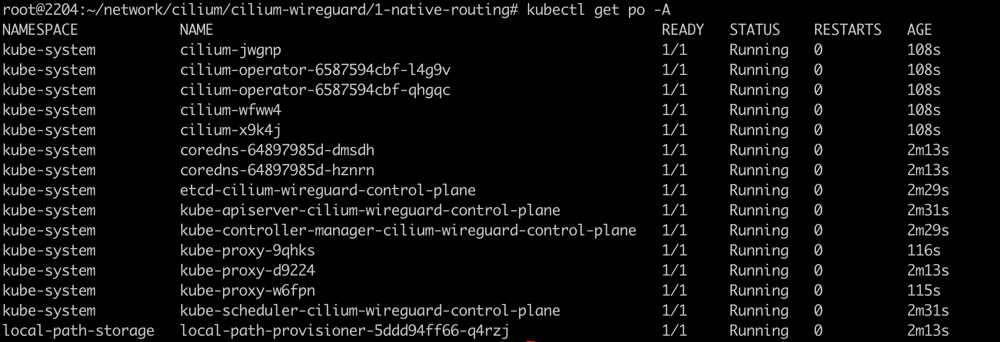


### 三：Cilium WireGuard 特性分析

1. 查看node节点网卡信息

   `ip -d link show`,可以发现cilium_wg0网卡是个wireguard设备，其中有个`NOARP` 标志，表示此接口没有地址解析协议 (address resolution protocol, ARP)，该协议适用于没有广播地址的设备的所有接口。此标志特定于 IPv4。

   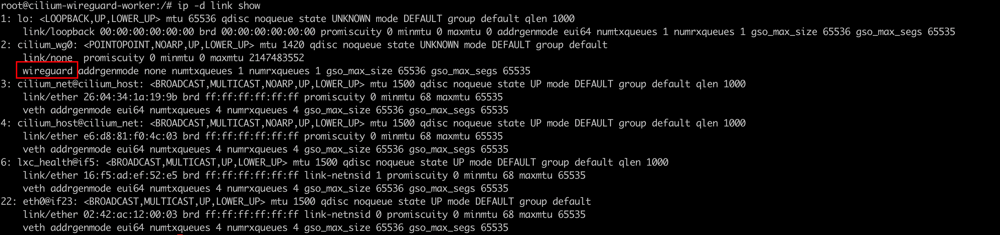

2. 在cilium环境中，如果想对流量包进行封装加密，势必需要将该流量包引入到对应的设备上来(cilium_wg0)。

   `route -n 查看节点路由策略` 

   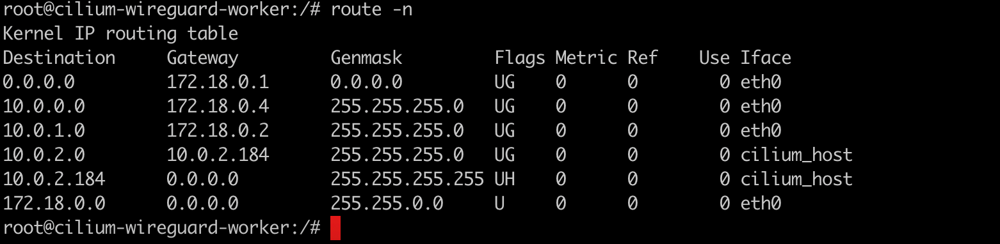

   并未发现wireguard相关设备接口，那该怎么实现数据包封装呢？基于目的地址路由看起来是不行的。

   

3. 那么cilium_wg0是否是基于源地址路由策略的呢？（SBR）

   `ip rule show`

   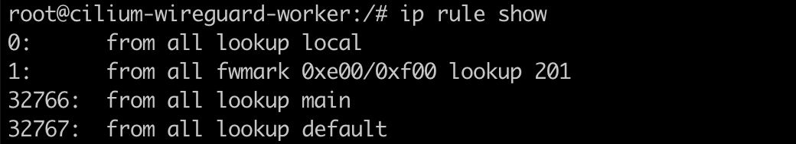

   可以看到 除了三个默认的规则，多了一条tid为`201`的规则。

   

4. 安装wireguard工具

   `apt-get install wireguard-tools`

   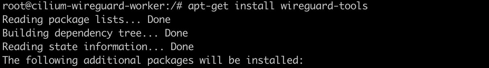

   `wg` 命令可以发现存在两个peer对，因为是三节点集群，存在两个peer是正常的,对端节点分别是：`172.18.0.4 172.18.0.2`

   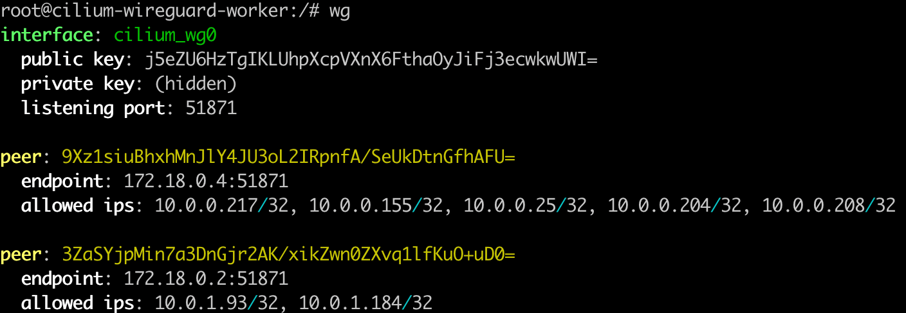

   这些字段分别表示：

   peer列表，自己的公钥和私钥，UDP监听端口。对端peer公钥，对端允许的ip列表

   

   `wg show cilium_wg0 fwmark`

   

   

5. `ip r s t 201` 查看sbr路由

   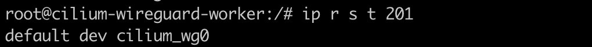

   这个源地址路由表达的意思： cilium_wg0 是默认的路由接口设备


### 四：Cilium WireGuard 流量走向分析

1. 对节点上的eth0进行抓包

   `tcpdump -pne -i eth0 -w cilium-wireguard.cap`

   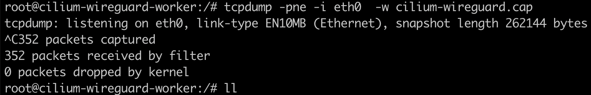

   

2. 进行pod间的流量ping测

   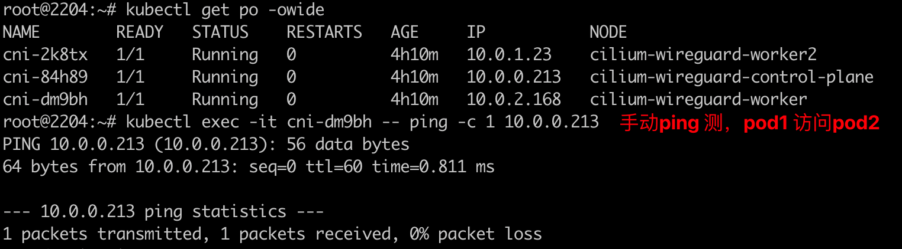

3. 分析数据包

   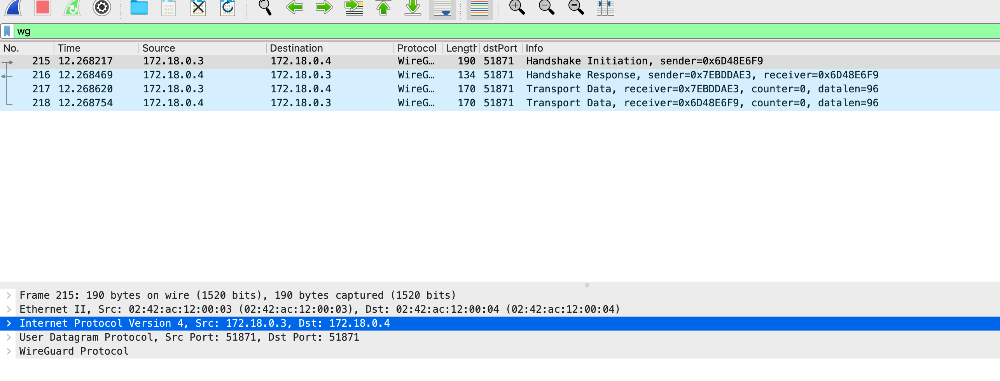

   可以看到握手阶段的数据包，以及icmp的request和response信息。同时也能看到数据包的外层srcip和dstip。

   由于数据包进行wireguard加密了，无法解密，所以看不到内部ip。

   

4. 数据包在传输时，怎么知道哪些ip是否需要进行加密处理呢？

   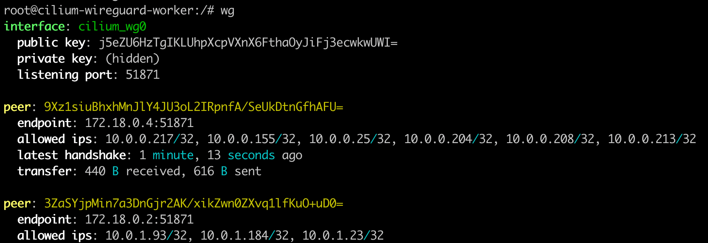

   allowed ips 这一行描述了对端节点上的pod。当有流量经过cilium_wg0时，会判断目的地址是否在对端的允许ip列表中。

   

   

5. 流量走线图

   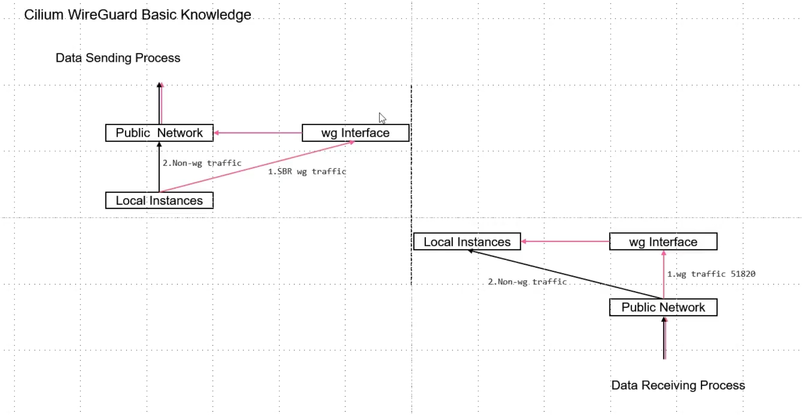

   当有数据包过来需要进行封装和解封装，如何判断该数据包是否是cilium_wg的呢？

   wireguard网卡子接口在linux内核上有UDP的监听端口


 