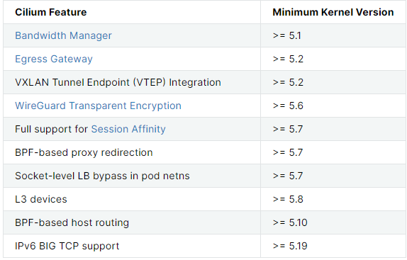

### 一：cilium 介绍

聚焦 网络,可观测性，安全

 

- Cilium 底层是基于 Linux 内核的新技术 [eBPF](https://jimmysong.io/kubernetes-handbook/GLOSSARY.html#ebpf)，可以在 Linux 系统中动态注入强大的安全性、可见性和网络控制逻辑。
-  Cilium 基于 [eBPF](https://jimmysong.io/kubernetes-handbook/GLOSSARY.html#ebpf) 提供了多集群路由、替代 kube-proxy 实现负载均衡、透明加密以及网络和服务安全等诸多功能。
- 除了提供传统的网络安全之外，[eBPF](https://jimmysong.io/kubernetes-handbook/GLOSSARY.html#ebpf) 的灵活性还支持应用协议和 DNS 请求/响应安全。
- 同时，Cilium 与 Envoy 紧密集成，提供了基于 Go 的扩展框架。因为 [eBPF](https://jimmysong.io/kubernetes-handbook/GLOSSARY.html#ebpf) 运行在 Linux 内核中，所以应用所有 Cilium 功能，无需对应用程序代码或容器配置进行任何更改。

本次安装以1.13 version 的cilium为例

cilium 的各种高级特性需要依赖于linux 内核版本。本试验均采用的ubuntu20.04 os 内核版本为5.15,基本能满足试验所有的cilium特性

 


### 二： cilium 安装模式介绍

大概可分为3种安装方向：

1. **cilium-kubeproxy-mode**

   最基础的方案，类似于传统cni,使用内核协议栈的方式进行数据包的分发；

   如果内核不支持cilium各种特性，仍然还要使用cilium,建议使用此种安装方案

   

2. **cilium-kubeproxy-replacement-mode**

   不使用kube-proxy。在kubeadm 中就是kubeproxy free

3. **cilium-kubeproxy-replacement-ebpf-mode**

   完全体ebpf能力；

   在Cilium 1.9中引入了基于eBPF的 Host Routing，可以完全绕过iptables和上层主机堆栈，并且与常规的veth设备操作相比，实现了更快的网络命名空间切换

    
   
   内核弊端：
   
   - 中断处理: 当网络中大量数据包到来时，会频繁产生中断请求，频繁的中断会产生较高的性能开销，并造成上下文的切换产生时延
   - 内存拷贝: 网络数据包到来时，网卡通过DMA 等拷贝到内核缓冲区，内核协议栈再从协议空间拷贝到用户态空间，在Linux内核协议栈中，这个耗时操作甚至占到了数据包整个处理流程的57.1%
   - 局部性失效: 目前主流处理器都是多个CPU核心的，这意味着一个数据包的处理可能跨多个CPU核心；比如：一个数据包中断可能在cpu0，内核态处理是在cpu1，用户态处理是在cpu2，这样跨多个核心，容易造成CPU缓存失效，造成局部性失效
   
   所以cilium通过eBFPF 实现了by pass root内核，提高了传输效率


### 三： how  to install cilium

建议使用helm安装cilium

#### **3.1     cilium-kubeproxy-mode** 模式安装

1. 准备安装脚本: 1-setup-env.sh

   ```shell
   #1-setup-env.sh
   #! /bin/bash
   date
   set -v
   
   # 1.prep nocNI env
   cat <<EOF |kind create cluster --name=cilium-kubeproxy --image=kindest/node:v1.23.4  --config=-
   kind: Cluster
   apiVersion: kind.x-k8s.io/v1alpha4
   networking:
     disableDefaultCNI: true  #kind 默认使用rancher cni，我们不需要该cni
     
   nodes:
     - role: control-plane
     - role: worker
     - role: worker
    
   containerdConfigPatches:
   - |-
     [plugins."io.containerd.grpc.v1.cri".registry.mirrors."192.168.186.131:5000"]
       endpoint = ["http://192.168.186.131:5000"]
     
   EOF
   
   # 2. remove taints
   controller_node=`kubectl get nodes --no-headers -o custom-columns=NAME:.metadata.name |grep control-plane`
   kubectl taint nodes $controller_node node-role.kubernetes.io/master:NoSchedule-
   kubectl get nodes -owide
   
   # 3.  install cni
   helm repo add cilium  https://helm.cilium.io > /dev/null 2>&1
   helm repo update > /dev/null  2>&1
   
   #Direct Routing Options(--set tunnel=disabled --set autoDirectNodeRoutes=true --set ipv4NativeRoutingCIDR="10.0.0.0/8")
   helm  install cilium  cilium/cilium --set k8sServiceHost=$controller_node --set k8sServicePort=6443 --version 1.13.0-rc5 --namespace kube-system --set dubug.enabled=true --set dubug.verbose=datapath --set monitorAggregation=none --set ipam.mode=cluster-pool --set cluster.name=cilium-kubeproxy --set tunnel=disabled --set autoDirectNodeRoutes=true --set ipv4NativeRoutingCIDR="10.0.0.0/8"
   
   #4. install necessary tools
   for i in $(docker ps -a --format "table {{.Names}}" |grep cilium-kubeproxy)
   do
                   echo $i
                   #docker cp ./bridge $i:/opt/cni/bin/
                   docker cp /usr/bin/ping $i:/usr/bin/ping
                   docker exec -it $i bash -c "sed -i -e  's/jp.archive.ubuntu.com\|archive.ubuntu.com\|security.ubuntu.com/old-releases.ubuntu.com/g' /etc/apt/sources.list"
                   docker exec -it $i bash -c "apt-get -y update > /dev/null && apt-get -y install net-tools tcpdump lrzsz > /dev/null 2>&1"
   done
   ```

   需要注意的地方：

   `set tunnel=disabled`  默认是true, cilium 默认的backend 是vxlan,如果不想使用vxlan的方式，想使用direct-routing的方式

   **`direct-routing == native routing == host-gateway !=  ebpf hostrouting`**

   `set autoDirectNodeRoutes=true` 自动发现节点路由

   `set ipv4NativeRoutingCIDR="10.0.0.0/8"`  指定该地址不做snat。cilium 默认会对所用地址做snat

   `set dubug.enabled=true`  方便后续使用cilium-monitor

   

2.  执行安装

   `sh 1-setup-env.sh`

    


3. 检查安装状态

   安装完成

    

   

4. 部署demo 验证集群pod 网络是否ok

   `kubectl apply -f cni-demo.yaml`

   ```yaml
   #cni-demo.yaml
   apiVersion: apps/v1
   kind: DaemonSet
   metadata:
     name: cilium-with-kubeproxy
     labels:
       app: cilium-with-kubeproxy
   spec:
     selector:
       matchLabels:
         app: cilium-with-kubeproxy
     template:
       metadata:
         labels:
           app: cilium-with-kubeproxy
       spec:
         containers:
         - name: cilium-with-kubeproxy
           image: 192.168.186.131:5000/nettool:latest
           securityContext:
             privileged: true
   ---
   apiVersion: v1
   kind: Service
   metadata:
     name: cilium-with-kubeproxy
   spec:
     type: NodePort
     selector: 
       app: cilium-with-kubeproxy
     ports:
     - name: cilium-with-kubeproxy
       port: 8080
       targetPort: 80
       nodePort: 32000
   ```

   集群内pod 网络正常，同时pod 也可访问公网

    

   


#### 3.2  cilium-kubeproxy-replacement-mode 模式安装

1. 准备安装脚本`1-setup-env.sh`

   ```shell
   #1-setup-env.sh
   #! /bin/bash
   date
   set -v
   
   # 1.prep nocNI env
   cat <<EOF |kind create cluster --name=cilium-kubeproxy-replacement --image=kindest/node:v1.23.4  --config=-
   kind: Cluster
   apiVersion: kind.x-k8s.io/v1alpha4
   networking:
     disableDefaultCNI: true  #kind 默认使用rancher cni，我们不需要该cni
     kubeProxyMode: "none"  #不使用kube-proxy
     
   nodes:
     - role: control-plane
     - role: worker
     - role: worker
    
   containerdConfigPatches:
   - |-
     [plugins."io.containerd.grpc.v1.cri".registry.mirrors."192.168.186.131:5000"]
       endpoint = ["http://192.168.186.131:5000"]
     
   EOF
   
   # 2. remove taints
   controller_node=`kubectl get nodes --no-headers -o custom-columns=NAME:.metadata.name |grep control-plane`
   kubectl taint nodes $controller_node node-role.kubernetes.io/master:NoSchedule-
   kubectl get nodes -owide
   
   # 3.  install cni
   helm repo add cilium  https://helm.cilium.io > /dev/null 2>&1
   helm repo update > /dev/null  2>&1
   
   #Direct Routing Options(--set kubeProxyReplacement=strict --set tunnel=disabled --set autoDirectNodeRoutes=true --set ipv4NativeRoutingCIDR="10.0.0.0/8")
   helm  install cilium  cilium/cilium --set k8sServiceHost=$controller_node --set k8sServicePort=6443 --version 1.13.0-rc5 --namespace kube-system --set dubug.enabled=true --set dubug.verbose=datapath --set monitorAggregation=none --set ipam.mode=cluster-pool --set cluster.name=cilium-kubeproxy-replacement --set kubeProxyReplacement=strict --set tunnel=disabled --set autoDirectNodeRoutes=true --set ipv4NativeRoutingCIDR="10.0.0.0/8"
   
   #4. install necessary tools
   for i in $(docker ps -a --format "table {{.Names}}" |grep cilium-kubeproxy-replacement)
   do
                   echo $i
                   #docker cp ./bridge $i:/opt/cni/bin/
                   docker cp /usr/bin/ping $i:/usr/bin/ping
                   docker exec -it $i bash -c "sed -i -e  's/jp.archive.ubuntu.com\|archive.ubuntu.com\|security.ubuntu.com/old-releases.ubuntu.com/g' /etc/apt/sources.list"
                   docker exec -it $i bash -c "apt-get -y update > /dev/null && apt-get -y install net-tools tcpdump lrzsz > /dev/null 2>&1"
   done
   ```

   主要注意的地方：

   `set kubeProxyReplacement=strict` 相比第一中安装方式 多了该参数，表示不使用kubeProxy。 该参数可选` disabled,partical,strict`

   

2. 执行安装

   `sh 1-setup-env.sh`

    

   

3. 检查安装状态

   集群已就绪

    

   可以通过 `cilium-status ` 查看cilium 是否就绪

   

4. 部署demo 验证集群网络

   demo 已就绪

    

   pod之间访问正常

    

5. 查看节点上的iptables 规则

   `kubectl get node`

   `docker exec -it cilium-kubeproxy-replacement-control-plane bash`

    

   发现节点上并没有该`svc`对应的iptables规则 

   

6. 那该svc的iptables规则在哪里呢？

   通过BPF Map 实现服务的转发，该模式安装的cilium ，svc没有通过iptables规则负载均衡到pod，转而通过bpf方式实现

    

   

7. 通过`cilium status --verbose` 查看更多clium 配置

    


#### 3.3  **cilium-kubeproxy-replacement-ebpf-mode** 模式安装

1. 准备安装脚本: `1-setup-env.sh`

   ```shell
   #1-setup-env.sh
   #! /bin/bash
   date
   set -v
   
   # 1.prep nocNI env
   cat <<EOF |kind create cluster --name=cilium-kubeproxy-replacement-ebpf --image=kindest/node:v1.23.4  --config=-
   kind: Cluster
   apiVersion: kind.x-k8s.io/v1alpha4
   networking:
     disableDefaultCNI: true  #kind 默认使用rancher cni，我们不需要该cni
     kubeProxyMode: "none"  #不使用kube-proxy
     
   nodes:
     - role: control-plane
     - role: worker
     - role: worker
    
   containerdConfigPatches:
   - |-
     [plugins."io.containerd.grpc.v1.cri".registry.mirrors."192.168.186.131:5000"]
       endpoint = ["http://192.168.186.131:5000"]
     
   EOF
   
   # 2. remove taints
   controller_node=`kubectl get nodes --no-headers -o custom-columns=NAME:.metadata.name |grep control-plane`
   kubectl taint nodes $controller_node node-role.kubernetes.io/master:NoSchedule-
   kubectl get nodes -owide
   
   # 3.  install cni
   helm repo add cilium  https://helm.cilium.io > /dev/null 2>&1
   helm repo update > /dev/null  2>&1
   
   #Direct Routing Options(--set kubeProxyReplacement=strict --set tunnel=disabled --set autoDirectNodeRoutes=true --set ipv4NativeRoutingCIDR="10.0.0.0/8" --set bpf.masquerade=true)
   helm  install cilium  cilium/cilium --set k8sServiceHost=$controller_node --set k8sServicePort=6443 --version 1.13.0-rc5 --namespace kube-system --set dubug.enabled=true --set dubug.verbose=datapath --set monitorAggregation=none --set ipam.mode=cluster-pool --set cluster.name=cilium-kubeproxy-replacement-ebpf --set kubeProxyReplacement=strict --set tunnel=disabled --set autoDirectNodeRoutes=true --set ipv4NativeRoutingCIDR="10.0.0.0/8" --set bpf.masquerade=true
   
   #4. install necessary tools
   for i in $(docker ps -a --format "table {{.Names}}" |grep cilium-kubeproxy-replacement-ebpf)
   do
                   echo $i
                   #docker cp ./bridge $i:/opt/cni/bin/
                   docker cp /usr/bin/ping $i:/usr/bin/ping
                   docker exec -it $i bash -c "sed -i -e  's/jp.archive.ubuntu.com\|archive.ubuntu.com\|security.ubuntu.com/old-releases.ubuntu.com/g' /etc/apt/sources.list"
                   docker exec -it $i bash -c "apt-get -y update > /dev/null && apt-get -y install net-tools tcpdump lrzsz > /dev/null 2>&1"
   done
   ```

   需要注意的是:

   `--set bpf.masquerade=true`   加上该配置后，就是cilium 中的 hostrouting 模式了，启用完全体ebpf，使得 cilium 绕过了 Node 上的 iptables Overhead

   

2. 执行安装

   `sh 1-setup-env.sh`

    

   

3. 检查安装状态

   集群已就绪

    

   pod 之间访问正常

    

   

4. 查看cilium 配置

    

   


