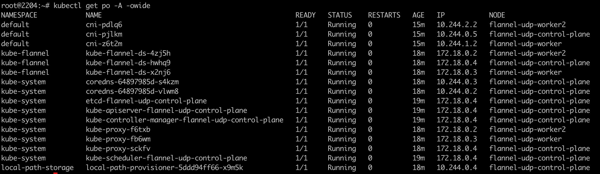
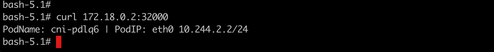
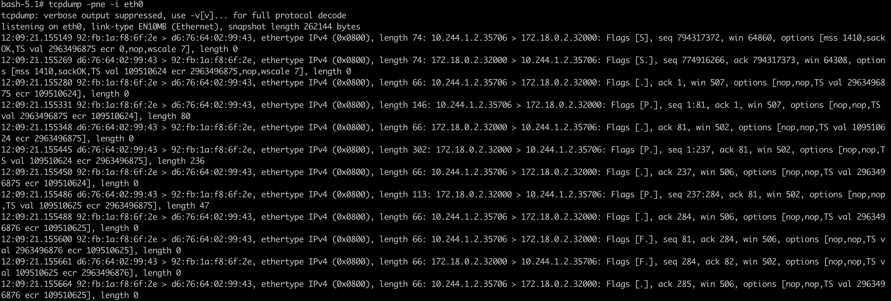
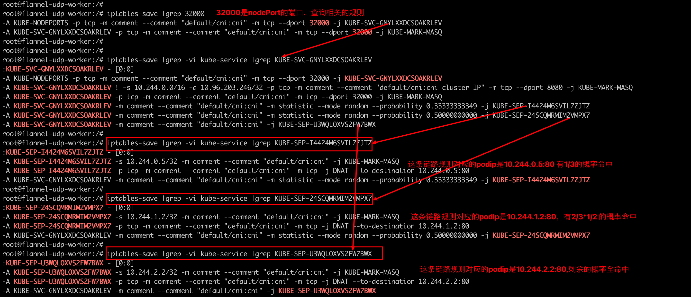
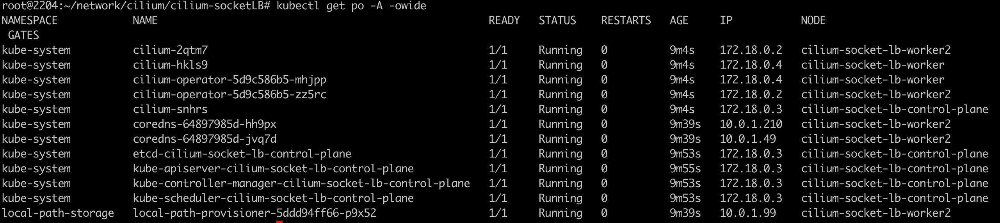
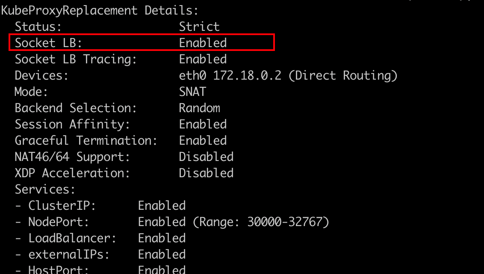
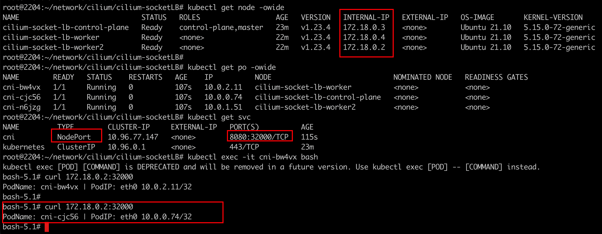
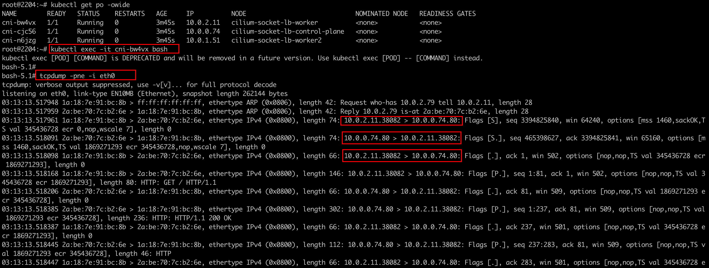

### 一：Cilium SocketLB 模式认知


负载均衡的实现方式通常有如下两种：

- 客户端负载平衡并自行选择目标端点。这样做的好处是，在建立连接时预先支付负载平衡的成本，并且在连接的生命周期内不存在额外的开销。这种方法的缺点是这对应用程序不透明。
- 服务端负载均衡，通过一个中间服务将请求转换为对应服务 IP 来执行负载平衡。与客户端负载平衡相比，此方法的优点是透明。应用程序本身不涉及。然而，缺点是每个网络数据包都需要在请求和响应上更改其 IP 地址。

在 Cilium 1.6 中，引入了基于套接字的负载平衡（socket-based load-balancingg），它结合了两种方法的优点：

- **Transparent**: 负载平衡对应用程序保持 100% 透明。服务是使用标准 Kubernetes svc

- **Highly efficient**: 通过转换地址在socket层面执行负载平衡，LB的成本是在建立连接时预先支付的，并且在之后的连接持续时间内不需要额外的ip地址转换。性能与应用程序直接与后端对话相同。

  


### 二：普通cni 如何实现东西向流量的负载均衡

以flannel-udp模式为例

 

1. 通过在pod中访问service,然后在pod内进行抓包分析

   

   

2. 抓包分析数据包流量

   

   通过curl命令触发流量，curl是基于tcp协议的，tcp在发包之前需要建立一个三次握手。我们可以看到前三次握手的信息：`10.244.1.2.35706 > 172.18.0.2.32000 && 172.18.0.2.32000 > 10.244.1.2.35706 && 10.244.1.2.35706 > 172.18.0.2.32000 `

   其中`10.244.1.2 是客户端pod的ip地址，172.18.0.2是node ip地址`

   通常情况下 srcIP不会变，也就是我们的podip，srcport 随机生成的， dstIP 是对应的节点ip（启用了nodeport svc），端口是svc port。

   这种是最为朴实的方式，抓包的IP就是访问的IP地址。大概流程就是pod内的数据包通过veth pair将数据包送到节点上，节点上在根据对应的iptables规则，将数据包发往目的pod，目的pod收到请求报文后，在reply回来。

   

3. 分析节点上的iptables规则

   


### 三： Cilium Socket LB 如何实现东西向流量的负载均衡

1. 采用kind 搭建集群环境，配置文件如下：

   ```yaml
   #1-setup-env.sh
   #! /bin/bash
   date
   set -v
   
   # 1.prep nocNI env
   cat <<EOF |kind create cluster --name=cilium-socket-lb --image=kindest/node:v1.23.4  --config=-
   kind: Cluster
   apiVersion: kind.x-k8s.io/v1alpha4
   networking:
     disableDefaultCNI: true  #kind 默认使用rancher cni，我们不需要该cni
     kubeProxyMode: "none" #Enable the kubeProxy
     
   nodes:
     - role: control-plane
     - role: worker
     - role: worker
     
   EOF
   
   # 2. remove taints
   controller_node=`kubectl get nodes --no-headers -o custom-columns=NAME:.metadata.name |grep control-plane`
   kubectl taint nodes $controller_node node-role.kubernetes.io/master:NoSchedule-
   kubectl get nodes -owide
   
   # 3.  install cni
   helm repo add cilium  https://helm.cilium.io > /dev/null 2>&1
   helm repo update > /dev/null  2>&1
   
   
   
   helm  install cilium  cilium/cilium --set k8sServiceHost=$controller_node --set k8sServicePort=6443 --version 1.13.0-rc5 --namespace kube-system --set debug.enabled=true --set debug.verbose=datapath --set monitorAggregation=none --set ipam.mode=cluster-pool --set cluster.name=cilium-socket-lb  --set tunnel=disabled --set autoDirectNodeRoutes=true --set ipv4NativeRoutingCIDR="10.0.0.0/8" --set bpf.masquerade=true --set kubeProxyReplacement=strict --set installNoConntrackIptablesRules=true --set socketLB.enabled=true
   
   #4. install necessary tools
   for i in $(docker ps -a --format "table {{.Names}}" |grep cilium-socket-lb)
   do
                   echo $i
                   #docker cp ./bridge $i:/opt/cni/bin/
                   docker cp /usr/bin/ping $i:/usr/bin/ping
                   docker exec -it $i bash -c "sed -i -e  's/jp.archive.ubuntu.com\|archive.ubuntu.com\|security.ubuntu.com/old-releases.ubuntu.com/g' /etc/apt/sources.list"
                   docker exec -it $i bash -c "apt-get -y update > /dev/null && apt-get -y install net-tools tcpdump lrzsz > /dev/null 2>&1"
   done
   ```

   其中cilium的安装配置中：

   `set socketLB.enabled=true 表示开启socketLb特性`

   `set kubeProxyReplacement=strict  cilium基于eBPF完全实现了kube-proxy的功能，所以理论上可以直接替换掉 kube-proxy ，strict表示强制替换`

   `set tunnel=disabled 对于在node之间传输的pod间流量启用overlay网络通信,disabled 表示不使用vxlan`

   `set bpf.masquerade=true  在ebpf中启用ip地址伪装`

   `set installNoConntrackIptablesRules=true 表示绕过主机上iptable规则，遍历主机命名空间中的网络堆栈，iptables会增加成本，通过禁用所有 Pod 流量的连接跟踪要求，从而绕过主机上的iptables连接跟踪器，可以最大限度地减少成本。`

   

2. 确认部署成功

   

   cilium socket_based lb 模式确认

   `kubectl exec -it cilium-2qtm7 -n kube-system  -- cilium status --verbose`

    

   

3. 抓包分析流量，如何进行tcp的三次握手，如何进行数据报文的转发

   登录pod，然后通过nodePort svc 访问目标服务

   

   抓包分析`tcpdump -pne -i eth0`

   

   可以发现 三次握手的过程，srcIP 为podIP地址，dstIP不再是nodeport的节点IP地址，在cilium socket LB的加持下，将serviceIP 转换成了后端podIP地址。

   通过ebpf的劫持，没有必要将nat的过程传递到root Ns中去了，不再需要root NS中的iptables规则了，节省了网络开销。

   在数据包从源pod中出去的时候，已经做了替换，进入root ns的时候，就变成了一个简单的跨节点pod间的通信，相比基于iptable来说效率更高

### 四: 总结

- 在k8s 中对服务连接进行负载均衡时，端口需要与服务通信，因此必须进行网络地址转换(NAT),一个数据包被发送到一个虚拟IP，该虚拟IP将其转换为支持该服务的pod的目标IP; Pod然后响应虚拟IP，返回的数据包被翻译回源IP

  

- 使用eBPF，可以通过使用已加载到内核中的eBPF程序并在连接源进行负载均衡来避免数据包转换，由于目标网络地址转换(DNAT)不需要在数据包处理路径上进行，因此消除了服务连接的所有NAT开销

