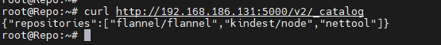

### 搭建个人本地镜像仓库

背景: 由于后续需要使用vmware创建的虚拟机，会频繁的去dockerhub拉取各种镜像，网络限速严重，所以搭建个人本地镜像仓

#### 一 : 环境准备

1. 准备一台主机，个人配置如下:

    

2. 安装docker

   ```shell
   #卸载老版本docker(如果之前有安装)
   sudo apt-get remove docker docker-engine docker.io containerd runc
   #由于 apt 源使用 HTTPS 以确保软件下载过程中不被篡改。因此，我们首先需要添加使用 HTTPS 传输的软件包以及 CA 证书。
   sudo apt-get update
   sudo apt-get install \
       ca-certificates \
       curl \
       gnupg \
       lsb-release
   # 使用阿里源进行安装
   curl -fsSL https://mirrors.aliyun.com/docker-ce/linux/ubuntu/gpg | sudo gpg --dearmor -o /usr/share/keyrings/docker-archive-keyring.gpg
   #docker 官方源: curl -fsSL https://download.docker.com/linux/ubuntu/gpg | sudo gpg --dearmor -o /etc/apt/keyrings/docker.gpg
   echo \
     "deb [arch=amd64 signed-by=/usr/share/keyrings/docker-archive-keyring.gpg] https://mirrors.aliyun.com/docker-ce/linux/ubuntu \
     $(lsb_release -cs) stable" | sudo tee /etc/apt/sources.list.d/docker.list > /dev/null
   # 更新apt 源，安装docker
   sudo apt-get update
   sudo apt-get install docker-ce docker-ce-cli containerd.io
   
   #配置镜像加速
   mkdir -p /etc/docker
   cat <<EOF > /etc/docker/daemon.json
   {
     "registry-mirrors": ["https://pz0rz98b.mirror.aliyuncs.com"]
   }
   EOF
   systemctl daemon-reload
   systemctl restart docker
   systemctl enable docker
   ```


#### 二： 安装部署个人仓库

1. 下载官方registry 镜像文件

   `docker pull registry:2`

    

2. 运行registry容器

   ```bash
   docker iamges 
   docker run -itd -v /docker/registry/:/docker/registry -p 5000:5000 --restart=always --name registry registry:2
   #运行完之后私人仓库地址为: 192.168.186.131:5000
   ```

    

3. 查看个人镜像仓库文件

   ```bash
   curl localhost:5000/V2/_catalog
   ```

    

   

4. 客户端推送到后续需要使用到的镜像到私人仓库

   ```bash
   docker images  #查看需要用的镜像
   docker tag imageid  192.168.186.131:5000/imageName:tag
   docker push 192.168.186.131:5000/imageName:tag
   #如果推送出错，则需要修改 客户端/etc/docker/daemon.json, 加上 "insecure-registries":["192.168.186.131:5000"] 
   ```

    

5. 查镜像仓库

    

   

6. 后续其他主机 就可以从该仓库拉取镜像了