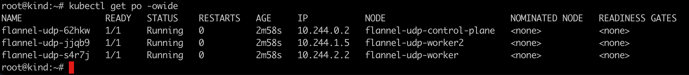
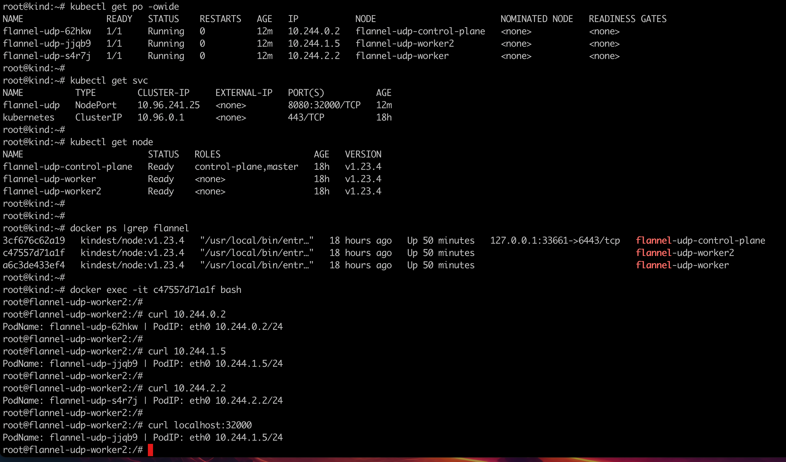

### 一： kind 是什么

kind 是 Kubernetes in Docker 的简写，是一个使用 Docker 容器作为 Nodes，在本地创建和运行 Kubernetes 群集的工具。适用于在本机创建 Kubernetes 群集环境进行开发和测试。

 


### 二:  环境准备

1. 准备一台机器2u4g 即可, 安装一些必要的工具

   `apt install -y net-tools tcpdump  chrony bridge-utils tree wget iftop ethtool curl`

2. 机器上安装docker

   注意：不要在没有配置 Docker APT 源的情况下直接使用 apt 命令安装 Docker

   ```shell
   #卸载老版本docker(如果之前有安装)
   sudo apt-get remove docker docker-engine docker.io containerd runc
   #由于 apt 源使用 HTTPS 以确保软件下载过程中不被篡改。因此，我们首先需要添加使用 HTTPS 传输的软件包以及 CA 证书。
   sudo apt-get update
   sudo apt-get install \
       ca-certificates \
       curl \
       gnupg \
       lsb-release
   # 使用阿里源进行安装
   curl -fsSL https://mirrors.aliyun.com/docker-ce/linux/ubuntu/gpg | sudo gpg --dearmor -o /usr/share/keyrings/docker-archive-keyring.gpg
   #docker 官方源: curl -fsSL https://download.docker.com/linux/ubuntu/gpg | sudo gpg --dearmor -o /etc/apt/keyrings/docker.gpg
   echo \
     "deb [arch=amd64 signed-by=/usr/share/keyrings/docker-archive-keyring.gpg] https://mirrors.aliyun.com/docker-ce/linux/ubuntu \
     $(lsb_release -cs) stable" | sudo tee /etc/apt/sources.list.d/docker.list > /dev/null
   # 更新apt 源，安装docker
   sudo apt-get update
   sudo apt-get install docker-ce docker-ce-cli containerd.io
   
   #配置镜像加速
   mkdir -p /etc/docker
   cat <<EOF > /etc/docker/daemon.json
   {
     "registry-mirrors": ["https://pz0rz98b.mirror.aliyuncs.com"]
   }
   EOF
   systemctl daemon-reload
   systemctl restart docker
   systemctl enable docker
   
   ```

3. 机器上安装kubectl

   ```bash
   #添加源， 更新缓存索引
   apt update && apt install -y apt-transport-https
   # 添加访问公钥
   curl https://mirrors.aliyun.com/kubernetes/apt/doc/apt-key.gpg | apt-key add - 
   # 添加源
   cat <<EOF >/etc/apt/sources.list.d/kubernetes.list
   deb https://mirrors.aliyun.com/kubernetes/apt/ kubernetes-xenial main
   EOF
   #更新缓存索引
   apt update
   #进行安装
   apt-cache madison kubectl #查询特定版本
   version=1.23.4-00
   apt-get install kubectl=${version}
   
   ```

4. 机器上安装golang运行环境

   下载go，这里选择go1.19版本

   ```bash
   wget https://golang.google.cn/dl/go1.19.2.linux-amd64.tar.gz
   tar -C /usr/local/ -xzf go1.19.2.linux-amd64.tar.gz
   ```

   修改/etc/profile文件

   ```bash
   #vim /etc/profile
   export GOROOT=/usr/local/go
   export PATH=$PATH:$GOROOT/bin
   ```

   修改完成后

   ```bash
   source /etc/profile
   ```


### 三： 安装 kind & kind 创建k8s集群

1.  源编译安装

   ```bash
   go install sigs.k8s.io/kind@v0.18.0
   ```

   如果安装报错，报错信息为超时之类的，可能需要修改goproxy

   ```bash
   go env -w GOPROXY="https://goproxy.cn,direct"
   ```

2. kind 安装完成后，直接使用kind 命令会报错：`kind: command not found`

   这是因为kind安装完成后，被放在了 `$(go env GOPATH)/bin` 下

   `export PATH=$PATH:/root/go/bin/`  解决

   

3.  脚本化 安装kind： `sh 1-setup-env.sh`

   ```shell
   #1-setup-env.sh
   #! /bin/bash
   date
   set -v
   
   # 1.prep nocNI env
   cat <<EOF |kind create cluster --name=flannel-udp --image=kindest/node:v1.23.4  --config=-
   kind: Cluster
   apiVersion: kind.x-k8s.io/v1alpha4
   networking:
     disableDefaultCNI: true  #kind 默认使用rancher cni，我们不需要该cni
     podSubnet: "10.244.0.0/16"
   nodes:
     - role: control-plane
     - role: worker
     - role: worker
   EOF
   
   # 2. remove taints
   controller_node=`kubectl get nodes --no-headers -o custom-columns=NAME:.metadata.name |grep control-plane`
   kubectl taint nodes $controller_node node-role.kubernetes.io/master:NoSchedule-
   kubectl get nodes -owide
   
   # 3. install CNI
   kubectl apply -f ./flannel.yaml
   #kubectl apply -f https://raw.githubusercontent.com/flannel-io/flannel/master/Documentation/kube-flannel.yml
   
   #4. install necessary tools
   for i in $(docker ps -a --format "table {{.Names}}" |grep flannel-udp)
   do
                   echo $i
                   #docker cp ./bridge $i:/opt/cni/bin/
                   docker cp /usr/bin/ping $i:/usr/bin/ping
                   docker exec -it $i bash -c "apt-get -y update > /dev/null && apt-get -y install net-tools tcpdump lrzsz > /dev/null 2>&1"
   done
   
   ```
   
4. 安装过程如下所示

    

   

5. 安装完成后，可以执行命令 `kind get clusters`  `kubectl get xxx`查看安装的集群

    


6. 如果安装完集群，`kubectl get po -A` ,pod启动失败

    

   查看异常状态pod日志，发现cni插件相关报错，缺少bridge

   `failed to delegate add: failed to find plugin "bridge" in path [/opt/cni/bin]`

   节点上没有相关cni组件，所以我们可以下载相关plugin，然后docker cp到容器节点内

   ```shell
   wget https://github.com/containernetworking/plugins/releases/download/v1.2.0/cni-plugins-linux-amd64-v1.2.0.tgz
   mkdir -p /opt/cni/bin
   tar -C /opt/cni/bin -xzf cni-plugins-linux-amd64-v1.2.0.tgz
   for i in $(docker ps -a --format "table {{.Names}}" |grep flannel-udp);do echo $i;docker cp /opt/cni/bin/bridge $i:/opt/cni/bin/;done
   ```

   然后查看集群信息,一切正常

    

7. 部署测试业务验证集群

   `kubectl apply -f nettool.yaml`

   ```shell
   #nettool.yaml
   apiVersion: apps/v1
   kind: DaemonSet
   metadata:
     name: flannel-udp
     labels:
       app: flannel-udp
   spec:
     selector:
       matchLabels:
         app: flannel-udp
     template:
       metadata:
         labels:
           app: flannel-udp
       spec:
         containers:
         - name: nettool
           image: burlyluo/nettool
           securityContext:
             privileged: true
   ---
   apiVersion: v1
   kind: Service
   metadata:
     name: flannel-udp
   spec:
     type: NodePort
     selector: 
       app: flannel-udp
     ports:
     - name: flannel-udp
       port: 8080
       targetPort: 80
       nodePort: 32000
   ```

   查看pod 是否部署成功

   `kubectl get po -owide`

   

   

   验证测试业务是否正常: 一切ok 

   
