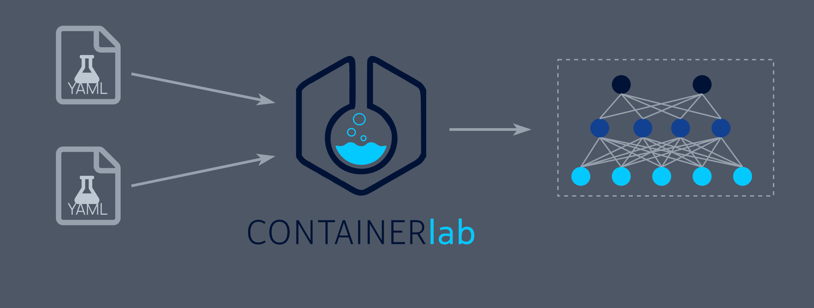
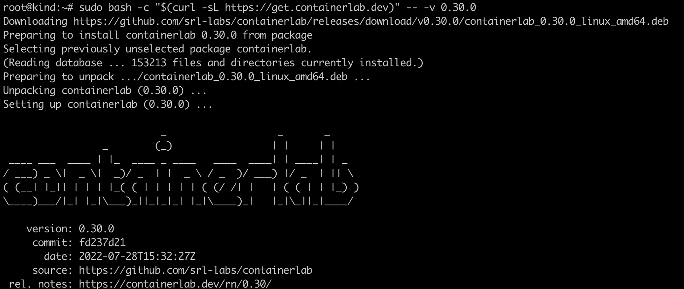
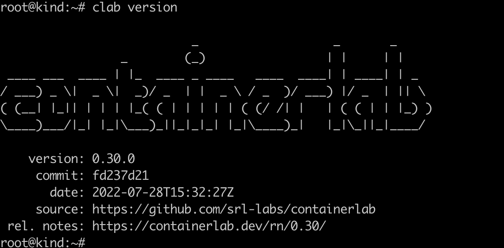
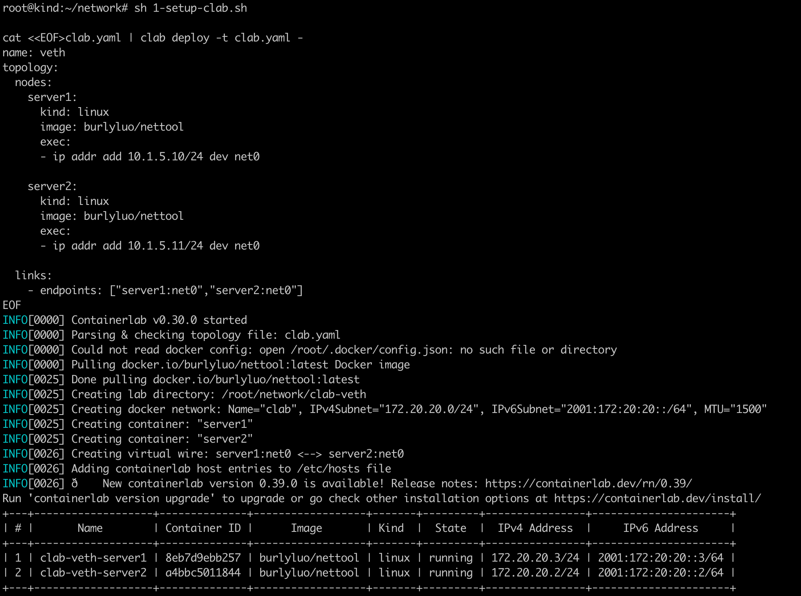
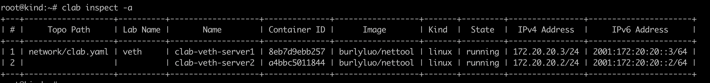
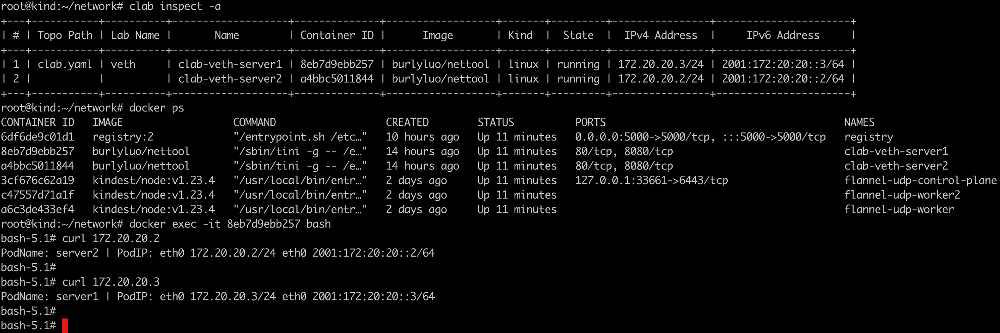

### 一:Containerlab 基本概念

Containerlab根据用户传递给它的拓扑信息来建立实验,构建网络交换和路由



在后面的学习中，我们可以利用containerLab 实现交换机，路由器等功能，或者模仿cni来实现不同网络命名空间下的容器网络互通，加深对cni的理解


### 二： 部署安装containerLab

1. Containerlab 快速安装，最好使用该版本0.30.0，后续版本yaml写法有变动  

   执行命令`clab version`,确认安装完成

     

 

2. 创建clab执行脚本

   ```shell
   #1-setup-clab.sh
   #!/bin/bash
   set -v
   cat <<EOF>clab.yaml | clab deploy -t clab.yaml -
   name: veth
   topology:
     nodes:
       server1:
         kind: linux
         image: 192.168.186.131:5000/nettool
         exec:
         - ip addr add 10.1.5.10/24 dev net0
         
       server2:
         kind: linux
         image: 192.168.186.131:5000/nettool
         exec:
         - ip addr add 10.1.5.11/24 dev net0
         
     links:
       - endpoints: ["server1:net0","server2:net0"]
   EOF
   ```

   

3. 运行脚本，容器创建完成

4. 执行`clab inspect -a`查看容器信息

   

5. 登录其中任一容器，访问另外一个容器。验证网络是否可达

   

   

   

