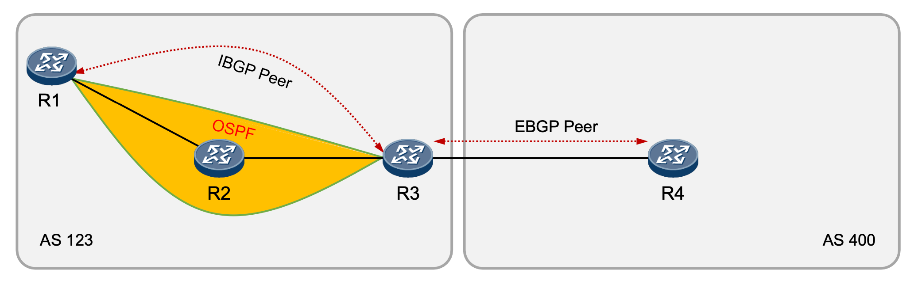
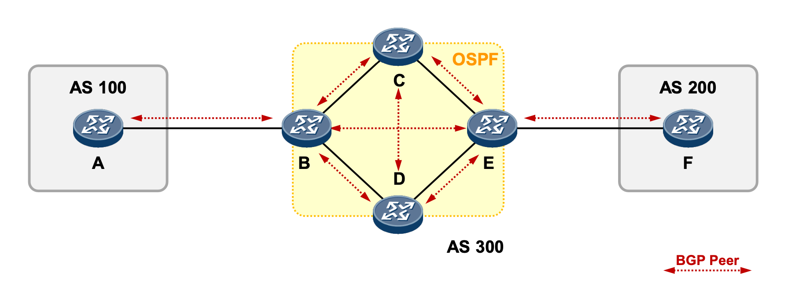
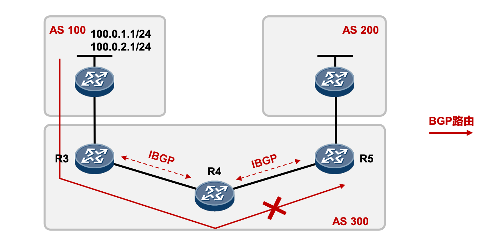
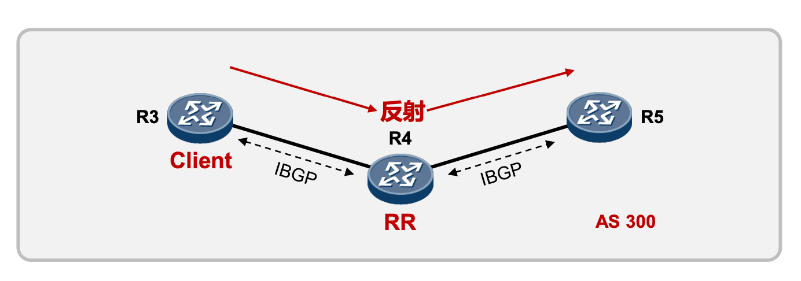
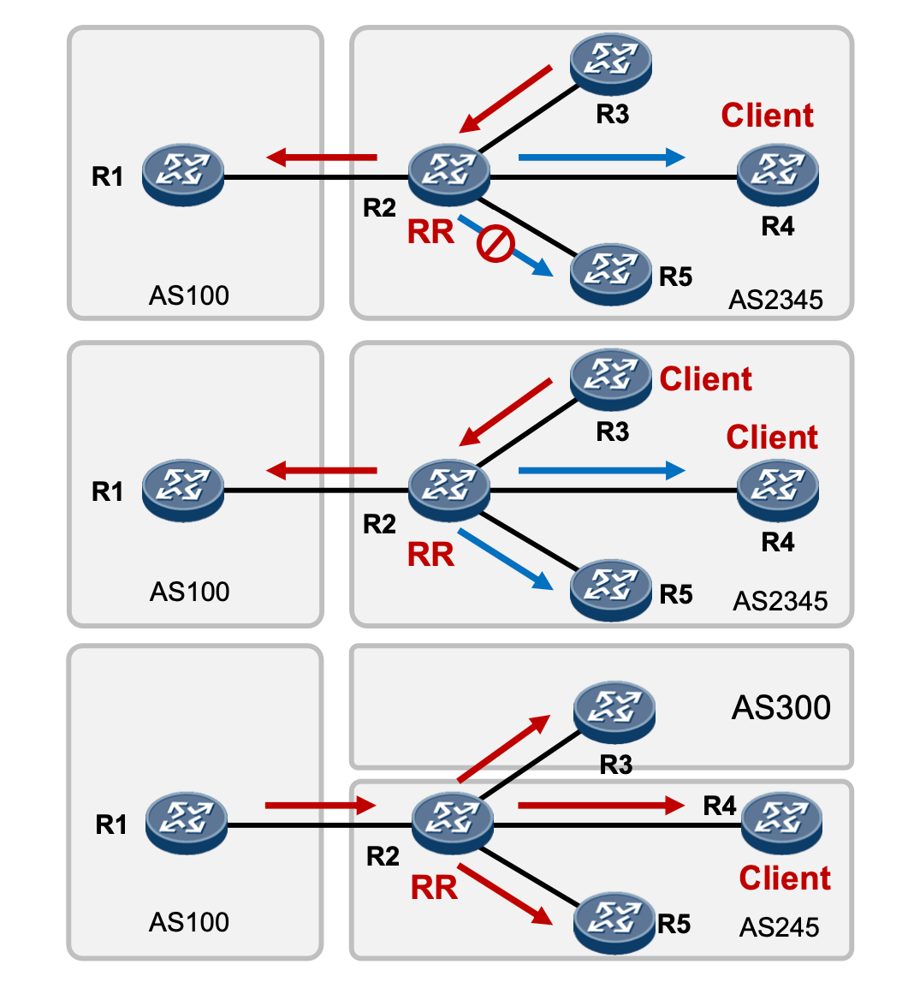
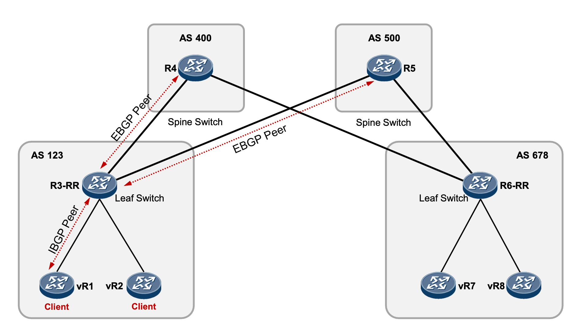

### 一: Why use BGP 

我们都知道数据报文在进行转发的时候，都需要根据对应的路由协议才能去转发。

- 可以基于最基本的静态路由进行转发，静态路由要求我们告诉每一跳的网络设备，如何前往下一跳。例如A要访问B，A和B之间有5个路由器，则需要告诉这5个路由器，如何从A去往B，路由器收到数据包之后，才能根据目的地址进行一跳一跳的转发，进而把数据报文送到目的地址。静态路由需要人工去维护。

- 还可以基于动态路由(自动学习)进行数据包转发，例如早期的RIP，OSPF(IGP，适用成千上万个路由条目，适用各种园区环境)和BGP(能承载十万，百万级别路由)，动态路由适用规模较大的网络环境。
- 在kubernetes环境中，动态路由一般都是通过BGP协议(边界网关路由协议)来实现的。因为在k8s里面每个业务有不同的ip不同端口，相比虚机环境下同ip不同端口的环境，路由条目会变得非常庞大(比如1个虚机上的100个进程，需要一个路由条目，k8s容器化后，就需要100个路由条目，如如果是200台虚机的话，k8s环境下路由条目将变成20000条)

边界网关协议（BGP）是运行于 TCP 上的一种自治系统的路由协议。 BGP 系统的主要功能是和其他的 BGP 系统交换网络可达信息。

---

### 二：AS自治系统

自治系统（autonomous system，简称“AS”），是全局唯一编号，遵守一个明确定义的路由策略的相连 IP 网络组，用于标识并且使 AS 能够交换相邻 AS 之间的外部路由信息。自治系统的编号取值范围是1~65535，其中1~64511是互联网上注册的公有AS号类，类似于公有IP地址，是全球唯一且不可重复使用的；64512~65535是私有AS号，类似于私有IP地址，可以重复使用但是互联网上不可见。

BGP解决的是AS之间的路由学习问题，当今互联网是全球互联，在中国，互联网运营商有移动、电信和联通。每个公司都有自己的自治系统，并且内部运行IGP协议。但是互联网又要求互联，所以通过BGP就可以在电信和联通等之间学习对方的AS内部路由，使电信和联通的用户之间互相通信。

---

### 三: BGP的分类

IBGP(Internal BGP):位于相同自治系统(同一个AS)的BGP路由器之间的BGP邻接关系。

1.  两台路由器之间要建立IBGP对等体关系，必须满足两个条件:

2.  两个路由器所属AS需相同(也即AS号相同)。

3.  在配置BGP时，Peer命令所指定的对等体IP地址要求路由可达，并且TCP连接能够正确建立 

   

EBGP(External BGP):位于不同自治系统的BGP路由器之间的BGP邻接关系。

1.  两台路由器之间要建立EBGP对等体关系，必须满足两个条件:
2.  两个路由器所属AS不同(也即AS号不同)。
3.  在配置BGP时，Peer命令所指定的对等体IP地址要求路由可达，并且TCP连接能够正确建立.

---

### 四: BGP Split Horizon(水平分割)

 

为了保证中转AS300内所有路由器都能学习到完整的BGP路由信息，我们不得不在该AS内的每一台 路由器上运行BGP并且建立全互联的IBGP对等体关系。 为了防止AS内产生环路，BGP设备不将从IBGP对等体学到的路由通告给其他IBGP对等体，**并与所有 IBGP对等体建立全连接**。

例如: 路由器C 从路由器B学到的路由，不会通告给路由器E;路由器D从路由器B学习到的路由，也不会通告给路由器E，主要目的就是为了防环。要想B和E之间能直接路由，必须B和E之间建立连接关系。

但是这样也有个弊端，路由器内部就会形成一个网状结构，每两两都要建立连接关系，给人感觉会很乱。

注意⚠️: 水平分割仅适用于IBGP

---

### 五: BGP RR(路由反射器)

 

- 由于IBGP水平分割的存在，为了保证所有的BGP路由器都能学习到完整的BGP路由，就必须在AS内实现IBGP全 互联，这就导致AS内部需要维护大量的BGP连接，从而影响网络性能，路由反射器(Route Reflector，RR)可 以“放宽”水平分割原则，解决该问题。
- 为保证IBGP对等体之间的连通性，需要在IBGP对等体之间建立全连接关系。假设在一个AS内部有n台设备，那 么建立的IBGP连接数就为n(n-1)/2。当设备数目很多时，设备配置将十分复杂，而且配置后网络资源和CPU资源 的消耗都很大。在IBGP对等体间使用路由反射器可以解决以上问题。

RR在接收BGP路由时:

1. 如果该路由学习自非Client IBGP对等体，则反射给自己所有的Client;
2. 如果路由学习自Client，则反射给所有非Client IBGP对等体和除了该Client之外的所有Client(华为设备可通过命令关闭RR在Client之间的路由反射行为);

3. 如果路由学习自EBGP对等体，则发送给所有Client和非Client IBGP对等体。

---

### 六: BGP RR Mechanism

 

1. 如果路由学习自非Client IBGP对等体，则反射 给所有Client。
2. 如果路由学习自Client，则反射给所有非Client IBGP对等体和除了该Client之外的所有Client。
3. 如果路由学习自己EBGP对等体，则发送给所有 Client和非Client IBGP对等体。

简而言之: 对外是整体，对内分彼此。

---

### 七: 搭建BGP topo环境

可以借助 kind 和containerLab 模拟搭建BGP 环境。加深理解

