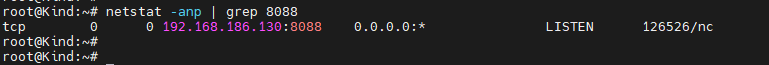
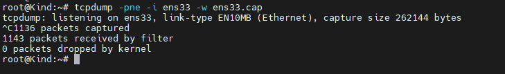
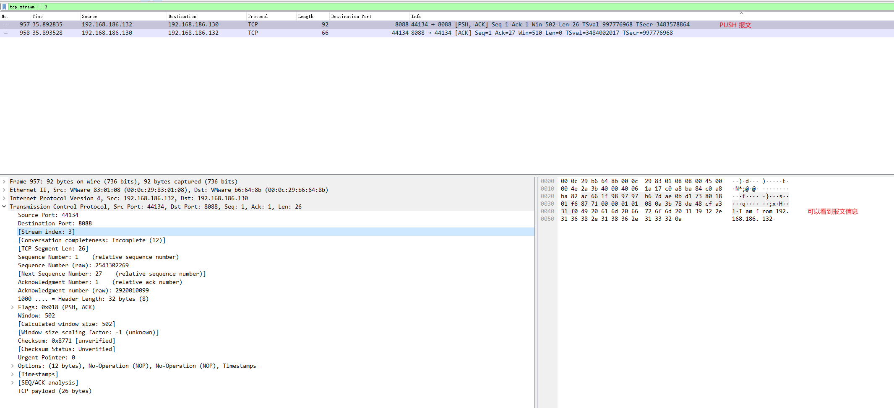
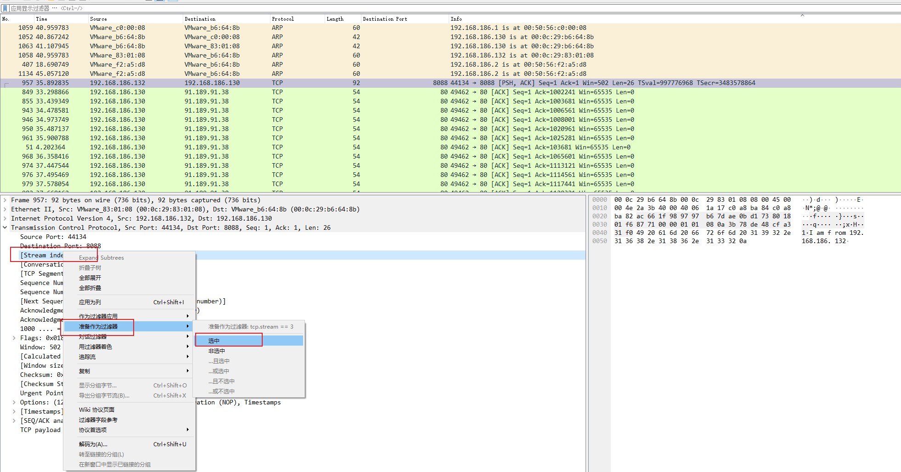

### 一: 如何理解数据报文的发送

1. 通过nc 工具进行网络流量传输的试验

2. 节点上建立一个监听端口，默认支持TCP 协议

    

3. 查看监听是否建立

    

4. 客户端进行消息发送

    

5. 抓包分析

   `tcpdump -pne -i ens33 -w ens33.cap`，服务端发送消息后，停止抓包

    

    

6. 当打开个包文件后，可以通过Stream index进行筛选，从而找到对应的上下文

    


### 二：通过网桥&交换机进行网络通信

网桥是工作在OSI第二层(数据链路层)上的，能在不同网段之间再深信号的功能，它可以有效联接两个局域网，根据mac地址转发帧，可以看作是一个低层的路由器。网桥通常用于连接数量不多的，同一类型的网段。由于网桥是链路层设备，因此不处理数据链路层以上层次协议所加的报头。

多端口网桥 就是交换机了。交换机的作用是连接数个相同网段的不同主机，减少网内冲突，隔离冲突域。


1. 使用containerLab 进行网络topo的搭建

   ```shell
   #1-setup-clab.sh
   #!/bin/bash
   set -v
   brctl addbr  br-pool0
   ifconfig br-pool0 up
   cat <<EOF>clab.yaml | clab deploy -t clab.yaml -
   name: bridge
   topology: 
     nodes:
       br-pool0:
         kind: bridge
         
       server1:
         kind: linux
         image: 192.168.186.131:5000/nettool
         exec:
         - ip addr add 10.1.5.10/24 dev net0
         
       server2:
         kind: linux
         image: 192.168.186.131:5000/nettool
         exec: 
         - ip addr add 10.1.5.11/24 dev net0
         
     links: 
       - endpoints: ["br-pool0:eth1", "server1:net0"]
       - endpoints: ["br-pool0:eth2", "server2:net0"]
   EOF
   ```

2.  执行脚本

   容器创建成功

    

   登录server1容器，ping测server2

   

   可以发现ttl的值一直是64,表示网络走的是交换，如果走的路由，ttl会每走一次路由 -1 

### 三:  通过路由进行网络通信

路由器通过路由决定数据的转发，转发策略称为路由选择，作为不同网络之间相互连接的枢纽，路由器系统构成了基于TCP/IP的国际互联网络internet的主体网络

网桥只能连接两个相同的网络，而路由器可以连接不同的网络。路由器在为不同目的或不同组织的连接网络是很有用的，用户可以申请规则或过滤器来使特定的数据通过。

路由器是第三层网络层的设备


1. 通过containerLab 定义网络topo

   ```shell
   #!/bin/bash
   set -v
   cat <<EOF> clab.yaml | clab deploy -t clab.yaml -
   name: routing 
   topology:
     nodes:
       gw0:       #gw0 是一个路由器配置
         kind: linux
         image: 192.168.186.131:5000/vyos:1.2.8
         cmd: sbin/init
         binds:
           - /lib/modules:/lib/modules
           - ./startup-conf/gw0-boot.cfg:/opt/vyatta/etc/config/config.boot
         
         
       server1: 
         kind: linux
         image: 192.168.186.131:5000/nettool
         exec:
         - ip addr add 10.1.5.10/24 dev net0
         - ip route replace default via 10.1.5.1
         
       server2:
         kind: linux
         image: 192.168.186.131:5000/nettool
         exec:
         - ip addr add 10.1.8.10/24 dev net0
         - ip route replace default via 10.1.8.1
         
     links:
       - endpoints: ["gw0:eth1", "server1:net0"]
       - endpoints: ["gw0:eth2", "server2:net0"]
       
   EOF
   ```

   

2.  执行该配置

    

   网络topo建立成功，但是此时网络还不通，我们需要将clab-routing-gw0 中的配置文件拷贝出来，然后进行定制化配置。

   `docker cp clab-routing-gw0:/opt/vyatta/etc/config/config.boot .`

   ```bash
   interfaces {
       ethernet eth1 {
       	address 10.1.5.1/24  
       	duplex auto
       	smp-affinity auto
       	speed auto
   	}
   	ethernet eth2 {
       	address 10.1.8.1/24   
       	duplex auto
       	smp-affinity auto
       	speed auto
   	}
   	loopback lo {
       }
   }
   nat {
       source {
       	rule 100 {
       		outbound-interface eth0  
       		source {
       			address 10.1.0.0/16   
   			}
   			translation {
                   	address masquerade
               }
       
   		}
   	}
   }
   
   system {
       host-name "vyos"
       login {
           user vyos {
               authentication {
                   encrypted-password "$6$QxPS.uk6mfo$9QBSo8u1FkH16gMyAVhus6fU3LOzvLR9Z9.82m3tiHFAxTtIkhaZSWssSgzt4v4dGAL8rhVQxTg0oAG9/q11h/"
                   plaintext-password ""
               }
               level "admin"
           }
       }
       syslog {
           global {
               facility all {
                   level "info"
               }
               facility protocols {
                   level "debug"
               }
           }
       }
       ntp {
           server "0.pool.ntp.org"
           server "1.pool.ntp.org"
           server "2.pool.ntp.org"
       }
       config-management {
           commit-revisions "100"
       }
       console {
           device ttyS0 {
               speed 9600
           }
       }
   }
   interfaces {
       loopback "lo"
   }
   
   
   /* Warning: Do not remove the following line. */
   /* === vyatta-config-version: "broadcast-relay@1:cluster@1:config-management@1:conntrack@1:conntrack-sync@1:dhcp-relay@2:dhcp-server@5:dns-forwarding@1:firewall@5:ipsec@5:l2tp@1:mdns@1:nat@4:ntp@1:pppoe-server@2:pptp@1:qos@1:quagga@7:snmp@1:ssh@1:system@10:vrrp@2:wanloadbalance@3:webgui@1:webproxy@1:zone-policy@1" === */
   /* Release version: 1.2.8 */
   
   ```


3. 登陆容器进行ping 测，验证网络联通性

   server1 的网卡地址为: 10.1.5.10/24

   server2 的网卡地址为: 10.1.8.10/24

    

   

   ping测外网也是通的

    

   

4. 分别查各自的网卡信息

   `docker exec -it clab-routing-server1 ip a`

    

   `docker exec -it clab-routing-server2 ip a`

    

   `docker exec -it clab-routing-gw0 ip a`

    

   

5. **猜想： 在server1 ping 测 server2， 如果在server2的net0 网卡上抓包，源ip和源mac 会是什么呢？**

   server1  ping 测 :  ` docker exec -it clab-routing-server1 ping 10.1.8.10`

   ping 测过程中可以发现ttl 的值 为63，说明经过了一轮转发

    

   server2  net0网卡抓包信息：`tcpdump -pne -i net0`

    

   gw0 路由器eth2 上抓包的信息: `tcpdump -pne -i eth2`

    

   gw0 路由器eth1 上抓包的信息: `tcpdump -pne -i eth1`

   

   **通过报文分析得出结论:**  

   **a: 在路由转发 (非nat)的环境中，源ip和目的ip 不会发生变化。**

   **b:  在路由转发(非nat) 的环境中，源mac会发生变化，随着每一跳的变化,源mac 和目的mac 都会发生变化**


