### 一： VxLAN介绍

https://support.huawei.com/enterprise/zh/doc/EDOC1100087027

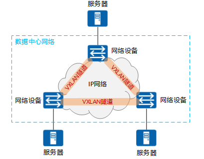 

- VXLAN本质上是一种隧道技术，在源网络设备与目的网络设备之间的IP网络上，建立一条逻辑隧道，将用户侧报文经过特定的封装后通过这条隧道转发

- VXLAN已经成为当前构建数据中心的主流技术，是因为它能很好地满足数据中心里虚拟机动态迁移和多租户等需求。


### 二： 通过containerLab 实现VxLAN

目的： 学会如何分析VxLAN组网

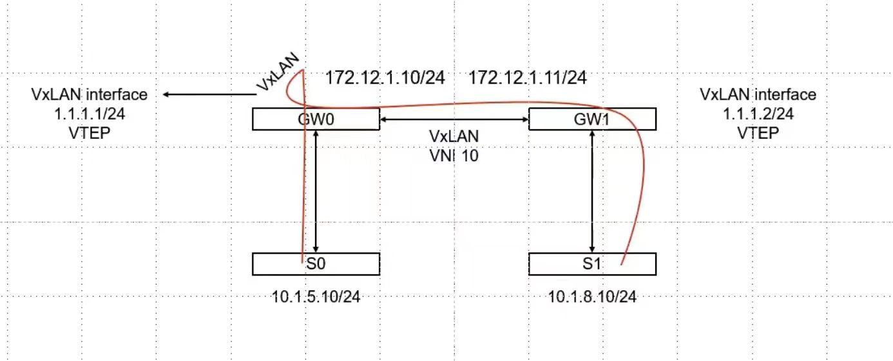 

1. 准备containerLab 配置文件:  1-setup-clab.sh

   ```shell
   #!/bin/bash
   set -v
   cat <<EOF> clab.yaml | clab deploy -t clab.yaml -
   name: vxlan
   topology:
     nodes:
       gw0:      
         kind: linux
         image: 192.168.186.131:5000/vyos:1.2.8
         cmd: /sbin/init
         binds:
           - /lib/modules:/lib/modules
           - ./startup-conf/gw0.cfg:/opt/vyatta/etc/config/config.boot
           
       gw1:      
         kind: linux
         image: 192.168.186.131:5000/vyos:1.2.8
         cmd: /sbin/init
         binds:
           - /lib/modules:/lib/modules
           - ./startup-conf/gw1.cfg:/opt/vyatta/etc/config/config.boot
            
       server1: 
         kind: linux
         image: 192.168.186.131:5000/nettool
         exec:
         - ip addr add 10.1.5.10/24 dev net0
         - ip route replace default via 10.1.5.1
         
       server2:
         kind: linux
         image: 192.168.186.131:5000/nettool
         exec:
         - ip addr add 10.1.8.10/24 dev net0
         - ip route replace default via 10.1.8.1
         
     links:
       - endpoints: ["gw0:eth1", "server1:net0"]
       - endpoints: ["gw1:eth1", "server2:net0"]
       - endpoints: ["gw0:eth2", "gw1:eth2"]
       
   EOF
   ```
   


2.  vyos的配置如下:

    `gw0 .cfg  `
   
   ```
   interfaces {
       ethernet eth1 {
       	address 10.1.5.1/24  
       	duplex auto
       	smp-affinity auto
       	speed auto
   	}
   	ethernet eth2 {
       	address 172.12.1.10/24
       	duplex auto
       	smp-affinity auto
       	speed auto
   	}
   	loopback lo {
       }
   	vxlan vxlan0 {
           address 1.1.1.1/24
           remote 172.12.1.11
           vni 10
       }
   }
   protocols {
       static {
       	route 10.1.8.0/24{
       		next-hop 1.1.1.2 {  
   			}
   		}
   	}
   }
   
   system {
       host-name "vyos"
       login {
           user vyos {
               authentication {
                   encrypted-password "$6$QxPS.uk6mfo$9QBSo8u1FkH16gMyAVhus6fU3LOzvLR9Z9.82m3tiHFAxTtIkhaZSWssSgzt4v4dGAL8rhVQxTg0oAG9/q11h/"
                   plaintext-password ""
               }
               level "admin"
           }
       }
       syslog {
           global {
               facility all {
                   level "info"
               }
               facility protocols {
                   level "debug"
               }
           }
       }
       ntp {
           server "0.pool.ntp.org"
           server "1.pool.ntp.org"
           server "2.pool.ntp.org"
       }
       config-management {
           commit-revisions "100"
       }
       console {
           device ttyS0 {
               speed 9600
           }
       }
   }
   interfaces {
       loopback "lo"
   }
   
   
   /* Warning: Do not remove the following line. */
   /* === vyatta-config-version: "broadcast-relay@1:cluster@1:config-management@1:conntrack@1:conntrack-sync@1:dhcp-relay@2:dhcp-server@5:dns-forwarding@1:firewall@5:ipsec@5:l2tp@1:mdns@1:nat@4:ntp@1:pppoe-server@2:pptp@1:qos@1:quagga@7:snmp@1:ssh@1:system@10:vrrp@2:wanloadbalance@3:webgui@1:webproxy@1:zone-policy@1" === */
   /* Release version: 1.2.8 */
   
   ```
   
   `gw1.cfg`
   
   ```
   interfaces {
       ethernet eth1 {
       	address 10.1.8.1/24  
       	duplex auto
       	smp-affinity auto
       	speed auto
   	}
   	ethernet eth2 {
       	address 172.12.1.11/24
       	duplex auto
       	smp-affinity auto
       	speed auto
   	}
   	loopback lo {
       }
   	vxlan vxlan0 {
           address 1.1.1.2/24
           remote 172.12.1.10
           vni 10
       }
   }
   protocols {
       static {
       	route 10.1.5.0/24{
       		next-hop 1.1.1.1 {  
   			}
   		}
   	}
   }
   
   system {
       host-name "vyos"
       login {
           user vyos {
               authentication {
                   encrypted-password "$6$QxPS.uk6mfo$9QBSo8u1FkH16gMyAVhus6fU3LOzvLR9Z9.82m3tiHFAxTtIkhaZSWssSgzt4v4dGAL8rhVQxTg0oAG9/q11h/"
                   plaintext-password ""
               }
               level "admin"
           }
       }
       syslog {
           global {
               facility all {
                   level "info"
               }
               facility protocols {
                   level "debug"
               }
           }
       }
       ntp {
           server "0.pool.ntp.org"
           server "1.pool.ntp.org"
           server "2.pool.ntp.org"
       }
       config-management {
           commit-revisions "100"
       }
       console {
           device ttyS0 {
               speed 9600
           }
       }
   }
   interfaces {
       loopback "lo"
   }
   
   
   /* Warning: Do not remove the following line. */
   /* === vyatta-config-version: "broadcast-relay@1:cluster@1:config-management@1:conntrack@1:conntrack-sync@1:dhcp-relay@2:dhcp-server@5:dns-forwarding@1:firewall@5:ipsec@5:l2tp@1:mdns@1:nat@4:ntp@1:pppoe-server@2:pptp@1:qos@1:quagga@7:snmp@1:ssh@1:system@10:vrrp@2:wanloadbalance@3:webgui@1:webproxy@1:zone-policy@1" === */
   /* Release version: 1.2.8 */
   
   ```


3. 执行脚本`1-setup-clab.sh`  构建vxlan网络topo

   构建成功

   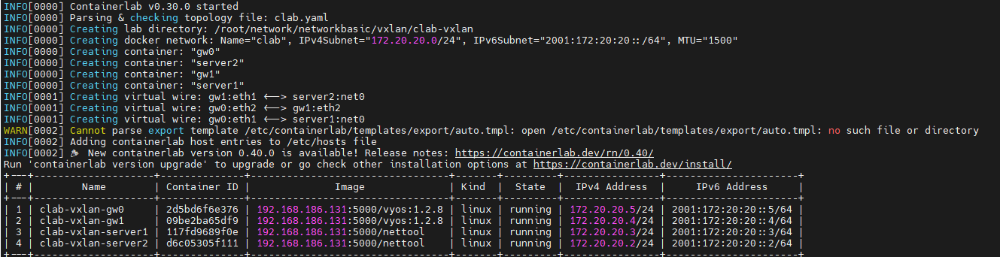

   

4. 登陆vyos容器，查看配置

   `clab inspect -t clab.yaml`

   `docker exec -it clab-vxlan-gw0 bash` 

   配置已生效

   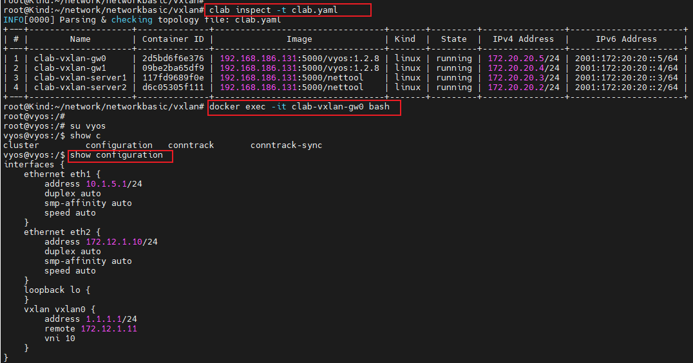 


5. 抓包分析vxlan 模式下，数据包如何传输

   src：  name: server1   ||  ip：10.1.5.10/24    

   dst：  name: server2   ||  ip:   10.1.8.10/24    

   登陆server1 容器，进行ping 测： `docker exec -it clab-vxlan-server1  ping 10.1.8.10 -c 1`

   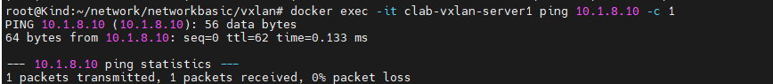 

   

   登陆gw0 容器，在eth2 网卡上进行抓包： `tcpdump -pne -i eth2 -w vxlan_clab.cap `

   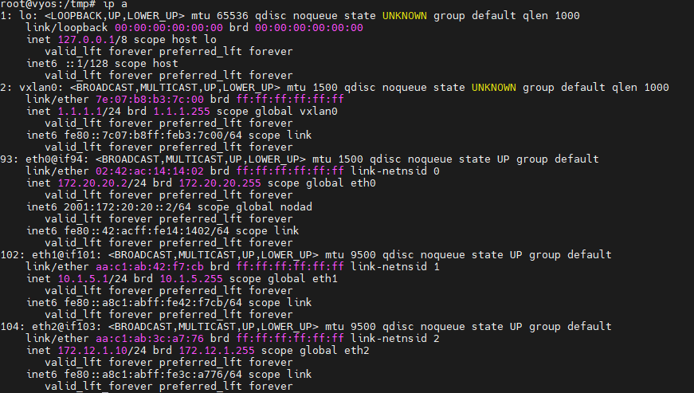 

   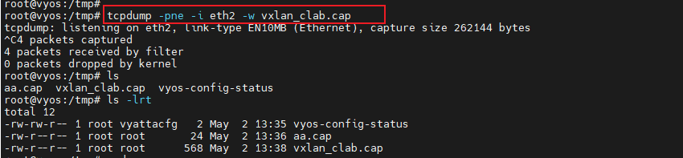 

   备注: 在vyos中抓包，使用tcpdump -w xxx.cap 可能会报错： `permission denied`, 可以通过cd 命令切换到家目录或者cd /tmp 进行抓包

   

6. 使用wireshark 分析抓包文件

   因为vxlan传送数据包默认使用的是 8472端口。我们对这几条数据分别进行解码

   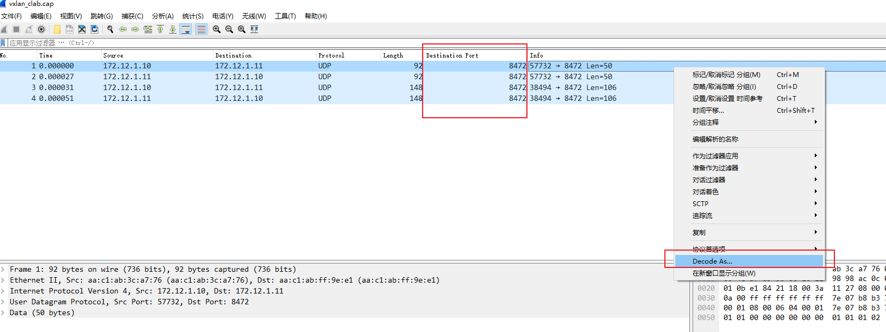 

   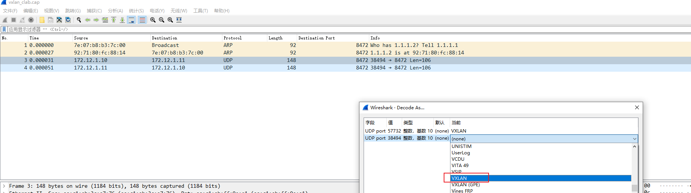

   解完码以后，可以看见,ARP 和UDP 协议的数据包

   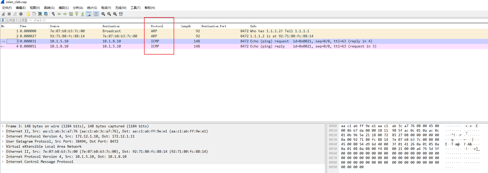 

   如何分析vxlan 报文呢？

   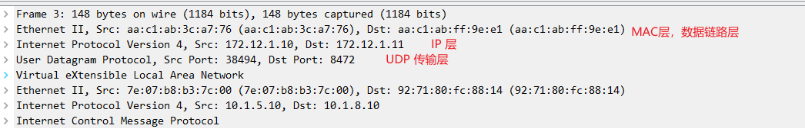 

   正常来说，传输层后面应该是应用层相关的，在vxlan模式下应用层协议 封装成了一个包

   根据报文信息，找到mac地址对应网卡分别是谁的：**发现就是gw的互联网卡的mac地址**

   `aa:c1:ab:3c:a7:76  == gw0的eth2 网卡 == 172.12.1.10/24 `   || ` aa:c1:ab:ff:9e:e1 == gw1的eth2 网卡 == 172.12.1.11/24`  

   

   经过vxlan封装后的mac地址 分别是谁的： 

   `7e:07:b8:b3:7c:00 == gw0 的vxlan0 网卡 == 1.1.1.1/24`      ||  `92:71:80:fc:88:14 == gw1的vxlan0 网卡 ==  1.1.1.2/24`

   查看server1 的路由表： 去往10.1.8.10/24 这个地址，需要经过net0网卡出去，下一跳是gw0上的10.1.5.1 地址对应eth1网卡

   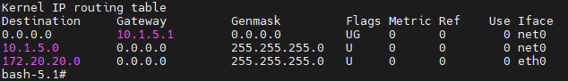 

   然后查看gw0 的路由表： 去往10.1.8.10/24 这个地址，需要经过vxlan0 这个网卡接口出去，所以需要使用这个接口的MAC地址封装

   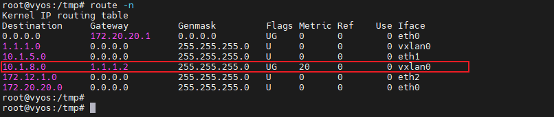 

   `ip -d link show vxlan0`  查看接口类型:vxlan 设备

   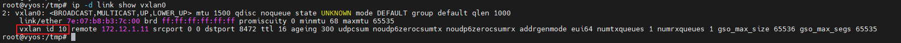 

   vxlan是内核的一个模块，它的表现形式就是内核的一张网卡，数据报文经过这个网卡，就会作为它的封装和解封装。

   数据报文到了vxlan0这个网卡后，vxlan0就需要查询tunnal 信息： `show configuration`

   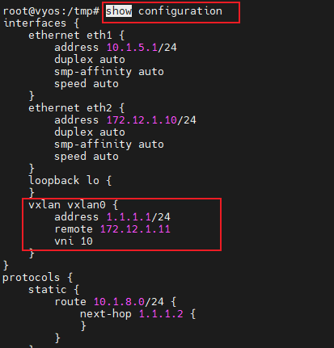 

   

