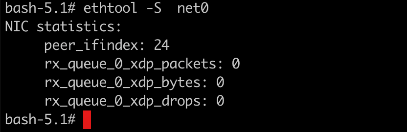

### 一:veth pair 概念

 


### 二： 通过containerLab构建网络topo

1. containerlab拓扑配置如下

   ```shell
   #1-setup-clab.sh
   #!/bin/bash
   set -v
   cat <<EOF>clab.yaml | clab deploy -t clab.yaml -
   name: veth
   topology:
     nodes:
       server1:
         kind: linux
         image: burlyluo/nettool
         exec:
         - ip addr add 10.1.5.10/24 dev net0
         
       server2:
         kind: linux
         image: burlyluo/nettool
         exec:
         - ip addr add 10.1.5.11/24 dev net0
         
       links:
         - endpoints: ["server1:net0","server2:net0"]
   EOF
   ```

2. 构建完成

   

3. 查看server2容器的网卡信息

   `ip a`

   

4. 查看server2容器的net0 网卡的相关信息(确认对端网卡)

   `ethtool -S net0` 

    

   对端id是24号，本身id是23号

5. 查看server1 的网卡信息 和net0网卡的对端

    

6. 确认这两个网卡形成了虚拟网卡对

7. 回收containerLab 配置

   `clab destroy -y clab.yaml`

   

### 三： 手动配置veth pair

 备：至后续补充topo图 便于直观理解

1. 具体配置如下：

   ```shell
   #1-setup-env.sh
   #!/bin/bash
   set -v
   ip netns add ns1  #设置网络命名空间
   ip netns add ns2
   
   ip l a veth-01 type veth peer name veth-10  # 添加设置网卡对
   
   ip l s veth-01 netns ns1   #将网卡设置到不同网络空间
   ip netns exec ns1 ip l s veth-01 up 
   ip netns exec ns1 ip a a 10.1.5.10/24 dev veth-01 #网卡配置ip地址
   
   ip l s veth-10 netns ns2
   ip netns exec ns2 ip l s veth-10 up 
   ip netns exec ns2 ip a a 10.1.5.11/24 dev veth-10
   ```

2. 上述规则应用完成后，可以尝试体验一下

   `ip netns exec ns1 ping 10.1.5.10`  ping 测本地，发现网络不同

   原因是因为，本地回环lo 网卡处于 DOWN state

    

   `ip netns exec ns2 ping 10.1.5.11` ping 测对端网卡，正常访问

    

3. 可以检查网卡对id 是否对应

   网卡id 正常映射

    

4. 解决ping 测本地

   `ip netns exec ns1 ip l s lo up`

   `ip netns exec ns2 ip l s lo up `

   

5. 查看路由配置

   `ip route show` 简写 `ip  r s` 来自iproute 库，支持名称空间的配置，尽量使用该库

   `route -n` 来之net-tools 库，很多镜像不预置该库，常见的ifconfig就是该库的命令，尽量不依赖该库

    

6. 实验做完回收配置

   `ip netns d ns1`

   `ip netns d ns2` 


### 四: 网桥

将游离态的veth pair 扦插到(plugin)网桥上，例如flannel 就会将所有pod内对应的veth pair扦插到cni0这个网桥上

交换机学习mac地址

#### 4.1 通过containerLab 定义网桥网络topo


#### 4.2 通过手工配置 网桥

1. 详细配置如下：

   ```shell
   #!/bin/bash
   set -v
   ip netns add ns1
   ip netns add ns2
   
   ip l a br0 type bridge  #设置网桥 br0
   ip l s br0 up
   
   ip l a int0 type veth peer name br-int0
   ip l a int1 type veth peer name br-int1
   
   ip l s int0 netns ns1
   ip netns exec ns1 ip l s int0 up 
   ip netns exec ns1 ip a a 10.5.1.10/24 dev int0
   
   ip l s int1 netns ns2
   ip netns exec ns2 ip l s int1 up
   ip netns exec ns2 ip a a 10.5.1.11/24 dev int1
   
   ip l s br-int0 master br0
   ip l s br-int0 up
   ip l s br-int1 master br0
   ip l s br-int1 up 
   
   
   ```

   
